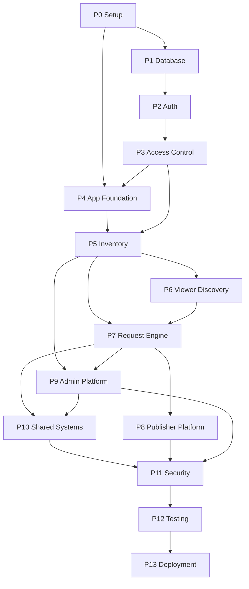

# SEEABLE Hoardings — MVP Implementation Plan

**Document Type:** Engineering Implementation Roadmap (MVP Scope)
**Product:** SEEABLE Hoardings — Bengaluru OOH marketplace
**Version:** 2.0 — Supabase-direct revision
**Date:** 3 September 2026
**Status:** Final — every open decision is resolved in §2. Nothing here waits on approval.

**Source documents this plan consolidates (do not re-derive requirements from them):**
`mvp-prd.md`, `mvp-brd.md`, `seeable_free_first_techstack.md`, `system-architecture.md`, `database-design.md`, `api-specification.md`, `inventory.md`, `viewer-platform.md`, `request-engine.md`, `admin-platform.md`, UI/UX files `00`–`08`.

**What changed from v1.0:** the app now talks to **Supabase directly** (browser/server → PostgREST + `rpc()` + RLS + Supabase Auth + Storage + Realtime). The `/api/v1` REST surface from `api-specification.md` is kept **as a thin facade** — ~10-line route handlers that authenticate, call Supabase as the caller's JWT (RLS applies), wrap the result in the `{success,data,meta,request_id}` envelope, and map Postgres errors to `SEEABLE_CODE`s. **No business logic lives in the route layer** — it is all RLS policies + `SECURITY DEFINER` functions, already written in `database-design.md` §41. Auth endpoints are **not** built (spec §5.2 sanctions this) — the client uses `supabase.auth.*` directly; only `GET /api/v1/auth/me` survives. Background jobs run on **`pg_cron` inside Postgres** — no GitHub Actions, no shared secret, no `/api/jobs/*` routes. Notifications and request-status updates are **Supabase Realtime**.

---

## 0. How To Use This Document

14 phases (Phase 0 → 13) in strict dependency order. Each phase carries the twelve required elements: (1) number/name, (2) objective, (3) features/modules, (4) dependencies, (5) database work, (6) backend/API work, (7) frontend/UI work, (8) integrations, (9) env vars/config, (10) testing, (11) Definition of Done, (12) deliverables — plus a recommended intra-phase order and a complexity rating.

- **§1** — fixed constraints + the final architecture.
- **§2** — every decision, resolved, with a one-line rationale. There is nothing to wait on.
- **§3** — the fastest path to a working end-to-end demo (a subset of the phases). Use this if you need something to show quickly; the full §19 checklist is still the completion bar.
- **§4–§5** — sequence, dependency graph, critical cross-phase dependencies.
- **§15–§19** — traceability, risks, MVP-vs-future, complexity/milestones, final checklist.

**Reality note:** this is still a multi-week build for one developer — the marketplace loop, conflict-safe confirmation, 24 screens, and moderation are not a one-day job. What §2 removes is the *decision and approval overhead*, and the Supabase-direct choices remove a large amount of *code*. §3 gives you the shortest route to a demoable core.

---

## 1. Guiding Constraints & Final Architecture

| Constraint | Source | Consequence |
|---|---|---|
| **₹0 infrastructure** | `seeable_free_first_techstack.md` §2 | Supabase Free, Cloudflare Free, GitHub Free, MapLibre. No payment, no SMS, no paid AI, no Redis/Elasticsearch/CDN. |
| **One deployable + jobs inside Postgres** | `system-architecture.md` §7 / this revision | One Next.js app on Cloudflare. Jobs = `pg_cron`. No separate services, no external cron. |
| **One PostgreSQL database, transactional core** | `system-architecture.md` §12 | 11 tables (12 with the two viewer-safe views), one `public` schema. |
| **The invariant that must never break:** no two overlapping requests both `CONFIRMED` on one hoarding | `REQUEST-004`, `database-design.md` §31 | Postgres `EXCLUDE USING gist` (btree_gist) *under* `confirm_request()`. First migration. |
| **Availability is computed, never cached** | `system-architecture.md` §27, `database-design.md` §34 | `is_hoarding_available()` composes three inputs live. `REQUEST-002` "release immediately" is then free. |
| **Business rules live once, in the DB** | `system-architecture.md` §10, §44 | Every state transition is one `SECURITY DEFINER` function. Triggers do bookkeeping only. The route layer never re-implements a rule. |
| **RLS is THE enforcement layer** | `database-design.md` §37, `api-specification.md` §6.3 | Since clients call Supabase directly, RLS + column grants + `SECURITY DEFINER` guards are the whole authorization story. The thin route layer adds the envelope and error mapping, not security. |
| **Disintermediation boundary** | `mvp-brd.md` §12 | A Viewer sees `business_name` + `is_verified` only. Enforced by **dedicated viewer-safe views** (`public_hoarding_listings`, `public_hoarding_detail`) that project only safe columns — RLS filters rows, not columns, so the view is the boundary. |
| **Content protection = watermarking only** | `mvp-prd.md` §7.7 | `hoarding-private` bucket with no public policy; `hoarding-public` holds watermarked derivatives only. |
| **Scale target** | `mvp-prd.md` §3.3 | 50–200 approved listings, Bengaluru, INR. No search engine, no PostGIS, no caching. Haversine in SQL. |

### Final stack

| Layer | Choice |
|---|---|
| Frontend | Next.js (App Router) + TypeScript, Tailwind, shadcn/ui, React Hook Form, Zod, lucide-react, `maplibre-gl` |
| Data access | **`@supabase/supabase-js` + `@supabase/ssr` directly** from client and server components; PostgREST for CRUD/reads; `supabase.rpc()` for every state transition |
| API facade | Thin Next.js Route Handlers under `/api/v1/*` — envelope + `SEEABLE_CODE` mapping only. **No `/api/v1/auth/*` except `GET /api/v1/auth/me`.** |
| Auth | Supabase Auth, email/mobile + password (OTP off — D2), cookie sessions via `@supabase/ssr` |
| Database / Storage | Supabase PostgreSQL + Supabase Storage (`hoarding-public`, `hoarding-private`, `publisher-private`) |
| Realtime | Supabase Realtime — Postgres Changes on `notifications` and `requests` (RLS-filtered) |
| Scheduled jobs | **`pg_cron`** calling SQL functions directly. Optional email via `pg_net` → Resend. |
| Hosting | Cloudflare Pages/Workers via `@opennextjs/cloudflare` |
| Maps | MapLibre GL JS + MapTiler free-tier tiles (domain-restricted key) — D6 |
| Testing | Vitest (unit + DB), Playwright (E2E) |
| CI/CD | GitHub Actions (lint/typecheck/test/build → Cloudflare deploy; migrations staging-gated) |

### Request flow (the shape of every data operation)

```
Browser / Server Component
  │
  ├─ reads/simple writes ──▶ supabase.from('public_hoarding_listings').select(...)   ← RLS + view projection
  ├─ state transitions ────▶ supabase.rpc('confirm_request', { p_request_id })       ← SECURITY DEFINER fn + EXCLUDE constraint
  ├─ auth ─────────────────▶ supabase.auth.signUp / signInWithPassword / getUser
  ├─ live updates ─────────▶ supabase.channel(...).on('postgres_changes', ...)        ← Realtime, RLS-filtered
  ├─ public media ─────────▶ supabase.storage.from('hoarding-public').getPublicUrl()
  │
  └─ envelope-wrapped calls ▶ /api/v1/*  (thin route handler)
                                 └─ authenticates → calls supabase as caller's JWT
                                 └─ wraps { success, data, meta, request_id }
                                 └─ maps Postgres error → SEEABLE_CODE   (api-specification.md §8)

pg_cron (inside Postgres, every 15 min / daily):
  select expire_stale_requests();
  select promote_confirmed_to_live();
  select notify_expiring_soon_requests();
```

**Which calls go through `/api/v1` vs direct Supabase:** all mutations that carry a business rule and all reads that need the envelope/pagination contract go through the thin facade (so `api-specification.md` stays literally accurate — the client still sees `/api/v1/hoardings`, the envelope, the error codes). Auth, public media URLs, and Realtime subscriptions are direct `supabase.*` calls. The route handler and the direct call both run under the same RLS, so there is no security difference — the facade is purely for contract shape and error ergonomics.

---

## 2. Decisions — ALL RESOLVED (nothing waits on approval)

| # | Question | **Decided** | Rationale |
|---|---|---|---|
| D1 | Media watermarking: server worker vs browser Canvas | **Browser Canvas (Variant B)** | Fastest; runs in Cloudflare Workers (no server image lib); wire contract identical. Admin approval is the compensating trust control. Server-side watermarking is a post-MVP hardening item. |
| D2 | OTP vs password login | **Password (email/mobile + password). `AUTH_OTP_ENABLED=false`.** The `AUTH_VERIFICATION_REQUIRED` gate on request creation is not applied. | Matches `viewer-platform.md` v1.1 demo variance; no SMS provider in the ₹0 stack. Supabase Auth email-OTP can be switched on later with a config flag. Publisher listing submission still gates on the **Admin** `verification_status='VERIFIED'` decision. |
| D3 | Session transport | **Cookie sessions via `@supabase/ssr`.** Mutations protected by SameSite=Lax cookies + strict `Origin`/`Referer` check on POST/PATCH/DELETE. | Native fit for Next.js Server Components + middleware. |
| D4 | Anonymous listing browsing | **Auth required** to view listings (matches `database-design.md` grants). | Simplest; reversible later with one `GRANT` + one RLS policy. |
| D5 | Notification channels | **In-app (Realtime) is the system of record. Email via `pg_net`→Resend is optional and best-effort. No SMS.** | `seeable_free_first_techstack.md` §24/§37. Email can be added last or skipped for the demo. |
| D6 | Map tiles | **MapTiler free tier**, domain-restricted key, in `NEXT_PUBLIC_MAP_STYLE_URL`. | Fastest to wire (one URL). Self-hosted Protomaps `.pmtiles` is the ₹0-purist alternative if the MapTiler free quota is ever a concern. |
| D7 | DB error → API error mapping | **REQUIRED: every `SECURITY DEFINER` function raises `USING ERRCODE = '<sqlstate>', DETAIL = 'SEEABLE_CODE=<CODE>'`.** The facade (and direct callers) read `DETAIL`. | `database-design.md` §41 currently reuses SQLSTATE `55000` for ~10 outcomes. Do this while writing the functions in Phase 1 — it is a small additive edit, not a redesign. |
| D8 | SLA duration / clock start | **48 hours from `requests.created_at`.** Computed by a `CREATE OR REPLACE FUNCTION` so it re-tunes without a migration. `REQUEST_SLA_HOURS=48`, `REQUEST_EXPIRING_SOON_HOURS=6`. | Undefined in the docs; 48h is a reasonable default. |
| D9 | Shortlist (VW-06) | **CUT.** Not in `mvp-prd.md`, not in the schema. Remove the VW-06 screen and the Shortlist nav tab. | Pure scope reduction. Re-add later with a `shortlists` table if wanted. |
| D10 | Admin request lookup | **CUT for MVP.** Admin can `COMPLETE` a request but cannot browse requests (matches `api-specification.md` §6.6). | Documented gap. Add a read-only `GET /api/v1/admin/requests` as a fast-follow when dispute handling is needed. |
| D11 | Reversibility | **Un-suspend, re-list, and resubmit-after-reject all supported. Rejected listing → same record → `DRAFT` → resubmit.** Rejected verification → resubmit same record. | Functions already exist in `database-design.md` §41. Operationally necessary. |
| D12 | Geocoding | **Manual draggable map pin + free-text address. No geocoding API.** | Schema has `latitude`/`longitude` NOT NULL; PB-03 Step 3 is a pin picker. Address autocomplete is a Future Consideration. |
| D13 | Job scheduling | **`pg_cron` inside Postgres.** Drops GitHub Actions job workflows, `JOBS_SHARED_SECRET`, `/api/jobs/*` routes, and the dedicated keep-alive job. | Simpler, fewer moving parts, more Supabase-native. Diverges from `seeable_free_first_techstack.md` §25 / `api-specification.md` §28 — noted deliberately. Keep a free external `/api/health` ping every few hours as a pause backstop (`RISK-8`). |
| D14 | Live updates | **Supabase Realtime on `notifications` (bell) and `requests` (My Requests / Incoming Requests status).** | Removes polling; the existing RLS SELECT policies already scope the subscriptions correctly. |
| D15 | Hoarding facts | Static types + codes are canonical in `inventory.md` §7 / `database-design.md` §18: `UNIPOLE_BILLBOARD`, `GANTRY`, `METRO_PILLAR`, `WALL_WRAP`, `TRANSIT_MEDIA`, `BUS_QUEUE_SHELTER` (+ data-model-only `DIGITAL_BILLBOARD`, `DIGITAL_SCREEN`). **Size unit = feet. Minimum photos to submit = 3.** | Resolves the UI file `06` §10.1 uncertainty. |
| D16 | Timezone | **Compute IST explicitly** in date-sensitive functions: `(now() AT TIME ZONE 'Asia/Kolkata')::date` in `promote_confirmed_to_live()`; schedule `pg_cron` with that in mind. | Single-city app; fixes `RISK-14`. |

---

## 3. Fastest Working-Demo Path

The smallest slice that demonstrates **Discover → Request → Confirm** end to end. Do these, in this order, skipping the polish:

1. **Phase 0** (setup) — but skip staging/prod; one Supabase project, deploy to Cloudflare once to confirm it works.
2. **Phase 1** (database) — the full migration set is non-negotiable; it *is* the app. Include the exclusion constraint, the `SEEABLE_CODE` details (D7), `pg_cron` schedules, and the two viewer-safe views.
3. **Phase 2** (auth) — Supabase Auth client + `@supabase/ssr` + a bare login/signup screen. Skip AUTH-01 marketing polish and password reset styling.
4. **Phase 4** (foundation) — tokens + the ~8 components the demo screens need (Button, Input, Card, Badge, Calendar, Modal, Tabs, nav shell). Skip the full catalog.
5. **Phase 5** (inventory) — the 6-step wizard + Variant B watermarking + submit gates + `POST /api/v1/hoardings/{id}/media`. Approve listings by calling `select approve_listing('<id>')` in the Supabase SQL editor (skip the Admin console for now).
6. **Phase 6** (discovery) — VW-01 list + VW-03 detail. Skip VW-02 map if truly pressed (map is the biggest single UI item).
7. **Phase 7** (request engine) — `POST /api/v1/requests`, `PATCH /api/v1/requests/{id}` → `confirm_request` / `reject_request`, VW-04 + VW-05 + PB-06 + PB-07, Realtime status. **Write the concurrency test here — do not skip it.**

That is a demoable marketplace loop. Everything else (Admin console, Publisher dashboard, notifications email, analytics, hardening, full test suite, deployment pipeline, 50+ real listings) is required for a real launch (§19) but not for a demo.

---

## 4. Overall Sequence & Dependency Graph

```
P0  Project Setup                        P7  Request / Booking Engine
P1  Database (schema + RLS + fns +       P8  Publisher Platform
      pg_cron + viewer-safe views)       P9  Admin Platform
P2  Authentication (Supabase Auth)       P10 Shared Systems (analytics, audit,
P3  Access Control / Isolation                optional email) — small
P4  Application Foundation               P11 Security Hardening
P5  Inventory                            P12 Testing & QA
P6  Viewer Discovery                     P13 Deployment & Launch
```



**Parallelizable:** P4 runs alongside P1–P3 once P0 is done. P6 and the P9 Admin console run in parallel after P5. P10 is now small enough to fold into P11 if you prefer.

**Critical path:** `P0 → P1 → P2 → P3 → P5 → P7 → P11 → P12 → P13`. Longest pole: **P7** (concurrency correctness + its test harness).

---

## 5. Critical Cross-Phase Dependencies

| Dependency | Consumer | Provider | Why critical |
|---|---|---|---|
| `btree_gist` + `requests_no_overlapping_confirmed` exclusion constraint | P7 confirmation | P1 migration 1 & 9 | The invariant is structural only if this ships first. |
| `handle_new_user` trigger on `auth.users` (creates `profiles`/`publisher_profiles`, downgrades `ADMIN`→`VIEWER`) | P2 registration | P1 | Since auth is client-direct, this trigger is the *only* thing setting up a new user's app rows and blocking role escalation. |
| **Viewer-safe views** `public_hoarding_listings` / `public_hoarding_detail` (project `business_name`, `is_verified` only) | P6, P7 | P1 (new — not in `database-design.md`) | RLS filters rows, not columns. With client-direct reads, the view is the disintermediation boundary. |
| `SEEABLE_CODE` in every function's `DETAIL` (D7) | P3 error mapper, P7 conflict UX | P1 | Without it, a Publisher's failed accept returns a generic 409, not "dates taken". |
| RLS verified end-to-end with real cookie sessions per role | P5–P9 every screen | P3 | Every client-direct call trusts RLS. If a policy is wrong, data leaks with no route-layer safety net. |
| `is_hoarding_available()` + `visible_hoardings` + `INVENTORY-003` predicate | P5 submission, P6 search, P7 validation | P1 | One predicate, one place, or an unapproved listing leaks (`ADMIN-001`). |
| Design tokens → Tailwind + component library + Calendar | P5–P9 screens | P4 | 23 screens (Shortlist cut) share one system. |
| `pg_cron` schedules for `expire_stale_requests` / `promote_confirmed_to_live` | P7 lifecycle completeness | P1 | Without expiry, `REQUESTED` requests never expire — silent `OWNER-002` violation. |
| Realtime enabled on `notifications` + `requests` (`alter publication supabase_realtime add table …`) | P4 notification bell, P7 live status | P1 | The subscriptions the UI depends on. |
| Notification rows written in-transaction with state changes | P4/P7 Realtime delivery | P1 triggers + functions | A confirmed request can never exist without its notification recorded. |

---

## Phase 0 — Project Setup

**Objective:** A deployable, CI-gated Next.js + Supabase + Cloudflare skeleton. Prove the two hard infra constraints in week one.

**Features/modules:** Repo, tooling, Supabase environments, Cloudflare deploy, CI pipeline, walking-skeleton page.

**Dependencies:** none.

**Database work:**
- Create Supabase projects: `seeable-dev`, `seeable-staging`, `seeable-prod` (for a pure demo, one project is fine; add the others before Phase 13).
- `supabase init`; `supabase/migrations/`, `seed.sql`.
- Confirm extensions available on Free: `btree_gist`, `pg_cron`, `pg_net` (enable in Dashboard → Database → Extensions, or via migration).

**Backend/API work:**
- App Router groups: `app/(auth)/`, `app/(viewer)/`, `app/(publisher)/`, `app/(admin)/`, `app/api/v1/`.
- `lib/supabase/` — `server.ts` (RSC/route-handler client via `@supabase/ssr`), `client.ts` (browser client), `admin.ts` (service-role, **server-only** — `import 'server-only'` guard + ESLint rule restricting imports to `app/api/v1/hoardings/[id]/media/` and the migration/seed tooling).
- Envelope helpers `ok(data, meta)` / `err(code, message, details)` + `request_id` (ULID) generation.
- `GET /api/health` — bare JSON (no envelope): DB reachable + storage reachable.

**Frontend/UI work:**
- Tailwind + shadcn init with a placeholder token set (full set in Phase 4).
- App error boundary + not-found.
- One deployed page importing `@supabase/supabase-js`, `maplibre-gl`, `react-hook-form`, `zod` — to measure the bundle.

**Integrations:** GitHub repo + branch protection; Supabase (1–3 projects); Cloudflare Pages project + OpenNext build command; GitHub Actions.

**Env vars:** the canonical set (populate per phase):
```
# Client
NEXT_PUBLIC_SUPABASE_URL=
NEXT_PUBLIC_SUPABASE_ANON_KEY=
NEXT_PUBLIC_APP_URL=
NEXT_PUBLIC_ENV=development
NEXT_PUBLIC_MAP_STYLE_URL=              # Phase 6 (MapTiler)
# Server only
SUPABASE_SERVICE_ROLE_KEY=
SUPABASE_PROJECT_REF=
SUPABASE_ACCESS_TOKEN=                  # CI migrations
REQUEST_SLA_HOURS=48
REQUEST_EXPIRING_SOON_HOURS=6
MEDIA_MAX_UPLOAD_MB=10
MEDIA_MIN_PHOTOS_TO_SUBMIT=3
RESEND_API_KEY=                         # Phase 10, optional
EMAIL_FROM=                             # Phase 10, optional
ADMIN_BOOTSTRAP_EMAIL=                  # Phase 9
# GitHub Actions secrets
CLOUDFLARE_API_TOKEN=
CLOUDFLARE_ACCOUNT_ID=
```
`.env.example` committed; real values in Cloudflare env + GitHub secrets, never in git. **No `JOBS_SHARED_SECRET`** (pg_cron, D13).

**Testing:** `lint` / `typecheck` / `test` / `build` pass locally and in CI; one trivial Vitest + one trivial Playwright test run in CI; CI blocks merge on failure.

**Definition of Done:**
- [ ] Push to `main` → CI → deploy to Cloudflare; the URL renders over HTTPS.
- [ ] `GET /api/health` returns 200 with DB + storage status.
- [ ] **`RISK-1` retired:** built Worker bundle measured under the 3 MiB compressed Free-plan ceiling with the four heavy deps, or a mitigation recorded (dynamic-import `maplibre-gl`, route splitting).
- [ ] `btree_gist`, `pg_cron`, `pg_net` confirmed available.
- [ ] `.env.example` complete; service-role client provably server-only.

**Deliverables:** deployed skeleton; CI/CD pipeline; Supabase project(s); repo structure; env contract; local-dev README section.

**Order:** repo + Next + TS → Tailwind/shadcn → Supabase CLI + dev project → env contract → OpenNext + Cloudflare deploy → CI → bundle spike → extra environments.

**Complexity:** M.

---

## Phase 1 — Database Schema, Constraints, Functions, `pg_cron` & Data Layer

**Objective:** The complete, engineering-ready PostgreSQL schema per `database-design.md` §40–§42 — 11 tables, the exclusion constraint, indexes, triggers, all `SECURITY DEFINER` functions (with `SEEABLE_CODE` details), RLS, column grants, seed data — **plus** two viewer-safe projection views, `pg_cron` schedules, and Realtime publication. This phase is the heart of the app.

**Features/modules:** the data foundation for every module.

**Dependencies:** Phase 0.

**Database work** — follow `database-design.md` §40 order:

1. `CREATE EXTENSION btree_gist; CREATE EXTENSION pg_cron; CREATE EXTENSION pg_net;`
2. Tables in order: `profiles` → `publisher_profiles` → `hoarding_types` → `hoardings` → `hoarding_media` → `hoarding_availability_blocks` → `requests` → **exclusion constraint** `requests_no_overlapping_confirmed EXCLUDE USING gist (hoarding_id WITH =, stay_range WITH &&) WHERE (status IN ('CONFIRMED','LIVE','COMPLETED'))` → `request_status_history` → `notifications` → `admin_actions` → `analytics_events`.
3. Generated columns: `requests.stay_range = daterange(start_date, end_date, '[]')` (inclusive-both), `hoarding_availability_blocks.date_range` likewise.
4. Check constraints (§30): all status enums as `text + CHECK`; `end_date >= start_date`; `price >= 0`; lat/lng bounds; `hoardings` rejection-reason NOT NULL when `approval_status='REJECTED'`.
5. `requests_one_pending_per_viewer_hoarding` — partial unique index on `(viewer_id, hoarding_id) WHERE status = 'REQUESTED'` (`VIEWER-002`).
6. Indexes per §32 (conflict-detection access path on `requests`; partial indexes on `PENDING_REVIEW` / `REQUESTED` / unread notifications; `visible_hoardings` partial index; `type_code`, `price`, `(latitude, longitude)`).
7. Helper functions: `is_admin()`, `owns_hoarding()`, `haversine_km()` (with `LEAST/GREATEST` acos clamp), `is_hoarding_available()` — `SECURITY DEFINER SET search_path = public` where cross-RLS.
8. Bookkeeping triggers: `set_updated_at`; **`handle_new_user`** (on `auth.users`: create `profiles` + `publisher_profiles`, read `role` from `raw_user_meta_data`, downgrade non-VIEWER/PUBLISHER → VIEWER); `validate_request_creation` (BEFORE INSERT: `INVENTORY-003` visibility + `CONFIRMED/LIVE/COMPLETED` overlap re-check + not-past-dated + set denormalized `publisher_id` + set `sla_deadline` = `created_at + REQUEST_SLA_HOURS` via a replaceable function); `log_request_status_change` (AFTER INSERT OR UPDATE OF status → `request_status_history`); `notify_request_created` (AFTER INSERT → two `REQUEST_CREATED` rows); `enforce_hoarding_edit_freeze` (BEFORE UPDATE: `OWNER-003`; `is_paused` toggle exempt).
9. **State-transition functions — each `SECURITY DEFINER`, each raising `USING ERRCODE, DETAIL='SEEABLE_CODE=<CODE>'` (D7):** `confirm_request`, `reject_request`, `mark_request_completed`, `expire_stale_requests`, `promote_confirmed_to_live` (compare against `(now() AT TIME ZONE 'Asia/Kolkata')::date` — D16), `submit_hoarding_for_review`, `hoarding_has_required_attributes`, `approve_listing`, `reject_listing`, `delist_hoarding`, `relist_hoarding`, `delete_hoarding`, `verify_publisher`, `reject_publisher_verification`, `suspend_publisher`, `unsuspend_publisher`, `get_original_media_path`, `admin_dashboard_summary`, `admin_listing_queue`, `search_available_hoardings`, `notify_expiring_soon_requests`.
   - `confirm_request(p_request_id)`: `SELECT … FOR UPDATE` → assert `REQUESTED` → re-check `INVENTORY-003` → re-check overlap (`REQUEST-004`) → `UPDATE status='CONFIRMED'` + insert acceptance notification — one transaction. Catch `23P01` → re-raise `SEEABLE_CODE=REQUEST_DATE_CONFLICT`.
   - `GRANT EXECUTE` on the caller-facing functions to `authenticated`; Admin-only enforcement lives in the function body (`IF NOT is_admin() THEN RAISE … 42501`).
10. Views:
    - `visible_hoardings` (`security_invoker`), `publisher_inbox`, `viewer_request_list` — per §35.
    - **NEW — `public_hoarding_listings`**: `SELECT h.id, h.title, h.type_code, h.locality, h.city, h.address_text, h.size, h.price, h.price_unit, h.latitude, h.longitude, h.attributes, h.site_intelligence, pp.business_name AS publisher_business_name, (pp.verification_status='VERIFIED') AS publisher_is_verified FROM visible_hoardings h JOIN publisher_profiles pp ON pp.id = h.publisher_id` — **no publisher `profiles` join, no contact fields.** `GRANT SELECT` to `authenticated`. This is the disintermediation boundary for list views.
    - **NEW — `public_hoarding_detail`**: same projection + a media array (public URLs only) + the computed availability summary. Used by VW-03.
11. RLS `ENABLE` on all 11 tables + all policies per §37 (note: `requests` has **no** `is_admin()` SELECT clause and **no** client UPDATE policy).
12. Column grants per §38.1: `REVOKE UPDATE` + `GRANT UPDATE (specific cols)` on `profiles`, `publisher_profiles`, `notifications`; `REVOKE SELECT (original_storage_path) ON hoarding_media FROM authenticated, anon`.
13. **Realtime:** `alter publication supabase_realtime add table notifications, requests;`
14. **`pg_cron` schedules (D13):**
    ```sql
    select cron.schedule('expire-requests',     '*/15 * * * *', $$ select expire_stale_requests(); $$);
    select cron.schedule('expiring-soon',       '*/15 * * * *', $$ select notify_expiring_soon_requests(); $$);
    select cron.schedule('transition-live',     '5 0 * * *',    $$ select promote_confirmed_to_live(); $$);
    -- optional email dispatch (Phase 10): cron + pg_net → Resend
    -- optional cleanup (Phase 10): orphaned storage objects > 24h
    ```
    Monitor via `cron.job_run_details`.
15. Seed `hoarding_types` — 8 rows (D15) with `required_attribute_keys[]` from `mvp-prd.md` §8 (reconcile against `api-specification.md` §39.4's flagged conflict).

**Backend/API work:**
- `supabase gen types typescript` → committed DB types.
- `lib/db/` — the shared error mapper: `pgErrorToSeeable(error)` reading `DETAIL` for `SEEABLE_CODE`, plus the SQLSTATE→code table (`23P01`, `23505`, `23503`, `23514`, `42501`, `P0002`).
- CI migration deploy (staging → prod, gated).

**Frontend/UI work:** none.

**Integrations:** Supabase (all environments get the identical migration set).

**Env vars:** `SUPABASE_SERVICE_ROLE_KEY`, `SUPABASE_ACCESS_TOKEN`, `SUPABASE_PROJECT_REF`, `REQUEST_SLA_HOURS`, `REQUEST_EXPIRING_SOON_HOURS`.

**Testing (Vitest against a test DB, or pgTAP):**
- Every table creates; every FK/check rejects a bad row.
- **Exclusion constraint:** two overlapping `REQUESTED` succeed; a second overlapping `CONFIRMED` → `23P01`; adjacent ranges succeed; same range different hoarding succeeds.
- `VIEWER-002` partial unique index: second `REQUESTED` by same viewer/hoarding → rejected; after the first is `REJECTED` → succeeds.
- `is_hoarding_available()` correct for each of the three inputs.
- `confirm_request()` happy path + each precondition raises the right `SEEABLE_CODE`.
- `handle_new_user`: right rows for VIEWER vs PUBLISHER; `ADMIN` metadata role → `VIEWER`.
- RLS smoke: another user cannot select a Publisher's draft or a Viewer's request.
- **`public_hoarding_listings` / `public_hoarding_detail` expose no contact fields** — assert the column set.
- `pg_cron` jobs are registered and `expire_stale_requests()` only touches overdue `REQUESTED` rows and is idempotent.
- Realtime publication includes `notifications` and `requests`.
- `haversine_km()` no NULL on identical coords.

**Definition of Done:**
- [ ] All migrations apply cleanly from empty, in order, on every environment; `db reset` + re-apply is idempotent.
- [ ] Every `55000`-raising function carries `DETAIL='SEEABLE_CODE=…'` (D7).
- [ ] Exclusion-constraint + `VIEWER-002` tests pass.
- [ ] The two viewer-safe views exist and leak no contact fields (tested).
- [ ] `pg_cron` jobs scheduled; `cron.job_run_details` shows successful runs.
- [ ] Realtime enabled on `notifications` + `requests`.
- [ ] DB types generated + committed; error mapper implemented.
- [ ] `hoarding_types` seeded; weekly `pg_dump` script exists.

**Deliverables:** complete `supabase/migrations/*`; `seed.sql`; viewer-safe views; `pg_cron` schedules; Realtime publication; generated types; error mapper; DB test suite; backup script.

**Order:** extensions → tables → constraints/indexes → helpers → triggers → transition functions (with `SEEABLE_CODE`) → views (incl. viewer-safe) → RLS + grants → Realtime publication → `pg_cron` → seed → tests → backup script.

**Complexity:** L (largest single deliverable; `database-design.md` §41 is a near-complete migration body — the new work is the two views, the `SEEABLE_CODE` details, and pg_cron).

---

## Phase 2 — Authentication (Supabase Auth, direct)

**Objective:** Users register (Viewer/Publisher) and log in entirely through Supabase Auth from the client; every request carries a cookie session; role + verification are read from `profiles`/`publisher_profiles` via one thin endpoint. Admin accounts are provisioned out of band.

**Features/modules:** Auth. Screens AUTH-01 (landing), AUTH-02 (login), AUTH-03 (signup + role choice), AUTH-04 (forgot/reset).

**Dependencies:** Phase 1 (`handle_new_user`), Phase 0 (Supabase Auth on).

**Database work:**
- Supabase Auth config: email + password provider; `AUTH_OTP_ENABLED` behavior is off (D2). Password-reset + confirm email templates.
- Confirm `handle_new_user` fires in every environment.

**Backend/API work (minimal — spec §5.2 path):**
- **No `/api/v1/auth/register|login|refresh|logout` route handlers.** The client calls `supabase.auth.signUp({ email, password, options: { data: { role, full_name, city, business_name } } })` and `supabase.auth.signInWithPassword(...)` directly. `signOut()` clears the cookie.
- **`GET /api/v1/auth/me`** — the one thin route: reads the session, returns `{ id, role, email, phone, full_name, city, verification: { publisher_verification_status, publisher_suspended, can_submit_listings, can_create_requests }, publisher_profile }` (envelope-wrapped). `Cache-Control: no-store`. This is the single source of role + gates for the client.
- `middleware.ts` — `@supabase/ssr` session refresh on every request; attach `Origin`/`Referer` validation for mutating methods (CSRF, D3).
- Client-side guard: reject `role: 'ADMIN'` in the signup form before calling `signUp` (belt-and-suspenders; the trigger downgrades anyway).

**Frontend/UI work:**
- AUTH-01 landing (light theme, Anton hero, one CTA pair).
- AUTH-02 login (single `identifier` field email/mobile + password, show/hide toggle, generic "Incorrect email/mobile or password" error, submit-on-Enter).
- AUTH-03 signup: Step 1 role-choice radio cards → Step 2 form (Name, Business Name [Publisher only], Email, Mobile, Password with live strength/match). Publisher → route to PB-08 after signup; Viewer → VW-01.
- AUTH-04 forgot/reset (Supabase flow).
- Auth provider/context (wraps `supabase.auth.onAuthStateChange` + a cached `/api/v1/auth/me`); role-aware post-login routing.

**Integrations:** Supabase Auth (built-in email for reset/confirm — if Free-tier email is insufficient, wire Resend as the SMTP provider in Supabase settings).

**Env vars:** `NEXT_PUBLIC_SUPABASE_URL`, `NEXT_PUBLIC_SUPABASE_ANON_KEY`, `NEXT_PUBLIC_APP_URL`, `AUTH_OTP_ENABLED=false`.

**Testing:**
- Unit: signup form validation; `ADMIN` role rejected client-side; identifier email-vs-phone detection.
- Integration: register Viewer → `profiles` row `role='VIEWER'`, no `publisher_profiles`; register Publisher → both rows, `verification_status='UNVERIFIED'`.
- Integration: `GET /api/v1/auth/me` returns correct role + computed gates; forged `user_metadata.role='ADMIN'` in the JWT does **not** grant admin (role read from `profiles`).
- E2E: signup → land on correct home; login → land on correct home; wrong password → inline error, no navigation; password reset round-trip.
- Session persists across reload and token refresh.

**Definition of Done:**
- [ ] Viewer and Publisher register + log in via Supabase Auth directly; cookie session persists.
- [ ] `GET /api/v1/auth/me` is the client's single source of role + verification.
- [ ] `AUTH-001` holds (one immutable role; no `ADMIN` self-assignment).
- [ ] CSRF `Origin` check active on mutating requests.
- [ ] Password reset works; all four AUTH screens implemented + responsive.

**Deliverables:** Supabase Auth integration; `GET /api/v1/auth/me`; middleware; auth provider + role routing; 4 AUTH screens; auth test suite.

**Order:** Supabase Auth config → signup + `handle_new_user` verification → login + `/me` + middleware → session persistence → UI screens → guard skeleton → tests.

**Complexity:** S–M (much smaller than v1 — no auth API surface).

---

## Phase 3 — Access Control & Tenant Isolation

**Objective:** RLS is the enforcement layer — prove it exhaustively with real cookie sessions per role. Establish the thin-facade pattern (envelope + `SEEABLE_CODE` mapping + pagination), the `403`/`404` behavior, `request_id` correlation, Realtime channel authorization, and the service-role discipline. This is "multi-tenancy".

**Features/modules:** cross-cutting API infrastructure; the permission matrix (`api-specification.md` §6.6); route-guarding UX (`07` §22).

**Dependencies:** Phase 1 (RLS, functions, views), Phase 2 (identity + role).

**Database work:**
- Verify every RLS policy against real authenticated sessions for a seeded Viewer / Publisher / Admin (a dev harness that signs in and runs representative `supabase.from()` and `.rpc()` calls).
- Confirm column grants block escalation: a Publisher `update profiles set role='ADMIN'` on own row fails at the grant.
- Confirm `search_path` pinned on every `SECURITY DEFINER` function.
- Confirm Realtime respects RLS: a Viewer subscribed to `requests` receives only rows where `viewer_id = auth.uid() OR publisher_id = auth.uid()`.
- Document + script out-of-band Admin provisioning (`update profiles set role='ADMIN' where id = …`), keyed on `ADMIN_BOOTSTRAP_EMAIL`.

**Backend/API work:**
- **Thin-facade toolkit:** `withEnvelope(handler)`, `withAuth`, `withRole(['PUBLISHER'])`, `withValidation(zodSchema)`, `paginate(query, searchParams)` (offset, `pageSize ≤ 100`, `meta.pagination`). A handler is: authenticate → validate → `supabase.from()/.rpc()` as the caller → `pgErrorToSeeable` → envelope.
- Full error taxonomy (`api-specification.md` §8.3–§8.4) — stable `UPPER_SNAKE_CASE` codes, safe messages, `details` contract, `422` `fields` map (report all failed fields).
- `403` vs `404` (`api-specification.md` §6.5): a query that returns zero rows under RLS → the handler reports `404 RESOURCE_NOT_FOUND` without deciding "exists vs not yours". `403 FORBIDDEN_ROLE` / `FORBIDDEN_NOT_OWNER` for the visible-but-refused cases (raised as `42501` from functions).
- `X-Request-Id` + `request_id` on every response; structured logging that **never** logs PII/tokens.
- Rate-limit scaffold (Cloudflare-level or an in-handler token bucket) — concrete limits in Phase 11.
- Service-role rule enforced: `lib/supabase/admin.ts` importable only by `app/api/v1/hoardings/[id]/media/` + tooling.

**Frontend/UI work:**
- Route guards fully enforced (client middleware + server component checks): wrong-role URL → silent redirect to own home (not a 403 page).
- Suspended-Publisher access rules wired (read preserved; new-listing/submit disabled; banner in Phase 8).
- API client wrapper: unwraps envelope, surfaces `error.code`, attaches `X-Request-Id` to error reports, handles a 401 by prompting re-auth (Supabase refresh is automatic via `@supabase/ssr`).

**Integrations:** none new.

**Env vars:** none new.

**Testing (permanent CI invariants):**
- **Authz matrix:** for a representative endpoint of each kind, assert every cell of `api-specification.md` §6.6 (Viewer/Publisher/Admin/anon × allowed/denied) — via the facade AND via a direct `supabase.from()` call (both must behave identically).
- **Role vs ownership (`RISK-6`):** Publisher A cannot read/edit/act on Publisher B's listing or its requests, direct or via facade.
- `403` vs `404`: another Publisher's draft ID → `404`; an owner-only action on a public listing you don't own → `403 FORBIDDEN_NOT_OWNER`.
- Envelope shape identical on success and error across 10+ endpoints; `422` returns all fields.
- DB-error mapping: force each mapped SQLSTATE / `SEEABLE_CODE` and assert the API code.
- Realtime: a Viewer's subscription to `requests` never delivers another user's row.
- Service-role client absent from client bundles (build-output grep).

**Definition of Done:**
- [ ] Every `/api/v1/*` endpoint returns the standard envelope + `request_id`.
- [ ] The authz-matrix + role-vs-ownership suites pass in CI, tested both through the facade and via direct Supabase calls.
- [ ] DB errors map to specific API codes (no bare 500 for a business outcome).
- [ ] Realtime subscriptions are RLS-scoped (tested).
- [ ] Route guards enforced client- and server-side; service-role key provably server-only.
- [ ] Out-of-band Admin provisioning documented.

**Deliverables:** thin-facade toolkit; error taxonomy + DB-error mapper; envelope + pagination helpers; PII-safe logging; route-guard layer; API client wrapper; the standing authz/isolation test suite; Admin provisioning doc.

**Order:** envelope + error taxonomy → facade toolkit (auth/role/ownership/validation/paginate) → DB-error mapper (D7) → `403`/`404` behavior → logging → route guards → Realtime RLS verification → API client → invariant tests.

**Complexity:** M.

---

## Phase 4 — Application Foundation

**Objective:** The shared UI system — design tokens, component library, cross-cutting UX systems, three nav shells, the Realtime notification bell, and the client data layer — so every subsequent screen assembles from ready parts.

**Features/modules:** Design System (`02`); Cross-Cutting UX Systems (`07`); role shells (`01` §4); SH-02 Notifications panel.

**Dependencies:** Phase 0 (Tailwind/shadcn); Phase 3 (API client, Realtime RLS). Can start in parallel with P1–P3.

**Database work:** none.

**Backend/API work:**
- Client data layer: TanStack Query hooks over (a) the `/api/v1` facade for envelope endpoints and (b) direct `supabase.from()` for simple reads. Optimistic-update helpers; `error.code`-aware error handling.
- Realtime hooks: `useNotifications()` (subscribe to `notifications` INSERT filtered by `recipient_id`; merge into the query cache), `useRequestRealtime(scope)` (subscribe to `requests` changes for the Viewer's/Publisher's rows; invalidate the relevant list/detail query).
- `GET /api/v1/notifications` + `PATCH /api/v1/notifications/{id}` (`is_read` only) — thin facades over `notifications` (RLS-scoped).

**Frontend/UI work (per `02` and `07`):**
- **Design tokens → Tailwind config + CSS variables** (`02` §11): full `ink/surface/gold/semantic` palette, Inter / Inter Tight / Anton scale, spacing/radius/elevation/motion. Light theme canonical.
- **Component library** (`02` §10): Button (5 variants/3 sizes/all states), Inputs (text, textarea, select, date-range, phone `+91`, search), Status Badge (text-first, status→color map), Cards (Hoarding, Listing row, Request, Dashboard Metric), Navigation (desktop left rail, mobile bottom tabs, underline tabs with counts), **Availability Calendar** (shared — Available / Requested-hold hatch / Booked / Past / Selected-range), Overlays (Modal, Drawer/bottom-sheet, Confirmation dialog, Inline expansion), Table (sortable, sticky header, responsive → stacked cards), Skeletons.
- **Cross-cutting systems** (`07`): form validation timing (blur; live for password); inline errors; modal-vs-drawer rule; toast queueing (max 1); skeletons not spinners; empty-state anatomy + tonal differentiation; the three error categories (validation / expected-business-outcome / system-network).
- **Three nav shells:** Viewer (mobile-first bottom tabs: Discover / My Requests / Account — **no Shortlist**, D9); Publisher (desktop left rail: Dashboard / My Hoardings / Requests / Account); Admin (desktop-only: Overview / Publishers & Inventory / Activity).
- **SH-02 Notifications panel** — bell + slide-out drawer, **live via `useNotifications()`**, unread `gold-500` dot, tap → deep link, bell `aria-label` reflects unread count.
- Responsive breakpoints; 44px touch targets; `prefers-reduced-motion`.
- A11y baseline: semantic HTML, focus traps + return-focus, `gold-700` focus ring, `aria-live` for in-place swaps, real labels.
- UX writing constants: sentence case, verb-first buttons, `₹` Indian grouping, absolute dates, IST everywhere.

**Integrations:** Google Fonts (or self-hosted Inter/Inter Tight/Anton).

**Env vars:** none new.

**Testing:**
- Component interaction tests (Vitest + Testing Library): Button states, form validation timing, Status Badge mapping, Calendar cell states, Modal/Drawer focus trap + Esc + return-focus.
- `axe` on the component catalog; keyboard-only walkthrough of overlays + nav.
- `useNotifications()` receives a live INSERT and updates the bell.
- Contrast pairings match the computed ratios in `02` §9.1.

**Definition of Done:**
- [ ] Tailwind config + CSS variables match `02` §11.
- [ ] Every component in `02` §10 exists with all variants/states; passes `axe`.
- [ ] Three nav shells render + responsive per role device priority (no Shortlist tab).
- [ ] Availability Calendar complete (used by PB-05, VW-03, VW-04).
- [ ] SH-02 panel updates live via Realtime.
- [ ] Client data layer (query hooks + Realtime hooks + error handling) in place.
- [ ] Loading/empty/error patterns implemented once, reusable.

**Deliverables:** design-token config; component library + catalog; three nav shells; SH-02 (live); cross-cutting UX systems; client data layer incl. Realtime hooks; component test suite.

**Order:** tokens → primitives → composites → overlays → Calendar → nav shells → cross-cutting systems → data layer + Realtime hooks → SH-02 → tests.

**Complexity:** L.

---

## Phase 5 — Inventory Module

**Objective:** A Publisher creates, edits, prices, photographs (watermarked), sets availability for, and submits a hoarding listing; the submission gates (`INVENTORY-001`, `CONTENT-001`, `OWNER-004`) are enforced; a minimal path can approve/reject so listings reach `APPROVED`.

**Features/modules:** Inventory + Content Protection; PB-02/03/04/05; minimal Admin approve (AD-04 detail + approve/reject).

**Dependencies:** Phase 3 (facade + RLS verified), Phase 4 (components, Calendar), Phase 1 (Inventory tables + functions + `visible_hoardings` + `public_hoarding_*` views).

**Database work:**
- Storage buckets: `hoarding-private` (no public access policy — **no public route**), `hoarding-public` (watermarked derivatives only), policies per `seeable_free_first_techstack.md` §19. Storage RLS: public bucket readable by `authenticated` (D4); private bucket accessible only by service role + `get_original_media_path()`.
- Confirm `submit_hoarding_for_review()` enforces: Publisher `VERIFIED` + not suspended (`OWNER-004`); all `required_attribute_keys` in `attributes` (`INVENTORY-001`); ≥ `MEDIA_MIN_PHOTOS_TO_SUBMIT` media rows all `WATERMARKED` (`CONTENT-001`); `price`/`latitude`/`longitude` non-null.
- Confirm `enforce_hoarding_edit_freeze` (`OWNER-003`).
- `site_intelligence_complete` derived flag (`INVENTORY-002`, non-blocking).

**Backend/API work (thin facades over Supabase + one real handler):**
- Thin: `GET /api/v1/hoardings` (list — reads `public_hoarding_listings` for Viewers, `visible_hoardings`+own for Publishers, all-states for Admin), `GET /api/v1/hoardings/{id}` (`public_hoarding_detail` for non-owners), `POST /api/v1/hoardings` (insert `DRAFT`), `PATCH /api/v1/hoardings/{id}` (`OWNER-003` freeze; `is_paused` toggle), `DELETE /api/v1/hoardings/{id}` (→ `delete_hoarding()`; `23503` → `HOARDING_HAS_REQUEST_HISTORY`), `POST /api/v1/hoardings/{id}/submit` (→ `submit_hoarding_for_review()`; returns the specific gate code), `GET /api/v1/hoardings/{id}/media`, `PATCH/DELETE …/media/{mediaId}`, `GET /api/v1/media/{mediaId}/original` (→ `get_original_media_path()` → signed URL), `GET /api/v1/hoardings/{id}/availability` (→ `is_hoarding_available()` / a range function), `POST/DELETE /api/v1/hoardings/{id}/availability/blocks/…`, `GET /api/v1/hoarding-types`.
- **Real handler (service role):** `POST /api/v1/hoardings/{id}/media` — receives the client-watermarked derivative (D1 Variant B), re-validates MIME/size/dimensions/ownership on the bytes, writes to `hoarding-public` **using the service role** (the server chooses the storage path), inserts the `hoarding_media` row with `processing_status='WATERMARKED'`, `201`. Optional original → `hoarding-private`. **No response ever contains a `hoarding-private` URL.**
- Thin Admin: `POST /api/v1/admin/hoardings/{id}/approve`, `POST …/reject` (reason required — `ADMIN-003`), `GET /api/v1/admin/hoardings` (queue). Full Admin → Phase 9.
- `pending_request_count`, `is_edit_frozen`, `submission_readiness.blockers[]` computed on the owner projection.

**Frontend/UI work (`04` PB-02/03/04/05, `06` §10/§12, `05` AD-04):**
- **PB-02 My Hoardings:** status tabs (All / Draft / Pending Approval / Approved / Paused / Rejected / Delisted), table (thumbnail, name, type, status pill + secondary annotation, price, pending-requests badge, updated, ⋯), "+ Add Hoarding". Row → PB-04 (Draft/Rejected) or read-only summary + "View Calendar" (Approved). Action menu: Pause/Unpause (optimistic), Delete (Draft only), View Calendar. Per-tab empty states.
- **PB-03 Add Hoarding wizard** (full-screen, autosave on step transition, 6 steps): 1 Type (8 cards; digital = disabled "Coming soon" draft-only), 2 Details (dynamic fields from `required_attribute_keys` + name/description/size-in-feet), 3 Location (draggable map pin → lat/lng + manual fallback; optional Site Intelligence — Traffic Volume, Visibility Rating, Nearby Landmarks), 4 Media (drag-drop; **client-side Canvas watermark** with per-photo "Watermarking…" → check; ≥3 to submit, fewer OK for draft), 5 Pricing & Availability (rate + `/month`|`/2 weeks` + initial calendar), 6 Review (per-section Edit jumps + `submission_readiness.blockers[]` checklist; "Submit for Approval" enabled only when blockers empty AND verified; "Save as Draft" always).
- **PB-04 Edit:** same shell pre-filled; `is_edit_frozen` fields read-only with the lock note when `pending_request_count > 0`.
- **PB-05 Availability Calendar:** full-size month grid, month nav, legend, "Mark Unavailable" for a selected available range (Publisher-blocked hatch vs Booked solid), upcoming-bookings side list (Viewer `full_name` to the owning Publisher). Cannot select Booked cells.
- **AD-04 minimal:** drawer reusing VW-03 blocks + Admin header + `INVENTORY-002` flag; Approve (single click) / Reject (mandatory reason). Bare Admin route until Phase 9.

**Integrations:** Supabase Storage; MapLibre pin picker (MapTiler style — set up here or in Phase 6); browser Canvas API for watermarking.

**Env vars:** `MEDIA_MAX_UPLOAD_MB=10`, `MEDIA_MIN_PHOTOS_TO_SUBMIT=3`, `NEXT_PUBLIC_MAP_STYLE_URL`, `SUPABASE_SERVICE_ROLE_KEY`.

**Testing:**
- Unit: `required_attribute_keys` completeness; `submission_readiness.blockers[]` derivation; watermark canvas output contains the mark.
- Integration: create → draft; submit with a missing type field → `409 HOARDING_INCOMPLETE_ATTRIBUTES` + `missing_attribute_keys`; submit with an un-watermarked media row → `409 HOARDING_MEDIA_NOT_WATERMARKED`; submit unverified → `403 PUBLISHER_NOT_VERIFIED`; core-field edit with a `REQUESTED` request → `409 HOARDING_EDIT_FROZEN`; delete with request history → `409 HOARDING_HAS_REQUEST_HISTORY`.
- Integration: `INVENTORY-003` — Draft/Pending/Rejected/Paused/Delisted invisible to a Viewer (via `public_hoarding_listings`); Approved-not-paused-not-delisted visible; Publisher sees own in any state; Admin sees all.
- **`CONTENT-001` integrity:** no API response (any role) returns a `hoarding-private` URL; the private bucket has no public policy.
- Availability: a `CONFIRMED` request's dates read unavailable; a Publisher block reads unavailable; both compose.
- E2E: Publisher completes the wizard → submits → Admin approves → listing in the Viewer list. Rejection → edits same record → resubmits.

**Definition of Done:**
- [ ] All 8 types selectable (digital = draft-only).
- [ ] The three submission gates block with specific, field-level errors.
- [ ] `OWNER-003` edit-freeze enforced.
- [ ] Every public media URL watermarked; originals structurally unreachable.
- [ ] `INVENTORY-003` = one predicate via `public_hoarding_listings` / `visible_hoardings` — never re-implemented.
- [ ] PB-02/03/04/05 complete + mobile-usable.
- [ ] Minimal Admin approve/reject works; a listing reaches `APPROVED`.
- [ ] Availability block/unblock composes with confirmed requests.

**Deliverables:** Inventory module + Content Protection pipeline; ~15 thin endpoints + 1 real media handler + 3 minimal Admin endpoints; PB-02/03/04/05 + minimal AD-04; storage buckets; Inventory test suite.

**Order:** buckets + media handler (Variant B) → hoarding CRUD facades + projections → `hoarding-types` → PB-03 Steps 1–4 → submit + gates → PB-03 Steps 5–6 → PB-02 + actions → availability + PB-05 → minimal Admin + AD-04 → tests.

**Complexity:** XL (the wizard + media pipeline + gate logic — the biggest feature phase).

---

## Phase 6 — Viewer Discovery

**Objective:** A Viewer browses, searches, filters, and maps visible listings and opens a full hoarding detail page — with list/map showing one result set and the disintermediation boundary enforced by the `public_hoarding_*` views.

**Features/modules:** Viewer Platform (discovery half); VW-01 (Discover), VW-02 (Map), VW-03 (Hoarding Detail). (VW-06 Shortlist cut — D9.)

**Dependencies:** Phase 5 (approved listings; `search_available_hoardings()`, `public_hoarding_listings`, `public_hoarding_detail`), Phase 4 (cards, Calendar, map style), Phase 3 (pagination).

**Database work:**
- Finalize `search_available_hoardings(type, maxPrice, lat, lng, maxDistance, page, pageSize, sort)` — bounding-box prefilter + Haversine, `INVENTORY-003` predicate baked in, one query for list + map, returning the `public_hoarding_listings` projection. `GRANT EXECUTE` to `authenticated`.
- Confirm indexes are used (EXPLAIN at 200 rows).
- Rate normalization for the budget filter: `/2 weeks` → per-month equivalent **for filtering/sorting only**; display shows the entered rate + period.

**Backend/API work:**
- Thin `GET /api/v1/hoardings?type=&maxPrice=&latitude=&longitude=&maxDistance=&page=&pageSize=&sort=` → `search_available_hoardings()` (or a filtered `public_hoarding_listings` select). Errors: `GEO_PARAMS_INCOMPLETE` (partial lat/lng/maxDistance), `INVALID_FILTER` (unknown/duplicate param). Sorts: `newest` (default), `price_asc`, `price_desc`, `distance` (geo context only). `meta.pagination` + `meta.filters_applied`.
- Thin `GET /api/v1/hoardings/{id}` → `public_hoarding_detail` for non-owners: `publisher_business_name` + `publisher_is_verified` only; `site_intelligence` with the **partial-omission rule** (omit unfilled fields; omit the panel if none); watermarked media only.
- Thin `GET /api/v1/hoardings/{id}/availability` + `GET /api/v1/hoarding-types`.

**Frontend/UI work (`03` VW-01/02/03, `06` §9/§10):**
- **VW-01 Discover:** mobile — sticky search + horizontal filter chips (Type multi-select, Budget range, Distance radius) + single-column card feed; desktop — left filter sidebar + 2–3 col grid + sort + Map/List toggle. Result count. Debounced (~300ms) location text search (name/area match). Digital types shown disabled "Coming soon". Empty states (no-results + "Clear filters"; zero-listings; location-denied disables Distance). Skeleton cards while loading.
- **VW-02 Map:** full-bleed MapLibre, `gold-700` markers + type glyph, `ink-900` clusters, marker tap → popup card, bottom-sheet strip synced to bounds (mobile) / persistent list column (desktop). **Same filtered result set as VW-01.** Location permission on active engagement only; denial → Bengaluru center, no block. Tile-load failure → non-crashing fallback. Accessible path = the synced list.
- **VW-03 Hoarding Detail:** mobile vertical scroll + sticky mini price/CTA bar; desktop two-column + sticky summary card. Photo carousel (watermarked, keyboard nav, alt text), name/location/chips/price, Publisher identity row (`business_name` + Verified badge, **not a link**), Site Intelligence panel (labeled facts, never a score; partial-omission), description, **Availability Calendar** (read+select; a valid selection changes the CTA to "Request 15–30 Sep"), sticky "Request This Hoarding" CTA (wired in Phase 7). States: partial/absent Site Intelligence; "no longer available" banner (delisted/suspended race); "Fully booked through [date]".
- Precise map pins to all Viewers at every stage — no fuzzing.

**Integrations:** MapLibre GL JS + MapTiler free tile style (`NEXT_PUBLIC_MAP_STYLE_URL`); OSM/MapTiler attribution rendered.

**Env vars:** `NEXT_PUBLIC_MAP_STYLE_URL` (finalized).

**Testing:**
- Unit: filter param parsing; `GEO_PARAMS_INCOMPLETE`; rate-normalization math; distance sort gated on geo context.
- Integration: search returns only `INVENTORY-003`-visible listings; filters narrow correctly and combine with AND; pagination `meta` correct; digital types excluded.
- **Disintermediation payload test (`RISK-16`):** no discovery/detail response for a Viewer contains a Publisher phone, email, or personal name — assert on the raw payload from BOTH the `/api/v1` facade AND a direct `supabase.from('public_hoarding_listings')` call.
- Integration: a listing paused/delisted between list-load and detail-open → "no longer available"; the calendar reflects confirmed-request blocks.
- E2E: search → filter → switch to map (filters persist) → open detail → select a range (CTA updates). Map failure → list still works.
- Perf: search + detail feel responsive at 200 seeded listings; EXPLAIN shows index use.
- A11y: filter chips are toggle buttons; card grid is a list; calendar cells announce state; map has an accessible list equivalent.

**Definition of Done:**
- [ ] VW-01/02/03 complete + responsive (mobile-first).
- [ ] Map and list are provably one filtered result set; digital types excluded.
- [ ] Only `INVENTORY-003`-visible listings appear.
- [ ] Publisher contact info never leaves the server for a Viewer (tested on the payload, facade + direct).
- [ ] Site Intelligence partial-omission implemented.
- [ ] Distance filter + map markers work off lat/lng; no un-plottable listing.

**Deliverables:** Viewer discovery module; `search_available_hoardings` finalized; discovery + detail facades; VW-01/02/03; map integration; discovery test suite incl. the disintermediation payload test.

**Order:** `search_available_hoardings` + filter facade → VW-01 list + filters + sort → MapTiler style + VW-02 → VW-03 detail + Site Intelligence + calendar (read) → disintermediation/visibility tests → perf pass.

**Complexity:** L.

---

## Phase 7 — Request / Booking Engine

**Objective:** The full booking-lite lifecycle — Viewer submits a date request; Publisher accepts (conflict-safe, transactional via `confirm_request()` + the exclusion constraint) or rejects; unanswered requests expire (pg_cron); confirmed requests go Live (pg_cron) and are marked Completed — with `REQUEST-004` enforced by the DB and surfaced honestly in both UIs, and live status via Realtime.

**Features/modules:** Request Engine; VW-04 (Submit), VW-05 (My Requests); PB-06 (Incoming Requests), PB-07 (Request Detail). The `expire`/`live` jobs run as `pg_cron` (defined in Phase 1, verified here).

**Dependencies:** Phase 5 (approved listings, availability), Phase 6 (VW-03 date selection feeds VW-04), Phase 3 (envelope + `REQUEST_DATE_CONFLICT` mapping), Phase 1 (`confirm_request`, `reject_request`, `mark_request_completed`, `expire_stale_requests`, `promote_confirmed_to_live`, `validate_request_creation` trigger, exclusion constraint, `VIEWER-002` index, `request_status_history`, `notify_request_created`, Realtime on `requests`).

**Database work:**
- Verify `validate_request_creation` (BEFORE INSERT) blocks: not-`INVENTORY-003`-visible; `CONFIRMED/LIVE/COMPLETED` overlap; past-dated range. Sets denormalized `publisher_id` (immutable) + `sla_deadline` (= `created_at + 48h`, replaceable fn — D8).
- Verify `confirm_request()` end to end (lock → assert `REQUESTED` → re-check visibility + overlap → `CONFIRMED` + notification, one transaction; catch `23P01` → `REQUEST_DATE_CONFLICT`).
- Verify `reject_request()` (reason **optional** for Publishers), `mark_request_completed()` (`REQUEST-003` floor; Publisher OR Admin; bypasses RLS by design).
- Verify `expire_stale_requests()` / `promote_confirmed_to_live()` are idempotent, re-assert preconditions, and their `pg_cron` schedules run (`cron.job_run_details`).
- `amount_agreed`: settable only by the owning Publisher, only post-`REQUESTED`, via a narrow path → `REQUEST_AMOUNT_NOT_SETTABLE` otherwise.

**Backend/API work (thin facades over `rpc()`):**
- `POST /api/v1/requests` (Viewer; `start_date`, `end_date`, optional `message`; **no `amount_agreed`**). Errors: `REQUEST_DATE_CONFLICT` (409), `REQUEST_DUPLICATE_PENDING` (409, from the partial unique index — `VIEWER-002`), `HOARDING_NOT_VISIBLE`/`PAUSED`/`DELISTED` (409), `DATE_RANGE_IN_PAST` / `INVALID_DATE_RANGE` (422). Accepts an `Idempotency-Key` header; the `VIEWER-002` constraint also absorbs a concurrent double-submit.
- `GET /api/v1/requests/me` (Viewer list — embedded `hoarding` + `publisher{business_name}` summary, `status_label`, `sla_deadline`).
- `GET /api/v1/requests/{id}` (Viewer own / Publisher own-listing).
- `GET /api/v1/publishers/me/requests` (Publisher inbox; `available_actions[]` per row).
- `PATCH /api/v1/requests/{id}` with `action`: `ACCEPT` (Publisher → `confirm_request()`), `REJECT` (Publisher, optional `reason` → `reject_request()`), `COMPLETE` (Publisher **or Admin** → `mark_request_completed()`), `SET_AMOUNT_AGREED` (Publisher, post-confirmation). `REQUEST_STATE_CONFLICT` / `REQUEST_COMPLETE_TOO_EARLY` as mapped.
- `GET /api/v1/requests/{id}/history` (`request_status_history`).
- `DELETE`/`CANCEL` → `501 REQUEST_CANCEL_UNSUPPORTED`.
- `available_actions[]` computed server-side per request.
- **No `/api/jobs/*` routes** — `expire`/`live` are `pg_cron`.

**Frontend/UI work (`03` VW-04/05, `04` PB-06/07, `06` §11):**
- **VW-04 Submit Request:** modal / bottom sheet. Pre-filled editable range, optional "Message to Publisher", read-only summary, "Send Request", the explicit disclaimer line. Live re-validation on range change. **Named states:** success (in-place swap: check + "Request sent to [Publisher]" + "usually within [SLA copy]"), validation error, **`REQUEST_DATE_CONFLICT` = first-class non-alarming "these dates were just booked by another advertiser" with "Choose different dates" reopening the calendar and preserving the message**, generic/network error.
- **VW-05 My Requests:** status filter tabs (All / Pending / Confirmed / Live / Completed / Rejected+Expired grouped), Request Card list, detail drawer (desktop) / full-screen push (mobile), per-status plain-language explainer copy. **No Viewer cancel/withdraw.** `status_label` from the server. SLA countdown + static screen-reader equivalent. **Live via `useRequestRealtime('viewer')`** — status flips to Confirmed without a refresh.
- **PB-06 Incoming Requests:** status tabs, Pending default-sorted by SLA urgency, SLA countdown `warning-700` in the final-hours window. No bulk actions. **Live via `useRequestRealtime('publisher')`** — a new request appears without a refresh.
- **PB-07 Request Detail:** drawer — hoarding name + status pill, Viewer identity block (`full_name` only), requested range, message, action footer from `available_actions[]`. **Accept** = single click → success toast → back. **Reject** = inline expansion with an **optional** reason → "Confirm Rejection". **Accept-race state:** "These dates were just confirmed for a different request. This request has been automatically marked Rejected — [Viewer] has been notified." **Mark Completed** when Live/past-end-date.
- Wire the VW-03 CTA → VW-04.

**Integrations:** Supabase Realtime (already set up in Phase 4); pg_cron (Phase 1).

**Env vars:** `REQUEST_SLA_HOURS=48`.

**Testing (the highest-stakes set):**
- Unit: date-overlap predicate (inclusive-both, matching `mvp-prd.md` §12's 1–15/10–20); state-machine legal transitions; `available_actions[]` derivation; SLA computation.
- **Concurrency (`RISK-4`, in CI):** two clients call `confirm_request` on overlapping `REQUESTED` rows simultaneously → **exactly one** succeeds, the other gets `409 REQUEST_DATE_CONFLICT`, stays `REQUESTED`. Many iterations. Also: SLA expiry racing a Publisher accept → exactly one transition wins; the loser fails its precondition.
- Integration: two Viewers submit overlapping → **both** `REQUESTED`; against already-`CONFIRMED` dates → creation blocked with a specific reason; a Viewer's second `REQUESTED` on the same listing → `REQUEST_DUPLICATE_PENDING`; after the first is rejected → succeeds.
- Integration: `REQUEST-002` — a rejected/expired request's dates read available *immediately*.
- Integration: `REQUEST-003` — `COMPLETE` before `start_date` → `REQUEST_COMPLETE_TOO_EARLY`.
- Integration: Admin can `PATCH …/{id}` `COMPLETE` but `GET …/{id}` → `404` (documented gap — D10).
- `pg_cron`: `expire_stale_requests()` only touches overdue `REQUESTED` rows; running it twice expires nothing extra; `cron.job_run_details` shows success.
- Realtime: a Viewer sees status flip live when the Publisher confirms; a Publisher sees a new request appear live.
- E2E (canonical): Viewer registers → browses → opens listing → submits → Publisher accepts → Viewer sees Confirmed (live). Plus the conflict E2E: A + B request the same dates; Publisher confirms A; confirming B fails with the named state.
- Idempotency: replaying `POST /api/v1/requests` with the same `Idempotency-Key` does not create a second request.

**Definition of Done:**
- [ ] Full lifecycle `REQUESTED → CONFIRMED/REJECTED/EXPIRED → LIVE → COMPLETED` works end to end.
- [ ] **The core invariant holds under concurrent load** — the automated test is green in CI.
- [ ] `REQUEST_DATE_CONFLICT` returns a specific, actionable reason to both parties.
- [ ] `REQUEST-001/002/003/004`, `VIEWER-001/002`, `OWNER-001/002/003` covered by passing tests.
- [ ] Every transition goes through a `SECURITY DEFINER` function; no client can write `status`.
- [ ] VW-04/05 + PB-06/07 complete with the named race states (not generic errors) and live via Realtime.
- [ ] `expire`/`live` `pg_cron` jobs run and are idempotent.
- [ ] `amount_agreed` settable only post-confirmation; Viewer cancel returns `501`.

**Deliverables:** Request Engine module; 7 request facades; VW-04/05, PB-06/07; the concurrency test suite; the canonical E2E flow; verified `pg_cron` lifecycle jobs.

**Order:** `POST /requests` + trigger verification → VW-04 + named conflict state → `GET /requests/me` + VW-05 + Realtime → `GET /publishers/me/requests` + PB-06 + Realtime → `PATCH …/{id}` ACCEPT/REJECT + PB-07 + accept-race state → COMPLETE + amount_agreed → verify pg_cron → concurrency tests → E2E.

**Complexity:** XL (longest pole — the concurrency correctness work and its harness).

---

## Phase 8 — Publisher Platform

**Objective:** Complete the Publisher's connective experience — dashboard, verification submission, account settings, revenue view — so a Publisher has a coherent home. (PB-02/03/04/05 in Phase 5; PB-06/07 in Phase 7.)

**Features/modules:** PB-01 (Dashboard), PB-08 (Verification), SH-01 (Account, Publisher variant).

**Dependencies:** Phase 5 (listings), Phase 7 (requests + inbox), Phase 4 (metric cards, banners), Phase 3 (suspended-Publisher rules).

**Database work:**
- Confirm `publisher_profiles` drives PB-08 states (`verification_status`, `rejection_reason`, `suspended`, `verified_at`, `suspended_at`).
- `publisher-private` bucket for the verification document — private, Admin-readable via a `SECURITY DEFINER` accessor.
- Revenue view: derived from the Publisher's `CONFIRMED/LIVE/COMPLETED` requests (no payout ledger).

**Backend/API work (thin):**
- `GET /api/v1/publishers/me`, `PATCH /api/v1/publishers/me` (`business_name` only; contact fields via a `PATCH /api/v1/profiles/me` facade).
- `GET /api/v1/publishers/me/summary` (dashboard counts — derived from the Publisher's own collections, no new analytics endpoint).
- `GET /api/v1/publishers/me/hoardings`.
- `POST /api/v1/publishers/me/verification` (business name, business type, document upload → context for the Admin queue; minimal field set, no rich KYC).
- "Needs attention" aggregation (SLA-final-window requests + Admin-rejected listings) — derived.

**Frontend/UI work (`04` PB-01/PB-08, `05` SH-01):**
- **PB-01 Dashboard:** 4 metric cards (Active Listings, Pending Approval, Open Requests [→ PB-06 Pending], This Month's Confirmed Campaigns) + two-column "Needs Your Attention" / "Recent Activity". Brand-new-Publisher → single "Add your first hoarding" prompt (not four zero cards). Suspended-Publisher `danger-50` banner. Deep-links with filters pre-applied. Realtime-fed "Recent Activity".
- **PB-08 Verification:** single-column form (Business Name, Business Type, "Upload verification document", Contact Phone/Email), "Submit for Verification". States: not-started (form), pending (status block + slim `warning-50` banner on PB-01/02/03), verified (`success-700` check, no banner), rejected (Admin's reason + "Resubmit" pre-filled). Prompted right after Publisher signup.
- **SH-01 Account (Publisher):** settings nav (Profile, Security/Password, Verification → PB-08) + content panel (Business Name, Contact Phone/Email editable, verification status block).
- Draft-while-pending allowance: PB-03 Step 6 shows a non-blocking "pending verification" banner; "Submit for Approval" disabled until verified; "Save as Draft" always enabled.

**Integrations:** Supabase Storage (`publisher-private` bucket).

**Env vars:** none new.

**Testing:**
- Unit: dashboard count derivations; "needs attention" selection logic.
- Integration: unverified Publisher — creates/drafts, `POST …/submit` → `403 PUBLISHER_NOT_VERIFIED`; after Admin verify → submit succeeds.
- Integration: suspended Publisher — logs in, reads dashboard/listings, `mark_completed` still works on existing Confirmed requests (`ADMIN-002`), `POST /hoardings` + `…/submit` → `PUBLISHER_SUSPENDED`.
- Integration: verification document never returned to a Viewer or another Publisher.
- E2E: Publisher signup → PB-08 → submit → (Admin verifies) → banner clears → can submit a listing. Brand-new account sees "Add your first hoarding".

**Definition of Done:**
- [ ] PB-01, PB-08, SH-01(Publisher) complete + responsive.
- [ ] `OWNER-004` gate enforced at submit with the draft-while-pending allowance.
- [ ] Suspended-Publisher UX matches `ADMIN-002` (read + Confirmed-request management preserved; new listings blocked; banner shown).
- [ ] Dashboard counts + "needs attention" accurate and deep-link correctly.
- [ ] Revenue view lists Confirmed campaigns (no payout ledger).
- [ ] Verification document private + Admin-only.

**Deliverables:** Publisher Platform module; publisher profile/summary/verification facades; PB-01, PB-08, SH-01(Publisher); verification document storage; test suite.

**Order:** `publishers/me` + `summary` → PB-01 → PB-08 form + states + banner → SH-01 → suspended/unverified UX wiring → tests.

**Complexity:** M.

---

## Phase 9 — Admin Platform

**Objective:** The full internal moderation console — verification queue + decision, approval queue + decision, suspension, delist/relist, the 4-metric dashboard, activity feed — bounded exactly to what the docs grant (no bulk, no listing-edit, no individual-request browsing).

**Features/modules:** Admin Platform; AD-01 (Overview), AD-02 (Publishers & Inventory), AD-03 (Verification detail), AD-04 (Listing Approval detail — expanded), AD-05 (Activity). Admin provisioning procedure.

**Dependencies:** Phase 5 (minimal approve/reject exists), Phase 7 (requests exist for counts + joint `COMPLETE`), Phase 1 (all Admin functions + `admin_actions`).

**Database work:**
- Confirm every Admin function writes an `admin_actions` row (actor id + denormalized `admin_label` snapshot + action type + target FK + reason + metadata).
- Confirm `admin_dashboard_summary()` asserts `is_admin()` and returns the counts.
- Confirm `suspend_publisher()` does **not** cascade-delist (`ADMIN-004`) and does **not** touch Confirmed requests (`ADMIN-002`); `delist_hoarding()` independent of suspension.
- Admin provisioning: documented `update profiles set role='ADMIN' where id = …`; a one-off script keyed on `ADMIN_BOOTSTRAP_EMAIL`. No public Admin signup.

**Backend/API work (thin facades over the Admin `rpc()` functions):**
- `GET /api/v1/admin/dashboard` (→ `admin_dashboard_summary()`).
- `GET /api/v1/admin/hoardings` (queue, all states, `INVENTORY-002` flag), `POST …/approve`, `POST …/reject` (reason required — `ADMIN-003`), `POST …/delist`, `POST …/relist`.
- `GET /api/v1/admin/publishers` (verification queue), `GET …/{id}`, `POST …/verify`, `POST …/reject-verification` (reason required), `POST …/suspend`, `POST …/unsuspend`.
- `GET /api/v1/admin/actions` (activity feed).
- **Deliberately NOT built:** `GET /api/v1/admin/requests` (D10 — fast-follow), `POST /admin/requests/{id}/accept|reject`, `PATCH /api/v1/admin/hoardings/{id}` (moderation-edit), `bulk-approve`, any Admin account-management endpoint.
- Every `/api/v1/admin/*` route: `401 → 403 ADMIN_ONLY` (not 404) → the function's own `is_admin()` guard.

**Frontend/UI work (`05` AD-01..05, desktop-only):**
- **AD-01 Overview:** 4 metric cards (Pending Publisher Verifications, Pending Listing Approvals, Active Publishers, Live Campaigns). Zero shown as "0". Cards deep-link to AD-02 pre-filtered.
- **AD-02 Publishers & Inventory:** segmented control between two sub-views. **Publishers:** tabs (All / Pending Verification / Verified / Suspended), table (Business Name, **full contact info — Admin is allowed**, Verification Status pill, Listings Count, Joined, ⋯). Actions: Review Verification → AD-03; Suspend → confirmation modal spelling out `ADMIN-002`; Un-suspend → simpler confirm. **Listings:** tabs (All / Pending Approval / Approved / Rejected / Delisted), table (thumbnail, Name, Publisher, Type, Status pill + `INVENTORY-003` secondary annotation, Submitted, ⋯). Actions: Review → AD-04; Delist → modal ("independent of the Publisher's account status"); Re-list. Positive-framed empty states.
- **AD-03 Verification detail:** drawer — Business Name, Business Type, viewable/downloadable document, contact, submitted date. Approve (single click) / Reject (required reason). Approving lifts the `AUTH-002` submission gate.
- **AD-04 Listing Approval detail:** drawer reusing VW-03 blocks + Admin header + `INVENTORY-002` flag. Approve (single click → visible immediately) / Reject (required reason — `ADMIN-003`). Same Site-Intelligence partial-omission.
- **AD-05 Activity log:** reverse-chronological plain-language feed. No filters/search/export. Not clickable. Explicitly not compliance-grade.
- Narrow-viewport → "SEEABLE Admin is designed for desktop use". Every destructive action → an explicit confirmation modal with the consequence in plain language.

**Integrations:** Supabase Storage (read verification documents).

**Env vars:** `ADMIN_BOOTSTRAP_EMAIL` (optional).

**Testing:**
- Integration: `ADMIN-001` — no listing reaches Viewer search without `approve_listing()`.
- Integration: `ADMIN-002` — suspending hides listings (via `INVENTORY-003`) but does not cancel Confirmed requests; blocks new listings.
- Integration: `ADMIN-003` — empty-reason reject refused.
- Integration: `ADMIN-004` — suspend does not delist; delist independent of suspension; relist restores.
- Integration: two Admins on the same queue item → `FOR UPDATE` → second fails its precondition (no double-processing).
- Integration: every Admin action writes exactly one `admin_actions` row with the actor snapshot.
- Authz: Viewer/Publisher hitting any `/api/v1/admin/*` → `403 ADMIN_ONLY`; `GET /api/v1/admin/requests` does not exist.
- E2E: Admin verifies a Publisher → Publisher can submit; Admin approves a listing → it appears in Discover; Admin rejects → Publisher sees the reason and resubmits.

**Definition of Done:**
- [ ] AD-01..05 complete (desktop-only).
- [ ] Verification + approval + suspend/unsuspend + delist/relist with correct independence semantics.
- [ ] `ADMIN-001/002/003/004` covered by passing tests.
- [ ] Every moderation action leaves an `admin_actions` row.
- [ ] No out-of-scope Admin capability.
- [ ] Admin provisioning documented; no public Admin signup.
- [ ] Two-Admin concurrency on a queue item is safe.

**Deliverables:** Admin Platform module; ~13 admin facades; AD-01..05; provisioning doc; admin test suite.

**Order:** dashboard + AD-01 → approval queue + AD-02 Listings + AD-04 (expand Phase 5) → verification queue + AD-02 Publishers + AD-03 → suspend/delist + confirmation modals → AD-05 → provisioning → tests.

**Complexity:** L.

---

## Phase 10 — Shared Systems: Analytics, Audit, Optional Email

**Objective:** The small remainder of the asynchronous backbone. Notifications delivery (Realtime) is done in Phase 4; jobs (`pg_cron`) are done in Phase 1. This phase = analytics events for the BRD KPIs, audit-trail verification, and (optional) email dispatch.

**Features/modules:** Analytics event pipeline; `admin_actions` audit confirmation; optional Resend email.

**Dependencies:** Phase 7 (notification records), Phase 9 (admin audit), Phase 4 (SH-02, Realtime).

**Database work:**
- Confirm every state-transition function/trigger writes its notification row **in the same transaction** (`REQUEST_CREATED` ×2, `REQUEST_ACCEPTED/REJECTED/EXPIRED/EXPIRING_SOON`, `LISTING_APPROVED/REJECTED`); `LIVE`/`COMPLETED` do not notify but are in `request_status_history`.
- Confirm `notify_expiring_soon_requests()` is idempotent (queries the notifications table itself) and runs on its `pg_cron` schedule.
- `analytics_events` insert policy for `authenticated` (write-only from the client's view; Admin-only read). Events: `PAGE_VIEW`, `SEARCH`, `FILTER_USED`, `HOARDING_VIEWED`, `REQUEST_STARTED`, `REQUEST_SUBMITTED`, `REQUEST_ACCEPTED`, `REQUEST_REJECTED`.
- KPI query set (`mvp-brd.md` §14): publishers onboarded/verified, live listings, viewer accounts, requests submitted, request-to-confirmation rate, median Publisher response time (from `request_status_history`), repeat usage — all from the transactional tables + `analytics_events` (`database-design.md` §44).
- **Optional email:** a `pg_cron` job (`*/15`) running a function that uses `pg_net` to `POST` undelivered notification rows to the Resend API; mark them dispatched; exp. backoff ×3 then abandon. Provider outage never fails a business action; in-app stays authoritative.
- **Optional cleanup:** a weekly `pg_cron` job deleting `hoarding-public`/`hoarding-private` storage objects with no `hoarding_media` row, older than 24h. Nothing else (no retention policy exists).

**Backend/API work:**
- Analytics emit helper: fire-and-forget `supabase.from('analytics_events').insert(...)` from the client; failure never blocks the UI.
- Notification endpoints (`GET /api/v1/notifications`, `PATCH …/{id}`) already exist from Phase 4 — confirm `meta` unread count.
- `GET /api/v1/admin/kpis` (optional thin facade over the KPI queries) — or run them in the SQL editor for the demo.

**Frontend/UI work:**
- Analytics event emitters wired into discovery, detail, and request flows.
- Toast confirmations for every user-initiated mutation (patterned in Phase 4 — ensure coverage).
- SH-02 already live (Phase 4) — confirm per-role content + deep links.
- **No** infrastructure-health screen for MVP.

**Integrations:** Resend (optional, Free ~3,000/month) via `pg_net`. `pg_net` (Phase 1).

**Env vars:** `RESEND_API_KEY` (optional), `EMAIL_FROM` (optional).

**Testing:**
- Integration: each notification event creates the right row(s) for the right recipient(s) in the same transaction; `REQUEST_CREATED` → two rows.
- Integration: `notify_expiring_soon_requests()` emits `REQUEST_EXPIRING_SOON` once and only once; email dispatch failure does not fail the job or any business action.
- Analytics: events insert; a Viewer cannot read `analytics_events`; the 7 KPI queries return sane numbers against seed data.
- E2E: submit a request → Publisher gets an in-app notification (Realtime) → (if email configured) an email is dispatched within a job cycle.

**Definition of Done:**
- [ ] `NOTIF-001` satisfied: every relevant state change → a recorded notification; in-app delivery works for all roles (Realtime, verified in Phase 4/7).
- [ ] All `pg_cron` jobs run and are idempotent (`cron.job_run_details`).
- [ ] Email optional and best-effort; the marketplace works fully without it.
- [ ] Analytics events flow; the 7 `mvp-brd.md` §14 KPIs are queryable.
- [ ] Every Admin moderation action is audited (`admin_actions`).

**Deliverables:** analytics event pipeline + KPI query set + optional `/api/v1/admin/kpis`; optional email `pg_cron` job; optional cleanup job; audit verification; notifications/analytics test suite.

**Order:** confirm in-transaction notification writes → analytics emitters + KPI queries → optional email job → optional cleanup job → tests.

**Complexity:** S–M (much smaller than v1 — Realtime + pg_cron already carry the bulk).

---

## Phase 11 — Security Hardening & Content Protection Finalization

**Objective:** Close the security posture to the MVP bar (`mvp-prd.md` §10, `system-architecture.md` §30, `api-specification.md` §33): finalize content protection, apply rate limits, sweep validation, audit RLS/column-grants/Realtime, confirm secrets discipline, run a security review, and produce the ToS/privacy/offline-settlement copy required before real users.

**Features/modules:** Content Protection finalization; rate limiting; validation sweep; RLS/authz/Realtime audit; disintermediation audit; ToS/privacy/moderation/dispute-runbook copy.

**Dependencies:** Phases 3, 5, 7, 8, 9, 10.

**Database work:**
- Full RLS coverage audit: every table has RLS enabled + policies for every reachable operation; `requests` has no Admin SELECT + no client UPDATE; column grants block `role` escalation and `original_storage_path` reads.
- Confirm `search_path` pinned on every `SECURITY DEFINER` function.
- Confirm the exclusion constraint + `VIEWER-002` index present in production.
- Confirm `hoarding-private` has no public access policy in every environment.
- **Realtime audit:** confirm the `notifications` and `requests` channels deliver only RLS-permitted rows; no other table is in `supabase_publication`.
- (Post-MVP hook) server-side watermarking (Variant A) design recorded for when real inventory goes live.

**Backend/API work:**
- **Rate limits** (`api-specification.md` §30) — mostly Cloudflare-level now (fewer custom endpoints): Supabase Auth handles login/signup limits natively; add Cloudflare rate limiting on `POST /api/v1/requests`, `PATCH /api/v1/requests/{id}`, `POST /api/v1/hoardings/{id}/media`, and the Admin mutation routes. `429` carries `Retry-After`.
- Input validation sweep: every write facade + the direct-write paths (availability blocks, analytics) have a Zod schema at the boundary; `400` vs `422` consistent; all failed fields reported.
- Output-filtering audit (`api-specification.md` §33.6): no response leaks a private storage URL, a token, an internal id, SQL, or a stack trace; `500` messages generic; **the `public_hoarding_*` views and any direct `supabase.from()` a Viewer can run expose no contact fields.**
- CSRF (`Origin` check) confirmed on every mutating route.
- Secrets: service-role key + Resend key in the platform store, never in git, never `NEXT_PUBLIC_`; MapTiler key domain-restricted + usage-capped.
- Logging: PII scrubbing verified — no phone/email/token/credential in any log line; `request_id` correlation intact.

**Frontend/UI work:**
- **Disintermediation audit across all 23 screens (`RISK-16`):** no screen renders Publisher contact info to a Viewer at any request state; public vs owner/Admin are distinct data shapes.
- Field-level access: the client never receives owner-only fields (`is_edit_frozen`, `submission_readiness`, `original_storage_path`, verification documents) on Viewer surfaces.
- CSP headers; frame-ancestors; HTTPS-only; secure cookie flags (SameSite=Lax, HttpOnly on the Supabase auth cookies as configured by `@supabase/ssr`).
- **ToS / privacy / "settlement is offline, SEEABLE is not party to the transaction" copy** placed in signup, listing submission, and request submission (the direct mitigation for the disintermediation / no-recourse risks — `mvp-brd.md` §12/§17, `README.md` Tier 1 #9). Draft the Content Moderation criteria (Tier 1 #12) and a minimal Support/Dispute runbook (Tier 1 #13).

**Integrations:** Cloudflare rate limiting. Optionally lightweight error logging (Cloudflare + Supabase logs are the ₹0 baseline; Sentry optional).

**Env vars:** rate-limit config; CSP allowed-origins.

**Testing:**
- Run the `security-review` skill / a manual review of the full branch.
- The four invariant suites (concurrency, authz+ownership, `INVENTORY-003`, `CONTENT-001`) green.
- Manual checks: forge a role claim; probe another user's IDs; attempt a private-media URL; `role='ADMIN'` on profile update; subscribe to another user's Realtime rows; submit an unwatermarked derivative (Variant B) → Admin review is the compensating control.
- Rate-limit tests: each limited endpoint → `429` + `Retry-After`.
- `npm audit` / Dependabot; no `NEXT_PUBLIC_` secret; service-role client absent from client bundles.

**Definition of Done:**
- [ ] Security review completed; findings fixed or accepted with rationale.
- [ ] The four invariant test suites green in CI.
- [ ] Rate limits on sensitive endpoints; `429` carries `Retry-After`.
- [ ] No PII/secret in logs; no private URL / internal detail in any API response or direct Supabase read.
- [ ] Disintermediation boundary enforced by the views + audited across all 23 screens.
- [ ] Content protection: originals structurally unreachable; server-side-watermark (Variant A) plan recorded for real-inventory launch.
- [ ] ToS / privacy / offline-settlement copy live in the three key flows; moderation criteria + minimal dispute runbook drafted.
- [ ] Realtime channels deliver only RLS-permitted rows.
- [ ] CSP + secure cookies + HTTPS-only headers in place.

**Deliverables:** security review report; rate-limiting implementation; validation-sweep results; disintermediation + Realtime audit; ToS/privacy/moderation/dispute-runbook drafts; hardened headers; dependency-scan config.

**Order:** RLS/grants/`search_path`/Realtime audit → output-filtering + disintermediation audit → rate limits → validation sweep → secrets + logging audit → headers/CSP → ToS/privacy/runbook copy → security review → fix pass.

**Complexity:** M.

---

## Phase 12 — Testing & QA

**Objective:** Bring the suite to launch confidence — full unit/integration coverage of every business rule, the E2E critical-flow suite, accessibility conformance, a performance pass at MVP scale — all in CI.

**Features/modules:** cross-cutting QA. No new product features.

**Dependencies:** all feature phases (0–11).

**Database work:**
- A reproducible test seed: ~60 approved listings across all 6 static types over real Bengaluru coordinates; 2+ Publishers (one verified, one pending); several Viewers; requests in every lifecycle state; ≥1 confirmed booking with adjacent/overlapping scenarios.
- `supabase db reset` + migrations + seed → deterministic state for E2E.

**Backend/API work:**
- Fill integration-test gaps so **every** rule ID (`AUTH-001/002`, `OWNER-001–004`, `VIEWER-001/002`, `REQUEST-001–004`, `ADMIN-001–004`, `INVENTORY-001–003`, `CONTENT-001`, `NOTIF-001`) has ≥1 passing test, in a traceability table.
- Contract tests: every facade returns the correct envelope + error codes per `api-specification.md`.
- Each of the eight documented races (`api-specification.md` §32.2) has a test.
- **Parity tests:** for the endpoints that also allow a direct `supabase.from()` call, assert the facade and the direct call enforce the same RLS/authz.

**Frontend/UI work:**
- Full **Playwright E2E suite** for the critical flows:
  1. Viewer register → browse → filter → detail → submit → Publisher accepts → Viewer sees Confirmed (live).
  2. Conflict: A + B request the same dates → both Pending → Publisher confirms A → confirming B fails with the named state → one confirmation exists.
  3. Publisher: signup → verification → (Admin verify) → 6-step wizard → submit → (Admin approve) → live in Discover.
  4. Admin reject → Publisher edits same record → resubmits → approved.
  5. SLA expiry: request unanswered past `sla_deadline` → `pg_cron` expires it → both notified (Realtime) → dates released.
  6. Suspended Publisher: listings drop from Discover, Confirmed requests unaffected, new-listing blocked.
- **Accessibility:** `axe` on every screen; keyboard-only walkthrough per role; screen-reader spot-checks on the Calendar, the request flow's in-place swaps, the wizard; WCAG 2.1 AA conformance statement.
- Responsive QA: Viewer mobile-first; Publisher usable on mobile; Admin desktop-only notice.
- Cross-browser smoke (Chromium, Firefox, WebKit).

**Integrations:** CI runners; Playwright in CI against a preview/staging deploy with the deterministic seed.

**Env vars:** a `test`/`preview` env pointing at a disposable Supabase project or a reset-per-run DB.

**Testing (this phase IS testing — exit criteria):**
- 100% of rule IDs mapped to passing tests; date-overlap, state-machine, permission, validation logic covered.
- Concurrency: the overlapping-confirmation test green across many iterations.
- All 6 E2E flows green in CI on every merge.
- Accessibility: zero critical `axe` violations; AA conformance documented.
- Performance: search + detail p95 < ~500ms at 200 listings; map renders 200 markers without jank; queries use their indexes.
- Regression: a full pass of `mvp-prd.md` §12 and each module doc's Acceptance Criteria, checklisted.

**Definition of Done:**
- [ ] Traceability table: every one of the 22 rule IDs → a passing test.
- [ ] 6 critical-flow E2E tests green in CI.
- [ ] Concurrency invariant test green over repeated runs.
- [ ] Facade ↔ direct-Supabase parity tested for the dual-path endpoints.
- [ ] WCAG 2.1 AA conformance statement; no critical violations.
- [ ] Performance pass at 50–200 listings meets the "feels responsive" bar.
- [ ] Deterministic seed committed + used by CI.
- [ ] All module-doc acceptance criteria checklisted and passing.

**Deliverables:** complete test suite (unit/integration/E2E/a11y/perf) in CI; rule-ID → test matrix; deterministic seed; WCAG conformance statement; performance report; QA sign-off checklist.

**Order:** deterministic seed → fill integration coverage rule-by-rule → 6 E2E flows → concurrency hardening → parity tests → a11y sweep → perf pass → regression checklist → CI wiring.

**Complexity:** L.

---

## Phase 13 — Deployment, Launch Prep & Operations

**Objective:** Promote to production with a safe migration pipeline, `pg_cron` jobs live, monitoring, backups, seeded launch inventory, and launch/rollback runbooks — then go live.

**Features/modules:** production infrastructure; ops runbooks; launch inventory seeding.

**Dependencies:** Phase 12 (green suite).

**Database work:**
- Production migration pipeline: **staging first**, validated (smoke tests + a dry-run against a prod-shaped snapshot), then production, gated in CI. Migrations backward-compatible with the running app version (deploys are not atomic).
- Manual `pg_dump` backup immediately before the first prod migration and before every subsequent one; scheduled weekly export thereafter.
- Production seed: `hoarding_types`; the first Admin (`ADMIN_BOOTSTRAP_EMAIL`); **50+ real approved listings** (manual/field entry — a launch gate, `mvp-brd.md` §5.3).
- Confirm `pg_cron` jobs are scheduled on the **production** DB and `cron.job_run_details` shows runs; confirm IST handling in `promote_confirmed_to_live()` (D16).

**Backend/API work:**
- Production env vars in Cloudflare (all server + client vars); GitHub Actions secrets (`CLOUDFLARE_API_TOKEN`, `CLOUDFLARE_ACCOUNT_ID`, Supabase migration creds). **No `JOBS_SHARED_SECRET`.**
- `GET /api/health` monitored by a free external uptime probe every few hours (also serves as the Supabase pause backstop — `RISK-8`).
- A monitoring query/alert on `cron.job_run_details` for `expire-requests` staleness (`RISK-5`).
- Error logging: Cloudflare + Supabase logs; documented "how to correlate a user-reported `request_id`" procedure.
- Rollback: documented (redeploy previous build; migrations are forward-only — flag and avoid any rollback-unsafe migration).

**Frontend/UI work:**
- Production build via OpenNext; verify bundle under the 3 MiB Worker ceiling (`RISK-1`).
- Final production smoke of all 23 screens on real devices.
- Custom domain + HTTPS on Cloudflare; OSM/MapTiler attribution present.
- AUTH-01 marketing copy finalized.

**Integrations:** Cloudflare (production Pages/Workers, custom domain); GitHub Actions (deploy on merge; **no job workflows** — pg_cron); Supabase production (confirm Free-tier headroom: DB size, storage, egress, MAU; document upgrade triggers per `seeable_free_first_techstack.md` §47); Resend production key (if email enabled); external uptime monitor.

**Env vars:** all of Phase 0's set, populated for `production`; `NEXT_PUBLIC_ENV=production`; `AUTH_OTP_ENABLED=false`.

**Testing:**
- Full E2E suite green against the **production** deployment (throwaway test account, cleaned up).
- Migration pipeline dry-run: full migration set applies to a fresh project → passes.
- `pg_cron` jobs observed running in production (`cron.job_run_details`).
- Backup restore test: restore a `pg_dump` into a scratch project; confirm integrity.
- Disaster check: Supabase unreachable → app returns `503`, degrades per `system-architecture.md` §24 (cached list data still renders, media shows placeholders, map degrades) rather than white-screening.
- Supabase pause backstop: the external `/api/health` ping confirmed active.

**Definition of Done:**
- [ ] Merge to `main` → CI → Cloudflare production.
- [ ] `pg_cron` jobs run in production on schedule and are monitored (staleness alert on `expire-requests`).
- [ ] Migration pipeline staging-gated + backward-compatible; a pre-migration backup is taken.
- [ ] `GET /api/health` externally monitored (also the pause backstop).
- [ ] Weekly backup export scheduled; a restore tested.
- [ ] 50+ real approved listings live in Bengaluru (launch gate).
- [ ] First Admin provisioned; no public Admin signup.
- [ ] Production bundle under the Worker size ceiling.
- [ ] Rollback runbook + `request_id` correlation procedure written.
- [ ] Free-tier upgrade triggers documented; quotas checked.

**Deliverables:** live production app on a custom domain; staging-gated migration + deploy pipeline; `pg_cron` jobs running in production; monitoring + alerting; tested backup/restore procedure; launch + rollback runbooks; 50+ seeded listings; ops/limits documentation.

**Order:** production env + secrets → migration pipeline (staging-gated) → production migrate + seed `hoarding_types` + first Admin → deploy → verify pg_cron in production → monitoring + staleness alert → backup + restore test → degradation check → production E2E → seed 50+ listings → launch.

**Complexity:** M.

---

## 15. Business-Rule → Phase Traceability

| Rule | Summary | Enforced by | Phase |
|---|---|---|---|
| `AUTH-001` | One immutable role | `profiles.role`, `handle_new_user` | P1, P2 |
| `AUTH-002` | Verification gate (password variant, D2) | Supabase Auth config; Admin verify decision | P2, P8 |
| `OWNER-001` | No overlapping accepts | `confirm_request()` + exclusion constraint | P1, P7 |
| `OWNER-002` | Unanswered requests auto-expire | `expire_stale_requests()` via `pg_cron` | P1, P7 |
| `OWNER-003` | No core edits while a request is Pending | `enforce_hoarding_edit_freeze` trigger | P5 |
| `OWNER-004` | Unverified Publisher: draft not submit | `submit_hoarding_for_review()` check | P5, P8 |
| `VIEWER-001` | Multiple Pending across listings | no cross-listing constraint | P7 |
| `VIEWER-002` | No duplicate Pending per listing | partial unique index | P1, P7 |
| `REQUEST-001` | Confirmation blocks dates | computed availability; exclusion constraint | P1, P7 |
| `REQUEST-002` | Rejection/expiry releases dates immediately | computed availability (structural) | P1, P7 |
| `REQUEST-003` | No completion before start date | `mark_request_completed()` floor | P7 |
| `REQUEST-004` | Accept-time re-validation; no double-confirm | `confirm_request()` txn + `EXCLUDE USING gist` | P1, P7 |
| `ADMIN-001` | No unapproved listing in search | `INVENTORY-003` predicate / `public_hoarding_listings` | P1, P5, P6, P9 |
| `ADMIN-002` | Suspension doesn't cancel Confirmed requests | `suspend_publisher()` (no cascade) | P9 |
| `ADMIN-003` | Listing rejection requires a reason | `reject_listing()` NOT NULL reason | P5, P9 |
| `ADMIN-004` | Delist independent of suspension | `delist_hoarding()` independent flag | P9 |
| `INVENTORY-001` | Type-specific fields complete before submit | `hoarding_has_required_attributes()` | P5 |
| `INVENTORY-002` | Site Intelligence optional, flagged | `site_intelligence_complete` flag | P5, P9 |
| `INVENTORY-003` | Visible = Approved AND not paused AND not delisted | one predicate; `public_hoarding_listings` view | P1, P5, P6 |
| `CONTENT-001` | No submit with un-watermarked media; originals never public | submit gate + private bucket, no public route | P5, P11 |
| `NOTIF-001` | Every relevant state change → a notification | in-transaction writes + Realtime delivery | P1, P4, P7 |

---

## 16. Technical Risk Register (revised for Supabase-direct)

| # | Risk | Impact | Likelihood | Mitigation | Phase |
|---|---|---|---|---|---|
| R1 | Cloudflare Workers Free 3 MiB compressed bundle ceiling | Cannot deploy on the ₹0 host | Medium | Measure Phase 0; dynamic-import `maplibre-gl`, route splitting; direct-Supabase reduces route-handler count and helps | P0, P13 |
| R2 | `database-design.md` §41 reuses SQLSTATE `55000` for ~10 outcomes | Generic errors instead of specific ones | High (present) | **D7:** add `DETAIL='SEEABLE_CODE=…'` to every function while writing Phase 1 | P1, P3 |
| R3 | Watermark integrity under Variant B (browser) | `CONTENT-001` weakened | Medium | Ship B; Admin approval is the compensating control; restore Variant A before real inventory | P5, P11 |
| R4 | Core no-double-confirm invariant breaks under a refactor | Two advertisers hold the same hoarding | Medium without design | Exclusion constraint in migration 1 + `confirm_request()` txn + **automated concurrency test in CI from P7** | P1, P7, P12 |
| R5 | `expire-requests` job fails silently | Publisher calendars silently clogged; `OWNER-002` violated | Low–Medium | `pg_cron` failures land in `cron.job_run_details`; add a staleness alert on last successful run | P1, P13 |
| R6 | Role check ≠ ownership check (the classic marketplace bug) | One Publisher acts on another's data | Medium | RLS + `owns_hoarding()` + **explicit CI test in P3**, tested facade AND direct | P3, P12 |
| R7 | `INVENTORY-003` applied inconsistently | Unapproved listing in Discover → `ADMIN-001` violation | Medium | One predicate, one place (`public_hoarding_listings` / `visible_hoardings`); computed at query time | P1, P5, P6 |
| R8 | Supabase Free: 7-day pause, no auto-backup, storage/egress/MAU caps | Data-loss risk; pause during a demo | Medium | `pg_cron` keeps the DB active; **plus** a free external `/api/health` ping every few hours as backstop; weekly `pg_dump`; pre-migration manual backup | P1, P13 |
| R9 | Map tile provider free-tier limits / OSM policy | Map breaks / throttled | Low–Medium | **D6:** MapTiler free key (domain-restricted); Protomaps self-host as the fallback | P6 |
| R10 | pg_cron granularity / reliability | Slightly late expiry / live transitions | Low | pg_cron runs inside Postgres (more reliable than external cron); 1-min granularity is ample; nothing time-critical depends on it | P1 |
| R11 | `AUTH-002` wants OTP; ₹0 stack has no SMS | No phone OTP for free | Medium | **D2/D5:** password for the demo; email-OTP later via Supabase Auth config (free) | P2 |
| R12 | Cookie sessions (`@supabase/ssr`) → CSRF exposure on the surviving mutation routes | Session-riding on mutations | Medium | **D3:** SameSite=Lax + strict `Origin`/`Referer` check on every POST/PATCH/DELETE facade | P2, P3, P11 |
| R13 | No geocoding for the location step | Manual pin only, no address autocomplete | Low | **D12:** manual pin + free-text address is MVP-acceptable | P5 |
| R14 | `transition-live` date comparison vs DB timezone | Campaign flips `LIVE` at 05:30 IST | Low | **D16:** compute `(now() AT TIME ZONE 'Asia/Kolkata')::date` in the function | P1 |
| R15 | RLS filters rows, not columns — a direct `supabase.from('hoardings')` by a Viewer could expose owner-only columns of a visible row | Contact/internal fields leak | **Medium — new risk from going client-direct** | **The `public_hoarding_listings` / `public_hoarding_detail` views are the boundary.** Do not grant Viewers direct SELECT on base tables where a view is safer; payload-level tests in P6/P11 assert no contact fields | P1, P6, P11 |
| R16 | Disintermediation: Publisher contact info leaks to a Viewer | Core business-model threat materializes | Medium | Viewer-safe views + payload tests (facade AND direct) + a full-screen audit in P11 | P6, P11 |
| R17 | OpenNext/Cloudflare Workers lacks Node APIs (no `sharp`); Realtime is a direct browser↔Supabase WebSocket (not through the Worker — fine) | Some libs unavailable; ISR/caching differs | Low–Medium | No server-side image lib (→ D1 Variant B); validate runtime assumptions in P0 | P0, P5 |
| R18 | Publisher supply doesn't reach 50+ real listings | Marketplace never reaches useful density | Medium (business) | Manual/field onboarding tracked as a P13 launch gate | P13 |
| R19 | `confirm_request` lock scope vs the exclusion constraint interaction | Rare deadlock or missed conflict | Low | Exclusion constraint is the backstop; keep the locked set minimal; the concurrency test exercises the interaction | P1, P7, P12 |
| R20 | Realtime "Postgres Changes" scaling / RLS-filter cost at higher volume | Missed live updates or high DB load | Low at MVP scale | Fine at 50–200 listings; if it grows, move to Broadcast with a server-authored channel | P4, P11 |

---

## 17. MVP vs Future Scope

### In scope (this plan builds it)

3 roles · single city (Bengaluru) · 6 static hoarding types listable + 2 digital data-model-only · Publisher self-serve listing + Admin approval · Viewer discovery (search, 3 filters, map) + hoarding detail · Request lifecycle (conflict-safe date hold, no payment) · Publisher accept/reject + manual Mark Completed · Admin verify/approve/reject/suspend/delist + 4-metric dashboard + activity feed · in-app notifications via Realtime (+ optional email) · browser-side watermarking · `amount_agreed` as an unenforced record · basic analytics events · lightweight `admin_actions` audit · `pg_cron` scheduled jobs.

### Explicitly deferred (do NOT build)

Online payment / escrow / commission / invoicing · contracts / e-signature · campaign management / multi-hoarding requests · Agency, Technician, Operator roles · live digital-screen booking / CMS / device management · AI recommendations / AI pricing / Site-Intelligence consumption · multi-city · full analytics suite / BI dashboards · full audit-log + granular RBAC / multiple Admin tiers / bulk Admin actions · Admin listing-content editing · DRM / screenshot deterrents / custom watermark branding · **Shortlist** (cut — D9) · geocoded address search · Viewer request cancel/withdraw · **read-only Admin request lookup** (fast-follow — D10) · server-side watermarking (Variant A — hardening item) · email-OTP verification · dedicated observability stack · search engine · PostGIS · Redis · CDN · caching layer · GitHub Actions job workflows (replaced by pg_cron).

---

## 18. Complexity & Milestones

| Phase | Complexity | Effort driver |
|---|---|---|
| P0 Setup | M | OpenNext/Cloudflare + bundle spike |
| P1 Database | L | Large schema + concurrency constraint + `SEEABLE_CODE` + 2 new views + pg_cron |
| P2 Auth | S–M | Thin — no auth API surface |
| P3 Access Control | M | RLS verification + facade toolkit + invariant tests |
| P4 App Foundation | L | 23 screens depend on it; Calendar + Realtime hooks |
| P5 Inventory | XL | Wizard + media pipeline + gate logic |
| P6 Viewer Discovery | L | Map + search + viewer-safe projection |
| P7 Request Engine | XL | Concurrency correctness + harness — longest pole |
| P8 Publisher Platform | M | Connective UI |
| P9 Admin Platform | L | 5 screens + 13 facades + independence semantics |
| P10 Shared Systems | S–M | Realtime + pg_cron already carry the bulk |
| P11 Security | M | Audits + rate limits + ToS/privacy artefacts |
| P12 Testing | L | E2E + a11y + perf + full rule coverage |
| P13 Deployment | M | Pipeline + monitoring + backups + launch inventory |

**Rough sizing:** P5 + P7 are ~a third of the build. P1, P4, P6, P9, P12 are the next tier. The Supabase-direct choices removed roughly a phase's worth of work (no auth API layer, no GitHub Actions job infra, no keep-alive, Realtime instead of polling infra).

### Milestones

| Milestone | Phases | Done means |
|---|---|---|
| **M1 — Walking skeleton** | P0–P3 | Deployed; Viewer/Publisher register + log in via Supabase Auth; RLS + the 3-layer model enforced and tested; envelope + error taxonomy live. |
| **M2 — Inventory pipeline** | P4–P5 | Design system + shells done; Publisher completes the wizard, media watermarked, listing submitted, gates enforced; a minimal path approves it. |
| **M3 — Discovery** | P6 | Viewer searches, filters, maps, opens a full detail page; list/map consistent; contact info never leaks (tested facade + direct). |
| **M4 — The core loop** | P7 | End-to-end request → confirm → live → completed; concurrency invariant proven in CI; both-side request UIs live via Realtime with named race states. |
| **M5 — Full platform** | P8–P10 | All 23 screens; Admin console complete; notifications delivered (Realtime); pg_cron jobs running; analytics flowing. |
| **M6 — Launch-ready** | P11–P13 | Security review passed; full test suite green in CI; production deployed with monitoring + backups; 50+ real listings live. |

---

## 19. Final MVP Completion Checklist

### Foundation & data
- [ ] Deployed on Cloudflare via OpenNext; production bundle under the 3 MiB ceiling
- [ ] Supabase environment(s); migrations staging-gated + backward-compatible
- [ ] All 11 tables + `btree_gist` + the exclusion constraint + the `VIEWER-002` partial unique index in production
- [ ] `pg_cron` + `pg_net` enabled; the 3 lifecycle jobs scheduled; `cron.job_run_details` shows successful runs
- [ ] Every `SECURITY DEFINER` function carries `DETAIL='SEEABLE_CODE=…'` (D7)
- [ ] `public_hoarding_listings` + `public_hoarding_detail` views exist and expose no publisher contact fields (tested)
- [ ] Realtime enabled on `notifications` + `requests`; subscriptions RLS-scoped (tested)
- [ ] `hoarding_types` seeded (8 rows); weekly `pg_dump` scheduled + a restore tested; pre-migration backups automatic

### Auth & access control
- [ ] Register/login via Supabase Auth directly; cookie session persists; `AUTH-001` (one immutable role); no `ADMIN` self-assignment
- [ ] Password login (D2); `GET /api/v1/auth/me` is the client's single source of role + gates
- [ ] CSRF `Origin` check on all mutating facades
- [ ] 3-layer authz (route/RLS/function) enforced; the authz-matrix + role-vs-ownership suites green in CI, tested facade AND direct
- [ ] `403` vs `404` correct; service-role key server-only, absent from client bundles
- [ ] Standard response envelope + `request_id` on every `/api/v1/*` endpoint

### Inventory & content protection
- [ ] `INVENTORY-001` / `CONTENT-001` / `OWNER-004` submission gates enforced with field-level errors
- [ ] `OWNER-003` edit-freeze on core fields
- [ ] `INVENTORY-003` = one predicate via the views, applied everywhere, never re-implemented
- [ ] Every public media URL watermarked; `hoarding-private` structurally unreachable
- [ ] Server-side-watermark (Variant A) plan recorded for real-inventory launch
- [ ] PB-02/03/04/05 complete + mobile-usable; availability block/unblock composes with confirmed requests

### Discovery
- [ ] VW-01/02/03 complete (VW-06 Shortlist cut — D9)
- [ ] Map and list are provably one filtered result set; digital types excluded
- [ ] Distance filter + map markers work off lat/lng; tiles per D6 with attribution
- [ ] Site Intelligence partial-omission; never a rolled-up score
- [ ] Disintermediation: no Publisher contact info in a Viewer payload (tested facade AND direct `supabase.from()`)

### Request engine
- [ ] Full lifecycle works end to end; live status via Realtime
- [ ] The concurrency invariant test (`REQUEST-004`) green over repeated CI runs
- [ ] `REQUEST_DATE_CONFLICT` returns a specific, actionable reason to both parties
- [ ] `REQUEST-001/002/003`, `VIEWER-001/002`, `OWNER-001/002` covered by passing tests
- [ ] No client can write request `status`; every transition is a `SECURITY DEFINER` function
- [ ] VW-04/05, PB-06/07 complete with named race/failure states
- [ ] `expire` + `live` `pg_cron` jobs run and are idempotent
- [ ] `amount_agreed` settable only post-confirmation; Viewer cancel → `501`

### Publisher & Admin platforms
- [ ] PB-01/PB-08/SH-01 complete; draft-while-pending allowance; suspended-Publisher UX matches `ADMIN-002`
- [ ] AD-01..05 complete (desktop-only); `ADMIN-001/002/003/004` covered by passing tests
- [ ] Verification/approval queues, suspend/unsuspend, delist/relist with correct independence semantics
- [ ] Every moderation action writes an `admin_actions` row; two-Admin concurrency on a queue item is safe
- [ ] No out-of-scope Admin capability (no bulk, no listing-edit, no request browsing)
- [ ] First Admin provisioned out of band; no public Admin signup

### Shared systems
- [ ] `NOTIF-001`: every relevant state change → a recorded notification; in-app delivery via Realtime works for all roles
- [ ] All `pg_cron` jobs run in production, idempotent; `expire-requests` has a staleness alert
- [ ] Email optional and best-effort; marketplace fully functional without it
- [ ] `/api/health` external ping active (Supabase pause backstop)
- [ ] Analytics events flow; the 7 `mvp-brd.md` §14 KPIs queryable

### Security, testing, launch
- [ ] Security review completed; findings fixed or accepted with rationale
- [ ] Rate limits on sensitive endpoints (Cloudflare + Supabase Auth native); `429` carries `Retry-After`
- [ ] No PII/secret in logs; no private URL / internal detail in any response or direct read
- [ ] ToS / privacy / "settlement is offline, SEEABLE is not party to the transaction" copy live in signup, listing submission, request submission
- [ ] Content moderation criteria + minimal Support/Dispute runbook drafted
- [ ] Every one of the 22 business-rule IDs maps to a passing test (traceability matrix)
- [ ] 6 critical-flow E2E tests green in CI on every merge
- [ ] WCAG 2.1 AA conformance statement; no critical `axe` violations
- [ ] Performance: search + detail feel responsive at 50–200 listings
- [ ] Production monitoring (`/api/health` uptime + `cron.job_run_details` staleness alert) live
- [ ] Rollback + `request_id` correlation runbooks written
- [ ] **50+ real approved hoardings live in Bengaluru** (the marketplace-density launch gate)

---

*End of SEEABLE Hoardings — MVP Implementation Plan (v2.0, Supabase-direct).*
