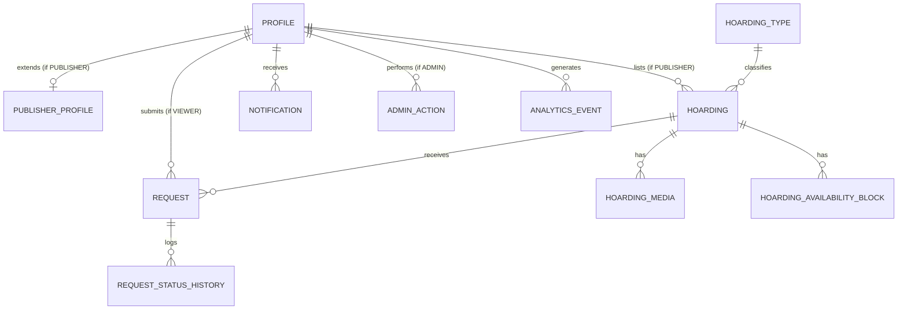
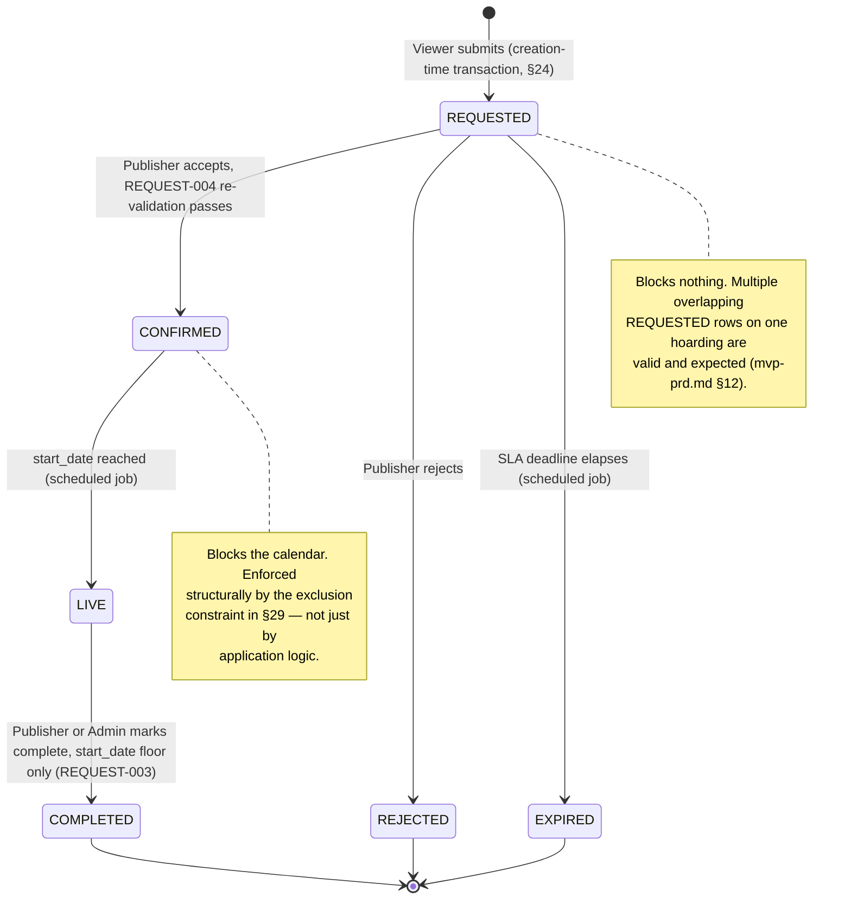
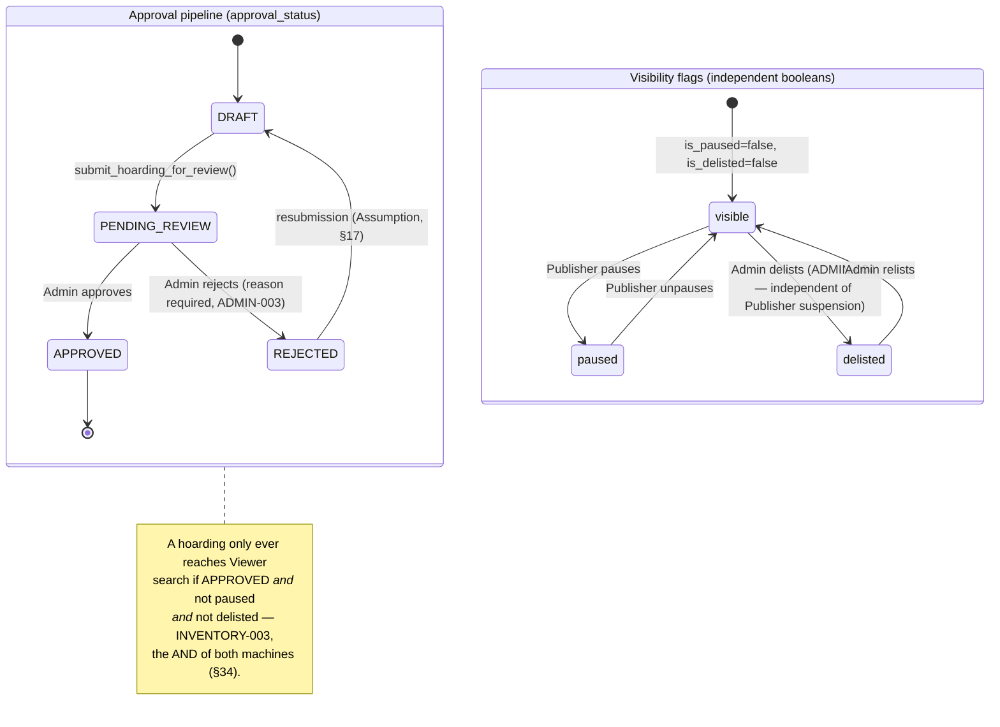

# SEEABLE Hoardings — Database Design & ERD

## 1. Document Metadata

| Field | Value |
|---|---|
| Document | `docs/05-technical/database-design.md` |
| Product | SEEABLE Hoardings |
| Scope | MVP only (Bengaluru, single-city, ~50–200 listings) |
| Version | 1.0 |
| Status | Draft for Review |
| Author role | Senior Database Architect + PostgreSQL Engineer + Product Systems Architect |
| Date | 28 August 2026 |
| Target platform | Supabase PostgreSQL |
| Related documents | `mvp-prd.md`, `mvp-brd.md`, `inventory.md`, `viewer-platform.md`, `request-engine.md`, `admin-platform.md`, `system-architecture.md`, `seeable_free_first_techstack.md`, `README.md` |
| Supersedes | Nothing directly — this is the first version of the document `README.md` lists as Tier 1 gap #5 and every module doc (`inventory.md` §26, `request-engine.md` §26/§32, `admin-platform.md` §26) has been explicitly deferring to |

**Labeling convention used throughout this document**, per the brief that produced it:

- **Assumption** — a technically necessary interpretation, made because the schema cannot be built without deciding it, where the source documents leave the point genuinely open.
- **Open Question** — a genuine unresolved product/business decision, carried forward from the source documents (or newly surfaced while reconciling them), not decided here.
- **Recommendation — Pending Confirmation** — a design choice this document makes on engineering judgment, where a reasonable alternative exists and the product team should sign off before treating it as final.

Nothing in this document silently promotes an Assumption or Recommendation to an approved requirement.

## 2. Purpose

This document is the database design and ERD specification `README.md` (Tier 1, item #5) lists as a real gap: *"`inventory.md` names entities but there's no schema, keys, or relationships defined."* It is the reconciliation point three other documents have been explicitly waiting on — `inventory.md` §20 calls its own data model "a minimum data shape implied by approved behavior, not a database schema... table design, keys, indexes, and constraints belong to the still-unwritten Database Design document"; `request-engine.md` §10 defers "the specific implementation mechanism (database-level locking, transaction isolation, optimistic vs. pessimistic concurrency control)" to this document by name; and `system-architecture.md` §16 states outright: *"Which of these is chosen belongs in `docs/05-technical/database-design.md`, once the database is chosen. What this document fixes is the property, not the technique."*

This document now makes those choices. It is written to be engineering-ready: a developer should be able to take §41 and begin creating Supabase migrations without re-deriving product requirements from scratch.

## 3. Database Design Principles

1. **The database is the enforcement layer for the one invariant that must never break** — no two overlapping requests both reach `CONFIRMED` on the same hoarding (`request-engine.md` §10, formalized as `REQUEST-004`). Frontend and API validation are UX; the database is where this is structurally guaranteed.
2. **One PostgreSQL database, one schema, no per-module databases.** `system-architecture.md` §7 rules out microservices for MVP; this document does not reintroduce that complexity at the data layer.
3. **Business rules live once, in the module that owns them** — `system-architecture.md` §44, rule 1. Concretely: Inventory's tables never store request status; the Request Engine's tables never store approval status.
4. **Computed availability, not cached availability.** Per `system-architecture.md` §27, availability is a query composed from three inputs (approval/pause/delist flags, publisher blocks, confirmed requests), not a mutated calendar column. This is what makes `REQUEST-002`'s "releases dates immediately" free of any explicit release step (§34 below).
5. **Explicit, testable functions for state transitions; triggers only for mechanical bookkeeping.** Confirmation, rejection, completion, listing approval — each is a single `SECURITY DEFINER` PostgreSQL function with its own validation. Triggers are used only for things with no business judgment in them: `updated_at` maintenance, status-history logging, denormalized-field population. This split directly answers `system-architecture.md` §36's caution that "business-critical state transitions should be explicit and testable rather than hidden inside complex triggers."
6. **MVP-appropriate normalization.** Target 3NF for the relational core; `jsonb` only where the product itself is genuinely variable (type-specific attributes, Site Intelligence) — never as a substitute for real columns and constraints on data every hoarding has.
7. **Every deviation from a source document is stated, not silent.** Where this document departs from the illustrative schema in `seeable_free_first_techstack.md` §11, or refines a provisional model from a module doc, the reason is given inline.

## 4. Scope

### 4.1 In scope

Everything needed to run the MVP marketplace loop — **Discover → Compare → Request → Publisher Decision → Confirm → Notify** — end to end at the database layer: identity/roles, Publisher profile and verification, hoarding inventory (six live static types + two data-model-only digital types), media with public/private separation, Publisher-managed availability, the full request lifecycle (`REQUESTED → CONFIRMED/REJECTED/EXPIRED → LIVE → COMPLETED`), Admin moderation, notifications, a lightweight admin audit trail, and analytics events.

### 4.2 Explicitly out of scope

Matching `mvp-prd.md` §3.2, `mvp-brd.md` §5.2, and the task's own exclusion list — none of the following gets a table, a column, or a status value anywhere in this schema:

| Excluded | Why it stays out |
|---|---|
| Payment, escrow, commission | Settlement is offline by product decision; `requests.amount_agreed` is record-keeping only (§21) |
| `PAID`, `PAYMENT_PENDING`, `ESCROWED`, `CONTRACTED`, `CANCELLED_BY_PAYMENT` states | Explicitly forbidden by the brief; Phase 2 concepts that would *extend*, not retrofit, this lifecycle |
| Campaigns, multi-hoarding booking | MVP is one request, one hoarding, one date range (`request-engine.md` §2) |
| Agencies | Single-advertiser flow only |
| Digital screen CMS / device management | Digital types exist as inventory *taxonomy* only — no device tables |
| AI / recommendation logic | Site Intelligence is captured, not consumed, at MVP |
| Contracts | Manual/offline |
| A full audit-log / RBAC system | `admin-platform.md`'s Source Conflict note is explicit that the full-scope BRD's `BR-ADMIN-001/002/003` (payment administration, granular RBAC, full audit log) are not MVP — this document's `admin_actions` table (§26) is a deliberately lightweight substitute, not that system |
| Redis, Elasticsearch, MongoDB, Kafka, a search database | Ruled out by `seeable_free_first_techstack.md` §8 and this brief alike, "unless actual scale proves they are necessary" |

## 5. Architecture Context

Per `system-architecture.md` §7, the MVP is a **modular monolith**: one deployable backend, one PostgreSQL database, with module boundaries enforced by convention and by which code touches which tables — not by network separation. §44's ten implementation rules bind this document in particular: rule 3 ("Request state is owned by the Request Engine — no other module transitions a request or stores its status"), rule 4 ("Inventory is the source of truth for inventory data — no module caches a hoarding's price, availability, or approval state"), and rule 9 ("Critical state transitions are transactional — request creation, confirmation, and listing approval each commit fully or not at all") are implemented directly in §24, §34, and §41.

The module-to-table ownership map (detailed per-table in the Entity Catalog, §9):

```text
Auth & Roles        → profiles (role column), auth.users (Supabase-owned)
Inventory            → hoarding_types, hoardings, hoarding_media, hoarding_availability_blocks
Publisher Platform    → publisher_profiles (workflow only — Inventory still owns hoarding data)
Viewer Platform       → no owned tables — reads Inventory + Request Engine through views/functions
Request Engine        → requests, request_status_history
Admin Platform        → admin_actions (+ mutates publisher_profiles.verification_status / .suspended
                         and hoardings.approval_status / .is_delisted through Inventory's own tables,
                         per rule 7: "cross-module writes go through the owning module's boundary")
Notifications         → notifications
Content Protection    → hoarding_media.processing_status / .original_storage_path
Analytics             → analytics_events
```

## 6. Technology Stack

`system-architecture.md` §43 states plainly that no stack was fixed at the time it was written ("No stack is specified anywhere in this project... every item below: Recommendation — Pending Confirmation"). `seeable_free_first_techstack.md` was written after it and commits concretely. **This document treats `seeable_free_first_techstack.md` as the settled decision** for everything database-relevant, both because it is the more specific and more recent of the two, and because it matches this task's own explicit technology target exactly. This is a documentation-timeline gap between two "technical authority" sources, not a genuine disagreement — surfaced here rather than silently picked, per the brief's instruction not to resolve conflicts without saying so.

| Layer | Choice | Source |
|---|---|---|
| Database | Supabase PostgreSQL | `seeable_free_first_techstack.md` §7 |
| Auth | Supabase Auth (`auth.users` + application `profiles`) | §9 |
| Storage | Supabase Storage, two buckets: `hoarding-public`, `hoarding-private` | §19 |
| API access to the DB | PostgREST over HTTPS (`@supabase/supabase-js`) — **no raw pooled connection from application code** | §21 (this is *why* `confirm_request` must be a single stored function — see §24) |
| Background/scheduled jobs | Database-backed (`pg_cron` on Supabase, or an equivalent scheduled invoker calling SQL functions) — no message broker | §25; `system-architecture.md` §23, ADR-005 |
| Explicitly not used | MongoDB, Redis, Elasticsearch, Kafka, a separate search database, PostGIS (at this scale — see §33) | §8, §26 |

## 7. Database Architecture

A single `public` schema alongside Supabase's own `auth` and `storage` schemas. `auth.users` is the identity system of record (§15); `public.profiles` is the application-owned 1:1 extension every other table ultimately hangs off. No table in this schema stores a password or any authentication secret — that is `auth.users`' job exclusively (`system-architecture.md` §30's "password hashing" requirement is satisfied entirely inside Supabase Auth, not by this schema).

Row Level Security (RLS) is enabled on every application table (§37); the two Supabase-managed schemas have their own access model and are not modified by this document beyond the Storage bucket policies noted in §19.

## 8. Domain Model Overview

Six actors and processes anchor the schema, matching `mvp-prd.md`'s seven MVP modules minus the two (Viewer Platform, Content Protection) that own no tables of their own:

- **Identity** — a Supabase Auth user extended by exactly one `profiles` row, role-tagged as `VIEWER`, `PUBLISHER`, or `ADMIN`.
- **Publisher workflow** — a `publisher_profiles` row carrying verification and suspension state, independent of the Publisher's listings.
- **Inventory** — a `hoardings` row per listing, typed against a small `hoarding_types` lookup table, with owned `hoarding_media` and `hoarding_availability_blocks`.
- **Request Engine** — a `requests` row per date-range ask, with `request_status_history` as its append-only audit trail.
- **Notifications** — a flat `notifications` table, one row per recipient per event.
- **Admin & Analytics** — `admin_actions` (lightweight moderation audit) and `analytics_events` (operational counters for `mvp-brd.md` §14's KPIs).

Eleven tables in total. No table exists that isn't traceable to a specific requirement or an explicitly labeled Assumption/Recommendation — the full traceability is in §47.

## 9. Entity Catalog

| # | Table | Owning module | One-line purpose |
|---|---|---|---|
| 1 | `profiles` | Auth & Roles | One row per authenticated user; role + shared identity fields |
| 2 | `publisher_profiles` | Publisher Platform | Verification/suspension workflow state, 1:1 with a Publisher's `profiles` row |
| 3 | `hoarding_types` | Inventory | Lookup/reference table for the 8-type taxonomy (`mvp-prd.md` §8) |
| 4 | `hoardings` | Inventory | One row per listing — the central entity of the product |
| 5 | `hoarding_media` | Inventory / Content Protection | Photos/videos per hoarding, public + private storage references |
| 6 | `hoarding_availability_blocks` | Inventory | Publisher-declared "not available" date ranges, independent of requests |
| 7 | `requests` | Request Engine | One row per Viewer date-range ask; owns the state machine |
| 8 | `request_status_history` | Request Engine | Append-only log of every status transition on a request |
| 9 | `notifications` | Notifications | One row per (event, recipient) — in-app notification feed |
| 10 | `admin_actions` | Admin Platform | Lightweight audit trail of moderation actions |
| 11 | `analytics_events` | Analytics | Generic event log for MVP-stage operational counters |

`auth.users` (Supabase-managed) is the twelfth entity in the diagrams below but is never modified by application code — it exists only as the FK target for `profiles.id`.

## 10. ERD — Conceptual Domain Model



This is the story the whole schema tells: a **Profile** is a Publisher who lists **Hoardings** (typed, photographed, and calendared) or a Viewer who submits **Requests** against them; every Request leaves a trail in its own history; every meaningful event produces a **Notification**; Admin actions and analytics sit alongside as thin, mostly-independent observers.

## 11. ERD — Full Physical Schema

```mermaid
erDiagram
    AUTH_USERS ||--|| PROFILES : "id (Supabase-managed)"
    PROFILES ||--o| PUBLISHER_PROFILES : "id"
    PROFILES ||--o{ HOARDINGS : "publisher_id"
    PROFILES ||--o{ REQUESTS : "viewer_id"
    PROFILES ||--o{ REQUESTS : "publisher_id (denormalized)"
    PROFILES ||--o{ NOTIFICATIONS : "recipient_id"
    PROFILES ||--o{ ADMIN_ACTIONS : "admin_id"
    PROFILES ||--o{ ANALYTICS_EVENTS : "user_id"
    PROFILES ||--o{ REQUEST_STATUS_HISTORY : "changed_by"
    HOARDING_TYPES ||--o{ HOARDINGS : "type_code"
    HOARDINGS ||--o{ HOARDING_MEDIA : "hoarding_id"
    HOARDINGS ||--o{ HOARDING_AVAILABILITY_BLOCKS : "hoarding_id"
    HOARDINGS ||--o{ REQUESTS : "hoarding_id"
    HOARDINGS ||--o{ ADMIN_ACTIONS : "target_hoarding_id"
    HOARDINGS ||--o{ NOTIFICATIONS : "related_hoarding_id"
    REQUESTS ||--o{ REQUEST_STATUS_HISTORY : "request_id"
    REQUESTS ||--o{ NOTIFICATIONS : "related_request_id"
    PUBLISHER_PROFILES ||--o{ ADMIN_ACTIONS : "target_publisher_id"

    AUTH_USERS {
        uuid id PK
        text email
        text encrypted_password
    }
    PROFILES {
        uuid id PK_FK
        text role
        text full_name
        text phone
        text email
        text city
        timestamptz created_at
        timestamptz updated_at
    }
    PUBLISHER_PROFILES {
        uuid id PK_FK
        text business_name
        text verification_status
        timestamptz verified_at
        text rejection_reason
        boolean suspended
        timestamptz suspended_at
        uuid suspended_by FK
        text suspension_reason
        timestamptz created_at
        timestamptz updated_at
    }
    HOARDING_TYPES {
        text code PK
        text display_name
        boolean is_digital
        text_array required_attribute_keys
        text description
    }
    HOARDINGS {
        uuid id PK
        uuid publisher_id FK
        text type_code FK
        text title
        text description
        text size
        numeric price
        text price_unit
        double_precision latitude
        double_precision longitude
        text locality
        text city
        text address_text
        text approval_status
        text rejection_reason
        timestamptz approved_at
        uuid approved_by FK
        boolean is_paused
        timestamptz paused_at
        boolean is_delisted
        timestamptz delisted_at
        uuid delisted_by FK
        text delist_reason
        boolean site_intelligence_complete
        jsonb site_intelligence
        jsonb attributes
        timestamptz created_at
        timestamptz updated_at
    }
    HOARDING_MEDIA {
        uuid id PK
        uuid hoarding_id FK
        text media_type
        text storage_path
        text original_storage_path
        boolean is_primary
        int display_order
        text processing_status
        timestamptz watermarked_at
        timestamptz created_at
    }
    HOARDING_AVAILABILITY_BLOCKS {
        uuid id PK
        uuid hoarding_id FK
        date start_date
        date end_date
        daterange date_range
        text reason
        timestamptz created_at
    }
    REQUESTS {
        uuid id PK
        uuid hoarding_id FK
        uuid viewer_id FK
        uuid publisher_id FK
        date start_date
        date end_date
        daterange stay_range
        text status
        text message
        text rejection_reason
        numeric amount_agreed
        timestamptz sla_deadline
        timestamptz confirmed_at
        timestamptz rejected_at
        timestamptz expired_at
        timestamptz live_at
        timestamptz completed_at
        uuid completed_by FK
        timestamptz created_at
        timestamptz updated_at
    }
    REQUEST_STATUS_HISTORY {
        uuid id PK
        uuid request_id FK
        text from_status
        text to_status
        uuid changed_by FK
        timestamptz changed_at
        text note
    }
    NOTIFICATIONS {
        uuid id PK
        uuid recipient_id FK
        text type
        text title
        text message
        uuid related_hoarding_id FK
        uuid related_request_id FK
        boolean is_read
        timestamptz read_at
        timestamptz created_at
    }
    ADMIN_ACTIONS {
        uuid id PK
        uuid admin_id FK
        text admin_label
        text action_type
        uuid target_hoarding_id FK
        uuid target_publisher_id FK
        text reason
        jsonb metadata
        timestamptz created_at
    }
    ANALYTICS_EVENTS {
        uuid id PK
        uuid user_id FK
        text event_name
        jsonb properties
        timestamptz created_at
    }
```

## 12. ERD — Request Lifecycle State Diagram

Directly implements the six-state machine `request-engine.md` §5 defines as canonical (`REQUESTED, CONFIRMED, REJECTED, EXPIRED, LIVE, COMPLETED`) and confirms `AVAILABLE` is **not** a request status — it is a calendar condition computed elsewhere (§34).



## 13. ERD — Hoarding Approval & Visibility State Diagram

`inventory.md` §14–§15's central refinement — `approval_status` and the `is_paused`/`is_delisted` flags are **independent axes**, not one linear chain — is the single most consequential modeling decision in the Inventory domain, and it is drawn that way deliberately below rather than flattened into one state machine.



## 14. Relationship & Cardinality Summary

| Parent | Child | Cardinality | On Delete | Notes |
|---|---|---|---|---|
| `profiles` | `publisher_profiles` | 1 : 0..1 | CASCADE | Only exists for `role = 'PUBLISHER'` rows; enforced by trigger, not a DB-level CHECK across tables (§31) |
| `profiles` | `hoardings` | 1 : many | RESTRICT | A Publisher cannot be hard-deleted while they own listings (§38) |
| `hoarding_types` | `hoardings` | 1 : many | RESTRICT | Reference data; a type in use cannot be removed |
| `hoardings` | `hoarding_media` | 1 : many | CASCADE | Media has no independent existence |
| `hoardings` | `hoarding_availability_blocks` | 1 : many | CASCADE | Blocks have no independent existence |
| `hoardings` | `requests` | 1 : many | RESTRICT | **The load-bearing FK of the whole soft-delete design (§38)** — a hoarding with request history cannot be hard-deleted, structurally |
| `profiles` (viewer) | `requests` | 1 : many | RESTRICT | Preserves request history even if a Viewer account is later deactivated (deactivation is out of MVP scope — no delete path is built) |
| `profiles` (publisher, denormalized) | `requests` | 1 : many | RESTRICT | Populated by trigger from `hoardings.publisher_id`, never client-set (§26) |
| `requests` | `request_status_history` | 1 : many | CASCADE | History is meaningless without its parent request |
| `profiles` | `notifications` | 1 : many | CASCADE | Notifications are disposable if the account itself is gone |
| `profiles` | `admin_actions` | 1 : many | SET NULL | Audit rows must outlive the admin identity (§38) |
| `publisher_profiles` | `admin_actions` | 1 : many | SET NULL | Same reasoning, target side |
| `profiles` | `analytics_events` | 1 : many | SET NULL | Analytics is explicitly decoupled from referential integrity (§39) |

## 15. Model Rationale — Identity & Roles (`profiles`)

`seeable_free_first_techstack.md` §9 is explicit and binding: authentication stays inside Supabase Auth (`auth.users`), and application profile data stays separate. `profiles.id` is both primary key and foreign key to `auth.users.id` — a true 1:1 extension table, not a duplicate identity system.

- **`role`** — one of `VIEWER`, `PUBLISHER`, `ADMIN` (uppercase convention, §16 below). `mvp-prd.md` §4 and `viewer-platform.md`/`request-engine.md` treat these as mutually exclusive at MVP (no multi-role accounts, no Publisher-who-is-also-a-Viewer path described anywhere) — modeled as a single column, not a join table, on that basis. **Assumption:** a single account cannot hold two roles; no source document tests or contradicts this, but nothing suggests multi-role accounts are needed at MVP scale.
- **Admin provisioning.** `admin-platform.md` §21 reasons that Admin accounts are "provisioned directly by SEEABLE... not created through the public registration flow," since no self-registration path for Admin is described anywhere (unlike Publisher/Viewer, `mvp-prd.md` §7.1). **Recommendation — Pending Confirmation:** the public-facing signup flow should never expose `ADMIN` as a selectable role; provisioning an Admin account is an out-of-band operation (e.g. a direct `UPDATE profiles SET role = 'ADMIN'` run by a superuser via the Supabase SQL editor, or a dedicated internal script) — not a capability this schema needs to expose through RLS to any client role.
- **`phone`, `full_name`, `city`** — shared fields every role needs; `mvp-prd.md` §7.2 lists them for Publisher, `viewer-platform.md` for Viewer. Kept on the shared table rather than duplicated per-role table, since they're identical in shape and meaning across roles.
- **Demo auth note:** `viewer-platform.md` §3 documents that this build's Viewer login uses email/mobile + password rather than the OTP `AUTH-002` specifies as the approved target, calling it out explicitly as a "Demo Scope Note," not a redefinition. This has **no schema impact** — Supabase Auth session gating via `auth.uid()` in RLS policies works identically regardless of which credential method authenticated the session.
- **Self-role-escalation is blocked at the grant level, not just RLS** (§37) — a Publisher updating their own `phone` must not be able to smuggle `role = 'ADMIN'` into the same UPDATE.

## 16. Enum Strategy — Text+Check vs. Lookup Tables

Directly resolves the task's own §25: this document does not pick one enum strategy dogmatically, it applies a **consistent rule** based on whether a category carries associated metadata:

| Category | Strategy | Reason |
|---|---|---|
| `role`, `approval_status`, `verification_status`, request `status`, `media_type`, `processing_status`, `notification_type`, `admin_action_type`, `price_unit` | **`text` + `CHECK` constraint** | Pure status labels with no attributes of their own. Several are still stabilizing — `request-engine.md` §17 explicitly leaves the SLA duration undefined and `admin-platform.md` §14.1 leaves publisher-unsuspend undecided — and a `CHECK` constraint is one `ALTER TABLE ... DROP CONSTRAINT / ADD CONSTRAINT` away from a new value, versus native `ENUM`'s `ALTER TYPE ... ADD VALUE` friction (cannot run inside a transaction block with other DDL in the same migration on older PostgreSQL, and cannot remove a value at all). |
| Hoarding type (8-value taxonomy) | **Lookup table** (`hoarding_types`) | Each type carries real metadata — `is_digital`, and (§28) the exact set of required type-specific attribute keys `INVENTORY-001` demands per type. A bare `CHECK (type_code IN (...))` cannot express "which JSON keys are mandatory for this type," so it has to be a table, not a constraint. |

**Uppercase convention.** All status-like `text` values in this schema use `UPPER_SNAKE_CASE` — `VIEWER`, `PENDING_REVIEW`, `CONFIRMED`, `WATERMARKED`. This is not this document's own invention: it matches `seeable_free_first_techstack.md` §11's illustrative schema (`'VIEWER'`, `'DRAFT'`, `'PENDING'`) and the request-status vocabulary `mvp-prd.md`/`request-engine.md` already use verbatim (`REQUESTED`, `CONFIRMED`, `LIVE`...). Adopting one casing convention everywhere, rather than mixing it per table, is this document's own consistency choice.

## 17. Model Rationale — Publisher Verification (`publisher_profiles`)

Kept as a **separate table** from `profiles`, 1:1, rather than adding verification columns directly to `profiles` — Viewer rows would otherwise carry four permanently-null verification columns, and the workflow (verify/reject/suspend) is conceptually a Publisher-Platform-owned process distinct from shared identity.

- **`verification_status`** — three values: `UNVERIFIED`, `VERIFIED`, `REJECTED` (`admin-platform.md` §14.1's own chain, minus the fourth). **Recommendation — Pending Confirmation, with the alternative stated:** `admin-platform.md` §18's own Data Requirements section lists `verification_status` as a single *four*-valued field including `Suspended`. This document instead keeps `suspended` as an **independent boolean**, for the same structural reason `inventory.md` gives for keeping `is_paused`/`is_delisted` independent of `approval_status` (§13 above): suspension needs its own `suspended_at` / `suspended_by` / `suspension_reason` metadata regardless of which design wins (`admin-platform.md` §18 lists `suspended_at` as a needed field *alongside* `verification_status`, which is itself a small tell that the two are not really one axis) — and folding suspension into the same column as verification would mean an unsuspend action has to reconstruct "what were they before suspension," which the independent-boolean design never has to do because the underlying `verification_status` value is simply never overwritten by a suspend action. Either design is defensible; this document picks the one that avoids state reconstruction on the reversal path.
- **`verified_at`, `suspended_at`** — both explicitly flagged by `admin-platform.md` §18 as *"Assumption — not stated, needed for the dashboard/audit trail."* Included on that basis.
- **Un-suspend.** Whether a suspended Publisher can ever be reversed is **explicitly undefined** — "no such action is described anywhere" (`admin-platform.md` §14.1, §22 edge case #9 goes further and notes even whether suspension blocks *login* or only *new listings* is undefined). This document still includes an `unsuspend_publisher()` function (§41) as a **Recommendation — Pending Confirmation**: leaving genuinely no reversal path for an Admin who suspends the wrong Publisher seems operationally untenable, but this is this document's own judgment call, not a sourced requirement.
- **Resubmission after rejection** (edge case #4, `admin-platform.md` §22) is likewise an **Open Question** — "no retry/appeal path defined." No column or function forecloses it; a rejected Publisher's row simply sits at `REJECTED` until a product decision is made.

## 18. Model Rationale — Inventory Taxonomy (`hoarding_types`)

Seeded, not user-editable, with exactly the eight types `mvp-prd.md` §8 names — six static (`UNIPOLE_BILLBOARD`, `GANTRY`, `METRO_PILLAR`, `WALL_WRAP`, `TRANSIT_MEDIA`, `BUS_QUEUE_SHELTER`) plus two digital (`DIGITAL_BILLBOARD`, `DIGITAL_SCREEN`) that exist in the taxonomy per `mvp-brd.md` §5.1's explicit scoping to "static hoarding types only" for actual MVP listing — the digital rows are seeded for completeness of the reference table and forward-compatibility, not because Publishers can list them yet. **Recommendation — Pending Confirmation:** enforce this at the application layer (listing-creation UI simply never offers the two digital types as selectable) rather than in the database, since `is_digital = true` is still useful, queryable metadata to have seeded even before those types go live.

- **`required_attribute_keys text[]`** — the exact list of type-specific fields `INVENTORY-001` requires per type (e.g. a Unipole needs `height_ft`, `width_ft`, `illumination`; a Bus Shelter needs different fields entirely — `mvp-prd.md` §8's per-type field tables). This is what makes `hoarding_types` a table and not a `CHECK` constraint (§16): the validation function `hoarding_has_required_attributes()` (§41) checks the submitted `hoardings.attributes` jsonb against this array using the `?&` "has all keys" operator, so adding or correcting a required field for one type is a data change (`UPDATE hoarding_types`), not a schema migration.

## 19. Model Rationale — Hoarding Core (`hoardings`)

The central entity. Column-by-column rationale for every decision that isn't self-evident:

- **`approval_status`, `is_paused`, `is_delisted` as independent axes** — already covered in depth in §13; this is `inventory.md` §14–15's own explicit refinement of an earlier, more linear model in `admin-platform.md`, adopted here because `inventory.md` is the later, more detailed, and more directly-reasoned source on this specific point. `INVENTORY-003` — visible to a Viewer only if `approval_status = 'APPROVED' AND NOT is_paused AND NOT is_delisted` — is implemented as the `visible_hoardings` view predicate (§35), not duplicated anywhere else.
- **`size text`, not `size numeric` + a unit column.** `inventory.md` §8 flags the *unit itself* as genuinely undefined — sqft, sqm, and named classes ("10x20 standard") are all plausible readings of the source material, with no way to pick one without inventing a product decision. A free-text column is this document's **Assumption**, chosen because it is the only representation that doesn't silently commit to a unit no source document states; **Open Question**, carried forward: standardizing this to a structured `numeric` + `unit` pair is worth doing as soon as the unit question is answered, since free-text size defeats like-for-like comparison — which is itself `BR-VIEWER-002`'s explicit purpose ("standardized information... to support like-for-like comparison").
- **`price numeric`, `price_unit text`.** `mvp-brd.md` and `mvp-prd.md` both describe price as flat with no stated billing period. **Assumption:** `price_unit` defaults to `'MONTH'` (the OOH industry norm) with `'DAY'`/`'WEEK'` also modeled, since a bare `numeric` price with no unit is not independently meaningful.
- **`latitude double precision`, `longitude double precision`** — plain columns, no PostGIS (§33 justifies this at length). `inventory.md` §8 flags geo-coordinates as an **Assumption** in the first place — no source document confirms coordinates are even captured — and `system-architecture.md` §26 goes further, calling this *"the most consequential undocumented dependency in the architecture"*: if Publishers enter a text address rather than pin a map location, a geocoding service is required, and no source document names one. This schema takes coordinates as given (columns exist, `NOT NULL`) and carries the acquisition-mechanism gap forward as an **Open Question** in §48 rather than silently assuming a geocoding provider.
- **`attributes jsonb`** — type-specific fields, directly justified by `mvp-prd.md`'s own explicit NFR that these be stored as structured JSON rather than a table-per-type. Validated against `hoarding_types.required_attribute_keys` at submission time (§41), never at write time on every UPDATE — a Publisher can save a Draft with incomplete attributes; only *submitting for review* enforces completeness (`inventory.md` §22 edge case, this document's Entity Catalog cross-reference).
- **`site_intelligence_complete boolean`, `site_intelligence jsonb`** — `INVENTORY-002`. A missing Site Intelligence flag does **not** block submission (admin-platform.md §22 edge case #1: "flagged incomplete in the queue; not blocked from approval") — it is informational for the Admin queue, not a gate, unlike `attributes`.
- **`approved_by uuid REFERENCES profiles(id)`.** `admin-platform.md` §18 states outright: *"No field for 'who approved/rejected this'... is specified anywhere... carried to §27."* This column is this document's direct, low-cost response to that gap — labeled **Recommendation — Pending Confirmation**, not presented as if the source already required it — and it matters beyond bookkeeping: `admin-platform.md` §20 ties the absence of any Admin-action audit trail directly to `mvp-brd.md` §17's named "no-recourse disputes" risk. Capturing who approved a listing is one of the cheapest possible mitigations for that named business risk.
- **Delist vs. Pause vs. Delete — three distinct actions, three distinct mechanisms.** `inventory.md` §16 is explicit these are non-interchangeable, by different actors: Publisher pauses (`is_paused`), Admin delists (`is_delisted`), and delete is a *destructive* action with no defined semantics anywhere in the source material. `inventory.md`'s own recommendation is that neither pause nor delist should ever be a hard delete, to protect historical Request references — this document's refinement (§38) goes one step further: hard `DELETE` is only physically possible when zero `requests` reference the hoarding, enforced by `ON DELETE RESTRICT` on `requests.hoarding_id`, not by application-level discipline alone.

## 20. Model Rationale — Media (`hoarding_media`)

`CONTENT-001` and `system-architecture.md` §20–21's content-protection pipeline (original → private storage → watermark worker → served/public storage; *"unwatermarked originals must never be publicly exposed"*) map directly onto this table:

- **`storage_path`** — the public, watermarked asset's location in the `hoarding-public` bucket (`seeable_free_first_techstack.md` §19's exact bucket name). This is the only path ever returned to a Viewer-facing client.
- **`original_storage_path`** — the private original in `hoarding-private`. **Never granted to any client role at the column level** (§37) — read only through a `SECURITY DEFINER` function that checks ownership/Admin status internally (§41), because RLS alone is row-level and cannot express "this column, but only for rows you own" without either a second table or a function boundary; a function boundary is simpler here and keeps the rule in one place.
- **`processing_status`** — `UPLOADED → PROCESSING → WATERMARKED | FAILED`. This is a refinement of, not a contradiction of, `system-architecture.md` §20's simpler three-value `pending → complete | failed` model: `UPLOADED` and `PROCESSING` both collapse into their single `pending` state, with the extra granularity giving the UI a finer-grained "still uploading" vs. "watermarking in progress" signal. Gates submission per `CONTENT-001` — `submit_hoarding_for_review()` (§41) refuses unless every media row is `WATERMARKED`.
- **Where watermarking computation happens is deliberately not this table's concern.** `seeable_free_first_techstack.md` §18 recommends browser-side Canvas processing (cheapest, no server compute) while `system-architecture.md` §20's diagram shows a server-side worker reading the private original and writing a derivative. This schema is agnostic to which: `processing_status` only tracks whether a watermarked asset has successfully landed in `hoarding-public` for a given media row, which is equally true either way. **Assumption**, flagged because `seeable_free_first_techstack.md`'s flow diagram shows a single upload step with no explicit "store the original too" arrow: this document still retains `original_storage_path` as populated by default, both because `system-architecture.md` §20's fuller diagram does show a stored original and because `CONTENT-001`'s own language ("unwatermarked *originals*") presupposes one exists somewhere. If the team implements pure client-side watermarking with no original ever retained, `original_storage_path` can simply stay `NULL` — nothing else in this schema depends on it being populated.
- **Minimum photo count.** `inventory.md` flags "at least one photo" as an **Assumption**, not a stated minimum. Enforced at `submit_hoarding_for_review()` time (§41: `COUNT(*) >= 1`), not by a table-level constraint, since a `Draft` listing may legitimately have zero media rows.

## 21. Model Rationale — Availability Blocks (`hoarding_availability_blocks`)

A simple, Publisher-managed list of date ranges the Publisher has marked unavailable (maintenance, an offline booking, personal reasons) — independent of and prior to any Request. `seeable_free_first_techstack.md` §11's illustrative sketch gives this table a `status` column defaulting to `'BOOKED'`; this document deliberately **omits** it. No source document describes more than one kind of block (`inventory.md`'s "blocked date ranges" language is uniformly binary — a range is blocked or it isn't), so a status column would have no second value to ever hold. Row existence *is* the status. This is a stated, deliberate simplification versus the illustrative sketch, not an oversight.

## 22. Model Rationale — Requests (`requests`)

The busiest table in the schema and the one carrying the product's core invariant.

- **`start_date date`, `end_date date`, both inclusive.** `mvp-prd.md`'s own worked example — "1–15 Sep and 10–20 Sep overlap" — only holds if both endpoints are inclusive on both ranges; PostgreSQL's default `daterange` bound type is `[)` (inclusive start, *exclusive* end), which would silently disagree with the product's own example. `stay_range` is a `GENERATED ALWAYS AS (daterange(start_date, end_date, '[]')) STORED` column specifying `'[]'` (inclusive-both) explicitly, so this can never be gotten wrong at the query-writing layer — it's baked into the generated column itself.
- **`status`** — the six-value vocabulary from §12's state diagram, `text` + `CHECK`, no native `ENUM` (§16). No `UPDATE` path on this table is granted directly to any client role (§37) — every transition goes through a `SECURITY DEFINER` function (§41), so the state diagram in §12 is not just documentation, it is the *complete* list of legal transitions this table can ever undergo.
- **`publisher_id` — denormalized from `hoardings.publisher_id`, deliberately.** `request-engine.md` §26 names this explicitly: *"denormalized from the hoarding for convenience; hoarding is source of truth for ownership."* Populated by a `BEFORE INSERT` trigger reading the parent hoarding, **never client-settable, never updated after insert**. This is not a violation of `system-architecture.md` §44 rule 4 ("no module caches a hoarding's price, availability, or approval state") — ownership is an *immutable* fact about a hoarding (a listing does not change owners at MVP), categorically different from the *mutable* business data (price, approval status) rule 4 is protecting against staleness for. The payoff is real: `requests`' RLS SELECT policy becomes a flat `publisher_id = auth.uid()` instead of an `EXISTS (SELECT 1 FROM hoardings WHERE ...)` subquery evaluated on every row.
- **`sla_deadline timestamptz`.** `request-engine.md` §17 leaves both the exact SLA duration and its clock-start event undefined. **Assumption:** clock starts at `created_at`; **Recommendation — Pending Confirmation:** a 48-hour default, computed by a trigger calling a small `SET`-returning function rather than hardcoded inline, so redefining the SLA later is `CREATE OR REPLACE FUNCTION`, not a schema migration — directly satisfying `request-engine.md`'s own stated requirement that finalizing the SLA duration must not require a schema rewrite.
- **`amount_agreed numeric`, nullable.** Record-keeping only — `mvp-prd.md` §3.2 is unambiguous that no payment is enforced or collected at MVP. WHO records it and WHEN are both undefined (`request-engine.md` §21). **Assumption:** settable only by the owning Publisher, only once the request has left `REQUESTED` (i.e. `CONFIRMED`/`LIVE`/`COMPLETED`), via a narrow dedicated function rather than a general `UPDATE` grant.
- **Publisher rejection reason is optional**, unlike Admin's listing-rejection reason (`ADMIN-003`, which *is* required). `request-engine.md` is explicit that Publisher-side rejection carries no such requirement — `rejection_reason` here is nullable with no `CHECK`, while the equivalent column on `hoardings` is enforced `NOT NULL WHEN approval_status = 'REJECTED'` (§30).
- **No `CASCADE` anywhere near this table.** Both FKs (`hoarding_id`, `viewer_id`) are `RESTRICT`. This is what makes hard-deleting a requested-against hoarding or a Viewer with request history structurally impossible, not just discouraged (§38).

## 23. Model Rationale — Request Status History (`request_status_history`)

`request-engine.md` is explicit and unambiguous that this concept is **not an approved MVP requirement**: *"Assumption/Open Question... an audit trail is a reasonable inference, not a stated rule."* This document includes it anyway, labeled clearly as **Recommendation — Pending Confirmation**, on three grounds stated together rather than asserted vaguely: (1) it is cheap — one `AFTER INSERT OR UPDATE OF status` trigger, no application code required to maintain it; (2) it is the direct, concrete answer to `admin-platform.md` §20's flagged audit-trail gap, tied to `mvp-brd.md` §17's named "no-recourse disputes" risk; (3) it is what makes `mvp-brd.md` §14's KPI "median Publisher response time to a request" computable at all — without a timestamped log of exactly when a request left `REQUESTED`, that KPI has no data source (§44 shows the query). If the product team decides against it, the table can be dropped with zero impact on any other table — nothing else has a required FK into it.

## 24. Concurrency Model — Why `confirm_request()` Must Be a Single Database Function

This is the design decision the whole document exists to make correctly, so the reasoning is given in full rather than compressed into a table.

**The invariant, stated once, plainly** (`system-architecture.md` §16): *no two overlapping requests may both reach `CONFIRMED` on the same hoarding.* Every other requirement in this section exists to serve that one sentence.

**Why it can't be enforced from application code alone.** `seeable_free_first_techstack.md` §21 states the concrete, architecture-level reason: the application talks to Postgres exclusively through Supabase's PostgREST layer over HTTPS (`@supabase/supabase-js`), **not** a raw pooled connection — so a client cannot wrap a `BEGIN ... COMMIT` around several separate API calls the way a traditional server with a direct connection pool could. The re-check-then-write sequence has to be atomic *inside the database*, as one statement from the client's point of view, or it isn't atomic at all.

**The mechanism, in two layers that each independently enforce the same rule:**

1. **A `SECURITY DEFINER plpgsql` function, `confirm_request(p_request_id uuid)`,** invoked as a single `supabase.rpc('confirm_request', { p_request_id })` call. Everything `system-architecture.md` §28 requires of the "Request confirmation" transaction happens inside one native Postgres transaction, atomic by construction:
   - `SELECT ... FOR UPDATE` locks the request row (and implicitly serializes concurrent confirmation attempts on the same hoarding, since step 2 reads sibling rows for the same `hoarding_id`);
   - asserts `status = 'REQUESTED'` (fails cleanly, doesn't silently no-op, if another admin/publisher action already moved it — directly answering `system-architecture.md` §16's "SLA expiry racing a Publisher response" hazard: whichever transaction commits first wins, the second fails its precondition check);
   - re-validates the hoarding is still visible (`INVENTORY-003`) — a hoarding paused or delisted between request creation and acceptance must block confirmation;
   - re-checks for a conflicting `CONFIRMED`/`LIVE`/`COMPLETED` request on the same hoarding — this is `REQUEST-004`, the exact re-validation `request-engine.md` §10 names as the central duty of acceptance;
   - performs the `UPDATE ... SET status = 'CONFIRMED'` and inserts the acceptance notification, in the same transaction.
2. **A database-level `EXCLUDE` constraint** (§29) as the structural backstop *underneath* the function — so that even a bug in the function's own logic, a future direct `UPDATE` that bypasses the function, or a second code path added later cannot produce two overlapping `CONFIRMED` rows. `seeable_free_first_techstack.md` §21 calls this "the single highest-value database feature for this specific product's core invariant... worth setting up in the first migration, not retrofitting later," and `system-architecture.md` §16 independently names it "the strongest option, and the one worth evaluating first." Both sources converge on exactly this mechanism without prescribing it as final — this document now makes it final.

**Why the function catches the constraint violation rather than letting it surface raw.** If the `EXCLUDE` constraint *does* fire (the belt-and-suspenders case — a race the function's own row lock should already have prevented, but defense in depth costs nothing here), a raw `23P01 exclusion_violation` is not a message a Publisher-facing UI should ever show. The function catches it and re-raises a specific, human-readable error — directly satisfying `system-architecture.md` §29's requirement that a failed conflict check "must return a *specific* reason... not a generic error."

**Why the predicate includes `LIVE` and `COMPLETED`, not just `CONFIRMED`.** This is a nuance beyond what any source document states outright, so the reasoning is spelled out: a `LIVE` or `COMPLETED` request represents a date range that genuinely *was* occupied — nothing in the product allows un-completing or cancelling a live campaign, so those dates cannot be legitimately re-confirmed to someone else, ever. `system-architecture.md` §27 explicitly surfaces this exact question — *"whether the availability query treats Completed as still-blocking... this document does not decide it"* — and defers the decision here. **Recommendation — Pending Confirmation:** yes, `COMPLETED` (and `LIVE`) continue to occupy the exclusion constraint's predicate and the computed-availability view (§35), on the grounds that a completed booking is a historical fact, not a reversible one, and allowing a second `CONFIRMED` request over already-fulfilled dates would be a real-world impossibility, not just a data inconsistency.

**Request creation is a transaction too — but not an RPC.** `system-architecture.md` §28 also names request *creation* as needing transactional treatment (validate visibility, check `VIEWER-002`, check conflicts, insert, notify). This document implements it without a dedicated function: a single `INSERT INTO requests (...)` statement is *already* one atomic Postgres transaction, including every trigger it fires — if any trigger raises, the whole insert (and any side effects already made by earlier triggers in the same statement) rolls back. Concretely: RLS's `WITH CHECK` handles ownership (`viewer_id = auth.uid()`, `status = 'REQUESTED'`); a `BEFORE INSERT` trigger (`validate_request_creation`, §41) checks hoarding visibility and re-checks for a `CONFIRMED`/`LIVE`/`COMPLETED` overlap, raising a specific, catchable error if either fails; the partial unique index (§30) enforces `VIEWER-002` structurally, which `system-architecture.md` §16 itself prefers over an application check ("best enforced by a database constraint... so a concurrent double-submit cannot slip past an application-level check"); and an `AFTER INSERT` trigger writes the two creation-time notification rows (§25). A plain client-side `INSERT` through PostgREST is therefore already fully compliant with §28's transaction diagram — no `rpc()` call is needed for this path, only for confirmation, where the *re-check-against-changed-state* semantics genuinely require a function.

## 25. Model Rationale — Notifications (`notifications`)

`request-engine.md` §22's event table is followed directly for recipients:

| Event | Recipient(s) | Source |
|---|---|---|
| `REQUEST_CREATED` | **Both** the Publisher ("new request received") and the Viewer ("submission confirmed") | `request-engine.md` §22 — two rows inserted per creation, not one |
| `REQUEST_ACCEPTED` | Viewer only | §22 |
| `REQUEST_REJECTED` | Viewer only | §22 |
| `REQUEST_EXPIRED` | Viewer only | §22 |
| `REQUEST_EXPIRING_SOON` | **Both** — see conflict note below | §22, `viewer-platform.md` |
| `LISTING_APPROVED` / `LISTING_REJECTED` | Publisher | `mvp-prd.md` §7.6's event list (see NOTIF-001 note below) |

**Cross-document conflict, surfaced rather than silently resolved:** `request-engine.md` §22 frames "request approaching expiry" as Publisher-relevant only ("implied — they can still act"), while `viewer-platform.md` independently describes the same event as Viewer-relevant too. **Recommendation — Pending Confirmation:** this document notifies **both**, since either reading is defensible and over-notifying is the lower-risk default (a Viewer who doesn't want a heads-up can ignore it; a Viewer who wanted one and didn't get it has no recourse).

**`LIVE` and `COMPLETED` transitions are deliberately not notification-triggering events** — neither appears in `mvp-prd.md` §7.6's named event set, and `request-engine.md` confirms notification is "not required" for either. They are *not silently dropped*, though: both are still fully captured in `request_status_history` (§23) regardless of whether a notification fires, so the audit trail is never incomplete even where the notification feed intentionally is.

**`NOTIF-001` wording gap.** `admin-platform.md` §16 flags that `NOTIF-001`'s literal text ("state change in the Request Engine") technically doesn't cover listing approval/rejection, which is an Inventory/Admin event, even though `mvp-prd.md` §7.6's functional event list clearly includes it. This document implements `LISTING_APPROVED`/`LISTING_REJECTED` notifications anyway, on the reasoning that the functional requirement's evident intent governs over a requirement-ID naming technicality — this does not require a design choice, only a note that the gap was seen and not silently worked around.

**What is deliberately *not* a notification type.** `admin-platform.md` §16 states that Publisher verification outcomes and suspension/delisting are "not listed anywhere in §7.6's event list" — genuinely out of scope, not an oversight. This schema's `notification_type` values (§28) accordingly do **not** include `PUBLISHER_VERIFIED`, `PUBLISHER_SUSPENDED`, or similar — evidence of scope discipline, not a gap to fix.

- **`recipient_id`**, not `user_id` (departing from `seeable_free_first_techstack.md` §11's sketch naming) — a notification always has exactly one recipient and no "actor" concept, and `recipient_id` says that unambiguously where `user_id` alone is ambiguous between "who does this concern" and "who caused this." A minor, low-stakes rename, noted rather than silently made.
- **`related_hoarding_id`, `related_request_id`** — both nullable, both used depending on event type, giving the client a direct link target without a second lookup.

## 26. Model Rationale — Admin Actions (`admin_actions`)

A deliberately lightweight audit trail — explicitly **not** the full-scope BRD's `BR-ADMIN-003` compliance-grade audit log, which `admin-platform.md` §20 confirms is a full-scope-only requirement, not MVP. What this table *does* do is give every one of `mvp-prd.md`'s Admin-moderation actions (approve/reject listing, verify/reject/suspend/unsuspend Publisher, delist/relist hoarding) a single, queryable row — directly answering the same audit-trail gap `admin-platform.md` §18 and §20 both flag, at minimal cost.

- **`admin_id uuid REFERENCES profiles(id) ON DELETE SET NULL`, plus `admin_label text`.** The audit row must outlive the admin's identity — an Admin account being deactivated years later must never silently corrupt or cascade-delete the historical record of what they did. `admin_label` is a redundant, denormalized snapshot of the admin's name/email *at the time of the action*, so the audit trail remains human-readable even after `admin_id` goes `NULL`.
- **Two nullable target FKs (`target_hoarding_id`, `target_publisher_id`), not a generic `(target_type, target_id)` pair.** `seeable_free_first_techstack.md` §11's sketch uses the generic/polymorphic form; this document deliberately trades that flexibility for referential integrity, since there are only ever two realistic target kinds in this product (a hoarding or a Publisher) — a real FK to each catches a dangling reference the database itself, versus a stringly-typed pair that never gets validated by Postgres at all.
- **Concurrency note, answering a named Open Question directly:** `admin-platform.md` §22 edge case #8 flags "two Admins act on the same queue item at the same time" as undefined. `system-architecture.md` §16 states the general architectural answer — a precondition check on the current-state read, no special locking needed — and this document's `approve_listing()`/`reject_listing()` functions (§41) implement exactly that: both use `SELECT ... FOR UPDATE`, so whichever transaction acquires the row lock first proceeds, and the second sees the now-changed `approval_status` and fails its own `IF approval_status <> 'PENDING_REVIEW'` precondition with a clear error, rather than silently double-processing the same listing.

## 27. Model Rationale — Analytics Events (`analytics_events`)

Deliberately the least-constrained table in the schema, on purpose. `system-architecture.md` §39 (referenced by the task's own §39 requirement) calls for analytics to be decoupled from core transactional integrity — this table has **no FK to `hoardings` or `requests` at all**, only a nullable `user_id` reference. `event_name` + `properties jsonb` is intentionally generic (`hoarding_viewed`, `search_performed`, `request_submitted`, etc., each with a free-form payload) rather than a fixed schema, because `mvp-brd.md` §14's KPI list (Publishers onboarded/verified, live listings, Viewer accounts, requests submitted, request-to-confirmation rate, median response time, repeat usage) is largely computable directly from the transactional tables themselves (§44 shows this) — this table exists for the *behavioral* counters that aren't (search volume, funnel drop-off) without requiring a schema change every time Product wants to track one more UI event.

## 28. Data Dictionary

Every column in every table. `Req?` cites the requirement ID or source section driving the column where one exists; `A`/`OQ`/`R` mark Assumption / Open Question / Recommendation per §1's legend.

### 28.1 `profiles`

| Column | Type | Null? | Default | Description | Req? |
|---|---|---|---|---|---|
| `id` | `uuid` | NOT NULL, PK | — | = `auth.users.id`; 1:1 identity extension | `AUTH-001` |
| `role` | `text` | NOT NULL | — | `VIEWER` \| `PUBLISHER` \| `ADMIN` | `AUTH-001` |
| `full_name` | `text` | NULL | — | Display name | `mvp-prd.md` §7 |
| `phone` | `text` | NULL | — | Contact number | §7 |
| `email` | `text` | NULL | — | Denormalized copy of `auth.users.email` for convenient querying | A |
| `city` | `text` | NULL | `'Bengaluru'` | Reserved for future multi-city expansion | §26 |
| `created_at` | `timestamptz` | NOT NULL | `now()` | — | — |
| `updated_at` | `timestamptz` | NOT NULL | `now()` | Maintained by `set_updated_at()` trigger | — |

### 28.2 `publisher_profiles`

| Column | Type | Null? | Default | Description | Req? |
|---|---|---|---|---|---|
| `id` | `uuid` | NOT NULL, PK/FK → `profiles.id` | — | 1:1 with a `PUBLISHER` profile | `OWNER-004` |
| `business_name` | `text` | NULL | — | Optional per `mvp-prd.md` §7.2 | §7.2 |
| `verification_status` | `text` | NOT NULL | `'UNVERIFIED'` | `UNVERIFIED` \| `VERIFIED` \| `REJECTED` | `admin-platform.md` §14.1 |
| `verified_at` | `timestamptz` | NULL | — | A — not stated, needed for dashboard/audit | A |
| `verification_rejection_reason` | `text` | NULL | — | Optional context if rejected | A |
| `suspended` | `boolean` | NOT NULL | `false` | Independent of `verification_status` — §17 | `ADMIN-002` |
| `suspended_at` | `timestamptz` | NULL | — | A — not stated, needed for audit | A |
| `suspended_by` | `uuid` | NULL, FK → `profiles.id` | — | Which Admin suspended | R |
| `suspension_reason` | `text` | NULL | — | — | A |
| `created_at` | `timestamptz` | NOT NULL | `now()` | — | — |
| `updated_at` | `timestamptz` | NOT NULL | `now()` | — | — |

### 28.3 `hoarding_types`

| Column | Type | Null? | Default | Description | Req? |
|---|---|---|---|---|---|
| `code` | `text` | NOT NULL, PK | — | e.g. `UNIPOLE_BILLBOARD` | `mvp-prd.md` §8 |
| `display_name` | `text` | NOT NULL | — | Human-readable label | §8 |
| `is_digital` | `boolean` | NOT NULL | `false` | Two of eight types are digital | §8 |
| `required_attribute_keys` | `text[]` | NOT NULL | `'{}'` | Keys `attributes` jsonb must contain | `INVENTORY-001` |
| `description` | `text` | NULL | — | — | — |
| `created_at` | `timestamptz` | NOT NULL | `now()` | — | — |

### 28.4 `hoardings`

| Column | Type | Null? | Default | Description | Req? |
|---|---|---|---|---|---|
| `id` | `uuid` | NOT NULL, PK | `gen_random_uuid()` | — | — |
| `publisher_id` | `uuid` | NOT NULL, FK → `profiles.id` | — | Owning Publisher | `OWNER-001` |
| `type_code` | `text` | NOT NULL, FK → `hoarding_types.code` | — | — | `INVENTORY-001` |
| `title` | `text` | NOT NULL | — | — | §7.2 |
| `description` | `text` | NULL | — | — | §7.2 |
| `size` | `text` | NULL | — | Free text — unit undefined, §19 | A |
| `price` | `numeric(12,2)` | NULL | — | INR; required at submission, not at Draft | §7.2 |
| `price_unit` | `text` | NOT NULL | `'MONTH'` | `DAY` \| `WEEK` \| `MONTH` | A |
| `latitude` | `double precision` | NULL | — | Required at submission | A, `system-architecture.md` §26 |
| `longitude` | `double precision` | NULL | — | Required at submission | A, §26 |
| `locality` | `text` | NULL | — | Neighborhood-level label | §7.2 |
| `city` | `text` | NOT NULL | `'Bengaluru'` | Single-city MVP | `mvp-prd.md` §3.3 |
| `address_text` | `text` | NULL | — | Free-text address as entered | §7.2 |
| `approval_status` | `text` | NOT NULL | `'DRAFT'` | `DRAFT`\|`PENDING_REVIEW`\|`APPROVED`\|`REJECTED` | `inventory.md` §14 |
| `rejection_reason` | `text` | NULL* | — | *Required when `approval_status='REJECTED'` (CHECK) | `ADMIN-003` |
| `approved_at` | `timestamptz` | NULL | — | A — not stated | A |
| `approved_by` | `uuid` | NULL, FK → `profiles.id` | — | R — gap `admin-platform.md` §18 names | R |
| `is_paused` | `boolean` | NOT NULL | `false` | Publisher-controlled | `OWNER-002` |
| `paused_at` | `timestamptz` | NULL | — | — | — |
| `is_delisted` | `boolean` | NOT NULL | `false` | Admin-controlled, independent of pause | `ADMIN-004` |
| `delisted_at` | `timestamptz` | NULL | — | A — not stated | A |
| `delisted_by` | `uuid` | NULL, FK → `profiles.id` | — | — | R |
| `delist_reason` | `text` | NULL | — | — | — |
| `site_intelligence_complete` | `boolean` | NOT NULL | `false` | Informational, non-blocking | `INVENTORY-002` |
| `site_intelligence` | `jsonb` | NOT NULL | `'{}'` | Site Intelligence fields | `INVENTORY-002` |
| `attributes` | `jsonb` | NOT NULL | `'{}'` | Type-specific fields | `INVENTORY-001` |
| `created_at` | `timestamptz` | NOT NULL | `now()` | — | — |
| `updated_at` | `timestamptz` | NOT NULL | `now()` | Edit-frozen while a `REQUESTED` row exists — `OWNER-003` | `OWNER-003` |

### 28.5 `hoarding_media`

| Column | Type | Null? | Default | Description | Req? |
|---|---|---|---|---|---|
| `id` | `uuid` | NOT NULL, PK | `gen_random_uuid()` | — | — |
| `hoarding_id` | `uuid` | NOT NULL, FK → `hoardings.id` | — | — | — |
| `media_type` | `text` | NOT NULL | `'IMAGE'` | `IMAGE` \| `VIDEO` | §7.2 |
| `storage_path` | `text` | NOT NULL | — | Public, watermarked — `hoarding-public` bucket | `CONTENT-001` |
| `original_storage_path` | `text` | NULL | — | Private original — `hoarding-private`; column-revoked from clients (§37) | `CONTENT-001` |
| `is_primary` | `boolean` | NOT NULL | `false` | Card/hero image flag | §7.2 |
| `display_order` | `int` | NOT NULL | `0` | Gallery order | — |
| `processing_status` | `text` | NOT NULL | `'UPLOADED'` | `UPLOADED`\|`PROCESSING`\|`WATERMARKED`\|`FAILED` | `CONTENT-001` |
| `watermarked_at` | `timestamptz` | NULL | — | — | — |
| `created_at` | `timestamptz` | NOT NULL | `now()` | — | — |

### 28.6 `hoarding_availability_blocks`

| Column | Type | Null? | Default | Description | Req? |
|---|---|---|---|---|---|
| `id` | `uuid` | NOT NULL, PK | `gen_random_uuid()` | — | — |
| `hoarding_id` | `uuid` | NOT NULL, FK → `hoardings.id` | — | — | `OWNER-002` |
| `start_date` | `date` | NOT NULL | — | Inclusive | `OWNER-002` |
| `end_date` | `date` | NOT NULL | — | Inclusive; `CHECK (end_date >= start_date)` | `OWNER-002` |
| `date_range` | `daterange` | GENERATED STORED | — | `daterange(start_date, end_date, '[]')` | — |
| `reason` | `text` | NULL | — | Publisher's own note | — |
| `created_at` | `timestamptz` | NOT NULL | `now()` | — | — |

### 28.7 `requests`

| Column | Type | Null? | Default | Description | Req? |
|---|---|---|---|---|---|
| `id` | `uuid` | NOT NULL, PK | `gen_random_uuid()` | — | — |
| `hoarding_id` | `uuid` | NOT NULL, FK → `hoardings.id` | — | — | `VIEWER-001` |
| `viewer_id` | `uuid` | NOT NULL, FK → `profiles.id` | — | — | `VIEWER-001` |
| `publisher_id` | `uuid` | NOT NULL, FK → `profiles.id` | — | Denormalized via trigger, immutable | `request-engine.md` §26 |
| `start_date` | `date` | NOT NULL | — | Inclusive | `REQUEST-001` |
| `end_date` | `date` | NOT NULL | — | Inclusive; `CHECK (end_date >= start_date)` | `REQUEST-001` |
| `stay_range` | `daterange` | GENERATED STORED | — | `daterange(start_date, end_date, '[]')` — drives the exclusion constraint | `REQUEST-001` |
| `status` | `text` | NOT NULL | `'REQUESTED'` | Six-value state machine, §12 | `REQUEST-001..004` |
| `message` | `text` | NULL | — | Optional Viewer note at submission | §7.4 |
| `rejection_reason` | `text` | NULL | — | Optional (unlike `hoardings`') | `request-engine.md` §18 |
| `amount_agreed` | `numeric(12,2)` | NULL | — | Record-keeping only, never enforced | A |
| `sla_deadline` | `timestamptz` | NULL | — | Set by trigger at creation | A, `request-engine.md` §17 |
| `confirmed_at` | `timestamptz` | NULL | — | — | — |
| `rejected_at` | `timestamptz` | NULL | — | — | — |
| `expired_at` | `timestamptz` | NULL | — | — | — |
| `live_at` | `timestamptz` | NULL | — | — | — |
| `completed_at` | `timestamptz` | NULL | — | — | `REQUEST-003` |
| `completed_by` | `uuid` | NULL, FK → `profiles.id` | — | Publisher or Admin | `REQUEST-003` |
| `created_at` | `timestamptz` | NOT NULL | `now()` | — | — |
| `updated_at` | `timestamptz` | NOT NULL | `now()` | — | — |

### 28.8 `request_status_history`

| Column | Type | Null? | Default | Description | Req? |
|---|---|---|---|---|---|
| `id` | `uuid` | NOT NULL, PK | `gen_random_uuid()` | — | — |
| `request_id` | `uuid` | NOT NULL, FK → `requests.id` | — | — | R |
| `from_status` | `text` | NULL | — | `NULL` for the initial insert | R |
| `to_status` | `text` | NOT NULL | — | — | R |
| `changed_by` | `uuid` | NULL, FK → `profiles.id` | — | `NULL` for system/scheduled-job transitions | R |
| `changed_at` | `timestamptz` | NOT NULL | `now()` | — | R |
| `note` | `text` | NULL | — | — | — |

### 28.9 `notifications`

| Column | Type | Null? | Default | Description | Req? |
|---|---|---|---|---|---|
| `id` | `uuid` | NOT NULL, PK | `gen_random_uuid()` | — | — |
| `recipient_id` | `uuid` | NOT NULL, FK → `profiles.id` | — | Renamed from sketch's `user_id`, §25 | `NOTIF-001` |
| `type` | `text` | NOT NULL | — | See §28.11 for values | `NOTIF-001` |
| `title` | `text` | NOT NULL | — | — | `NOTIF-001` |
| `message` | `text` | NOT NULL | — | — | `NOTIF-001` |
| `related_hoarding_id` | `uuid` | NULL, FK → `hoardings.id` (SET NULL) | — | — | — |
| `related_request_id` | `uuid` | NULL, FK → `requests.id` (SET NULL) | — | — | — |
| `is_read` | `boolean` | NOT NULL | `false` | — | — |
| `read_at` | `timestamptz` | NULL | — | — | — |
| `created_at` | `timestamptz` | NOT NULL | `now()` | — | — |

### 28.10 `admin_actions`

| Column | Type | Null? | Default | Description | Req? |
|---|---|---|---|---|---|
| `id` | `uuid` | NOT NULL, PK | `gen_random_uuid()` | — | — |
| `admin_id` | `uuid` | NULL, FK → `profiles.id` (SET NULL) | — | Nullable so audit survives identity deletion | R |
| `admin_label` | `text` | NOT NULL | — | Snapshot of admin name/email at action time | R |
| `action_type` | `text` | NOT NULL | — | See §28.12 for values | R |
| `target_hoarding_id` | `uuid` | NULL, FK → `hoardings.id` (SET NULL) | — | — | R |
| `target_publisher_id` | `uuid` | NULL, FK → `profiles.id` (SET NULL) | — | — | R |
| `reason` | `text` | NULL | — | — | — |
| `metadata` | `jsonb` | NOT NULL | `'{}'` | Free-form extra context | — |
| `created_at` | `timestamptz` | NOT NULL | `now()` | — | — |

### 28.11 `analytics_events`

| Column | Type | Null? | Default | Description | Req? |
|---|---|---|---|---|---|
| `id` | `uuid` | NOT NULL, PK | `gen_random_uuid()` | — | — |
| `user_id` | `uuid` | NULL, FK → `profiles.id` (SET NULL) | — | Nullable — anonymous events allowed | — |
| `event_name` | `text` | NOT NULL | — | Free-form, e.g. `search_performed` | `mvp-brd.md` §14 |
| `properties` | `jsonb` | NOT NULL | `'{}'` | Event payload | — |
| `created_at` | `timestamptz` | NOT NULL | `now()` | — | — |

### 28.12 Controlled Vocabularies (all `CHECK`-enforced, §16)

| Column | Allowed values |
|---|---|
| `profiles.role` | `VIEWER`, `PUBLISHER`, `ADMIN` |
| `publisher_profiles.verification_status` | `UNVERIFIED`, `VERIFIED`, `REJECTED` |
| `hoardings.approval_status` | `DRAFT`, `PENDING_REVIEW`, `APPROVED`, `REJECTED` |
| `hoardings.price_unit` | `DAY`, `WEEK`, `MONTH` |
| `hoarding_media.media_type` | `IMAGE`, `VIDEO` |
| `hoarding_media.processing_status` | `UPLOADED`, `PROCESSING`, `WATERMARKED`, `FAILED` |
| `requests.status` | `REQUESTED`, `CONFIRMED`, `REJECTED`, `EXPIRED`, `LIVE`, `COMPLETED` |
| `notifications.type` | `REQUEST_CREATED`, `REQUEST_ACCEPTED`, `REQUEST_REJECTED`, `REQUEST_EXPIRED`, `REQUEST_EXPIRING_SOON`, `LISTING_APPROVED`, `LISTING_REJECTED` |
| `admin_actions.action_type` | `LISTING_APPROVED`, `LISTING_REJECTED`, `PUBLISHER_VERIFIED`, `PUBLISHER_VERIFICATION_REJECTED`, `PUBLISHER_SUSPENDED`, `PUBLISHER_UNSUSPENDED`, `HOARDING_DELISTED`, `HOARDING_RELISTED` |

## 29. Primary & Foreign Key Reference

| Table | PK | FKs |
|---|---|---|
| `profiles` | `id` | `id → auth.users.id` (CASCADE) |
| `publisher_profiles` | `id` | `id → profiles.id` (CASCADE); `suspended_by → profiles.id` (SET NULL) |
| `hoarding_types` | `code` | — |
| `hoardings` | `id` | `publisher_id → profiles.id` (RESTRICT); `type_code → hoarding_types.code` (RESTRICT); `approved_by → profiles.id` (SET NULL); `delisted_by → profiles.id` (SET NULL) |
| `hoarding_media` | `id` | `hoarding_id → hoardings.id` (CASCADE) |
| `hoarding_availability_blocks` | `id` | `hoarding_id → hoardings.id` (CASCADE) |
| `requests` | `id` | `hoarding_id → hoardings.id` (RESTRICT); `viewer_id → profiles.id` (RESTRICT); `publisher_id → profiles.id` (RESTRICT); `completed_by → profiles.id` (SET NULL) |
| `request_status_history` | `id` | `request_id → requests.id` (CASCADE); `changed_by → profiles.id` (SET NULL) |
| `notifications` | `id` | `recipient_id → profiles.id` (CASCADE); `related_hoarding_id → hoardings.id` (SET NULL); `related_request_id → requests.id` (SET NULL) |
| `admin_actions` | `id` | `admin_id → profiles.id` (SET NULL); `target_hoarding_id → hoardings.id` (SET NULL); `target_publisher_id → profiles.id` (SET NULL) |
| `analytics_events` | `id` | `user_id → profiles.id` (SET NULL) |

**The `ON DELETE` policy pattern, stated as a rule rather than case-by-case:** `RESTRICT` on every FK where losing the row would erase evidence of a real business event that already happened (a hoarding with request history, a request itself); `CASCADE` only where the child has no meaning without the parent and no historical value of its own (media, availability blocks, notifications, an orphaned `publisher_profiles` row); `SET NULL` wherever the row is an *audit or reference* record whose value lies in surviving the referenced identity (admin actions, analytics, status history, "who approved this").

## 30. Check Constraints

Every `CHECK` in the schema, gathered in one place for review — full DDL is in §41.

| Table | Constraint | Rule |
|---|---|---|
| `profiles` | `profiles_role_check` | `role IN ('VIEWER','PUBLISHER','ADMIN')` |
| `publisher_profiles` | `publisher_profiles_verification_status_check` | `verification_status IN ('UNVERIFIED','VERIFIED','REJECTED')` |
| `hoardings` | `hoardings_approval_status_check` | `approval_status IN ('DRAFT','PENDING_REVIEW','APPROVED','REJECTED')` |
| `hoardings` | `hoardings_price_unit_check` | `price_unit IN ('DAY','WEEK','MONTH')` |
| `hoardings` | `hoardings_price_positive_check` | `price IS NULL OR price > 0` |
| `hoardings` | `hoardings_rejection_reason_required_check` | `approval_status <> 'REJECTED' OR rejection_reason IS NOT NULL` — implements `ADMIN-003` at the data layer, not just in `reject_listing()` |
| `hoardings` | `hoardings_lat_range_check` | `latitude IS NULL OR latitude BETWEEN -90 AND 90` |
| `hoardings` | `hoardings_lng_range_check` | `longitude IS NULL OR longitude BETWEEN -180 AND 180` |
| `hoarding_media` | `hoarding_media_type_check` | `media_type IN ('IMAGE','VIDEO')` |
| `hoarding_media` | `hoarding_media_processing_status_check` | `processing_status IN ('UPLOADED','PROCESSING','WATERMARKED','FAILED')` |
| `hoarding_availability_blocks` | `hab_date_order_check` | `end_date >= start_date` |
| `requests` | `requests_status_check` | `status IN ('REQUESTED','CONFIRMED','REJECTED','EXPIRED','LIVE','COMPLETED')` |
| `requests` | `requests_date_order_check` | `end_date >= start_date` |
| `requests` | `requests_amount_positive_check` | `amount_agreed IS NULL OR amount_agreed > 0` |
| `notifications` | `notifications_type_check` | `type IN (...)` — full list §28.12 |
| `admin_actions` | `admin_actions_type_check` | `action_type IN (...)` — full list §28.12 |

**Why `rejection_reason` is enforced by both a `CHECK` and application logic in `reject_listing()` (§41).** This is deliberate redundancy, not an oversight: the function gives a friendly, specific error before ever attempting the write; the `CHECK` constraint makes it impossible for *any* write path — including a future direct `UPDATE`, a migration script, or a bug in the function — to ever persist a Rejected listing with no reason. `ADMIN-003` is treated as important enough to enforce twice.

## 31. The Exclusion Constraint — Full Specification

This is the single load-bearing constraint in the entire schema — the concrete implementation of `REQUEST-001`, and the mechanism `seeable_free_first_techstack.md` §21 and `system-architecture.md` §16 both independently flag as the design this document needed to commit to.

```sql
-- Required once per database — GiST doesn't natively support equality
-- comparison on uuid, which the exclusion constraint below needs.
CREATE EXTENSION IF NOT EXISTS btree_gist;

ALTER TABLE requests
  ADD CONSTRAINT requests_no_overlapping_confirmed
  EXCLUDE USING gist (
    hoarding_id WITH =,
    stay_range WITH &&
  )
  WHERE (status IN ('CONFIRMED', 'LIVE', 'COMPLETED'));
```

**Reading this constraint plainly:** for any two rows on the *same* `hoarding_id` whose `status` is `CONFIRMED`, `LIVE`, or `COMPLETED`, their `stay_range` values must **not** overlap (`&&` is PostgreSQL's range-overlap operator) — or the `INSERT`/`UPDATE` that would create the second one is rejected outright by Postgres itself, before any application code runs.

**Worked examples:**

| Scenario | Result |
|---|---|
| Hoarding A: two `REQUESTED` rows, 1–15 Sep and 10–20 Sep | **Both succeed.** The `WHERE` predicate excludes `REQUESTED` rows entirely — this is what makes "a Pending request blocks nothing" (`request-engine.md` §9, `mvp-prd.md` §12) structurally true, not just an application convention |
| Hoarding A: a `CONFIRMED` row for 1–15 Sep; `confirm_request()` attempts to confirm a second `REQUESTED` row for 10–20 Sep | **Rejected at the database level** with `23P01 exclusion_violation`, caught by `confirm_request()` and re-raised as a specific, friendly error (§24) |
| Hoarding A: a `CONFIRMED` row for 1–15 Sep; a new request for 16–20 Sep (adjacent, non-overlapping) | **Succeeds.** `[1,15] && [16,20]` is `false` under inclusive-range semantics — no overlap |
| Hoarding A: a `COMPLETED` row for 1–15 Sep (from last month); a new request for 10–20 Sep this month | **Rejected.** `COMPLETED` remains in the predicate — §24's Recommendation that a completed booking is a historical fact, not a released one |
| Hoarding A: a `CONFIRMED` row; Hoarding B: an identical, overlapping date range | **Both succeed.** `hoarding_id WITH =` scopes the exclusion per-hoarding — this is a marketplace of independent inventory, not a shared calendar |

**Why this is stronger than a `CHECK` constraint or an application-level query could ever be:** a `CHECK` constraint can only see the row being written, never sibling rows, so it cannot express "no *other* row like this." An application-level `SELECT ... WHERE NOT EXISTS (overlap)` followed by an `INSERT`/`UPDATE` has a race window between the read and the write unless it holds a lock across both — which is exactly the class of bug `system-architecture.md` §16 catalogues at length. The exclusion constraint has no such window: Postgres enforces it as part of the same index structure it uses to store the data, so there is no gap between "check" and "write" for two concurrent transactions to both slip through.

## 32. Indexes

Beyond the automatic indexes on every primary key and the `btree_gist` exclusion index (§31):

| Table | Index | Purpose |
|---|---|---|
| `hoardings` | `idx_hoardings_publisher_id` | Publisher's own listing dashboard |
| `hoardings` | `idx_hoardings_type_code` | Type filter in search |
| `hoardings` | `idx_hoardings_approval_status` (partial: `WHERE approval_status = 'PENDING_REVIEW'`) | Admin approval queue — small, hot, exactly the rows that matter |
| `hoardings` | `idx_hoardings_visible` (partial: `WHERE approval_status='APPROVED' AND NOT is_paused AND NOT is_delisted`) | Backs the `visible_hoardings` view (§35) directly |
| `hoardings` | `idx_hoardings_city_locality` | Viewer search's most common filter combination |
| `hoarding_media` | `idx_hoarding_media_hoarding_id` | Fetch a listing's gallery |
| `hoarding_availability_blocks` | `idx_hab_hoarding_id` | Availability computation (§34) |
| `hoarding_availability_blocks` | `idx_hab_date_range` (GiST on `date_range`) | Overlap queries against Publisher blocks |
| `requests` | `idx_requests_hoarding_id` | Availability computation, Publisher inbox |
| `requests` | `idx_requests_viewer_id` | Viewer's own request list |
| `requests` | `idx_requests_publisher_id` | Publisher inbox (denormalized column, §22) |
| `requests` | `idx_requests_status` (partial: `WHERE status = 'REQUESTED'`) | Expiry sweep, pending-request scans |
| `requests` | `idx_requests_sla_deadline` (partial: `WHERE status = 'REQUESTED'`) | `expire_stale_requests()`'s scan target |
| `request_status_history` | `idx_rsh_request_id` | Timeline lookups |
| `notifications` | `idx_notifications_recipient_unread` (partial: `WHERE NOT is_read`) | The notification bell/feed's primary query, kept small by the partial predicate |
| `admin_actions` | `idx_admin_actions_target_hoarding` | Per-listing audit history |
| `admin_actions` | `idx_admin_actions_target_publisher` | Per-Publisher audit history |
| `analytics_events` | `idx_analytics_events_name_created` | Time-bucketed KPI queries (§44) |

Deliberately **not** indexed: `hoardings.attributes`/`site_intelligence` (no query in any source document filters on a specific attribute key at MVP scale — a GIN index here would be premature); `admin_actions.metadata`; `analytics_events.properties`. At 50–200 listings, a sequential scan over the whole `hoardings` table is sub-millisecond — these are reserved as a Stage 2 addition if and when a specific filtered query actually needs one (§46).

## 33. Geospatial Strategy

`system-architecture.md` §26 states this outright: *"At 50–200 rows this needs no geospatial extension at all... PostGIS is the natural upgrade if inventory grows... it is not required now."* This document implements distance filtering as plain `double precision` columns plus the Haversine great-circle formula, inline in SQL — deliberately **against** both PostGIS and the lighter `earthdistance`/`cube` extension, on the same "no new infrastructure without a demonstrated requirement" principle `system-architecture.md` §44 rule 10 states generally.

```sql
CREATE OR REPLACE FUNCTION haversine_km(
  lat1 double precision, lng1 double precision,
  lat2 double precision, lng2 double precision
) RETURNS double precision
LANGUAGE sql IMMUTABLE PARALLEL SAFE AS $$
  SELECT 6371 * acos(
    LEAST(1.0, GREATEST(-1.0,
      cos(radians(lat1)) * cos(radians(lat2)) * cos(radians(lng2) - radians(lng1))
      + sin(radians(lat1)) * sin(radians(lat2))
    ))
  );
$$;
```

**`LEAST`/`GREATEST` clamping to `[-1, 1]` before `acos`** is the one non-obvious detail worth calling out: floating-point rounding on two nearly-identical or antipodal coordinates can push the `cos(...)` expression fractionally outside `[-1, 1]`, and `acos` of an out-of-domain value returns `NULL` rather than erroring — a silent bug that would make a hoarding simply vanish from distance-sorted results with no error to debug. The clamp costs nothing and removes the failure mode entirely.

`search_available_hoardings()` (§41) uses this function with a cheap bounding-box prefilter (a `WHERE latitude BETWEEN ... AND longitude BETWEEN ...` range derived from the search radius) before computing exact Haversine distance only on the surviving rows — standard practice for keeping an index-friendly filter in front of a non-indexable trigonometric calculation, though at this table size the prefilter is a performance nicety, not a necessity.

**Upgrade path, stated explicitly per the task's own requirement:** if the catalog grows past roughly 1,000–2,000 rows, or the product needs true polygon/catchment-area queries, PostGIS's `geography` type and `ST_DWithin` replace this function directly — `hoardings.latitude`/`.longitude` can be migrated into a `geography(Point)` column without touching any other table, since no FK anywhere references these two columns.

## 34. Computed Availability Model

Directly implements `system-architecture.md` §27's three-input model — restated here as the concrete SQL boundary between what Inventory owns and what the Request Engine owns (§44 rule 4 and rule 3, respectively):

```text
A date range [start, end] on hoarding H is AVAILABLE when ALL of:
  1. INVENTORY-003 — H.approval_status = 'APPROVED' AND NOT H.is_paused AND NOT H.is_delisted   (Inventory input)
  2. No hoarding_availability_blocks row on H overlaps [start, end]                              (Inventory input)
  3. No requests row on H with status IN ('CONFIRMED','LIVE','COMPLETED') overlaps [start, end]   (Request Engine input)
```

```sql
CREATE OR REPLACE FUNCTION is_hoarding_available(
  p_hoarding_id uuid, p_start_date date, p_end_date date
) RETURNS boolean
LANGUAGE sql STABLE AS $$
  SELECT
    EXISTS (
      SELECT 1 FROM hoardings h
      WHERE h.id = p_hoarding_id
        AND h.approval_status = 'APPROVED'
        AND NOT h.is_paused
        AND NOT h.is_delisted
    )
    AND NOT EXISTS (
      SELECT 1 FROM hoarding_availability_blocks b
      WHERE b.hoarding_id = p_hoarding_id
        AND b.date_range && daterange(p_start_date, p_end_date, '[]')
    )
    AND NOT EXISTS (
      SELECT 1 FROM requests r
      WHERE r.hoarding_id = p_hoarding_id
        AND r.status IN ('CONFIRMED', 'LIVE', 'COMPLETED')
        AND r.stay_range && daterange(p_start_date, p_end_date, '[]')
    );
$$;
```

**Why this is computed, not cached, restated concretely:** `REQUEST-002` requires that a rejected or expired request release its dates *immediately*. Under this model, that is a structural consequence of input 3 querying live `status` values, not a behavior anyone has to remember to implement — the instant a request's `status` leaves `CONFIRMED`/`LIVE`/`COMPLETED`, `is_hoarding_available()` sees it as no longer blocking on the very next call, with no separate "release the dates" write anywhere. This is the exact correctness advantage `system-architecture.md` §27 names explicitly: *"There is no release step to forget, and no possibility of a stale block persisting after a rejection."*

## 35. Views

Two access patterns, two mechanisms — matching each to how RLS composes with it:

**Plain, self-filtering views** (`security_invoker = true`, so the *querying user's* RLS applies, not the view creator's):

```sql
CREATE VIEW visible_hoardings WITH (security_invoker = true) AS
  SELECT * FROM hoardings
  WHERE approval_status = 'APPROVED' AND NOT is_paused AND NOT is_delisted;

CREATE VIEW publisher_inbox WITH (security_invoker = true) AS
  SELECT r.*, h.title AS hoarding_title, p.full_name AS viewer_name
  FROM requests r
  JOIN hoardings h ON h.id = r.hoarding_id
  JOIN profiles p ON p.id = r.viewer_id
  WHERE r.publisher_id = auth.uid();

CREATE VIEW viewer_request_list WITH (security_invoker = true) AS
  SELECT r.*, h.title AS hoarding_title, h.city, h.locality
  FROM requests r
  JOIN hoardings h ON h.id = r.hoarding_id
  WHERE r.viewer_id = auth.uid();
```

`visible_hoardings` needs no `auth.uid()` filter of its own — it is the same rows for every role, so it relies entirely on the underlying table's own RLS SELECT policy (§37) plus its `WHERE` clause implementing `INVENTORY-003`. `publisher_inbox` and `viewer_request_list` exist purely for query ergonomics (pre-joined, pre-filtered) — the same rows are already reachable via `requests` directly under RLS; these views just save every client from re-writing the same join.

**Guarded functions, not views, for Admin-only aggregate reads.** A view's RLS still runs per-row; an Admin dashboard summary needs a role check *before* touching any row, with a clear failure if it's wrong — a job better suited to a function that explicitly asserts `is_admin()` and raises on failure:

```sql
CREATE OR REPLACE FUNCTION admin_dashboard_summary()
RETURNS TABLE (
  total_publishers bigint, verified_publishers bigint,
  total_listings bigint, approved_listings bigint, pending_listings bigint,
  total_requests bigint, confirmed_requests bigint,
  request_to_confirmation_rate numeric
) LANGUAGE plpgsql STABLE SECURITY DEFINER SET search_path = public AS $$
BEGIN
  IF NOT is_admin() THEN
    RAISE EXCEPTION 'Admin access required' USING ERRCODE = '42501';
  END IF;
  RETURN QUERY SELECT
    (SELECT count(*) FROM publisher_profiles),
    (SELECT count(*) FROM publisher_profiles WHERE verification_status = 'VERIFIED'),
    (SELECT count(*) FROM hoardings),
    (SELECT count(*) FROM hoardings WHERE approval_status = 'APPROVED'),
    (SELECT count(*) FROM hoardings WHERE approval_status = 'PENDING_REVIEW'),
    (SELECT count(*) FROM requests),
    (SELECT count(*) FROM requests WHERE status IN ('CONFIRMED','LIVE','COMPLETED')),
    (SELECT round(
        count(*) FILTER (WHERE status IN ('CONFIRMED','LIVE','COMPLETED'))::numeric
        / NULLIF(count(*), 0) * 100, 1)
     FROM requests);
END;
$$;
```

**`total_listings` counts every listing regardless of status, not just Approved ones.** `admin-platform.md` §16 itself resolves this ambiguity in its own reasoning, favoring the "platform health" reading over a narrower "live inventory" one — adopted here on that basis. `approved_listings` and `pending_listings` are broken out separately precisely so both readings are available to the dashboard UI without re-querying.

## 36. Triggers

Per §3's principle 5 — triggers do bookkeeping, never business-rule branching:

| Trigger | Table | Event | Purpose |
|---|---|---|---|
| `set_updated_at` | `profiles`, `publisher_profiles`, `hoardings`, `requests` | `BEFORE UPDATE` | Maintains `updated_at`; one generic function, four attachments |
| `handle_new_user` | `auth.users` | `AFTER INSERT` | Standard Supabase pattern — creates the matching `profiles` row, reading `role` from `raw_user_meta_data` |
| `validate_request_creation` | `requests` | `BEFORE INSERT` | Checks `INVENTORY-003` visibility + re-checks `CONFIRMED`/`LIVE`/`COMPLETED` overlap (§24); sets `publisher_id` (denormalized) and `sla_deadline` |
| `log_request_status_change` | `requests` | `AFTER INSERT OR UPDATE OF status` | Writes a row to `request_status_history` (§23) |
| `notify_request_created` | `requests` | `AFTER INSERT` | Writes the two `REQUEST_CREATED` notification rows (§25) |
| `enforce_hoarding_edit_freeze` | `hoardings` | `BEFORE UPDATE` | `OWNER-003` — blocks changing core columns (`title`, `type_code`, `attributes`, `price`, `latitude`, `longitude`) while any `REQUESTED` request exists on the hoarding; `is_paused` toggling is explicitly exempted |

Full bodies are in §41. No trigger on `hoardings` or `requests` ever changes `approval_status` or request `status` directly — every status transition happens exclusively inside the `SECURITY DEFINER` functions of §41, so triggers observe transitions (logging, notifying) but never cause them, keeping `system-architecture.md` §44 rule 3's ownership boundary intact even at the trigger layer.

## 37. Row Level Security (RLS)

RLS is enabled on all 11 application tables — `seeable_free_first_techstack.md` §10's baseline, made concrete per table below. Two helper functions underpin every policy:

```sql
CREATE OR REPLACE FUNCTION is_admin() RETURNS boolean
LANGUAGE sql STABLE SECURITY DEFINER SET search_path = public AS $$
  SELECT EXISTS (SELECT 1 FROM profiles WHERE id = auth.uid() AND role = 'ADMIN');
$$;

CREATE OR REPLACE FUNCTION owns_hoarding(p_hoarding_id uuid) RETURNS boolean
LANGUAGE sql STABLE SECURITY DEFINER SET search_path = public AS $$
  SELECT EXISTS (
    SELECT 1 FROM hoardings WHERE id = p_hoarding_id AND publisher_id = auth.uid()
  );
$$;
```

**Why `SECURITY DEFINER` + `SET search_path = public` on both, explicitly.** `SECURITY DEFINER` is required so `is_admin()` can read `profiles` without recursing into `profiles`' own RLS policy (which itself calls `is_admin()` for the Admin-visibility grant below) — without it, checking "is this user an admin" would need to evaluate a policy that asks "is this user an admin," an infinite loop. `SET search_path = public` is a defense-in-depth requirement for every `SECURITY DEFINER` function in this schema: without it, a function running with elevated privilege could be tricked into resolving an unqualified table name against a schema an attacker controls (a well-known Postgres privilege-escalation pattern) — pinning the search path closes that off entirely, regardless of what schemas exist in the session that calls it.

### 37.1 `profiles`

| Policy | Command | Rule |
|---|---|---|
| `profiles_select_own_or_admin` | SELECT | `id = auth.uid() OR is_admin()` |
| `profiles_update_own` | UPDATE | `id = auth.uid()` — **column-level GRANT restricts this to `full_name`, `phone`, `email`, `city` only** (§38.1); `role` is never client-writable, blocking self-escalation to `ADMIN` |
| `profiles_insert_self` | INSERT | `id = auth.uid()` — in practice only ever run by the `handle_new_user` trigger, never directly by a client |

### 37.2 `publisher_profiles`

| Policy | Command | Rule |
|---|---|---|
| `pp_select_own_or_admin` | SELECT | `id = auth.uid() OR is_admin()` |
| `pp_update_own` | UPDATE | `id = auth.uid()` — **column-level GRANT restricts this to `business_name` only** (§38.1); `verification_status`/`suspended` are never client-writable, changeable only via the `SECURITY DEFINER` functions in §41 |
| — | INSERT | No client INSERT policy — the row is created only via a trigger the first time a `PUBLISHER`-role user completes onboarding, or directly by `handle_new_user` |

### 37.3 `hoarding_types`

| Policy | Command | Rule |
|---|---|---|
| `hoarding_types_select_all` | SELECT | `true` — public reference data, every role including anonymous |
| — | INSERT/UPDATE/DELETE | No client policy at all — seeded once (§43), maintained only via direct migration |

### 37.4 `hoardings`

| Policy | Command | Rule |
|---|---|---|
| `hoardings_select_visible_or_own_or_admin` | SELECT | `(approval_status='APPROVED' AND NOT is_paused AND NOT is_delisted) OR publisher_id = auth.uid() OR is_admin()` — a Publisher always sees their own listings regardless of state; Admin sees every state (structural necessity for the approval queue, `admin-platform.md` §16's own reasoning) |
| `hoardings_insert_own` | INSERT | `publisher_id = auth.uid()` |
| `hoardings_update_own_or_admin` | UPDATE | `publisher_id = auth.uid() OR is_admin()` — **column-level GRANTs separate what each can touch** (§38.1): a Publisher edits listing content; only `approve_listing()`/`reject_listing()`/`delist_hoarding()` (Admin-only functions) touch `approval_status`/`is_delisted` |
| — | DELETE | No client DELETE policy — hard delete only via `delete_hoarding()` (§41), which itself only succeeds when zero `requests` reference the row (enforced by the FK, §38) |

### 37.5 `hoarding_media`

| Policy | Command | Rule |
|---|---|---|
| `hm_select_visible_or_own_or_admin` | SELECT | Same visibility logic as the parent hoarding, joined through `owns_hoarding()` or `visible_hoardings`; **`original_storage_path` is excluded from the client-facing column grant regardless of row visibility** (§38.1) |
| `hm_insert_own` | INSERT | `owns_hoarding(hoarding_id)` |
| `hm_update_own` | UPDATE | `owns_hoarding(hoarding_id)` — content-protection fields (`processing_status`, `original_storage_path`) are excluded from the client column grant; only a trusted server-side process (service role) sets these |
| `hm_delete_own` | DELETE | `owns_hoarding(hoarding_id)` |

### 37.6 `hoarding_availability_blocks`

| Policy | Command | Rule |
|---|---|---|
| `hab_select_own_or_admin` | SELECT | `owns_hoarding(hoarding_id) OR is_admin()` — **not** publicly readable; a Viewer never queries this table directly, only through `is_hoarding_available()`, which runs as the querying Viewer but reads via the function body's own logic, not row-by-row RLS exposure |
| `hab_insert_own` | INSERT | `owns_hoarding(hoarding_id)` |
| `hab_delete_own` | DELETE | `owns_hoarding(hoarding_id)` |

### 37.7 `requests`

The most consequential policy set in the schema — reflecting `request-engine.md`'s explicit, emphatic finding that Admin has **narrow** request visibility, not blanket access:

| Policy | Command | Rule |
|---|---|---|
| `requests_select_own` | SELECT | `viewer_id = auth.uid() OR publisher_id = auth.uid()` — **deliberately no `is_admin()` clause.** `request-engine.md` §4/§12 states plainly that Admin "is not given any arbitrary state-modification power" and has "no general visibility into individual Viewer or Publisher requests... never as a browsable list." Admin's only request-touching capabilities are `mark_request_completed()` (jointly with the Publisher) and the aggregate counts in `admin_dashboard_summary()` — both work correctly without this policy, since `SECURITY DEFINER` functions bypass RLS internally by design. **Open Question, carried forward** (§48): whether Admin needs broader visibility for dispute resolution is explicitly unresolved — this policy takes the conservative default until told otherwise |
| `requests_insert_viewer` | INSERT | `viewer_id = auth.uid() AND status = 'REQUESTED'` — the full visibility/conflict validation happens in the `BEFORE INSERT` trigger (§24), not here |
| — | UPDATE | **No client UPDATE policy at all.** Every transition (`confirm_request`, `reject_request`, `mark_request_completed`, the scheduled-job functions) goes through a `SECURITY DEFINER` function, which bypasses this table's RLS entirely — by design, since it does its own, more precise authorization check internally |
| — | DELETE | No policy — requests are never deleted, only transitioned |

### 37.8 `request_status_history`

| Policy | Command | Rule |
|---|---|---|
| `rsh_select_via_request` | SELECT | `EXISTS (SELECT 1 FROM requests r WHERE r.id = request_id AND (r.viewer_id = auth.uid() OR r.publisher_id = auth.uid())) OR is_admin()` |
| — | INSERT/UPDATE/DELETE | No client policy — written exclusively by the `log_request_status_change` trigger |

### 37.9 `notifications`

| Policy | Command | Rule |
|---|---|---|
| `notifications_select_own` | SELECT | `recipient_id = auth.uid()` |
| `notifications_update_own` | UPDATE | `recipient_id = auth.uid()` — **column-level GRANT restricts this to `is_read`, `read_at` only** (§38.1) |
| — | INSERT | No client policy — written only by triggers and `SECURITY DEFINER` functions |

### 37.10 `admin_actions`

| Policy | Command | Rule |
|---|---|---|
| `admin_actions_select_admin_only` | SELECT | `is_admin()` |
| — | INSERT/UPDATE/DELETE | No client policy — written only from inside the `SECURITY DEFINER` Admin functions (§41), never directly |

### 37.11 `analytics_events`

| Policy | Command | Rule |
|---|---|---|
| `analytics_events_insert_any_authenticated` | INSERT | `true` for any authenticated role (and, per the Open Question in §48, possibly `anon` too if pre-signup browsing is confirmed) — write-only from the client's perspective |
| `analytics_events_select_admin_only` | SELECT | `is_admin()` |

## 38. Soft Delete, Data Retention & Column-Level Security

### 38.1 Column-Level Grants (defense-in-depth beneath RLS)

RLS decides *which rows* a role can touch; it says nothing about *which columns* within an allowed row. Postgres column-level `GRANT`/`REVOKE` closes that gap, and this schema uses it wherever a client is allowed to `UPDATE` a row but only a subset of its columns:

```sql
-- Publishers/Viewers may update only their own contact fields — never role.
REVOKE UPDATE ON profiles FROM authenticated;
GRANT UPDATE (full_name, phone, email, city) ON profiles TO authenticated;

-- Publishers may update their business name — never verification/suspension state.
REVOKE UPDATE ON publisher_profiles FROM authenticated;
GRANT UPDATE (business_name) ON publisher_profiles TO authenticated;

-- Recipients may only mark their own notifications read.
REVOKE UPDATE ON notifications FROM authenticated;
GRANT UPDATE (is_read, read_at) ON notifications TO authenticated;

-- The private original is never exposed as a selectable column to clients —
-- only through get_original_media_path() (§41), which checks ownership/admin
-- status internally. Row-level RLS cannot express "this column, but only for
-- rows you own" on its own; a column REVOKE plus a SECURITY DEFINER function
-- boundary is the correct tool here, not a second table.
REVOKE SELECT (original_storage_path) ON hoarding_media FROM authenticated, anon;
```

This is the concrete mechanism behind every "column-level GRANT restricts this to..." note in §37 — stated once here in full rather than repeated as fragments.

### 38.2 Soft Delete Policy

`inventory.md` §16's own recommendation — that pausing and delisting should both be soft, to protect historical `requests` references — is implemented, and this document's refinement goes one step further:

| Action | Actor | Mechanism | Reversible? |
|---|---|---|---|
| Pause | Publisher | `is_paused = true` | Yes — Publisher unpauses |
| Delist | Admin | `is_delisted = true` | Yes — Admin relists (`relist_hoarding()`, §41) |
| Delete | Publisher | `delete_hoarding()` function (§41) | **No** — but only *possible at all* when zero `requests` rows reference the hoarding |

**The FK is what actually enforces this, not application discipline.** `requests.hoarding_id REFERENCES hoardings(id) ON DELETE RESTRICT` makes it *structurally impossible* to hard-delete a hoarding with any request history — `delete_hoarding()` doesn't need its own "has this ever received a request" check written in application logic; Postgres itself refuses the `DELETE` with a foreign-key-violation error, which the function catches and re-raises as a clear message ("This listing has request history and cannot be deleted — delist it instead"). This is `inventory.md` §16's own soft-delete recommendation, made unbreakable rather than merely conventional.

### 38.3 What Is Never Hard-Deleted, Regardless of Actor

- `requests` rows — no `DELETE` policy exists on this table at all (§37.7); the lifecycle only ever moves forward through the state machine.
- `request_status_history` rows — `CASCADE`s only if the parent `request` is gone, which never happens per the point above.
- `admin_actions` rows — the audit trail must outlive everything it references (§26); `SET NULL`, never `CASCADE`.

## 39. Audit Trail & Analytics — Deliberately Separate Concerns

Two tables could easily have been merged (`admin_actions` and `analytics_events` are structurally similar — both are append-only event logs with a `jsonb` payload) but are kept distinct, on purpose, per the task's own §39 requirement to justify this separation explicitly:

| | `admin_actions` | `analytics_events` |
|---|---|---|
| Purpose | Accountability — who did what, to what, and why | Operational counters — what happened, in aggregate |
| Referential integrity | Two real FKs to specific target tables | No FK to business tables at all — deliberately decoupled |
| Who can read it | Admin only (`is_admin()`) | Admin only, but for a different reason (product metrics, not accountability) |
| Retention expectation | Indefinite — it's the record `admin-platform.md` §20 says is currently missing | No defined retention — pure operational data, safe to prune or aggregate-and-drop later |
| Written by | Admin `SECURITY DEFINER` functions only | Any authenticated (and possibly anonymous, §48) client, directly |

Mixing them would either force analytics writes through privileged functions (defeating the point of lightweight client-side event logging) or weaken the audit table's FK integrity to match analytics' intentionally loose shape (defeating the point of an audit trail anyone could rely on for a dispute). Keeping them apart costs one extra table and buys real safety on the side that needs it.

## 40. Migration Order

Eleven tables, functions, and constraints have real dependency order — this is the sequence a single initial migration (or a numbered set of migration files, per the suggestion in §49) must follow:

```text
1.  CREATE EXTENSION btree_gist
2.  CREATE TABLE profiles                          (depends on auth.users, pre-existing)
3.  CREATE TABLE publisher_profiles                 (depends on profiles)
4.  CREATE TABLE hoarding_types                      (no dependencies)
5.  CREATE TABLE hoardings                           (depends on profiles, hoarding_types)
6.  CREATE TABLE hoarding_media                      (depends on hoardings)
7.  CREATE TABLE hoarding_availability_blocks        (depends on hoardings)
8.  CREATE TABLE requests                            (depends on hoardings, profiles)
9.  ALTER TABLE requests ADD CONSTRAINT ... EXCLUDE  (depends on requests existing + btree_gist)
10. CREATE TABLE request_status_history              (depends on requests, profiles)
11. CREATE TABLE notifications                       (depends on profiles, hoardings, requests)
12. CREATE TABLE admin_actions                       (depends on profiles, hoardings)
13. CREATE TABLE analytics_events                    (depends on profiles)
14. CREATE FUNCTION is_admin, owns_hoarding, haversine_km, is_hoarding_available
15. CREATE FUNCTION handle_new_user + TRIGGER on auth.users
16. CREATE FUNCTION set_updated_at + TRIGGERs on profiles/publisher_profiles/hoardings/requests
17. CREATE FUNCTION validate_request_creation + TRIGGER on requests (BEFORE INSERT)
18. CREATE FUNCTION log_request_status_change + TRIGGER on requests
19. CREATE FUNCTION notify_request_created + TRIGGER on requests
20. CREATE FUNCTION enforce_hoarding_edit_freeze + TRIGGER on hoardings
21. CREATE FUNCTION confirm_request, reject_request, mark_request_completed,
             expire_stale_requests, promote_confirmed_to_live
22. CREATE FUNCTION submit_hoarding_for_review, hoarding_has_required_attributes,
             approve_listing, reject_listing, delist_hoarding, relist_hoarding, delete_hoarding
23. CREATE FUNCTION verify_publisher, reject_publisher_verification,
             suspend_publisher, unsuspend_publisher
24. CREATE FUNCTION get_original_media_path, admin_dashboard_summary, admin_listing_queue,
             search_available_hoardings
25. CREATE VIEW visible_hoardings, publisher_inbox, viewer_request_list
26. ALTER TABLE ... ENABLE ROW LEVEL SECURITY          (all 11 tables)
27. CREATE POLICY ...                                  (all policies, §37)
28. REVOKE/GRANT column-level privileges                (§38.1)
29. INSERT seed data — hoarding_types                  (§42)
```

Steps 2–13 are the complete `CREATE TABLE` set and appear in full, in this exact order, in §41.

## 41. Complete Consolidated SQL Schema

Full, runnable PostgreSQL/Supabase migration SQL — every table, constraint, index, function, trigger, view, RLS policy, and grant described above, in the dependency order set out in §40. Nothing here is a placeholder; this is what actually gets committed to a `supabase/migrations/` file.

### 41.1 Extensions

```sql
CREATE EXTENSION IF NOT EXISTS btree_gist;
CREATE EXTENSION IF NOT EXISTS pgcrypto; -- provides gen_random_uuid() on older PG images
```

### 41.2 Tables

```sql
-- =========================================================================
-- 1. profiles — 1:1 extension of auth.users
-- =========================================================================
CREATE TABLE profiles (
  id          uuid PRIMARY KEY REFERENCES auth.users(id) ON DELETE CASCADE,
  role        text NOT NULL CHECK (role IN ('VIEWER', 'PUBLISHER', 'ADMIN')),
  full_name   text,
  phone       text,
  email       text,
  city        text DEFAULT 'Bengaluru',
  created_at  timestamptz NOT NULL DEFAULT now(),
  updated_at  timestamptz NOT NULL DEFAULT now()
);

-- =========================================================================
-- 2. publisher_profiles — verification/suspension workflow, 1:1 with profiles
-- =========================================================================
CREATE TABLE publisher_profiles (
  id                          uuid PRIMARY KEY REFERENCES profiles(id) ON DELETE CASCADE,
  business_name               text,
  verification_status         text NOT NULL DEFAULT 'UNVERIFIED'
                               CHECK (verification_status IN ('UNVERIFIED', 'VERIFIED', 'REJECTED')),
  verified_at                 timestamptz,
  verification_rejection_reason text,
  suspended                   boolean NOT NULL DEFAULT false,
  suspended_at                timestamptz,
  suspended_by                uuid REFERENCES profiles(id) ON DELETE SET NULL,
  suspension_reason           text,
  created_at                  timestamptz NOT NULL DEFAULT now(),
  updated_at                  timestamptz NOT NULL DEFAULT now()
);

-- =========================================================================
-- 3. hoarding_types — seeded reference/lookup table (§18, §43)
-- =========================================================================
CREATE TABLE hoarding_types (
  code                    text PRIMARY KEY,
  display_name            text NOT NULL,
  is_digital              boolean NOT NULL DEFAULT false,
  required_attribute_keys text[] NOT NULL DEFAULT '{}',
  description             text,
  created_at              timestamptz NOT NULL DEFAULT now()
);

-- =========================================================================
-- 4. hoardings — the central entity
-- =========================================================================
CREATE TABLE hoardings (
  id                          uuid PRIMARY KEY DEFAULT gen_random_uuid(),
  publisher_id                uuid NOT NULL REFERENCES profiles(id) ON DELETE RESTRICT,
  type_code                   text NOT NULL REFERENCES hoarding_types(code) ON DELETE RESTRICT,
  title                       text NOT NULL,
  description                 text,
  size                        text,
  price                       numeric(12,2),
  price_unit                  text NOT NULL DEFAULT 'MONTH'
                               CHECK (price_unit IN ('DAY', 'WEEK', 'MONTH')),
  latitude                    double precision,
  longitude                   double precision,
  locality                    text,
  city                        text NOT NULL DEFAULT 'Bengaluru',
  address_text                text,
  approval_status             text NOT NULL DEFAULT 'DRAFT'
                               CHECK (approval_status IN ('DRAFT', 'PENDING_REVIEW', 'APPROVED', 'REJECTED')),
  rejection_reason            text,
  approved_at                 timestamptz,
  approved_by                 uuid REFERENCES profiles(id) ON DELETE SET NULL,
  is_paused                   boolean NOT NULL DEFAULT false,
  paused_at                   timestamptz,
  is_delisted                 boolean NOT NULL DEFAULT false,
  delisted_at                 timestamptz,
  delisted_by                 uuid REFERENCES profiles(id) ON DELETE SET NULL,
  delist_reason               text,
  site_intelligence_complete  boolean NOT NULL DEFAULT false,
  site_intelligence           jsonb NOT NULL DEFAULT '{}'::jsonb,
  attributes                  jsonb NOT NULL DEFAULT '{}'::jsonb,
  created_at                  timestamptz NOT NULL DEFAULT now(),
  updated_at                  timestamptz NOT NULL DEFAULT now(),
  CONSTRAINT hoardings_price_positive_check CHECK (price IS NULL OR price > 0),
  CONSTRAINT hoardings_rejection_reason_required_check
    CHECK (approval_status <> 'REJECTED' OR rejection_reason IS NOT NULL),
  CONSTRAINT hoardings_lat_range_check CHECK (latitude IS NULL OR latitude BETWEEN -90 AND 90),
  CONSTRAINT hoardings_lng_range_check CHECK (longitude IS NULL OR longitude BETWEEN -180 AND 180)
);

-- =========================================================================
-- 5. hoarding_media — public/private storage references (CONTENT-001)
-- =========================================================================
CREATE TABLE hoarding_media (
  id                     uuid PRIMARY KEY DEFAULT gen_random_uuid(),
  hoarding_id            uuid NOT NULL REFERENCES hoardings(id) ON DELETE CASCADE,
  media_type             text NOT NULL DEFAULT 'IMAGE' CHECK (media_type IN ('IMAGE', 'VIDEO')),
  storage_path           text NOT NULL,
  original_storage_path  text,
  is_primary             boolean NOT NULL DEFAULT false,
  display_order          int NOT NULL DEFAULT 0,
  processing_status      text NOT NULL DEFAULT 'UPLOADED'
                          CHECK (processing_status IN ('UPLOADED', 'PROCESSING', 'WATERMARKED', 'FAILED')),
  watermarked_at         timestamptz,
  created_at             timestamptz NOT NULL DEFAULT now()
);

-- =========================================================================
-- 6. hoarding_availability_blocks — Publisher-declared unavailable ranges
-- =========================================================================
CREATE TABLE hoarding_availability_blocks (
  id           uuid PRIMARY KEY DEFAULT gen_random_uuid(),
  hoarding_id  uuid NOT NULL REFERENCES hoardings(id) ON DELETE CASCADE,
  start_date   date NOT NULL,
  end_date     date NOT NULL,
  date_range   daterange GENERATED ALWAYS AS (daterange(start_date, end_date, '[]')) STORED,
  reason       text,
  created_at   timestamptz NOT NULL DEFAULT now(),
  CONSTRAINT hab_date_order_check CHECK (end_date >= start_date)
);

-- =========================================================================
-- 7. requests — the Request Engine's core table
-- =========================================================================
CREATE TABLE requests (
  id                uuid PRIMARY KEY DEFAULT gen_random_uuid(),
  hoarding_id       uuid NOT NULL REFERENCES hoardings(id) ON DELETE RESTRICT,
  viewer_id         uuid NOT NULL REFERENCES profiles(id) ON DELETE RESTRICT,
  publisher_id      uuid NOT NULL REFERENCES profiles(id) ON DELETE RESTRICT,
  start_date        date NOT NULL,
  end_date          date NOT NULL,
  stay_range        daterange GENERATED ALWAYS AS (daterange(start_date, end_date, '[]')) STORED,
  status            text NOT NULL DEFAULT 'REQUESTED'
                     CHECK (status IN ('REQUESTED', 'CONFIRMED', 'REJECTED', 'EXPIRED', 'LIVE', 'COMPLETED')),
  message           text,
  rejection_reason  text,
  amount_agreed     numeric(12,2),
  sla_deadline      timestamptz,
  confirmed_at      timestamptz,
  rejected_at       timestamptz,
  expired_at        timestamptz,
  live_at           timestamptz,
  completed_at      timestamptz,
  completed_by      uuid REFERENCES profiles(id) ON DELETE SET NULL,
  created_at        timestamptz NOT NULL DEFAULT now(),
  updated_at        timestamptz NOT NULL DEFAULT now(),
  CONSTRAINT requests_date_order_check CHECK (end_date >= start_date),
  CONSTRAINT requests_amount_positive_check CHECK (amount_agreed IS NULL OR amount_agreed > 0)
);

-- THE central invariant — REQUEST-001 / REQUEST-004, enforced structurally.
-- See §31 for full explanation and worked examples.
ALTER TABLE requests
  ADD CONSTRAINT requests_no_overlapping_confirmed
  EXCLUDE USING gist (
    hoarding_id WITH =,
    stay_range WITH &&
  )
  WHERE (status IN ('CONFIRMED', 'LIVE', 'COMPLETED'));

-- VIEWER-002 — one Pending request per Viewer per hoarding, enforced structurally.
CREATE UNIQUE INDEX requests_one_pending_per_viewer_hoarding
  ON requests (hoarding_id, viewer_id)
  WHERE status = 'REQUESTED';

-- =========================================================================
-- 8. request_status_history — append-only audit trail (§23)
-- =========================================================================
CREATE TABLE request_status_history (
  id           uuid PRIMARY KEY DEFAULT gen_random_uuid(),
  request_id   uuid NOT NULL REFERENCES requests(id) ON DELETE CASCADE,
  from_status  text,
  to_status    text NOT NULL,
  changed_by   uuid REFERENCES profiles(id) ON DELETE SET NULL,
  changed_at   timestamptz NOT NULL DEFAULT now(),
  note         text
);

-- =========================================================================
-- 9. notifications — flat, one row per (event, recipient)
-- =========================================================================
CREATE TABLE notifications (
  id                  uuid PRIMARY KEY DEFAULT gen_random_uuid(),
  recipient_id        uuid NOT NULL REFERENCES profiles(id) ON DELETE CASCADE,
  type                text NOT NULL CHECK (type IN (
                        'REQUEST_CREATED', 'REQUEST_ACCEPTED', 'REQUEST_REJECTED',
                        'REQUEST_EXPIRED', 'REQUEST_EXPIRING_SOON',
                        'LISTING_APPROVED', 'LISTING_REJECTED'
                      )),
  title               text NOT NULL,
  message             text NOT NULL,
  related_hoarding_id uuid REFERENCES hoardings(id) ON DELETE SET NULL,
  related_request_id  uuid REFERENCES requests(id) ON DELETE SET NULL,
  is_read             boolean NOT NULL DEFAULT false,
  read_at             timestamptz,
  created_at          timestamptz NOT NULL DEFAULT now()
);

-- =========================================================================
-- 10. admin_actions — lightweight moderation audit trail (§26)
-- =========================================================================
CREATE TABLE admin_actions (
  id                   uuid PRIMARY KEY DEFAULT gen_random_uuid(),
  admin_id             uuid REFERENCES profiles(id) ON DELETE SET NULL,
  admin_label          text NOT NULL,
  action_type          text NOT NULL CHECK (action_type IN (
                         'LISTING_APPROVED', 'LISTING_REJECTED',
                         'PUBLISHER_VERIFIED', 'PUBLISHER_VERIFICATION_REJECTED',
                         'PUBLISHER_SUSPENDED', 'PUBLISHER_UNSUSPENDED',
                         'HOARDING_DELISTED', 'HOARDING_RELISTED'
                       )),
  target_hoarding_id   uuid REFERENCES hoardings(id) ON DELETE SET NULL,
  target_publisher_id  uuid REFERENCES profiles(id) ON DELETE SET NULL,
  reason               text,
  metadata             jsonb NOT NULL DEFAULT '{}'::jsonb,
  created_at           timestamptz NOT NULL DEFAULT now()
);

-- =========================================================================
-- 11. analytics_events — decoupled operational event log (§27, §39)
-- =========================================================================
CREATE TABLE analytics_events (
  id          uuid PRIMARY KEY DEFAULT gen_random_uuid(),
  user_id     uuid REFERENCES profiles(id) ON DELETE SET NULL,
  event_name  text NOT NULL,
  properties  jsonb NOT NULL DEFAULT '{}'::jsonb,
  created_at  timestamptz NOT NULL DEFAULT now()
);
```

### 41.3 Indexes

```sql
CREATE INDEX idx_hoardings_publisher_id ON hoardings (publisher_id);
CREATE INDEX idx_hoardings_type_code ON hoardings (type_code);
CREATE INDEX idx_hoardings_approval_status ON hoardings (approval_status)
  WHERE approval_status = 'PENDING_REVIEW';
CREATE INDEX idx_hoardings_visible ON hoardings (city, type_code)
  WHERE approval_status = 'APPROVED' AND NOT is_paused AND NOT is_delisted;
CREATE INDEX idx_hoardings_city_locality ON hoardings (city, locality);

CREATE INDEX idx_hoarding_media_hoarding_id ON hoarding_media (hoarding_id);

CREATE INDEX idx_hab_hoarding_id ON hoarding_availability_blocks (hoarding_id);
CREATE INDEX idx_hab_date_range ON hoarding_availability_blocks USING gist (date_range);

CREATE INDEX idx_requests_hoarding_id ON requests (hoarding_id);
CREATE INDEX idx_requests_viewer_id ON requests (viewer_id);
CREATE INDEX idx_requests_publisher_id ON requests (publisher_id);
CREATE INDEX idx_requests_status ON requests (status) WHERE status = 'REQUESTED';
CREATE INDEX idx_requests_sla_deadline ON requests (sla_deadline) WHERE status = 'REQUESTED';

CREATE INDEX idx_rsh_request_id ON request_status_history (request_id);

CREATE INDEX idx_notifications_recipient_unread ON notifications (recipient_id, created_at DESC)
  WHERE NOT is_read;

CREATE INDEX idx_admin_actions_target_hoarding ON admin_actions (target_hoarding_id);
CREATE INDEX idx_admin_actions_target_publisher ON admin_actions (target_publisher_id);

CREATE INDEX idx_analytics_events_name_created ON analytics_events (event_name, created_at DESC);
```

### 41.4 Helper Functions

```sql
CREATE OR REPLACE FUNCTION is_admin() RETURNS boolean
LANGUAGE sql STABLE SECURITY DEFINER SET search_path = public AS $$
  SELECT EXISTS (SELECT 1 FROM profiles WHERE id = auth.uid() AND role = 'ADMIN');
$$;

CREATE OR REPLACE FUNCTION owns_hoarding(p_hoarding_id uuid) RETURNS boolean
LANGUAGE sql STABLE SECURITY DEFINER SET search_path = public AS $$
  SELECT EXISTS (
    SELECT 1 FROM hoardings WHERE id = p_hoarding_id AND publisher_id = auth.uid()
  );
$$;

CREATE OR REPLACE FUNCTION default_response_sla() RETURNS interval
LANGUAGE sql IMMUTABLE AS $$
  -- Recommendation — Pending Confirmation (§22). Redefine with CREATE OR
  -- REPLACE when the real SLA is decided; no migration required.
  SELECT interval '48 hours';
$$;

CREATE OR REPLACE FUNCTION haversine_km(
  lat1 double precision, lng1 double precision,
  lat2 double precision, lng2 double precision
) RETURNS double precision
LANGUAGE sql IMMUTABLE PARALLEL SAFE AS $$
  SELECT 6371 * acos(
    LEAST(1.0, GREATEST(-1.0,
      cos(radians(lat1)) * cos(radians(lat2)) * cos(radians(lng2) - radians(lng1))
      + sin(radians(lat1)) * sin(radians(lat2))
    ))
  );
$$;

CREATE OR REPLACE FUNCTION is_hoarding_available(
  p_hoarding_id uuid, p_start_date date, p_end_date date
) RETURNS boolean
LANGUAGE sql STABLE AS $$
  SELECT
    EXISTS (
      SELECT 1 FROM hoardings h
      WHERE h.id = p_hoarding_id
        AND h.approval_status = 'APPROVED'
        AND NOT h.is_paused
        AND NOT h.is_delisted
    )
    AND NOT EXISTS (
      SELECT 1 FROM hoarding_availability_blocks b
      WHERE b.hoarding_id = p_hoarding_id
        AND b.date_range && daterange(p_start_date, p_end_date, '[]')
    )
    AND NOT EXISTS (
      SELECT 1 FROM requests r
      WHERE r.hoarding_id = p_hoarding_id
        AND r.status IN ('CONFIRMED', 'LIVE', 'COMPLETED')
        AND r.stay_range && daterange(p_start_date, p_end_date, '[]')
    );
$$;

CREATE OR REPLACE FUNCTION hoarding_has_required_attributes(p_hoarding_id uuid) RETURNS boolean
LANGUAGE sql STABLE AS $$
  SELECT (h.attributes ?& ht.required_attribute_keys)
  FROM hoardings h JOIN hoarding_types ht ON ht.code = h.type_code
  WHERE h.id = p_hoarding_id;
$$;
```

### 41.5 Triggers & Trigger Functions

```sql
-- Generic updated_at maintenance -----------------------------------------
CREATE OR REPLACE FUNCTION set_updated_at() RETURNS trigger
LANGUAGE plpgsql AS $$
BEGIN
  NEW.updated_at := now();
  RETURN NEW;
END;
$$;

CREATE TRIGGER trg_profiles_updated_at BEFORE UPDATE ON profiles
  FOR EACH ROW EXECUTE FUNCTION set_updated_at();
CREATE TRIGGER trg_publisher_profiles_updated_at BEFORE UPDATE ON publisher_profiles
  FOR EACH ROW EXECUTE FUNCTION set_updated_at();
CREATE TRIGGER trg_hoardings_updated_at BEFORE UPDATE ON hoardings
  FOR EACH ROW EXECUTE FUNCTION set_updated_at();
CREATE TRIGGER trg_requests_updated_at BEFORE UPDATE ON requests
  FOR EACH ROW EXECUTE FUNCTION set_updated_at();

-- auth.users -> profiles, standard Supabase pattern -----------------------
CREATE OR REPLACE FUNCTION handle_new_user() RETURNS trigger
LANGUAGE plpgsql SECURITY DEFINER SET search_path = public AS $$
DECLARE
  v_role text;
BEGIN
  -- Security-relevant: never trust client-supplied metadata for ADMIN.
  -- Admin accounts are provisioned out-of-band (§15), never via signup.
  v_role := COALESCE(NEW.raw_user_meta_data ->> 'role', 'VIEWER');
  IF v_role NOT IN ('VIEWER', 'PUBLISHER') THEN
    v_role := 'VIEWER';
  END IF;

  INSERT INTO profiles (id, role, full_name, phone, email, city)
  VALUES (
    NEW.id, v_role,
    NEW.raw_user_meta_data ->> 'full_name',
    NEW.raw_user_meta_data ->> 'phone',
    NEW.email,
    COALESCE(NEW.raw_user_meta_data ->> 'city', 'Bengaluru')
  );

  IF v_role = 'PUBLISHER' THEN
    INSERT INTO publisher_profiles (id, business_name)
    VALUES (NEW.id, NEW.raw_user_meta_data ->> 'business_name');
  END IF;

  RETURN NEW;
END;
$$;

CREATE TRIGGER trg_handle_new_user AFTER INSERT ON auth.users
  FOR EACH ROW EXECUTE FUNCTION handle_new_user();

-- Request creation: visibility + conflict check + denormalization (§24) --
CREATE OR REPLACE FUNCTION validate_request_creation() RETURNS trigger
LANGUAGE plpgsql SECURITY DEFINER SET search_path = public AS $$
DECLARE
  v_publisher_id uuid;
BEGIN
  SELECT publisher_id INTO v_publisher_id
  FROM hoardings
  WHERE id = NEW.hoarding_id
    AND approval_status = 'APPROVED' AND NOT is_paused AND NOT is_delisted;

  IF v_publisher_id IS NULL THEN
    RAISE EXCEPTION 'This listing is not currently available for requests' USING ERRCODE = '55000';
  END IF;

  IF EXISTS (
    SELECT 1 FROM requests r
    WHERE r.hoarding_id = NEW.hoarding_id
      AND r.status IN ('CONFIRMED', 'LIVE', 'COMPLETED')
      AND r.stay_range && daterange(NEW.start_date, NEW.end_date, '[]')
  ) THEN
    RAISE EXCEPTION 'These dates are not available for this listing' USING ERRCODE = '55000';
  END IF;

  NEW.publisher_id := v_publisher_id;
  NEW.sla_deadline := now() + default_response_sla();

  RETURN NEW;
END;
$$;

CREATE TRIGGER trg_validate_request_creation BEFORE INSERT ON requests
  FOR EACH ROW EXECUTE FUNCTION validate_request_creation();

-- Status-change audit trail (§23) -----------------------------------------
CREATE OR REPLACE FUNCTION log_request_status_change() RETURNS trigger
LANGUAGE plpgsql SECURITY DEFINER SET search_path = public AS $$
BEGIN
  INSERT INTO request_status_history (request_id, from_status, to_status, changed_by)
  VALUES (
    NEW.id,
    CASE WHEN TG_OP = 'INSERT' THEN NULL ELSE OLD.status END,
    NEW.status,
    auth.uid()
  );
  RETURN NEW;
END;
$$;

CREATE TRIGGER trg_log_request_status_change
  AFTER INSERT OR UPDATE OF status ON requests
  FOR EACH ROW EXECUTE FUNCTION log_request_status_change();

-- Creation-time notifications (§25) ---------------------------------------
CREATE OR REPLACE FUNCTION notify_request_created() RETURNS trigger
LANGUAGE plpgsql SECURITY DEFINER SET search_path = public AS $$
DECLARE
  v_title text;
BEGIN
  SELECT title INTO v_title FROM hoardings WHERE id = NEW.hoarding_id;

  INSERT INTO notifications (recipient_id, type, title, message, related_hoarding_id, related_request_id)
  VALUES
    (NEW.publisher_id, 'REQUEST_CREATED', 'New request received',
     'You have a new date request on "' || v_title || '".', NEW.hoarding_id, NEW.id),
    (NEW.viewer_id, 'REQUEST_CREATED', 'Request submitted',
     'Your request for "' || v_title || '" has been sent to the Publisher.', NEW.hoarding_id, NEW.id);

  RETURN NEW;
END;
$$;

CREATE TRIGGER trg_notify_request_created AFTER INSERT ON requests
  FOR EACH ROW EXECUTE FUNCTION notify_request_created();

-- OWNER-003: freeze core fields while a Pending request exists ------------
CREATE OR REPLACE FUNCTION enforce_hoarding_edit_freeze() RETURNS trigger
LANGUAGE plpgsql AS $$
BEGIN
  IF (NEW.title, NEW.type_code, NEW.attributes, NEW.price, NEW.latitude, NEW.longitude)
     IS DISTINCT FROM
     (OLD.title, OLD.type_code, OLD.attributes, OLD.price, OLD.latitude, OLD.longitude)
  THEN
    IF EXISTS (SELECT 1 FROM requests WHERE hoarding_id = OLD.id AND status = 'REQUESTED') THEN
      RAISE EXCEPTION 'Cannot edit core listing details while a request is pending (OWNER-003)'
        USING ERRCODE = '55000';
    END IF;
  END IF;
  RETURN NEW;
END;
$$;

CREATE TRIGGER trg_enforce_hoarding_edit_freeze BEFORE UPDATE ON hoardings
  FOR EACH ROW EXECUTE FUNCTION enforce_hoarding_edit_freeze();
```

### 41.6 Request Engine Functions

```sql
-- =========================================================================
-- confirm_request — THE critical function. See §24 for full reasoning.
-- Publisher-only: request-engine.md §4/§12 explicitly excludes Admin from
-- accept/reject; Admin's only request-touching power is mark_request_completed.
-- =========================================================================
CREATE OR REPLACE FUNCTION confirm_request(p_request_id uuid)
RETURNS requests
LANGUAGE plpgsql SECURITY DEFINER SET search_path = public AS $$
DECLARE
  v_request requests;
BEGIN
  SELECT * INTO v_request FROM requests WHERE id = p_request_id FOR UPDATE;

  IF NOT FOUND THEN
    RAISE EXCEPTION 'Request not found' USING ERRCODE = 'P0002';
  END IF;

  IF v_request.publisher_id <> auth.uid() THEN
    RAISE EXCEPTION 'Only the owning Publisher can confirm a request' USING ERRCODE = '42501';
  END IF;

  IF v_request.status <> 'REQUESTED' THEN
    RAISE EXCEPTION 'Request is no longer awaiting a decision (current status: %)', v_request.status
      USING ERRCODE = '55000';
  END IF;

  -- REQUEST-004: re-validate visibility at accept time, not just at creation.
  IF NOT EXISTS (
    SELECT 1 FROM hoardings
    WHERE id = v_request.hoarding_id
      AND approval_status = 'APPROVED' AND NOT is_paused AND NOT is_delisted
  ) THEN
    RAISE EXCEPTION 'This listing is no longer available for confirmation' USING ERRCODE = '55000';
  END IF;

  -- REQUEST-004: re-validate no conflicting Confirmed/Live/Completed request.
  -- The row lock above already serializes concurrent attempts on this
  -- hoarding; the exclusion constraint (§31) is the structural backstop.
  IF EXISTS (
    SELECT 1 FROM requests r2
    WHERE r2.hoarding_id = v_request.hoarding_id
      AND r2.id <> v_request.id
      AND r2.status IN ('CONFIRMED', 'LIVE', 'COMPLETED')
      AND r2.stay_range && v_request.stay_range
  ) THEN
    RAISE EXCEPTION 'These dates are no longer available — a conflicting request was already confirmed'
      USING ERRCODE = '55000';
  END IF;

  BEGIN
    UPDATE requests
    SET status = 'CONFIRMED', confirmed_at = now()
    WHERE id = v_request.id
    RETURNING * INTO v_request;
  EXCEPTION WHEN exclusion_violation THEN
    RAISE EXCEPTION 'These dates are no longer available — a conflicting request was already confirmed'
      USING ERRCODE = '55000';
  END;

  INSERT INTO notifications (recipient_id, type, title, message, related_hoarding_id, related_request_id)
  VALUES (v_request.viewer_id, 'REQUEST_ACCEPTED', 'Your request was accepted',
          'The Publisher has confirmed your requested dates.', v_request.hoarding_id, v_request.id);

  RETURN v_request;
END;
$$;

-- =========================================================================
-- reject_request — Publisher-only. Reason optional (unlike ADMIN-003).
-- =========================================================================
CREATE OR REPLACE FUNCTION reject_request(p_request_id uuid, p_reason text DEFAULT NULL)
RETURNS requests
LANGUAGE plpgsql SECURITY DEFINER SET search_path = public AS $$
DECLARE
  v_request requests;
BEGIN
  SELECT * INTO v_request FROM requests WHERE id = p_request_id FOR UPDATE;

  IF NOT FOUND THEN
    RAISE EXCEPTION 'Request not found' USING ERRCODE = 'P0002';
  END IF;

  IF v_request.publisher_id <> auth.uid() THEN
    RAISE EXCEPTION 'Only the owning Publisher can reject a request' USING ERRCODE = '42501';
  END IF;

  IF v_request.status <> 'REQUESTED' THEN
    RAISE EXCEPTION 'Request is no longer awaiting a decision (current status: %)', v_request.status
      USING ERRCODE = '55000';
  END IF;

  UPDATE requests
  SET status = 'REJECTED', rejected_at = now(), rejection_reason = p_reason
  WHERE id = v_request.id
  RETURNING * INTO v_request;

  INSERT INTO notifications (recipient_id, type, title, message, related_hoarding_id, related_request_id)
  VALUES (v_request.viewer_id, 'REQUEST_REJECTED', 'Your request was declined',
          COALESCE('The Publisher declined your request: ' || p_reason, 'The Publisher declined your request.'),
          v_request.hoarding_id, v_request.id);

  RETURN v_request;
END;
$$;

-- =========================================================================
-- mark_request_completed — Publisher OR Admin (request-engine.md §4's one
-- named exception to Admin's otherwise-narrow request authority).
-- Enforces REQUEST-003's start-date floor only — no end-date floor exists
-- anywhere in the source material (Open Question, §48).
-- =========================================================================
CREATE OR REPLACE FUNCTION mark_request_completed(p_request_id uuid)
RETURNS requests
LANGUAGE plpgsql SECURITY DEFINER SET search_path = public AS $$
DECLARE
  v_request requests;
BEGIN
  SELECT * INTO v_request FROM requests WHERE id = p_request_id FOR UPDATE;

  IF NOT FOUND THEN
    RAISE EXCEPTION 'Request not found' USING ERRCODE = 'P0002';
  END IF;

  IF v_request.publisher_id <> auth.uid() AND NOT is_admin() THEN
    RAISE EXCEPTION 'Only the owning Publisher or an Admin can mark a request completed'
      USING ERRCODE = '42501';
  END IF;

  IF v_request.status NOT IN ('CONFIRMED', 'LIVE') THEN
    RAISE EXCEPTION 'Only a Confirmed or Live request can be marked Completed (current status: %)',
      v_request.status USING ERRCODE = '55000';
  END IF;

  IF v_request.start_date > current_date THEN
    RAISE EXCEPTION 'Cannot mark a request Completed before its start date (REQUEST-003)'
      USING ERRCODE = '55000';
  END IF;

  UPDATE requests
  SET status = 'COMPLETED', completed_at = now(), completed_by = auth.uid()
  WHERE id = v_request.id
  RETURNING * INTO v_request;

  RETURN v_request;
END;
$$;

-- =========================================================================
-- Scheduled-job functions — invoked by pg_cron / a service-role-authenticated
-- scheduler ONLY. No EXECUTE grant to authenticated/anon (§43).
-- =========================================================================
CREATE OR REPLACE FUNCTION expire_stale_requests() RETURNS integer
LANGUAGE plpgsql SECURITY DEFINER SET search_path = public AS $$
DECLARE
  v_count integer;
BEGIN
  WITH expired AS (
    UPDATE requests
    SET status = 'EXPIRED', expired_at = now()
    WHERE status = 'REQUESTED' AND sla_deadline IS NOT NULL AND sla_deadline < now()
    RETURNING id, viewer_id, hoarding_id
  )
  INSERT INTO notifications (recipient_id, type, title, message, related_hoarding_id, related_request_id)
  SELECT viewer_id, 'REQUEST_EXPIRED', 'Your request expired',
         'The Publisher did not respond in time and your request has expired.', hoarding_id, id
  FROM expired;

  GET DIAGNOSTICS v_count = ROW_COUNT;
  RETURN v_count;
END;
$$;

CREATE OR REPLACE FUNCTION promote_confirmed_to_live() RETURNS integer
LANGUAGE plpgsql SECURITY DEFINER SET search_path = public AS $$
DECLARE
  v_count integer;
BEGIN
  -- Assumption (request-engine.md §7): automatic, system-triggered, no
  -- notification required for this transition (§25).
  UPDATE requests
  SET status = 'LIVE', live_at = now()
  WHERE status = 'CONFIRMED' AND start_date <= current_date;

  GET DIAGNOSTICS v_count = ROW_COUNT;
  RETURN v_count;
END;
$$;

CREATE OR REPLACE FUNCTION notify_expiring_soon_requests() RETURNS integer
LANGUAGE plpgsql SECURITY DEFINER SET search_path = public AS $$
DECLARE
  v_req RECORD;
  v_count integer := 0;
BEGIN
  -- REQUEST_EXPIRING_SOON: notifies BOTH Viewer and Publisher (§25 —
  -- resolves the request-engine.md vs viewer-platform.md recipient conflict
  -- as "notify both", Recommendation — Pending Confirmation). Idempotent:
  -- uses the notifications table itself to avoid re-notifying on every run.
  FOR v_req IN
    SELECT r.* FROM requests r
    WHERE r.status = 'REQUESTED'
      AND r.sla_deadline IS NOT NULL
      AND r.sla_deadline BETWEEN now() AND now() + interval '6 hours'
      AND NOT EXISTS (
        SELECT 1 FROM notifications n
        WHERE n.related_request_id = r.id AND n.type = 'REQUEST_EXPIRING_SOON'
      )
  LOOP
    INSERT INTO notifications (recipient_id, type, title, message, related_hoarding_id, related_request_id)
    VALUES
      (v_req.viewer_id, 'REQUEST_EXPIRING_SOON', 'Your request is expiring soon',
       'Your request is still awaiting a response and will expire soon.', v_req.hoarding_id, v_req.id),
      (v_req.publisher_id, 'REQUEST_EXPIRING_SOON', 'A request needs your response',
       'A pending request on your listing will expire soon if you do not respond.',
       v_req.hoarding_id, v_req.id);
    v_count := v_count + 1;
  END LOOP;
  RETURN v_count;
END;
$$;
```

### 41.7 Inventory & Admin Moderation Functions

```sql
-- =========================================================================
-- submit_hoarding_for_review — the full submission gate, all in one place.
-- =========================================================================
CREATE OR REPLACE FUNCTION submit_hoarding_for_review(p_hoarding_id uuid)
RETURNS hoardings
LANGUAGE plpgsql SECURITY DEFINER SET search_path = public AS $$
DECLARE
  v_hoarding hoardings;
  v_media_count integer;
  v_unwatermarked_count integer;
BEGIN
  SELECT * INTO v_hoarding FROM hoardings WHERE id = p_hoarding_id FOR UPDATE;

  IF NOT FOUND THEN
    RAISE EXCEPTION 'Hoarding not found' USING ERRCODE = 'P0002';
  END IF;

  IF v_hoarding.publisher_id <> auth.uid() THEN
    RAISE EXCEPTION 'Not authorized to submit this listing' USING ERRCODE = '42501';
  END IF;

  -- Assumption (§17): resubmission after rejection re-enters the same
  -- pipeline directly, rather than requiring a new listing record.
  IF v_hoarding.approval_status NOT IN ('DRAFT', 'REJECTED') THEN
    RAISE EXCEPTION 'Only a Draft or Rejected listing can be submitted for review (current status: %)',
      v_hoarding.approval_status USING ERRCODE = '55000';
  END IF;

  IF NOT EXISTS (
    SELECT 1 FROM publisher_profiles
    WHERE id = v_hoarding.publisher_id AND verification_status = 'VERIFIED' AND NOT suspended
  ) THEN
    RAISE EXCEPTION 'Publisher must be Verified and not Suspended before submitting a listing'
      USING ERRCODE = '55000';
  END IF;

  IF v_hoarding.price IS NULL OR v_hoarding.latitude IS NULL OR v_hoarding.longitude IS NULL THEN
    RAISE EXCEPTION 'Price and location are required before submission' USING ERRCODE = '55000';
  END IF;

  IF NOT hoarding_has_required_attributes(p_hoarding_id) THEN
    RAISE EXCEPTION 'Missing required attributes for this hoarding type (INVENTORY-001)'
      USING ERRCODE = '55000';
  END IF;

  SELECT count(*) INTO v_media_count FROM hoarding_media WHERE hoarding_id = p_hoarding_id;
  IF v_media_count < 1 THEN
    RAISE EXCEPTION 'At least one media asset is required before submission' USING ERRCODE = '55000';
  END IF;

  SELECT count(*) INTO v_unwatermarked_count
  FROM hoarding_media WHERE hoarding_id = p_hoarding_id AND processing_status <> 'WATERMARKED';
  IF v_unwatermarked_count > 0 THEN
    RAISE EXCEPTION 'All media must finish watermarking before submission (CONTENT-001)'
      USING ERRCODE = '55000';
  END IF;

  UPDATE hoardings
  SET approval_status = 'PENDING_REVIEW', rejection_reason = NULL
  WHERE id = p_hoarding_id
  RETURNING * INTO v_hoarding;

  RETURN v_hoarding;
END;
$$;

-- =========================================================================
-- approve_listing / reject_listing — Admin-only. FOR UPDATE row locking
-- resolves the "two Admins, same queue item" Open Question structurally
-- (admin-platform.md §22 #8) — see §26.
-- =========================================================================
CREATE OR REPLACE FUNCTION approve_listing(p_hoarding_id uuid)
RETURNS hoardings
LANGUAGE plpgsql SECURITY DEFINER SET search_path = public AS $$
DECLARE
  v_hoarding hoardings;
  v_admin_label text;
BEGIN
  IF NOT is_admin() THEN
    RAISE EXCEPTION 'Admin access required' USING ERRCODE = '42501';
  END IF;

  SELECT * INTO v_hoarding FROM hoardings WHERE id = p_hoarding_id FOR UPDATE;
  IF NOT FOUND THEN
    RAISE EXCEPTION 'Hoarding not found' USING ERRCODE = 'P0002';
  END IF;

  IF v_hoarding.approval_status <> 'PENDING_REVIEW' THEN
    RAISE EXCEPTION 'Listing is not awaiting review (current status: %)', v_hoarding.approval_status
      USING ERRCODE = '55000';
  END IF;

  UPDATE hoardings
  SET approval_status = 'APPROVED', approved_at = now(), approved_by = auth.uid(), rejection_reason = NULL
  WHERE id = p_hoarding_id
  RETURNING * INTO v_hoarding;

  SELECT COALESCE(full_name, email, id::text) INTO v_admin_label FROM profiles WHERE id = auth.uid();

  INSERT INTO admin_actions (admin_id, admin_label, action_type, target_hoarding_id, target_publisher_id)
  VALUES (auth.uid(), v_admin_label, 'LISTING_APPROVED', p_hoarding_id, v_hoarding.publisher_id);

  INSERT INTO notifications (recipient_id, type, title, message, related_hoarding_id)
  VALUES (v_hoarding.publisher_id, 'LISTING_APPROVED', 'Your listing was approved',
          'Your listing "' || v_hoarding.title || '" is now live in search.', p_hoarding_id);

  RETURN v_hoarding;
END;
$$;

CREATE OR REPLACE FUNCTION reject_listing(p_hoarding_id uuid, p_reason text)
RETURNS hoardings
LANGUAGE plpgsql SECURITY DEFINER SET search_path = public AS $$
DECLARE
  v_hoarding hoardings;
  v_admin_label text;
BEGIN
  IF NOT is_admin() THEN
    RAISE EXCEPTION 'Admin access required' USING ERRCODE = '42501';
  END IF;

  IF p_reason IS NULL OR btrim(p_reason) = '' THEN
    RAISE EXCEPTION 'A reason is required to reject a listing (ADMIN-003)' USING ERRCODE = '55000';
  END IF;

  SELECT * INTO v_hoarding FROM hoardings WHERE id = p_hoarding_id FOR UPDATE;
  IF NOT FOUND THEN
    RAISE EXCEPTION 'Hoarding not found' USING ERRCODE = 'P0002';
  END IF;

  IF v_hoarding.approval_status <> 'PENDING_REVIEW' THEN
    RAISE EXCEPTION 'Listing is not awaiting review (current status: %)', v_hoarding.approval_status
      USING ERRCODE = '55000';
  END IF;

  UPDATE hoardings
  SET approval_status = 'REJECTED', rejection_reason = p_reason
  WHERE id = p_hoarding_id
  RETURNING * INTO v_hoarding;

  SELECT COALESCE(full_name, email, id::text) INTO v_admin_label FROM profiles WHERE id = auth.uid();

  INSERT INTO admin_actions (admin_id, admin_label, action_type, target_hoarding_id, target_publisher_id, reason)
  VALUES (auth.uid(), v_admin_label, 'LISTING_REJECTED', p_hoarding_id, v_hoarding.publisher_id, p_reason);

  INSERT INTO notifications (recipient_id, type, title, message, related_hoarding_id)
  VALUES (v_hoarding.publisher_id, 'LISTING_REJECTED', 'Your listing was rejected',
          'Your listing "' || v_hoarding.title || '" was rejected: ' || p_reason, p_hoarding_id);

  RETURN v_hoarding;
END;
$$;

-- =========================================================================
-- delist_hoarding / relist_hoarding — Admin-only, independent of
-- suspend_publisher (ADMIN-004, §26).
-- =========================================================================
CREATE OR REPLACE FUNCTION delist_hoarding(p_hoarding_id uuid, p_reason text DEFAULT NULL)
RETURNS hoardings
LANGUAGE plpgsql SECURITY DEFINER SET search_path = public AS $$
DECLARE
  v_hoarding hoardings;
  v_admin_label text;
BEGIN
  IF NOT is_admin() THEN
    RAISE EXCEPTION 'Admin access required' USING ERRCODE = '42501';
  END IF;

  UPDATE hoardings
  SET is_delisted = true, delisted_at = now(), delisted_by = auth.uid(), delist_reason = p_reason
  WHERE id = p_hoarding_id AND NOT is_delisted
  RETURNING * INTO v_hoarding;

  IF NOT FOUND THEN
    RAISE EXCEPTION 'Hoarding not found or already delisted' USING ERRCODE = 'P0002';
  END IF;

  SELECT COALESCE(full_name, email, id::text) INTO v_admin_label FROM profiles WHERE id = auth.uid();

  INSERT INTO admin_actions (admin_id, admin_label, action_type, target_hoarding_id, target_publisher_id, reason)
  VALUES (auth.uid(), v_admin_label, 'HOARDING_DELISTED', p_hoarding_id, v_hoarding.publisher_id, p_reason);

  RETURN v_hoarding;
END;
$$;

CREATE OR REPLACE FUNCTION relist_hoarding(p_hoarding_id uuid)
RETURNS hoardings
LANGUAGE plpgsql SECURITY DEFINER SET search_path = public AS $$
DECLARE
  v_hoarding hoardings;
  v_admin_label text;
BEGIN
  IF NOT is_admin() THEN
    RAISE EXCEPTION 'Admin access required' USING ERRCODE = '42501';
  END IF;

  UPDATE hoardings
  SET is_delisted = false, delisted_at = NULL, delisted_by = NULL, delist_reason = NULL
  WHERE id = p_hoarding_id AND is_delisted
  RETURNING * INTO v_hoarding;

  IF NOT FOUND THEN
    RAISE EXCEPTION 'Hoarding not found or not currently delisted' USING ERRCODE = 'P0002';
  END IF;

  SELECT COALESCE(full_name, email, id::text) INTO v_admin_label FROM profiles WHERE id = auth.uid();

  INSERT INTO admin_actions (admin_id, admin_label, action_type, target_hoarding_id, target_publisher_id)
  VALUES (auth.uid(), v_admin_label, 'HOARDING_RELISTED', p_hoarding_id, v_hoarding.publisher_id);

  RETURN v_hoarding;
END;
$$;

-- =========================================================================
-- delete_hoarding — Publisher (own) or Admin. Hard delete only succeeds
-- when the RESTRICT FK from requests allows it (§38.2) — the exception
-- handler turns a raw FK violation into a clear, actionable message.
-- =========================================================================
CREATE OR REPLACE FUNCTION delete_hoarding(p_hoarding_id uuid) RETURNS void
LANGUAGE plpgsql SECURITY DEFINER SET search_path = public AS $$
BEGIN
  IF NOT EXISTS (SELECT 1 FROM hoardings WHERE id = p_hoarding_id) THEN
    RAISE EXCEPTION 'Hoarding not found' USING ERRCODE = 'P0002';
  END IF;

  IF NOT owns_hoarding(p_hoarding_id) AND NOT is_admin() THEN
    RAISE EXCEPTION 'Not authorized to delete this listing' USING ERRCODE = '42501';
  END IF;

  BEGIN
    DELETE FROM hoardings WHERE id = p_hoarding_id;
  EXCEPTION WHEN foreign_key_violation THEN
    RAISE EXCEPTION 'This listing has request history and cannot be deleted — delist it instead (§38.2)'
      USING ERRCODE = '55000';
  END;
END;
$$;
```

### 41.8 Publisher Verification, Media Access & Dashboard Functions

```sql
-- =========================================================================
-- Publisher verification workflow — Admin-only.
-- =========================================================================
CREATE OR REPLACE FUNCTION verify_publisher(p_publisher_id uuid)
RETURNS publisher_profiles
LANGUAGE plpgsql SECURITY DEFINER SET search_path = public AS $$
DECLARE
  v_pp publisher_profiles;
  v_admin_label text;
BEGIN
  IF NOT is_admin() THEN
    RAISE EXCEPTION 'Admin access required' USING ERRCODE = '42501';
  END IF;

  UPDATE publisher_profiles
  SET verification_status = 'VERIFIED', verified_at = now(), verification_rejection_reason = NULL
  WHERE id = p_publisher_id
  RETURNING * INTO v_pp;

  IF NOT FOUND THEN
    RAISE EXCEPTION 'Publisher profile not found' USING ERRCODE = 'P0002';
  END IF;

  SELECT COALESCE(full_name, email, id::text) INTO v_admin_label FROM profiles WHERE id = auth.uid();

  INSERT INTO admin_actions (admin_id, admin_label, action_type, target_publisher_id)
  VALUES (auth.uid(), v_admin_label, 'PUBLISHER_VERIFIED', p_publisher_id);

  RETURN v_pp;
END;
$$;

CREATE OR REPLACE FUNCTION reject_publisher_verification(p_publisher_id uuid, p_reason text DEFAULT NULL)
RETURNS publisher_profiles
LANGUAGE plpgsql SECURITY DEFINER SET search_path = public AS $$
DECLARE
  v_pp publisher_profiles;
  v_admin_label text;
BEGIN
  IF NOT is_admin() THEN
    RAISE EXCEPTION 'Admin access required' USING ERRCODE = '42501';
  END IF;

  UPDATE publisher_profiles
  SET verification_status = 'REJECTED', verification_rejection_reason = p_reason
  WHERE id = p_publisher_id
  RETURNING * INTO v_pp;

  IF NOT FOUND THEN
    RAISE EXCEPTION 'Publisher profile not found' USING ERRCODE = 'P0002';
  END IF;

  SELECT COALESCE(full_name, email, id::text) INTO v_admin_label FROM profiles WHERE id = auth.uid();

  INSERT INTO admin_actions (admin_id, admin_label, action_type, target_publisher_id, reason)
  VALUES (auth.uid(), v_admin_label, 'PUBLISHER_VERIFICATION_REJECTED', p_publisher_id, p_reason);

  RETURN v_pp;
END;
$$;

-- suspend_publisher deliberately never touches hoardings — ADMIN-004 (§26).
CREATE OR REPLACE FUNCTION suspend_publisher(p_publisher_id uuid, p_reason text DEFAULT NULL)
RETURNS publisher_profiles
LANGUAGE plpgsql SECURITY DEFINER SET search_path = public AS $$
DECLARE
  v_pp publisher_profiles;
  v_admin_label text;
BEGIN
  IF NOT is_admin() THEN
    RAISE EXCEPTION 'Admin access required' USING ERRCODE = '42501';
  END IF;

  UPDATE publisher_profiles
  SET suspended = true, suspended_at = now(), suspended_by = auth.uid(), suspension_reason = p_reason
  WHERE id = p_publisher_id
  RETURNING * INTO v_pp;

  IF NOT FOUND THEN
    RAISE EXCEPTION 'Publisher profile not found' USING ERRCODE = 'P0002';
  END IF;

  SELECT COALESCE(full_name, email, id::text) INTO v_admin_label FROM profiles WHERE id = auth.uid();

  INSERT INTO admin_actions (admin_id, admin_label, action_type, target_publisher_id, reason)
  VALUES (auth.uid(), v_admin_label, 'PUBLISHER_SUSPENDED', p_publisher_id, p_reason);

  RETURN v_pp;
END;
$$;

-- Recommendation — Pending Confirmation (§17): no un-suspend action is
-- described anywhere in the source material; included because leaving no
-- reversal path seems operationally untenable.
CREATE OR REPLACE FUNCTION unsuspend_publisher(p_publisher_id uuid)
RETURNS publisher_profiles
LANGUAGE plpgsql SECURITY DEFINER SET search_path = public AS $$
DECLARE
  v_pp publisher_profiles;
  v_admin_label text;
BEGIN
  IF NOT is_admin() THEN
    RAISE EXCEPTION 'Admin access required' USING ERRCODE = '42501';
  END IF;

  UPDATE publisher_profiles
  SET suspended = false, suspended_at = NULL, suspended_by = NULL, suspension_reason = NULL
  WHERE id = p_publisher_id
  RETURNING * INTO v_pp;

  IF NOT FOUND THEN
    RAISE EXCEPTION 'Publisher profile not found' USING ERRCODE = 'P0002';
  END IF;

  SELECT COALESCE(full_name, email, id::text) INTO v_admin_label FROM profiles WHERE id = auth.uid();

  INSERT INTO admin_actions (admin_id, admin_label, action_type, target_publisher_id)
  VALUES (auth.uid(), v_admin_label, 'PUBLISHER_UNSUSPENDED', p_publisher_id);

  RETURN v_pp;
END;
$$;

-- =========================================================================
-- get_original_media_path — the ONLY path to the private original (§20, §38.1).
-- =========================================================================
CREATE OR REPLACE FUNCTION get_original_media_path(p_media_id uuid) RETURNS text
LANGUAGE plpgsql STABLE SECURITY DEFINER SET search_path = public AS $$
DECLARE
  v_path text;
  v_hoarding_id uuid;
BEGIN
  SELECT original_storage_path, hoarding_id INTO v_path, v_hoarding_id
  FROM hoarding_media WHERE id = p_media_id;

  IF NOT FOUND THEN
    RAISE EXCEPTION 'Media not found' USING ERRCODE = 'P0002';
  END IF;

  IF NOT owns_hoarding(v_hoarding_id) AND NOT is_admin() THEN
    RAISE EXCEPTION 'Not authorized to access the original media file' USING ERRCODE = '42501';
  END IF;

  RETURN v_path;
END;
$$;

-- =========================================================================
-- admin_dashboard_summary — guarded aggregate read (§35).
-- total_listings counts ALL listings regardless of status — admin-platform.md
-- §16's own "platform health" reading, adopted here (§26).
-- =========================================================================
CREATE OR REPLACE FUNCTION admin_dashboard_summary()
RETURNS TABLE (
  total_publishers bigint, verified_publishers bigint,
  total_listings bigint, approved_listings bigint, pending_listings bigint,
  total_requests bigint, confirmed_requests bigint,
  request_to_confirmation_rate numeric
) LANGUAGE plpgsql STABLE SECURITY DEFINER SET search_path = public AS $$
BEGIN
  IF NOT is_admin() THEN
    RAISE EXCEPTION 'Admin access required' USING ERRCODE = '42501';
  END IF;
  RETURN QUERY SELECT
    (SELECT count(*) FROM publisher_profiles),
    (SELECT count(*) FROM publisher_profiles WHERE verification_status = 'VERIFIED'),
    (SELECT count(*) FROM hoardings),
    (SELECT count(*) FROM hoardings WHERE approval_status = 'APPROVED'),
    (SELECT count(*) FROM hoardings WHERE approval_status = 'PENDING_REVIEW'),
    (SELECT count(*) FROM requests),
    (SELECT count(*) FROM requests WHERE status IN ('CONFIRMED', 'LIVE', 'COMPLETED')),
    (SELECT round(
        count(*) FILTER (WHERE status IN ('CONFIRMED', 'LIVE', 'COMPLETED'))::numeric
        / NULLIF(count(*), 0) * 100, 1)
     FROM requests);
END;
$$;

CREATE OR REPLACE FUNCTION admin_listing_queue()
RETURNS SETOF hoardings
LANGUAGE plpgsql STABLE SECURITY DEFINER SET search_path = public AS $$
BEGIN
  IF NOT is_admin() THEN
    RAISE EXCEPTION 'Admin access required' USING ERRCODE = '42501';
  END IF;
  RETURN QUERY SELECT * FROM hoardings WHERE approval_status = 'PENDING_REVIEW' ORDER BY created_at ASC;
END;
$$;

-- =========================================================================
-- search_available_hoardings — the Viewer discovery query (§33).
-- Bounding-box prefilter, then exact Haversine on the surviving rows.
-- =========================================================================
CREATE OR REPLACE FUNCTION search_available_hoardings(
  p_start_date date DEFAULT NULL,
  p_end_date date DEFAULT NULL,
  p_type_code text DEFAULT NULL,
  p_center_lat double precision DEFAULT NULL,
  p_center_lng double precision DEFAULT NULL,
  p_radius_km double precision DEFAULT NULL,
  p_max_price numeric DEFAULT NULL
)
RETURNS TABLE (
  id uuid, title text, type_code text, city text, locality text,
  price numeric, price_unit text, latitude double precision, longitude double precision,
  distance_km double precision
)
LANGUAGE plpgsql STABLE AS $$
DECLARE
  v_lat_delta double precision;
  v_lng_delta double precision;
BEGIN
  IF p_center_lat IS NOT NULL AND p_radius_km IS NOT NULL THEN
    v_lat_delta := p_radius_km / 111.0;
    v_lng_delta := p_radius_km / (111.0 * cos(radians(p_center_lat)));
  END IF;

  RETURN QUERY
  SELECT h.id, h.title, h.type_code, h.city, h.locality, h.price, h.price_unit,
         h.latitude, h.longitude,
         CASE WHEN p_center_lat IS NOT NULL
              THEN haversine_km(p_center_lat, p_center_lng, h.latitude, h.longitude)
              ELSE NULL END AS distance_km
  FROM visible_hoardings h
  WHERE (p_type_code IS NULL OR h.type_code = p_type_code)
    AND (p_max_price IS NULL OR h.price <= p_max_price)
    AND (p_center_lat IS NULL OR (
          h.latitude BETWEEN p_center_lat - v_lat_delta AND p_center_lat + v_lat_delta
          AND h.longitude BETWEEN p_center_lng - v_lng_delta AND p_center_lng + v_lng_delta
          AND haversine_km(p_center_lat, p_center_lng, h.latitude, h.longitude) <= p_radius_km
        ))
    AND (p_start_date IS NULL OR p_end_date IS NULL
         OR is_hoarding_available(h.id, p_start_date, p_end_date))
  ORDER BY (CASE WHEN p_center_lat IS NOT NULL
                 THEN haversine_km(p_center_lat, p_center_lng, h.latitude, h.longitude)
                 ELSE 0 END) ASC,
           h.created_at DESC;
END;
$$;
```

### 41.9 Views

```sql
CREATE VIEW visible_hoardings WITH (security_invoker = true) AS
  SELECT * FROM hoardings
  WHERE approval_status = 'APPROVED' AND NOT is_paused AND NOT is_delisted;

CREATE VIEW publisher_inbox WITH (security_invoker = true) AS
  SELECT r.*, h.title AS hoarding_title, p.full_name AS viewer_name
  FROM requests r
  JOIN hoardings h ON h.id = r.hoarding_id
  JOIN profiles p ON p.id = r.viewer_id
  WHERE r.publisher_id = auth.uid();

CREATE VIEW viewer_request_list WITH (security_invoker = true) AS
  SELECT r.*, h.title AS hoarding_title, h.city, h.locality
  FROM requests r
  JOIN hoardings h ON h.id = r.hoarding_id
  WHERE r.viewer_id = auth.uid();
```

### 41.10 Row Level Security — Enable + Policies

```sql
ALTER TABLE profiles ENABLE ROW LEVEL SECURITY;
ALTER TABLE publisher_profiles ENABLE ROW LEVEL SECURITY;
ALTER TABLE hoarding_types ENABLE ROW LEVEL SECURITY;
ALTER TABLE hoardings ENABLE ROW LEVEL SECURITY;
ALTER TABLE hoarding_media ENABLE ROW LEVEL SECURITY;
ALTER TABLE hoarding_availability_blocks ENABLE ROW LEVEL SECURITY;
ALTER TABLE requests ENABLE ROW LEVEL SECURITY;
ALTER TABLE request_status_history ENABLE ROW LEVEL SECURITY;
ALTER TABLE notifications ENABLE ROW LEVEL SECURITY;
ALTER TABLE admin_actions ENABLE ROW LEVEL SECURITY;
ALTER TABLE analytics_events ENABLE ROW LEVEL SECURITY;

-- profiles ----------------------------------------------------------------
CREATE POLICY profiles_select_own_or_admin ON profiles FOR SELECT
  USING (id = auth.uid() OR is_admin());
CREATE POLICY profiles_update_own ON profiles FOR UPDATE
  USING (id = auth.uid());
CREATE POLICY profiles_insert_self ON profiles FOR INSERT
  WITH CHECK (id = auth.uid());

-- publisher_profiles --------------------------------------------------------
CREATE POLICY pp_select_own_or_admin ON publisher_profiles FOR SELECT
  USING (id = auth.uid() OR is_admin());
CREATE POLICY pp_update_own ON publisher_profiles FOR UPDATE
  USING (id = auth.uid());

-- hoarding_types — public reference data -----------------------------------
CREATE POLICY hoarding_types_select_all ON hoarding_types FOR SELECT
  USING (true);

-- hoardings -----------------------------------------------------------------
CREATE POLICY hoardings_select_visible_or_own_or_admin ON hoardings FOR SELECT
  USING (
    (approval_status = 'APPROVED' AND NOT is_paused AND NOT is_delisted)
    OR publisher_id = auth.uid()
    OR is_admin()
  );
CREATE POLICY hoardings_insert_own ON hoardings FOR INSERT
  WITH CHECK (publisher_id = auth.uid());
CREATE POLICY hoardings_update_own_or_admin ON hoardings FOR UPDATE
  USING (publisher_id = auth.uid() OR is_admin());

-- hoarding_media --------------------------------------------------------------
CREATE POLICY hm_select_visible_or_own_or_admin ON hoarding_media FOR SELECT
  USING (
    EXISTS (
      SELECT 1 FROM hoardings h WHERE h.id = hoarding_id
        AND (
          (h.approval_status = 'APPROVED' AND NOT h.is_paused AND NOT h.is_delisted)
          OR h.publisher_id = auth.uid()
          OR is_admin()
        )
    )
  );
CREATE POLICY hm_insert_own ON hoarding_media FOR INSERT
  WITH CHECK (owns_hoarding(hoarding_id));
CREATE POLICY hm_update_own ON hoarding_media FOR UPDATE
  USING (owns_hoarding(hoarding_id));
CREATE POLICY hm_delete_own ON hoarding_media FOR DELETE
  USING (owns_hoarding(hoarding_id));

-- hoarding_availability_blocks — not publicly readable ------------------------
CREATE POLICY hab_select_own_or_admin ON hoarding_availability_blocks FOR SELECT
  USING (owns_hoarding(hoarding_id) OR is_admin());
CREATE POLICY hab_insert_own ON hoarding_availability_blocks FOR INSERT
  WITH CHECK (owns_hoarding(hoarding_id));
CREATE POLICY hab_delete_own ON hoarding_availability_blocks FOR DELETE
  USING (owns_hoarding(hoarding_id));

-- requests — deliberately NO admin SELECT clause (request-engine.md §4/§12) ---
CREATE POLICY requests_select_own ON requests FOR SELECT
  USING (viewer_id = auth.uid() OR publisher_id = auth.uid());
CREATE POLICY requests_insert_viewer ON requests FOR INSERT
  WITH CHECK (viewer_id = auth.uid() AND status = 'REQUESTED');
-- No UPDATE or DELETE policy: every transition goes through a
-- SECURITY DEFINER function (§41.6), which bypasses RLS by design.

-- request_status_history ------------------------------------------------------
CREATE POLICY rsh_select_via_request ON request_status_history FOR SELECT
  USING (
    EXISTS (
      SELECT 1 FROM requests r WHERE r.id = request_id
        AND (r.viewer_id = auth.uid() OR r.publisher_id = auth.uid())
    ) OR is_admin()
  );

-- notifications -----------------------------------------------------------------
CREATE POLICY notifications_select_own ON notifications FOR SELECT
  USING (recipient_id = auth.uid());
CREATE POLICY notifications_update_own ON notifications FOR UPDATE
  USING (recipient_id = auth.uid());

-- admin_actions -------------------------------------------------------------------
CREATE POLICY admin_actions_select_admin_only ON admin_actions FOR SELECT
  USING (is_admin());

-- analytics_events ----------------------------------------------------------------
CREATE POLICY analytics_events_insert_any_authenticated ON analytics_events FOR INSERT
  WITH CHECK (true);
CREATE POLICY analytics_events_select_admin_only ON analytics_events FOR SELECT
  USING (is_admin());
```

### 41.11 Column-Level Grants & Function Execute Privileges

```sql
-- Base table grants — RLS above governs rows; these govern columns (§38.1).
GRANT SELECT, INSERT ON profiles TO authenticated;
REVOKE UPDATE ON profiles FROM authenticated;
GRANT UPDATE (full_name, phone, email, city) ON profiles TO authenticated;

GRANT SELECT ON publisher_profiles TO authenticated;
REVOKE UPDATE ON publisher_profiles FROM authenticated;
GRANT UPDATE (business_name) ON publisher_profiles TO authenticated;

GRANT SELECT ON hoarding_types TO authenticated, anon;

GRANT SELECT, INSERT, UPDATE ON hoardings TO authenticated;

GRANT SELECT, INSERT, DELETE ON hoarding_media TO authenticated;
REVOKE SELECT (original_storage_path) ON hoarding_media FROM authenticated, anon;
REVOKE UPDATE ON hoarding_media FROM authenticated;
GRANT UPDATE (is_primary, display_order) ON hoarding_media TO authenticated;

GRANT SELECT, INSERT, DELETE ON hoarding_availability_blocks TO authenticated;

GRANT SELECT, INSERT ON requests TO authenticated;
-- No UPDATE/DELETE grant at all — every transition is a function call.

GRANT SELECT ON request_status_history TO authenticated;

GRANT SELECT ON notifications TO authenticated;
REVOKE UPDATE ON notifications FROM authenticated;
GRANT UPDATE (is_read, read_at) ON notifications TO authenticated;

GRANT SELECT ON admin_actions TO authenticated;

GRANT SELECT, INSERT ON analytics_events TO authenticated, anon;

-- Function execute privileges -------------------------------------------------
GRANT EXECUTE ON FUNCTION
  confirm_request, reject_request, mark_request_completed,
  submit_hoarding_for_review, delete_hoarding,
  get_original_media_path, search_available_hoardings
  TO authenticated;

GRANT EXECUTE ON FUNCTION
  approve_listing, reject_listing, delist_hoarding, relist_hoarding,
  verify_publisher, reject_publisher_verification, suspend_publisher, unsuspend_publisher,
  admin_dashboard_summary, admin_listing_queue
  TO authenticated; -- internally gated by is_admin(); §37 relies on the
                     -- function's own check, not on withholding EXECUTE,
                     -- since every authenticated role needs the same
                     -- function signature available to call (and be
                     -- correctly rejected by) — Admin-only enforcement
                     -- lives in the function body, consistent with §35's
                     -- guarded-function pattern.

-- Scheduled-job-only functions: NO EXECUTE grant to authenticated/anon.
-- Invoked exclusively via pg_cron (running as the table owner / a
-- privileged role) or an equivalent service-role-authenticated scheduler.
-- REVOKE EXECUTE ... FROM PUBLIC is the default for a newly created
-- function beyond the owner, so no explicit REVOKE is required here —
-- stated explicitly so the intent is not lost: expire_stale_requests(),
-- promote_confirmed_to_live(), and notify_expiring_soon_requests() must
-- never be reachable from a client role.
```

This completes the schema. §42–§44 exercise it with seed data, worked queries, and test scenarios; §45–§49 close out with performance notes, future-phase extensibility, the full traceability matrix, and the compiled Open Questions list.

## 42. Seed Data

### 42.1 `hoarding_types` — required at first migration, referenced by every hoarding

**Note on field fidelity:** the `required_attribute_keys` below are this document's reasonable reconstruction of `mvp-prd.md` §8's per-type field tables, based on standard OOH industry attributes for each named type — not a character-for-character copy verified against that section's exact field names. **Recommendation — Pending Confirmation:** reconcile this list against `mvp-prd.md` §8 directly before running in production, since `INVENTORY-001` validation (§41.7's `hoarding_has_required_attributes()`) depends on it being exactly right; a mismatch here would either wrongly block a valid submission or wrongly allow an incomplete one.

```sql
INSERT INTO hoarding_types (code, display_name, is_digital, required_attribute_keys, description) VALUES
  ('UNIPOLE_BILLBOARD', 'Unipole / Billboard', false,
    ARRAY['height_ft', 'width_ft', 'illumination', 'facing_direction'],
    'Single-pole outdoor billboard structure'),
  ('GANTRY', 'Gantry', false,
    ARRAY['height_ft', 'width_ft', 'illumination', 'road_name'],
    'Overhead structure spanning a road'),
  ('METRO_PILLAR', 'Metro Pillar', false,
    ARRAY['pillar_number', 'height_ft', 'width_ft', 'metro_line'],
    'Advertising wrap on a metro rail pillar'),
  ('WALL_WRAP', 'Wall Wrap', false,
    ARRAY['height_ft', 'width_ft', 'building_name', 'wrap_type'],
    'Large-format wrap on a building wall'),
  ('TRANSIT_MEDIA', 'Transit Media', false,
    ARRAY['vehicle_type', 'route_number', 'media_position'],
    'Advertising on buses/transit vehicles'),
  ('BUS_QUEUE_SHELTER', 'Bus Queue Shelter', false,
    ARRAY['shelter_id', 'height_ft', 'width_ft', 'illumination'],
    'Advertising panel at a bus shelter'),
  ('DIGITAL_BILLBOARD', 'Digital Billboard', true,
    ARRAY['screen_resolution', 'loop_duration_seconds', 'slot_count'],
    'Digital display billboard — taxonomy only, not listable at MVP (mvp-brd.md §5.1)'),
  ('DIGITAL_SCREEN', 'Digital Screen', true,
    ARRAY['screen_resolution', 'orientation', 'network_connectivity'],
    'Digital display screen — taxonomy only, not listable at MVP (mvp-brd.md §5.1)');
```

### 42.2 Representative Sample Data (development/staging only)

```sql
-- Two Publishers, one Verified and one Unverified (illustrates the gate
-- in submit_hoarding_for_review), one Viewer, one Admin.
-- In practice these rows are created by handle_new_user() when the
-- corresponding auth.users row signs up — shown here as direct inserts
-- purely for local seeding, bypassing the trigger for test convenience.
INSERT INTO profiles (id, role, full_name, phone, email, city) VALUES
  ('11111111-1111-1111-1111-111111111111', 'PUBLISHER', 'Ramesh Kumar', '+919900000001', 'ramesh@example.com', 'Bengaluru'),
  ('22222222-2222-2222-2222-222222222222', 'PUBLISHER', 'Anita Rao', '+919900000002', 'anita@example.com', 'Bengaluru'),
  ('33333333-3333-3333-3333-333333333333', 'VIEWER', 'Vikram Shah', '+919900000003', 'vikram@example.com', 'Bengaluru'),
  ('44444444-4444-4444-4444-444444444444', 'ADMIN', 'SEEABLE Ops', '+919900000004', 'ops@seeable.example', 'Bengaluru');

INSERT INTO publisher_profiles (id, business_name, verification_status, verified_at) VALUES
  ('11111111-1111-1111-1111-111111111111', 'Kumar Outdoor Media', 'VERIFIED', now() - interval '10 days'),
  ('22222222-2222-2222-2222-222222222222', 'Rao Hoardings', 'UNVERIFIED', NULL);

INSERT INTO hoardings (id, publisher_id, type_code, title, price, price_unit,
                        latitude, longitude, locality, attributes,
                        approval_status, approved_at, approved_by, site_intelligence_complete)
VALUES (
  'aaaaaaaa-aaaa-aaaa-aaaa-aaaaaaaaaaaa',
  '11111111-1111-1111-1111-111111111111', 'UNIPOLE_BILLBOARD',
  'Outer Ring Road Unipole — Marathahalli', 85000, 'MONTH',
  12.9569, 77.7011, 'Marathahalli',
  '{"height_ft": 20, "width_ft": 40, "illumination": "backlit", "facing_direction": "north"}'::jsonb,
  'APPROVED', now() - interval '5 days', '44444444-4444-4444-4444-444444444444', true
);

INSERT INTO hoarding_media (hoarding_id, media_type, storage_path, original_storage_path, is_primary, processing_status, watermarked_at)
VALUES (
  'aaaaaaaa-aaaa-aaaa-aaaa-aaaaaaaaaaaa', 'IMAGE',
  'hoarding-public/aaaaaaaa/photo-1-watermarked.jpg',
  'hoarding-private/aaaaaaaa/photo-1-original.jpg',
  true, 'WATERMARKED', now() - interval '5 days'
);
```

## 43. Query Examples

### 43.1 Viewer search — Unipoles near a point, budget capped, dates available

```sql
SELECT * FROM search_available_hoardings(
  p_start_date  => '2026-10-01',
  p_end_date    => '2026-10-15',
  p_type_code   => 'UNIPOLE_BILLBOARD',
  p_center_lat  => 12.9716,
  p_center_lng  => 77.5946,
  p_radius_km   => 10,
  p_max_price   => 100000
);
```

### 43.2 Publisher inbox — requests awaiting this Publisher's decision

```sql
SELECT id, hoarding_title, viewer_name, start_date, end_date, sla_deadline
FROM publisher_inbox
WHERE status = 'REQUESTED'
ORDER BY sla_deadline ASC NULLS LAST;
```

### 43.3 Confirming a request (client-side call)

```sql
SELECT * FROM confirm_request('bbbbbbbb-bbbb-bbbb-bbbb-bbbbbbbbbbbb');
-- Raises a specific error if the dates were taken between request
-- creation and this call (REQUEST-004) — see §24 and §44.2's test.
```

### 43.4 Admin approval queue

```sql
SELECT id, title, publisher_id, type_code, city, created_at
FROM admin_listing_queue();
```

### 43.5 Admin dashboard

```sql
SELECT * FROM admin_dashboard_summary();
```

### 43.6 `mvp-brd.md` §14 KPIs, directly

```sql
-- Publishers onboarded and verified
SELECT
  count(*) AS publishers_onboarded,
  count(*) FILTER (WHERE verification_status = 'VERIFIED') AS publishers_verified
FROM publisher_profiles;

-- Live, approved listings (target: 50+, mvp-brd.md §5.3)
SELECT count(*) AS live_approved_listings
FROM hoardings WHERE approval_status = 'APPROVED' AND NOT is_paused AND NOT is_delisted;

-- Viewer accounts created
SELECT count(*) AS viewer_accounts FROM profiles WHERE role = 'VIEWER';

-- Date requests submitted, and request-to-confirmation rate
SELECT
  count(*) AS requests_submitted,
  round(count(*) FILTER (WHERE status IN ('CONFIRMED','LIVE','COMPLETED'))::numeric
        / NULLIF(count(*), 0) * 100, 1) AS request_to_confirmation_rate_pct
FROM requests;

-- Median Publisher response time to a request — the concrete reason
-- request_status_history (§23) earns its place despite being an
-- Assumption/Open Question in request-engine.md itself: without this
-- table, this KPI has no data source at all.
SELECT percentile_cont(0.5) WITHIN GROUP (ORDER BY responded_at - r.created_at) AS median_response_time
FROM requests r
JOIN LATERAL (
  SELECT changed_at AS responded_at FROM request_status_history
  WHERE request_id = r.id AND to_status IN ('CONFIRMED', 'REJECTED')
  ORDER BY changed_at ASC LIMIT 1
) first_response ON true;

-- Repeat usage — Viewers with more than one request, Publishers with more
-- than one listing, without prompting
SELECT
  (SELECT count(*) FROM (
     SELECT viewer_id FROM requests GROUP BY viewer_id HAVING count(*) > 1
   ) t) AS repeat_viewers,
  (SELECT count(*) FROM (
     SELECT publisher_id FROM hoardings GROUP BY publisher_id HAVING count(*) > 1
   ) t) AS repeat_publishers;
```

## 44. Test Scenarios

Each scenario states the setup, the action, and the expected database-level outcome — written so they translate directly into integration tests (e.g. `pgTAP` or application-level tests against a Supabase test project).

| # | Scenario | Setup | Action | Expected outcome |
|---|---|---|---|---|
| 1 | **The core invariant** | Hoarding H, Viewer A's request 1–15 Sep is `CONFIRMED` | Viewer B's `REQUESTED` row for 10–20 Sep on H attempts `confirm_request()` | Function raises "dates no longer available"; B's row stays `REQUESTED`; H's `CONFIRMED` row for A is untouched — `REQUEST-004` |
| 2 | **Two Pending, both allowed** | Hoarding H, no Confirmed requests | Viewer A requests 1–15 Sep, Viewer B requests 10–20 Sep, same hoarding | Both `INSERT`s succeed as `REQUESTED` — `mvp-prd.md` §12's own acceptance criterion |
| 3 | **VIEWER-002** | Viewer A already has a `REQUESTED` row on hoarding H | Viewer A attempts a second `REQUESTED` row on H (different dates) | Second `INSERT` fails on `requests_one_pending_per_viewer_hoarding` |
| 4 | **Adjacent, non-overlapping dates** | Hoarding H, a `CONFIRMED` row for 1–15 Sep | New request for 16–20 Sep, then `confirm_request()` | Succeeds — inclusive-range semantics correctly treat day 15 and day 16 as non-overlapping |
| 5 | **Rejection releases dates immediately** | Hoarding H, Viewer A's `REQUESTED` row for 1–15 Sep | Publisher calls `reject_request()`; immediately after, Viewer B requests 1–15 Sep | B's request succeeds instantly — no separate "release" step exists (§34) |
| 6 | **Pause hides, doesn't delete** | Approved hoarding H with photos/attributes intact | Publisher sets `is_paused = true` | H disappears from `visible_hoardings` / search; `SELECT * FROM hoardings WHERE id = H` (as the owning Publisher) still returns full data unchanged |
| 7 | **Suspension does not cascade to delisting** | Publisher P has two `APPROVED` hoardings, A and B | Admin calls `suspend_publisher(P)` | A and B remain in `visible_hoardings` — `ADMIN-004`; P can no longer call `submit_hoarding_for_review()` on a new Draft (blocked by the Verified-and-not-Suspended gate) |
| 8 | **Edit freeze (`OWNER-003`)** | Hoarding H has one `REQUESTED` row | Publisher attempts to `UPDATE hoardings SET price = ... WHERE id = H` | Blocked by `trg_enforce_hoarding_edit_freeze`; `UPDATE hoardings SET is_paused = true WHERE id = H` on the same row succeeds (pause is exempted) |
| 9 | **Reject without a reason is impossible** | A `PENDING_REVIEW` hoarding | Admin calls `reject_listing(H, NULL)` | Raises "A reason is required" before any write — enforced twice, by the function and by `hoardings_rejection_reason_required_check` (§30) |
| 10 | **Hard delete blocked by history** | Hoarding H has one `COMPLETED` request in its history | Publisher calls `delete_hoarding(H)` | Raises "has request history and cannot be deleted" — the `RESTRICT` FK, not application logic, is what actually stops it |
| 11 | **Hard delete allowed with zero history** | A `DRAFT` hoarding H with never any requests | Publisher calls `delete_hoarding(H)` | Succeeds; row and its `hoarding_media`/`hoarding_availability_blocks` children cascade-delete |
| 12 | **RLS — Admin cannot browse individual requests** | Any `requests` rows exist | An Admin session runs `SELECT * FROM requests` directly (not via a function) | Returns zero rows — `requests_select_own` has no `is_admin()` clause (§37.7); `mark_request_completed()` still works, since it bypasses RLS internally |
| 13 | **RLS — self-role-escalation blocked** | A `PUBLISHER`-role session | `UPDATE profiles SET role = 'ADMIN' WHERE id = auth.uid()` | Fails — `role` is not in the column-level `GRANT UPDATE (...)` list (§38.1/§41.11), independent of the RLS `USING` clause passing |
| 14 | **Concurrent confirmation race** | Hoarding H, two `REQUESTED` rows with overlapping dates | Two concurrent transactions both call `confirm_request()`, one for each row, at nearly the same instant | Exactly one succeeds; the second's `FOR UPDATE` wait resolves after the first commits, then its own re-validation (or the exclusion constraint as a backstop) fails it cleanly — never both `CONFIRMED` |
| 15 | **Original media never selectable** | A hoarding with one `hoarding_media` row | Any authenticated client runs `SELECT original_storage_path FROM hoarding_media` | Fails with a permission-denied error at the column level, regardless of row ownership — must go through `get_original_media_path()` |

## 45. Performance Considerations

At the MVP's own stated scale — 50–200 listings (`mvp-brd.md` §5.3), a single city, no payment traffic — almost nothing here is a genuine performance risk; the considerations below are about not accidentally building something that *becomes* one, and about the handful of query shapes that matter regardless of scale.

- **The exclusion constraint's cost is negligible at this scale.** A GiST index over a few hundred rows, checked on the rare write path (confirmation, not every request), is not a bottleneck — it would remain fast into the low tens of thousands of `CONFIRMED`-family rows per hoarding, far beyond anything this product will see for years.
- **`search_available_hoardings()`'s bounding-box prefilter matters more at 5,000 rows than at 200** — at MVP scale it is a correctness-neutral nicety (§33); the moment it stops being one is a natural, well-flagged trigger for the PostGIS upgrade path, not a reason to add PostGIS now.
- **Partial indexes are used deliberately** (`idx_hoardings_approval_status`, `idx_requests_status`, `idx_notifications_recipient_unread`, §32) to keep the *hot* subset of each table — the pending queue, active requests, unread notifications — small and fast to scan, independent of how large the *historical* portion of each table grows over time. This is the one indexing decision in this schema that pays off increasingly, not just at MVP scale.
- **No connection-pooling concern at this table count** — Supabase's pooler (PgBouncer, transaction mode) handles the MVP's expected concurrency without any schema-level accommodation.
- **`jsonb` columns (`attributes`, `site_intelligence`, `metadata`, `properties`) are read far more than written** and never appear in a `WHERE` clause anywhere in this document's functions except the `?&` check in `hoarding_has_required_attributes()` — which runs once, at submission, not on every search. No GIN index is warranted yet (§32).

## 46. Future Extensibility — Phase 2 Hooks

Every hook below is a **note that this schema doesn't block a known future direction** — none of it is built now, and none of it should be read as a commitment beyond MVP.

| Phase 2 direction | This schema's posture |
|---|---|
| **Payment / escrow** (`mvp-brd.md` §15's own stated next step) | `requests.amount_agreed` already exists as a record-keeping field; a `payments` table with a FK to `requests.id` can be added without touching any existing table. `requests.status` would need new values (e.g. `PAID`, `ESCROWED`) added to the `CHECK` constraint — trivial with the `text`+`CHECK` strategy (§16), painful with a native `ENUM`, which is exactly why `CHECK` was chosen over `ENUM` for this column in particular |
| **Multi-city expansion** | `hoardings.city` and `profiles.city` already exist as real columns, not hardcoded — `mvp-prd.md` §3.3's single-city constraint is an application-layer filter today, not a schema limitation |
| **PostGIS geospatial upgrade** | `latitude`/`longitude` can migrate into a `geography(Point)` column without touching any other table — nothing else has an FK to these two columns (§33) |
| **Structured `size`** | Once the unit question (§19) is resolved, `size text` can be split into `size_value numeric` + `size_unit text` via a standard migration; existing free-text values would need a one-time backfill pass, not a design change |
| **Digital inventory going live** | `hoarding_types` already has two `is_digital = true` rows seeded (§42) — enabling them for listing is an application-layer change (offering them in the creation UI), not a schema change |
| **Full audit/RBAC system** (full-scope BRD's `BR-ADMIN-001/002/003`) | `admin_actions` (§26) is this MVP's lightweight substitute; a full system would likely supersede rather than extend it, so no schema hook is pre-built for it beyond keeping the audit *concept* alive now |
| **Campaign / multi-hoarding requests** | Out of scope structurally as well as by decision — `requests` is one row per single hoarding per single date range. A future "campaign" concept would be a new parent table with `requests` as a child, not a change to this table |

## 47. Traceability Matrix

Every technical requirement ID this document is aware of, mapped to where it is implemented. `mvp-brd.md` §7's own business-requirement IDs (`BR-*`) each map to exactly one technical ID per that section's stated correspondence, so they are folded into the same rows rather than duplicated.

| Requirement | Business ID | Implemented by |
|---|---|---|
| `AUTH-001` | `BR-AUTH-001` | `profiles.role`, `handle_new_user()` trigger, RLS on `profiles` (§15, §41.5, §37.1) |
| `AUTH-002` | `BR-AUTH-002` | Not a DB-layer concern — `auth.uid()`/RLS work identically under OTP or the demo's password flow (§15) |
| `OWNER-001` | `BR-OWNER-001` | `hoardings` table, `hoarding_types` lookup, `attributes` jsonb (§18, §19, §41.2) |
| `OWNER-002` | `BR-OWNER-002` | `hoarding_availability_blocks`, `hoardings.is_paused` (§21, §41.2) |
| `OWNER-003` | — | `enforce_hoarding_edit_freeze()` trigger (§36, §41.5) |
| `OWNER-004` | `BR-AUTH-002` | `publisher_profiles.verification_status`, gated in `submit_hoarding_for_review()` (§17, §41.7) |
| `VIEWER-001` | `BR-VIEWER-001`, `BR-VIEWER-002` | `requests` table; no cross-listing constraint — multiple Pending requests across different hoardings are unrestricted (§22, §41.2) |
| `VIEWER-002` | — | `requests_one_pending_per_viewer_hoarding` partial unique index (§31, §41.2) |
| `REQUEST-001` | `BR-REQUEST-001` | `requests_no_overlapping_confirmed` exclusion constraint (§31, §41.2) |
| `REQUEST-002` | `BR-REQUEST-002` | Computed availability model — `is_hoarding_available()` (§34, §41.4) |
| `REQUEST-003` | `BR-REQUEST-003` | `mark_request_completed()`'s start-date floor check (§41.6) |
| `REQUEST-004` | `BR-REQUEST-001` | `confirm_request()`'s full re-validation (§24, §41.6) — **the central function of this schema** |
| `ADMIN-001` | `BR-ADMIN-001` | `hoardings_select_visible_or_own_or_admin` RLS policy, `visible_hoardings` view (§37.4, §41.9) |
| `ADMIN-002` | — | `suspend_publisher()` blocks new submissions via the Verified-and-not-Suspended gate in `submit_hoarding_for_review()`; existing Confirmed requests are untouched by design (§41.7, §41.8) |
| `ADMIN-003` | — | `reject_listing()`'s mandatory-reason check + `hoardings_rejection_reason_required_check` (§30, §41.7) — enforced twice |
| `ADMIN-004` | — | `suspend_publisher()` never writes to `hoardings` (§41.8) — verified by test scenario #7 (§44) |
| `NOTIF-001` | — | `notifications` table + the notification-insert logic in every relevant trigger/function (§25, §41.5–§41.8) |
| `CONTENT-001` | `BR-CONTENT-001` | `hoarding_media.processing_status` gate in `submit_hoarding_for_review()`; `original_storage_path` column-revoked from clients (§20, §38.1, §41.7) |
| `INVENTORY-001` | `BR-OWNER-001` | `hoarding_types.required_attribute_keys` + `hoarding_has_required_attributes()` (§18, §41.4) |
| `INVENTORY-002` | — | `hoardings.site_intelligence_complete` — informational, non-blocking (§19) |
| `INVENTORY-003` | — | `visible_hoardings` view predicate, `is_hoarding_available()` (§13, §34, §41.9) |
| `BR-ADMIN-002` (platform-health visibility) | — | `admin_dashboard_summary()` (§35, §41.8) |

## 48. Open Questions — Compiled

Every genuine unresolved point this document encountered while reconciling nine source documents, gathered here rather than left scattered. Grouped by theme; each notes where this schema currently defaults, so the gap is actionable, not just noted.

**Identity & Auth**
- Whether an account can ever hold more than one role — assumed no (§15); no source document tests this.
- Admin account provisioning is entirely out-of-band by this schema's design (§15) — confirm this operational assumption before launch, since no source document states the mechanism.

**Publisher Verification & Suspension**
- Whether a rejected Publisher can retry/appeal verification — no path defined (`admin-platform.md` §22 #4); this schema leaves the row at `REJECTED` indefinitely.
- Whether `unsuspend_publisher()` should exist at all — included as a Recommendation (§17); no source document describes a reversal action.
- Whether suspension should block login entirely, or only new-listing creation as `ADMIN-002` literally states — this schema implements only the latter (`admin-platform.md` §22 #9).
- What happens to a Publisher's already-`REQUESTED` (not yet Confirmed) requests when they're suspended mid-flight — undefined (`admin-platform.md` §22 #6, `request-engine.md` §33); this schema does not auto-reject or auto-expire them.

**Inventory & Listing Lifecycle**
- The unit for `size` (sqft/sqm/named class) — undefined; kept as free text (§19), which defeats true like-for-like comparison (`BR-VIEWER-002`'s own stated purpose) until resolved.
- The billing period for `price` — assumed `MONTH` by default (§19).
- **How hoarding coordinates are captured** — `system-architecture.md` §26 calls this the single most consequential undocumented dependency in the whole architecture; this schema takes `latitude`/`longitude` as given, with no geocoding mechanism specified anywhere.
- Whether a rejected listing, on resubmission, reuses the same row or creates a new one — this schema assumes the same row (§17, §41.7); `admin-platform.md` §22 #5 leaves it open.
- What happens to a Pending request when its hoarding is delisted mid-flight — undefined (`admin-platform.md` §22 #10); this schema does not auto-reject it.
- A hoarding that plausibly fits two types — no source document resolves this, and no database-level fix is possible for a fundamentally product-level taxonomy question.

**Requests & SLA**
- The exact SLA duration and its clock-start event — `request-engine.md` §17 leaves both undefined; this schema assumes `created_at` as the start and defaults to 48 hours, redefinable via `default_response_sla()` without a migration (§22, §41.4).
- Who records `amount_agreed`, and when — assumed the owning Publisher, only after `CONFIRMED` (§22); no source document specifies this.
- Which side should win when SLA expiry and a Publisher's Accept/Reject race each other — `system-architecture.md` §16 guarantees only that exactly one transition commits, not which *should*; this schema's guarantee is mechanical, not a product decision about the "correct" winner.
- Retry/idempotency semantics for a client that double-submits a request creation call — `request-engine.md` §25 #12 flags this explicitly; `VIEWER-002`'s unique index absorbs the most common case (a true duplicate), but a genuine idempotency-key mechanism is not built.
- Whether a soft cap on simultaneous Pending requests per Viewer is needed — `mvp-brd.md` §17 names this as a live risk-mitigation idea, not a decision; not built, and would be a small addition (a `COUNT`-based check in `validate_request_creation()`) if confirmed.
- **Whether a `COMPLETED` request's dates remain blocking** — `system-architecture.md` §27 surfaces this explicitly as undecided; this document resolves it as **yes** (§24, §31) as a Recommendation — Pending Confirmation, not a sourced requirement.

**Admin, Audit & Notifications**
- The scope of Admin's visibility into individual requests — this schema takes the conservative, narrow default `request-engine.md` describes (no blanket SELECT); whether Admin needs broader visibility for dispute resolution is explicitly open, and ties to the still-unwritten Support/Dispute Runbook (`README.md` Tier 1 item #13).
- Whether Publisher verification/suspension outcomes should generate notifications — `admin-platform.md` §16 confirms these are genuinely out of `mvp-prd.md` §7.6's scope; not built, on that basis.
- The recipient of `REQUEST_EXPIRING_SOON` — `request-engine.md` (Publisher) and `viewer-platform.md` (Viewer) disagree; this schema notifies both (§25).
- Whether pre-signup anonymous browsing of listings should be supported — **not decided by any source document**, and this schema's current grants (§41.11) require authentication to `SELECT` from `hoardings`/`visible_hoardings` (no `anon` grant). If anonymous browsing is confirmed as wanted — plausible, given `mvp-brd.md` §4's "reduce discovery friction" objective — extending `SELECT` and the view to `anon` is a small, additive change, not a redesign.
- Watermark-failure retry/escalation policy — `system-architecture.md` §20 confirms this is undefined everywhere; `hoarding_media.processing_status = 'FAILED'` exists as a terminal state with no automatic recovery path.

## 49. Final Summary

This document delivers the engineering-ready PostgreSQL/Supabase schema `README.md` names as Tier 1 gap #5: eleven tables, a complete RLS policy set, twenty-eight `SECURITY DEFINER` and helper functions, four ERDs, a full data dictionary, and the single mechanism — a `btree_gist` exclusion constraint wrapped by the `confirm_request()` function — that structurally guarantees `REQUEST-001`'s core promise: no hoarding is ever double-booked, no matter how many Viewers race for the same dates.

Every design choice traces to a specific source: a requirement ID, a named Assumption, an explicitly flagged Open Question, or a Recommendation offered for sign-off rather than presented as settled. Nothing in this document silently resolves a genuine product ambiguity, and nothing invents a requirement no source document supports. The compiled Open Questions in §48 are this document's honest account of what still needs a product decision — not gaps in the schema itself, which is complete and runnable as written (§41).

**Suggested next steps, not undertaken here without being asked:**
- Confirm the handful of Recommendations flagged throughout (most consequentially: the `unsuspend_publisher()` addition, §17; treating `COMPLETED` requests as still calendar-blocking, §24; the verification/suspension independence over `admin-platform.md` §18's alternative single-field suggestion, §17) before treating this schema as final.
- Reconcile `hoarding_types.required_attribute_keys` (§42.1) against `mvp-prd.md` §8's exact per-type field tables.
- If useful, this document's §41 can be split into a numbered set of runnable Supabase migration files (`0001_extensions.sql`, `0002_tables.sql`, ...) following the exact dependency order in §40 — available on request, not produced speculatively here.

---

*End of Database Design & ERD Specification.*
