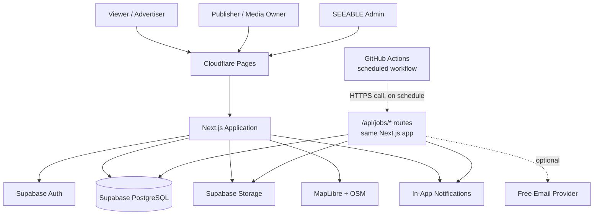
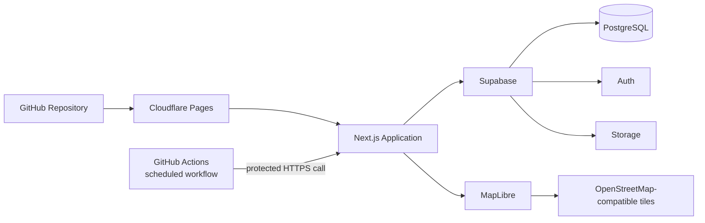

# SEEABLE Hoardings — ₹0 MVP Tech Stack & Architecture

> **Motto: Build it clean. Keep it easy. Pay ₹0 for the MVP.**

> **Revision note (2026-08-28):** Hosting stays on Cloudflare Pages/Workers rather than moving to Vercel — Vercel's free Hobby plan restricts users to "non-commercial, personal use only" per its own docs, which SEEABLE would violate as a live marketplace. Cloudflare's free plan does not carry that restriction. This revision also removes Cloudflare Workers + Cron as a separate scheduled-jobs component (Workers' V8 runtime can't open a raw Postgres connection without an extra product, Hyperdrive) in favor of GitHub Actions scheduled workflows calling protected API routes on the same app — one less moving part, minute-level scheduling precision, and it doubles as the keep-alive ping Supabase's free tier needs (see §25). See §5, §21, §25, §47.

## 1. Executive Summary

SEEABLE Hoardings is an Out-of-Home (OOH) advertising marketplace connecting advertisers/viewers with media owners/publishers.

The MVP should validate the core marketplace loop:

**Discover → Compare → Request → Publisher decision → Confirm → Notify**

The technical architecture is deliberately constrained by one hard rule:

> **No paid service is required to develop, deploy, launch, or operate the MVP.**

The architecture therefore favors:

- Open-source software
- Genuine free tiers
- One main application codebase
- One PostgreSQL database
- Minimal external services
- No unnecessary microservices
- No paid APIs
- No payment gateway in MVP
- No SMS in MVP
- No AI API dependency in MVP

The initial product target is approximately **50+ live hoardings**, with the broader MVP scope supporting roughly **50–200 listings**.

---

# 2. The ₹0 Architecture Rule

## Hard requirement

Every dependency must satisfy at least one of these conditions:

1. Open source and free to run.
2. Available on a ₹0 free tier.
3. Replaceable by application/database logic.
4. Optional rather than required for core functionality.

### The system must not depend on a paid service for:

- Authentication
- Database
- File storage
- Hosting
- Core API functionality
- Booking/request integrity
- Maps rendering
- Search
- Image optimization
- Notifications inside the application
- Analytics
- Error logging
- CI/CD

Third-party free tiers can change. Therefore, free-tier limits must be treated as operational constraints rather than permanent guarantees.

---

# 3. Final Technology Stack

| Layer | Technology | Cost Strategy | MVP Decision |
|---|---|---|---|
| Frontend | Next.js + TypeScript | Open source | **USE** |
| Styling | Tailwind CSS | Open source | **USE** |
| UI Components | shadcn/ui | Open source | **USE** |
| Forms | React Hook Form | Open source | **USE** |
| Validation | Zod | Open source | **USE** |
| Backend | Next.js server-side logic / API | Same application | **USE** |
| Database | Supabase PostgreSQL Free | Free tier | **USE** |
| Authentication | Supabase Auth Free | Included | **USE** |
| Storage | Supabase Storage Free | Free tier | **USE** |
| Hosting | Cloudflare Pages/Workers Free (via OpenNext adapter) | Free tier | **USE** |
| Server-side jobs | Next.js API routes, same app (no separate Workers project) | Same application | **USE** |
| Scheduled jobs | GitHub Actions scheduled workflow → protected API route | Free allowance | **USE** |
| Critical transactions | Single PostgreSQL function (RPC), not raw multi-statement SQL | ₹0, native to Supabase | **USE** |
| Maps | MapLibre GL JS | Open source | **USE** |
| Map data | OpenStreetMap | Free data | **USE WITH TILE POLICY** |
| Geocoding | Stored coordinates/manual location data initially | Avoid API cost | **USE** |
| Image processing | Browser Canvas/Web APIs | ₹0 | **USE** |
| Image library | Optional open-source library if runtime supports it | ₹0 | **OPTIONAL** |
| Email | Resend Free | Optional free tier | **OPTIONAL** |
| Notifications | PostgreSQL + in-app notifications | ₹0 | **USE** |
| Analytics | PostgreSQL event tracking | ₹0 | **USE** |
| Error logging | Application logs + Cloudflare/Supabase logs | ₹0 | **USE** |
| Testing | Vitest + Playwright | Open source | **USE** |
| Git | GitHub Free | Free | **USE** |
| CI/CD | GitHub Actions | Free allowance | **USE CAREFULLY** |
| Payments | None | ₹0 | **EXCLUDE** |
| SMS | None | ₹0 | **EXCLUDE** |
| AI APIs | None | ₹0 | **EXCLUDE** |
| Redis | None | Avoid extra service | **EXCLUDE** |
| Elasticsearch | None | PostgreSQL is sufficient | **EXCLUDE** |
| Kubernetes | None | Unnecessary | **EXCLUDE** |
| AWS | None | Unnecessary for MVP | **EXCLUDE** |
| Cloudinary | None | Avoid paid media dependency | **EXCLUDE** |
| Sentry | None initially | Avoid mandatory SaaS | **EXCLUDE** |
| PostHog Cloud | None initially | Use internal events | **EXCLUDE** |

---

# 4. High-Level Architecture



Note: there is no separate Cloudflare Workers deployment. `/api/jobs/*` are ordinary routes inside the same Next.js app running on Cloudflare — GitHub Actions is just what calls them on a schedule, the same way a browser calls any other route.

## Core principle

There is **one main application**.

```text
SEEABLE
│
├── Viewer
├── Publisher
├── Admin
├── Authentication
├── Inventory
├── Requests
├── Notifications
└── Media
```

Do not create separate deployable services for each module.

---

# 5. Hosting — Where SEEABLE Runs

## Primary hosting

**Cloudflare Pages/Workers Free**, deploying the Next.js app via the **OpenNext Cloudflare adapter** (`@opennextjs/cloudflare`) — this is Cloudflare's own current recommended path for a full Next.js app (Server Actions, middleware, ISR all supported), not the older `next-on-pages` project.

```text
Developer
   ↓
GitHub
   ↓
Cloudflare (via OpenNext adapter)
   ↓
SEEABLE Hoardings
```

**Why not Vercel, given Vercel is the "native" Next.js host:** Vercel's Hobby plan is free but its own docs restrict it to **"non-commercial, personal use"** — SEEABLE, a live marketplace, would not qualify, and Vercel does suspend accounts flagged this way. Cloudflare's free plan carries no equivalent restriction (confirmed via Cloudflare staff response in their community forum — not yet cross-checked against primary Terms of Service text, worth a final look if SEEABLE starts generating real revenue). Vercel's Hobby plan also caps cron jobs at once per day, which is too coarse for the SLA-expiry and Confirmed→Live jobs below — another reason this isn't a close call.

**Two real constraints to test in week one, not assume away:**

- The free Workers plan caps a deployed app at **3 MiB compressed**. A full Next.js app with the Supabase client, MapLibre, react-hook-form, and zod is a plausible candidate to bump into that — get a real deploy working before building features on top of it.
- The Workers runtime (even via OpenNext's Node.js-compatible mode) cannot open a raw TCP connection to Postgres without an extra product, Hyperdrive. Rather than adding that, route all database access through Supabase's HTTPS client (`@supabase/supabase-js`) — see §21 for how the one place that matters (request confirmation) stays transactionally safe without a raw SQL connection.

## Server-side processing

There is no separate Workers deployment for background work. The four scheduled jobs (§25) are ordinary routes inside the same Next.js app — `/api/jobs/expire-requests`, `/api/jobs/transition-live`, etc. — protected by a shared secret header, and triggered on a schedule by GitHub Actions rather than by a user's browser. This keeps "one main application" true in practice, not just in the diagram: one deployable, one bundle-size budget, one place database access happens.

Do not stand up a second Cloudflare Workers project "for jobs" — it adds a second deployable with its own DB-connectivity problem (see above) to solve a problem GitHub Actions already solves for free.

---

# 6. Why Cloudflare?

Cloudflare is suitable because it gives SEEABLE:

- ₹0 hosting at MVP scale, **with no non-commercial-use restriction** (unlike Vercel's Hobby plan — §5)
- CDN delivery
- HTTPS
- Git-based deployment
- Serverless execution
- Global edge infrastructure
- No VPS management

Scheduled jobs run as ordinary routes on this same host, triggered externally by GitHub Actions (§5, §25) — not as a second Cloudflare Workers product.

The MVP does not need:

- AWS EC2
- Kubernetes
- Docker orchestration
- Dedicated Linux server
- Load balancer
- Redis cluster

---

# 7. Database — Supabase PostgreSQL

Supabase is the primary backend data platform.

It provides:

- PostgreSQL
- Authentication
- Storage
- API access
- Row Level Security
- Database management

The Free plan currently includes a limited PostgreSQL database, storage, bandwidth, and authentication quota.

For the MVP, this is appropriate because the initial inventory is small.

## Use PostgreSQL for

- Users
- Publisher profiles
- Viewer profiles
- Hoardings
- Hoarding attributes
- Media metadata
- Availability
- Requests
- Notifications
- Admin actions
- Audit information
- Analytics events

---

# 8. Why PostgreSQL?

SEEABLE has strongly relational data.

```text
Publisher
    │
    └── Hoardings
            │
            ├── Media
            ├── Availability
            └── Requests
                    │
                    └── Viewer
```

The request engine also needs transactional integrity.

Therefore PostgreSQL is preferable to introducing MongoDB or another document database.

## Do not add

- MongoDB
- Redis
- Elasticsearch
- Kafka
- Separate search database

unless actual scale proves they are necessary.

---

# 9. Authentication

## MVP

Use **Supabase Auth**.

Initial authentication can use:

```text
Email
+
Password
```

The application should keep authentication separate from application profile data.

Conceptually:

```text
Supabase Auth User
        │
        ▼
Application Profile
        │
        ├── Viewer
        └── Publisher
```

Do not build a custom password/session system.

## Future

OTP/phone verification can be introduced later if required, but SMS should not be a mandatory dependency for the ₹0 MVP.

---

# 10. Database Security

Enable **Row Level Security (RLS)** on application tables.

Examples:

### Viewer

Can:

- Read public approved listings
- Create own requests
- Read own requests
- Read own notifications
- Edit own profile

### Publisher

Can:

- Create own hoardings
- Edit own hoardings
- Upload own media
- Read requests for own inventory
- Accept/reject requests for own inventory

### Admin

Can:

- Moderate listings
- Manage users
- View requests
- Change operational states
- Access audit information

Never expose the Supabase service-role key to the browser.

---

# 11. Suggested Database Schema

The exact schema should be aligned with the product requirements and refined during implementation.

```sql
create table profiles (
  id uuid primary key references auth.users(id) on delete cascade,
  role text not null check (role in ('VIEWER', 'PUBLISHER', 'ADMIN')),
  full_name text,
  phone text,
  company_name text,
  created_at timestamptz not null default now(),
  updated_at timestamptz not null default now()
);

create table hoardings (
  id uuid primary key default gen_random_uuid(),
  publisher_id uuid not null references profiles(id),
  title text not null,
  description text,
  hoarding_type text not null,
  latitude double precision not null,
  longitude double precision not null,
  locality text,
  city text not null default 'Bengaluru',
  size text,
  price numeric,
  status text not null default 'DRAFT',
  approval_status text not null default 'PENDING',
  attributes jsonb not null default '{}'::jsonb,
  created_at timestamptz not null default now(),
  updated_at timestamptz not null default now()
);

create table hoarding_media (
  id uuid primary key default gen_random_uuid(),
  hoarding_id uuid not null references hoardings(id) on delete cascade,
  storage_path text not null,
  media_type text not null,
  is_primary boolean not null default false,
  created_at timestamptz not null default now()
);

create table availability_blocks (
  id uuid primary key default gen_random_uuid(),
  hoarding_id uuid not null references hoardings(id) on delete cascade,
  start_date date not null,
  end_date date not null,
  status text not null default 'BOOKED',
  created_at timestamptz not null default now()
);

create table requests (
  id uuid primary key default gen_random_uuid(),
  hoarding_id uuid not null references hoardings(id),
  viewer_id uuid not null references profiles(id),
  start_date date not null,
  end_date date not null,
  status text not null default 'PENDING',
  created_at timestamptz not null default now(),
  updated_at timestamptz not null default now()
);

create table notifications (
  id uuid primary key default gen_random_uuid(),
  user_id uuid not null references profiles(id),
  type text not null,
  title text not null,
  message text not null,
  is_read boolean not null default false,
  created_at timestamptz not null default now()
);

create table admin_actions (
  id uuid primary key default gen_random_uuid(),
  admin_id uuid not null references profiles(id),
  action text not null,
  target_type text,
  target_id uuid,
  metadata jsonb not null default '{}'::jsonb,
  created_at timestamptz not null default now()
);

create table analytics_events (
  id uuid primary key default gen_random_uuid(),
  user_id uuid references profiles(id),
  event_name text not null,
  properties jsonb not null default '{}'::jsonb,
  created_at timestamptz not null default now()
);
```

---

# 12. Inventory Model

Each hoarding should have:

```text
Identity
Location
Type
Size
Price
Media
Attributes
Approval state
Operational status
Availability
Publisher
```

## Type-specific attributes

Use PostgreSQL `jsonb` for attributes that differ by hoarding type.

Example:

```json
{
  "road_name": "Hosur Road",
  "facing_direction": "NORTH",
  "pole_height": 40,
  "visibility_distance": 250
}
```

This avoids creating a separate table for every physical media type during the MVP.

---

# 13. Maps

## Rendering

Use:

**MapLibre GL JS**

MapLibre is open source.

## Map data

Use OpenStreetMap-compatible data.

Important:

> OpenStreetMap data is free, but OpenStreetMap's public tile infrastructure is not an unlimited free CDN.

The public OSM tile servers have a usage policy and limited capacity.

Therefore:

### MVP

Use a compliant, low-volume map setup.

### Later

If traffic grows:

```text
MapLibre
   ↓
Dedicated tile provider
```

or:

```text
MapLibre
   ↓
Self-hosted tiles
```

Do not rewrite the frontend because MapLibre keeps the rendering layer provider-independent.

---

# 14. Location Strategy

Do not make Google Maps or another paid geocoding API a core dependency.

Every hoarding should store:

```text
latitude
longitude
address/locality
city
```

For the initial inventory, coordinates can be collected manually during listing creation or through a controlled internal process.

The database becomes the source of truth.

```text
Map provider
    ≠
Location database
```

The map is only a visualization layer.

---

# 15. Search

Do not use Elasticsearch or Algolia for the MVP.

PostgreSQL can handle:

- locality
- city
- hoarding type
- price
- dimensions
- approval state
- availability
- geographic filtering

At 50–200 listings, a dedicated search engine is unnecessary.

---

# 16. Image Processing — Why It Exists

Image processing is required because publishers will upload photographs of physical hoardings.

Raw uploads can be:

- Very large
- High resolution
- Inconsistent formats
- Slow to load
- Expensive in storage/bandwidth

SEEABLE should optimize images before they become public listing media.

## Processing pipeline

```text
Publisher
    │
    ▼
Browser Upload
    │
    ├── Validate file
    ├── Resize
    ├── Compress
    ├── Normalize format
    └── Add SEEABLE watermark
    │
    ▼
Optimized Watermarked Image
    │
    ▼
Supabase Storage
```

---

# 17. Why Watermarking Matters

Watermarking protects publicly displayed inventory from being easily reused without attribution.

The public image can contain:

```text
SEEABLE
Publisher / listing identifier
Optional timestamp or reference
```

The original source file should not be publicly exposed.

## Storage separation

```text
PRIVATE
├── originals/
└── restricted/

PUBLIC
└── watermarked/
```

For the strict ₹0 MVP, do not introduce Cloudinary or another paid image-processing platform.

---

# 18. Where Image Processing Happens

For the MVP, prefer **browser-side image processing** using Web APIs such as Canvas.

```text
Camera Image
    ↓
Browser
    ↓
Resize
    ↓
Compress
    ↓
Watermark
    ↓
Supabase Storage
```

This avoids:

- Dedicated image-processing servers
- Cloudinary
- Paid image APIs
- Additional compute services

## Important implementation rule

Do not assume Node-only image libraries such as Sharp will run directly inside Cloudflare Workers.

If a server-side processing path is later required, choose a runtime and library combination that is actually compatible with the deployment target.

---

# 19. Storage

Use **Supabase Storage**.

Recommended buckets:

```text
hoarding-public
hoarding-private
```

### Public

Only optimized/watermarked media.

### Private

Originals or sensitive files.

The frontend must never receive unrestricted URLs to private source media.

---

# 20. Request Engine

This is the most important backend subsystem.

The core flow is:

```text
Viewer
  ↓
Request
  ↓
PENDING
  ↓
Publisher Decision
  ↓
CONFIRMED / REJECTED / EXPIRED
```

## Critical rule

Availability shown on the frontend is **not authoritative**.

When the publisher accepts a request, the backend must re-check the inventory inside a transaction.

---

# 21. Concurrency Protection

Example logic:

```text
BEGIN TRANSACTION

1. Lock/check relevant hoarding state
2. Verify request is still PENDING
3. Check date overlap
4. Check existing confirmed blocks
5. If conflict:
       reject/rollback
6. If no conflict:
       mark request CONFIRMED
       create availability block
       create notification
7. COMMIT
```

**Implementation note, made concrete by the Cloudflare hosting choice (§5):** the app talks to Supabase over HTTPS (`@supabase/supabase-js`), not a raw pooled Postgres connection — so `BEGIN … COMMIT` isn't something application code can wrap around several separate calls. Implement this whole block as **one PostgreSQL function** (`plpgsql`), invoked with a single `supabase.rpc('confirm_request', { request_id })` call. The function body does the re-check, the conflict check, and the writes inside one native Postgres transaction — atomic by construction, and it works identically regardless of which runtime calls it (the Next.js app today, anything else later).

For the conflict check itself, prefer a **PostgreSQL exclusion constraint** (`EXCLUDE USING gist`, via the `btree_gist` extension) on confirmed requests' date ranges per hoarding, so two overlapping `CONFIRMED` rows are structurally impossible at the database level — not just something the function remembers to check. This is the single highest-value database feature for this specific product's core invariant; worth setting up in the first migration, not retrofitting later.

Never rely on:

```text
Frontend says available
        ↓
Backend blindly confirms
```

Two viewers could otherwise submit overlapping requests at almost the same time.

---

# 22. Date Overlap Rule

For two inclusive date ranges:

```text
Existing: A_start → A_end
New:      B_start → B_end
```

They overlap when:

```text
A_start <= B_end
AND
B_start <= A_end
```

The final implementation should enforce this at the database/transaction layer.

---

# 23. Notifications

In-app notifications should be the primary ₹0 notification system.

```text
notifications
--------------------
id
user_id
type
title
message
is_read
created_at
```

Examples:

```text
REQUEST_CREATED
REQUEST_ACCEPTED
REQUEST_REJECTED
REQUEST_EXPIRED
LISTING_APPROVED
LISTING_REJECTED
```

The product should remain functional even if email is unavailable.

---

# 24. Email

Email is useful but should be **optional**.

A free transactional email service such as Resend can be used within its current free limits.

Current published free pricing is **3,000 emails/month**, subject to provider limits and policy changes.

Use email for:

- Request received
- Request accepted
- Request rejected
- Listing approved
- Listing rejected

Do not make email the system of record.

---

# 25. Background Jobs

Use a **GitHub Actions scheduled workflow** (cron syntax, minute-level precision, genuinely free) that makes an HTTPS call to a protected `/api/jobs/*` route on the same Next.js app for each job below. No separate Cloudflare Workers project, no Workers Cron Triggers, no Hyperdrive — the app already runs on Cloudflare (§5) and already talks to Supabase over HTTPS, so a scheduled job is just an authenticated request to a route that would otherwise never be visited by a browser.

Protect these routes with a shared secret checked against a header GitHub Actions sends (e.g. `Authorization: Bearer <secret>` stored as a GitHub Actions secret) — never leave a job-trigger route unauthenticated.

Recommended jobs:

### Supabase keep-alive

Supabase free-tier projects pause after **7 days of low activity** (confirmed in Supabase's own docs) — no data loss, but restoring one requires a manual click in the dashboard, which is a bad thing to discover during a live demo. Add a trivial 5th scheduled job — a lightweight read query every 2–3 days — purely to keep the project active. This piggybacks on infrastructure you already need for the four jobs below, so it costs nothing extra.

### Request expiry

```text
PENDING
   ↓
SLA exceeded
   ↓
EXPIRED
```

### Status transition

```text
CONFIRMED
   ↓
Start date reached
   ↓
LIVE
```

### Notification processing

```text
Event
 ↓
Notification record
 ↓
Optional email
```

### Cleanup

Remove temporary processing records and stale data where appropriate.

**Honest caveat:** GitHub Actions scheduled workflows are documented as best-effort — under high platform load, a run can be delayed by minutes past its scheduled time. Fine for these four jobs (none needs second-level precision), but not a guarantee to build anything time-critical on top of.

---

# 26. No Redis

Do not introduce Redis for the MVP.

Use PostgreSQL for:

- Request state
- Notification state
- Job state
- Basic caching metadata
- Locks/transactions where appropriate

Add Redis only when measured traffic demonstrates a real requirement.

---

# 27. No Separate Backend Server

Do not build:

```text
React
+
Express
+
Node server
+
separate database API
```

Instead:

```text
Next.js
├── UI
├── Server components
├── Server actions/API
└── Business modules
```

This reduces:

- Deployment complexity
- Cost
- DevOps work
- Authentication duplication
- Network hops

---

# 28. Repository Structure

```text
seeable-hoardings/
│
├── app/
│   ├── (auth)/
│   ├── viewer/
│   ├── publisher/
│   ├── admin/
│   └── api/
│
├── components/
│   ├── ui/
│   ├── map/
│   ├── hoarding/
│   ├── request/
│   └── forms/
│
├── modules/
│   ├── auth/
│   ├── inventory/
│   ├── viewer/
│   ├── publisher/
│   ├── requests/
│   ├── notifications/
│   ├── admin/
│   └── media/
│
├── lib/
│   ├── supabase/
│   ├── maps/
│   ├── email/
│   └── utils/
│
├── workers/
│   ├── expiry/
│   ├── transitions/
│   └── notifications/
│
├── supabase/
│   ├── migrations/
│   └── seed.sql
│
├── tests/
│   ├── unit/
│   └── e2e/
│
├── public/
│
├── .github/
│   └── workflows/
│
├── package.json
├── tsconfig.json
└── README.md
```

---

# 29. Frontend Stack

Install only what the MVP needs.

```bash
npm install next react react-dom
npm install @supabase/supabase-js
npm install @supabase/ssr
npm install maplibre-gl
npm install react-hook-form zod
npm install lucide-react
```

UI:

```bash
npm install tailwindcss
```

Use shadcn/ui components selectively.

Do not install a huge UI framework if a small component system is sufficient.

---

# 30. Environment Variables

Example:

```env
NEXT_PUBLIC_SUPABASE_URL=
NEXT_PUBLIC_SUPABASE_PUBLISHABLE_KEY=

SUPABASE_SERVICE_ROLE_KEY=

RESEND_API_KEY=

NEXT_PUBLIC_MAP_STYLE_URL=
```

## Security

Only public Supabase configuration may be exposed to the browser.

Never expose:

```text
SUPABASE_SERVICE_ROLE_KEY
```

or other server secrets.

---

# 31. Local Development

Recommended:

```bash
git clone <repository>
cd seeable-hoardings

npm install

npm run dev
```

Development environment:

```text
Browser
   ↓
localhost
   ↓
Next.js
   ↓
Supabase development project
```

Use a separate development Supabase project rather than experimenting against production data.

---

# 32. Database Migrations

All schema changes must be version-controlled.

Example:

```text
supabase/
└── migrations/
    ├── 001_profiles.sql
    ├── 002_hoardings.sql
    ├── 003_media.sql
    ├── 004_availability.sql
    ├── 005_requests.sql
    └── 006_notifications.sql
```

Never make undocumented production schema changes manually.

---

# 33. Testing

## Unit tests

Use **Vitest**.

Test:

- Date overlap
- Price calculations
- Status transitions
- Validation
- Permission rules
- Request state machine

## End-to-end tests

Use **Playwright**.

Critical flows:

```text
Viewer registration
      ↓
Browse
      ↓
Open listing
      ↓
Submit request
      ↓
Publisher login
      ↓
Accept
      ↓
Viewer sees confirmation
```

Also test the conflict case:

```text
Viewer A ──┐
           ├── same hoarding/date
Viewer B ──┘
           ↓
Only one confirmation
```

---

# 34. Analytics Without Paying

Do not introduce a separate analytics SaaS initially.

Use:

```text
analytics_events
```

Example events:

```text
PAGE_VIEW
SEARCH
FILTER_USED
HOARDING_VIEWED
REQUEST_STARTED
REQUEST_SUBMITTED
REQUEST_ACCEPTED
REQUEST_REJECTED
```

Example:

```json
{
  "event_name": "HOARDING_VIEWED",
  "properties": {
    "hoarding_id": "..."
  }
}
```

This gives SEEABLE the first product analytics layer at ₹0.

---

# 35. Error Logging

Initially use:

- Browser console in development
- Application logs
- Cloudflare logs
- Supabase logs
- Database records for important business failures

Do not make Sentry or another monitoring SaaS a mandatory dependency.

If operational complexity increases later, introduce dedicated observability.

---

# 36. CI/CD

Use GitHub.

Recommended flow:

```text
Developer
   ↓
Git push
   ↓
GitHub
   ↓
Tests
   ↓
Build
   ↓
Cloudflare deployment
```

CI should verify:

```text
npm ci
npm run lint
npm run test
npm run build
```

Database migrations should be controlled separately and safely.

---

# 37. What NOT to Use

The following should stay outside the MVP:

| Technology | Reason |
|---|---|
| AWS EC2 | Adds server management and cost risk |
| Kubernetes | Massive overkill |
| Docker orchestration | Not required |
| Microservices | Adds complexity |
| MongoDB | Relational model fits PostgreSQL better |
| Redis | Not needed at MVP scale |
| Elasticsearch | PostgreSQL search is enough |
| Kafka | Not needed |
| Google Maps API | Avoid paid API dependency |
| Twilio | SMS is not ₹0 |
| Stripe/Razorpay | Payments are outside MVP |
| Cloudinary | Avoid media SaaS dependency |
| Auth0 | Supabase Auth is sufficient |
| Algolia | PostgreSQL search is sufficient |
| Pinecone | No vector-search requirement |
| OpenAI API | No AI requirement in MVP |
| Sentry | Optional later |
| PostHog Cloud | Internal analytics is sufficient initially |

---

# 38. Free-Tier Reality

The ₹0 architecture is feasible, but **₹0 does not mean unlimited**.

Free services have:

- Storage limits
- Database limits
- Bandwidth limits
- Request limits
- Build limits
- Email limits
- Usage policies

Therefore:

> **The architecture must fail gracefully when an optional free service reaches its limit.**

Examples:

### Email limit reached

```text
In-app notification → continues
Email → temporarily unavailable
```

### Analytics limit

```text
Core product → continues
Analytics → sampled/disabled
```

### Map issue

```text
Listing address + coordinates → remain available
Map visualization → degraded
```

The marketplace must not stop functioning because an optional integration reaches a quota.

---

# 39. Backup Strategy

The Supabase Free plan does not provide the same automated backup capabilities as paid plans.

Therefore, backups must be handled deliberately.

Maintain:

```text
Database schema
+
Seed data
+
Important production exports
```

in secure locations.

At minimum:

```text
Weekly database export
```

and before major migrations:

```text
Manual production backup
```

Do not store secrets inside the Git repository.

---

# 40. Storage Optimization Rules

To stay within free storage:

### Upload rules

- Maximum image dimensions
- Maximum file size
- Supported formats
- Automatic compression
- Watermark public images
- Reject unnecessary duplicates

Example policy:

```text
Maximum source upload:
10 MB

Public listing image:
~1600–2000 px long edge

Public web image:
compressed WebP/JPEG
```

The exact limits should be tuned after testing actual publisher uploads.

---

# 41. Performance Rules

The MVP should prioritize:

- Server-side rendering where useful
- Lazy-loaded images
- Responsive images
- Pagination
- Debounced search
- Limited map markers
- Indexed PostgreSQL queries
- Avoiding unnecessary API calls

Do not load every image and every listing at once.

---

# 42. Security Rules

Minimum requirements:

- HTTPS
- Supabase RLS
- Server-only secrets
- Input validation with Zod
- Authorization on every mutation
- Rate limiting for sensitive endpoints where feasible
- File type validation
- File size validation
- Private original media
- Audit trail for admin actions
- Transactional booking confirmation
- No client-side trust for availability

---

# 43. Deployment Architecture



---

# 44. Production Data Flow

## Viewer

```text
Viewer
  ↓
Cloudflare
  ↓
Next.js
  ↓
Supabase
  ↓
PostgreSQL
```

## Publisher

```text
Publisher
  ↓
Next.js
  ↓
Upload validation
  ↓
Browser optimization + watermark
  ↓
Supabase Storage
  ↓
Media metadata → PostgreSQL
```

## Request

```text
Viewer
  ↓
Request
  ↓
PostgreSQL
  ↓
Publisher
  ↓
Accept
  ↓
Transactional re-check
  ↓
Confirmed
  ↓
Availability block
  ↓
Notification
```

---

# 45. MVP Modules

The application should be organized into these modules:

## Viewer

- Discovery
- Map/list
- Filters
- Listing detail
- Availability
- Request submission
- Request tracking
- Notifications

## Publisher

- Registration
- Profile
- Inventory
- Add/edit listing
- Media upload
- Availability
- Request inbox
- Accept/reject
- Status tracking

## Admin

- Dashboard
- Publisher management
- Listing moderation
- Request oversight
- Audit actions
- Operational monitoring

---

# 46. MVP Development Order

## Phase 1 — Foundation

```text
Next.js
Supabase
Cloudflare
GitHub
Auth
Database
```

## Phase 2 — Inventory

```text
Publisher
↓
Create hoarding
↓
Upload media
↓
Admin approval
↓
Listing live
```

## Phase 3 — Viewer

```text
Browse
↓
Search
↓
Map
↓
Filters
↓
Listing detail
```

## Phase 4 — Request Engine

```text
Request
↓
Pending
↓
Publisher decision
↓
Conflict-safe confirmation
```

## Phase 5 — Notifications

```text
In-app
↓
Optional email
```

## Phase 6 — Hardening

```text
RLS
Validation
Tests
Performance
Backups
Logging
```

---

# 47. Upgrade Triggers

Do not upgrade because a tool looks more professional.

Upgrade only when a measurable requirement demands it.

## Database

Upgrade when:

- Database storage approaches free limit
- Query performance requires more resources
- Production reliability requires paid backup features

## Storage

Upgrade when:

- Media approaches storage quota
- Bandwidth becomes a bottleneck

## Hosting / scheduled jobs

Upgrade or reconsider when:

- The deployed app approaches the 3 MiB compressed Workers bundle-size ceiling on the free plan
- Daily request volume approaches the free-plan quota
- Real commercial transactions begin — worth a final, direct confirmation of Cloudflare's Terms of Service at that point, rather than relying on the community-forum answer this doc currently cites (§5)

## Maps

Change tile infrastructure when:

- Traffic becomes too high for the chosen free/compliant setup
- Reliability requirements increase

## Email

Upgrade when:

- Transactional volume exceeds free limits
- Deliverability requirements justify a paid provider

---

# 48. Cost-Control Dashboard

The admin platform should eventually display:

```text
Infrastructure Health

Database
██████░░░░ 60%

Storage
████░░░░░░ 40%

Workers
███░░░░░░░ 30%

Email
█████░░░░░ 50%

Map traffic
████░░░░░░ 40%
```

The exact metrics can be added later.

The objective is to know **before** a free quota becomes a production problem.

---

# 49. Architecture Decisions

## Decision 1

**Modular monolith instead of microservices.**

Reason:

- Small team
- MVP scale
- Faster development
- Lower infrastructure complexity
- Easier debugging

## Decision 2

**PostgreSQL instead of MongoDB.**

Reason:

- Relational data
- Transactions
- Date conflicts
- Strong consistency

## Decision 3

**Supabase instead of assembling separate database/auth/storage services.**

Reason:

- One platform
- PostgreSQL
- Auth
- Storage
- RLS

## Decision 4

**Cloudflare instead of VPS/AWS for hosting.**

Reason:

- Free tier
- CDN
- HTTPS
- Serverless functions
- Scheduled jobs

## Decision 5

**MapLibre instead of a proprietary map SDK.**

Reason:

- Open source
- Provider-independent rendering
- Avoid vendor lock-in

## Decision 6

**Browser-side image processing for MVP.**

Reason:

- ₹0
- Reduces upload size
- Reduces storage usage
- Avoids dedicated media-processing service

---

# 50. Final ₹0 Stack

```text
                 SEEABLE HOARDINGS

                      FRONTEND
                         │
             Next.js + TypeScript
                         │
              Tailwind + shadcn/ui
                         │
                         ▼
            CLOUDFLARE PAGES/WORKERS
             (via OpenNext adapter)
                         │
                         ▼
              Next.js Server Logic / API
           (incl. /api/jobs/* job routes)
                         ▲
                         │ protected HTTPS call, on schedule
                 GitHub Actions (cron)
                         │
                         ▼
                     SUPABASE
          ┌──────────────┼──────────────┐
          │              │              │
          ▼              ▼              ▼
      PostgreSQL        Auth         Storage
          │
          ├── Users
          ├── Publishers
          ├── Hoardings
          ├── Availability
          ├── Requests
          ├── Notifications
          ├── Admin Actions
          └── Analytics

                    MAPS
                      │
               MapLibre GL JS
                      │
                      ▼
        OpenStreetMap-compatible data

                  MEDIA
                     │
          Browser processing
                     │
       Resize + Compress + Watermark
                     │
                     ▼
              Supabase Storage

                NOTIFICATIONS
                     │
              In-app = ₹0
                     │
              Email = Optional
```

---

# 51. Final Checklist

## Required

- [ ] Next.js
- [ ] TypeScript
- [ ] Tailwind
- [ ] shadcn/ui
- [ ] Supabase PostgreSQL
- [ ] Supabase Auth
- [ ] Supabase Storage
- [ ] Cloudflare Pages/Workers (via OpenNext adapter)
- [ ] GitHub Actions scheduled workflows (jobs + Supabase keep-alive ping)
- [ ] MapLibre
- [ ] OpenStreetMap-compatible map setup
- [ ] Browser-side image optimization
- [ ] Watermarking
- [ ] PostgreSQL function (RPC) for request confirmation + exclusion constraint
- [ ] RLS
- [ ] In-app notifications
- [ ] Vitest
- [ ] Playwright
- [ ] GitHub

## Optional

- [ ] Resend
- [ ] Additional observability
- [ ] Dedicated geocoding
- [ ] Dedicated tile provider
- [ ] Advanced analytics

## Explicitly excluded from ₹0 MVP

- [ ] Payment gateway
- [ ] SMS
- [ ] Paid AI API
- [ ] Redis
- [ ] Elasticsearch
- [ ] Kubernetes
- [ ] AWS infrastructure
- [ ] Cloudinary
- [ ] Paid monitoring
- [ ] Paid search

---

# 52. Golden Rule

> **If a free/open-source solution can reliably satisfy the MVP requirement, do not introduce a paid service.**

And:

> **If a service is optional, the core SEEABLE marketplace must continue working without it.**

The goal is not to build the cheapest version of a complicated system.

The goal is to build the **simplest system that can prove SEEABLE works**.

```text
DISCOVER
   ↓
COMPARE
   ↓
REQUEST
   ↓
CONFIRM
   ↓
NOTIFY
   ↓
LEARN
   ↓
GROW
```

**SEEABLE Hoardings MVP target: ₹0 infrastructure cost, clean architecture, minimal operational complexity, and a clear upgrade path only after real product traction.**

---

## Source / Reference Links

- Supabase: https://supabase.com/
- Supabase pricing: https://supabase.com/pricing
- Supabase Next.js documentation: https://supabase.com/docs/guides/getting-started/quickstarts/nextjs
- Cloudflare Pages: https://pages.cloudflare.com/
- Cloudflare Pages limits: https://developers.cloudflare.com/pages/platform/limits/
- Cloudflare Workers: https://workers.cloudflare.com/
- Cloudflare Workers limits: https://developers.cloudflare.com/workers/platform/limits/
- MapLibre GL JS: https://maplibre.org/maplibre-gl-js/docs/
- OpenStreetMap tile policy: https://operations.osmfoundation.org/policies/tiles/
- Resend pricing: https://resend.com/pricing
- Next.js: https://nextjs.org/
- Tailwind CSS: https://tailwindcss.com/
- shadcn/ui: https://ui.shadcn.com/
- GitHub Actions: https://github.com/features/actions
- Vercel Hobby plan (non-commercial-use restriction): https://vercel.com/docs/plans/hobby
- Vercel Cron Jobs usage & pricing (Hobby = once/day limit): https://vercel.com/docs/cron-jobs/usage-and-pricing
- OpenNext Cloudflare adapter: https://opennext.js.org/cloudflare
- Cloudflare Hyperdrive (Workers → Postgres): https://developers.cloudflare.com/hyperdrive/
- Cloudflare community — free plan commercial use: https://community.cloudflare.com/t/is-cloudflare-pages-workers-free-plan-free-for-commercial-use/291741
- Supabase — free project pausing: https://supabase.com/docs/guides/platform/free-project-pausing

---

**Document:** SEEABLE Hoardings — ₹0 MVP Tech Stack & Architecture  
**Version:** 1.0  
**Date:** 2026-08-28
