# SEEABLE Hoardings — System Architecture

## 1. Document Metadata

**Document Type:** System Architecture (MVP Scope)
**Product:** SEEABLE Hoardings
**Version:** 1.0
**Status:** Draft for Review
**Date:** 27 August 2026
**Related Documents:** `docs/01-product/mvp-prd.md`, `docs/01-product/mvp-brd.md`, `docs/03-modules/inventory.md`, `docs/03-modules/viewer-platform.md`, `docs/03-modules/request-engine.md`, `docs/03-modules/admin-platform.md`, `docs/03-modules/owner-platform.md` (referenced, **does not exist** — see below), `README.md` (Documentation Index), `SEEABLE_Hoardings_Master_PRD_Framework.md`, `claude/SEEABLE_Hoardings_BRD.md` (full-scope)

**Architecture Status: Proposed.**

Not one architectural decision in this document is Approved, and the reason is concrete rather than procedural: **no technology stack exists anywhere in this project.** A survey of both the project knowledge base and the working folder found no source code, no `package.json` or equivalent manifest, no framework configuration, no infrastructure definition, and no prior architecture document. There is therefore nothing to preserve and nothing to defer to. Every technology named below is labelled **Recommendation — Pending Confirmation**, and every structural decision is an **ADR with status Proposed** (§40).

What *is* Approved, and treated as fixed input rather than architectural choice, is the product requirement set: the twenty-two business rules indexed in §41, and the module boundaries established by the five existing module specifications. The architecture is derived from those; it does not modify them.

> **Path conflict noted — this document's own location.** The brief that commissioned this document specifies `docs/04-architecture/system-architecture.md`. Two existing authoritative documents specify a different path: `README.md` Tier 1 item #4 (`docs/05-technical/system-architecture.md`) and the Master PRD Framework §2, whose canonical repository layout places `system-architecture.md` under `05-technical/` and assigns `04-business/` to business documentation — meaning a `04-architecture/` directory would collide with the existing numbering scheme. Per the brief's own writing rule 11, this conflict is identified rather than silently resolved. **Resolution recorded:** this document has been placed at the path the brief directs (`docs/04-architecture/`), because that is the most recent explicit instruction from the product owner; but whichever path is kept, `README.md` Tier 1 item #4 and the Master PRD Framework §2 both need updating so the reference does not dangle. This is a documentation-index fix, not an architectural decision.

> **Source availability finding — three README-✅ documents do not exist.** `README.md`'s Tier 1 "built so far" table marks six items ✅ Complete. Three of them could not be found in either the project knowledge base or the working folder: **`docs/03-modules/owner-platform.md`**, **`docs/01-product/mvp-scope.md`**, and **`seeable-discovery-map.html`**. The `owner-platform.md` gap has now been confirmed five separate times across this documentation effort (in `viewer-platform.md`, `request-engine.md`, `admin-platform.md`, `inventory.md`, and here). This one materially affects the present document twice over. First, all Publisher-side architecture below is derived from `mvp-prd.md` §7.2 directly, not from a Publisher module specification. Second, and more consequentially: `README.md` describes `seeable-discovery-map.html` as a **"working prototype — reference implementation, not a spec."** A working Discovery/map prototype would have been the single strongest piece of evidence about already-made technology choices — which map library, which frontend framework, which data shape the UI already expects. It is not present, which is why §43 can recommend a stack but cannot confirm one. If that prototype exists somewhere outside this documentation set, **§26 and §43 should be revised against it before any stack is committed**, since a running implementation outranks a recommendation.

---

## 2. Architecture Overview

SEEABLE Hoardings at MVP is a two-sided marketplace serving roughly 50–200 hoarding listings in a single city, with three user roles, no payment processing, and one integrity guarantee that dominates every other technical concern: **two overlapping requests must never both reach Confirmed on the same hoarding** (`REQUEST-001`, `REQUEST-004`).

The recommended architecture is a **modular monolith with background workers on managed infrastructure**:

- **Client applications** — a web client serving Viewer discovery, Publisher inventory management, and the internal Admin console. All three are role-scoped views onto one backend, not separate products.
- **Backend application** — a single deployable API service containing eight internal modules with enforced boundaries (§8): Auth & Roles, Inventory, Publisher Platform, Viewer Platform, Request Engine, Admin Platform, Notifications, Content Protection.
- **API layer** — one authenticated, authorized entry path (§19). Authorization is enforced server-side, in the module, never at the client route (§18).
- **Relational database** — one transactional store holding users, hoardings, availability, requests, and moderation state. It is a single database precisely so that the Request Engine's confirmation check and the Inventory availability read can occur inside one transaction (§28, ADR-006).
- **Object storage** — two access tiers: a private tier holding unwatermarked originals that are never publicly reachable, and a served tier holding watermarked derivatives (§20, §21, `CONTENT-001`).
- **Background workers** — four asynchronous jobs (§23): media watermarking, notification dispatch, request-SLA expiry, and the Confirmed→Live date transition.
- **External services** — maps/geolocation, and one notification channel (push plus one of SMS/email — which one is still an open product question, `mvp-prd.md` §14).

In one sentence: **one API, one database, one object store, a handful of scheduled jobs, and clean internal module seams that later become service boundaries if the product ever earns them.**

## 3. Architectural Goals

### Product goals

The architecture must support, without compromise, the capabilities the module specifications define:

- **Viewer discovery** — search, three filters (type, distance, price ceiling), map with radius visualization, listing detail (`viewer-platform.md` §8–§12)
- **Publisher inventory management** — create, edit, pause, delete listings; availability calendar; request inbox (`mvp-prd.md` §7.2)
- **Admin moderation** — Publisher verification queue, listing approval queue, suspension/delisting, counts dashboard (`admin-platform.md` §7–§11)
- **Date-based requests** — the full `AVAILABLE → REQUESTED → CONFIRMED/REJECTED → LIVE → COMPLETED` lifecycle plus the `EXPIRED` path (`request-engine.md` §5)
- **Request tracking** — Viewer- and Publisher-facing status visibility
- **Inventory availability** — composed from the Publisher's manual calendar and Confirmed requests (`inventory.md` §13, §16)
- **Media protection** — watermarking before any public exposure (`CONTENT-001`)

### Technical goals

- **Clear module boundaries** — one business rule, one owning module, no duplicated implementations (§10)
- **Secure role-based access** — enforced server-side, per §18
- **Reliable data integrity** — specifically, transactional consistency between availability and request confirmation (§16, §28)
- **Simple deployment** — one service plus workers; a small team can deploy it without orchestration expertise
- **Low operational complexity** — managed infrastructure over self-hosted; no component whose failure mode the team cannot reason about
- **Reasonable MVP performance** — responsive at 50–200 listings (`mvp-prd.md` §10), with no scale-phase commitments
- **Future extensibility** — module seams that survive extraction into services if volume ever demands it (§37)

## 4. Architectural Non-Goals

Stated explicitly, because the most likely failure mode for a documentation-rich, code-poor project is building for the full-scope BRD's ambition rather than the MVP's actual requirements:

- **Massive-scale traffic.** The target is 50–200 listings in one city. Nothing here is designed for thousands of concurrent listings.
- **Microservice orchestration.** See §7 and ADR-001 for why, in requirement terms rather than preference terms.
- **Multi-region deployment.** Single-city launch (`mvp-prd.md` §3.3).
- **Event-driven distributed architecture.** Four background jobs is not an event bus. No Kafka, no message broker beyond whatever the job queue itself needs.
- **Real-time bidding, programmatic DOOH, impression billing.** Not in MVP scope, not in Phase 2 scope (`mvp-prd.md` §3.2, §15).
- **Payment processing.** All settlement is offline (`mvp-prd.md` §1). No payment component exists anywhere in this architecture.
- **Advanced AI infrastructure.** Site Intelligence is captured but not consumed (`INVENTORY-002`, `inventory.md` §10). No inference, no model serving, no vector store.
- **Multi-tenant enterprise architecture.** One SEEABLE instance, one city.
- **Kubernetes, service mesh, streaming infrastructure.** None of these has a requirement behind it. Introducing any of them would add operational surface a small team must then carry with no product benefit at this scale.
- **A search engine.** 50–200 rows. See §25.
- **A full audit-log system.** Not an MVP requirement (`admin-platform.md` §20) — though §32 flags a narrower, cheaper alternative worth considering.

## 5. System Context

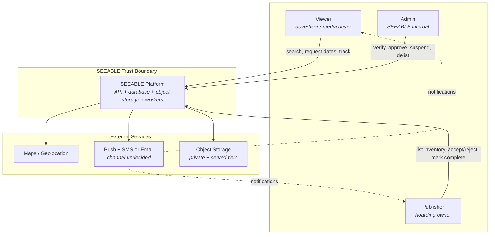

**Trust boundaries.** Everything inside the SEEABLE boundary enforces authorization server-side (§18). The three actors are outside it and are never trusted to scope their own access. External services are outside it in the other direction: SEEABLE sends them data and depends on their availability, and each has a defined failure behavior (§24, §38).

**Note on watermarking placement.** Media processing is drawn as internal, not external, because `mvp-prd.md` §10 requires the "watermark pipeline isolated from public asset serving" — an isolation property that is easier to guarantee for a component SEEABLE controls. Whether the watermarking itself runs as an in-house worker or a third-party media service is a recommendation, not a decision (§24, §43).

## 6. Container Architecture

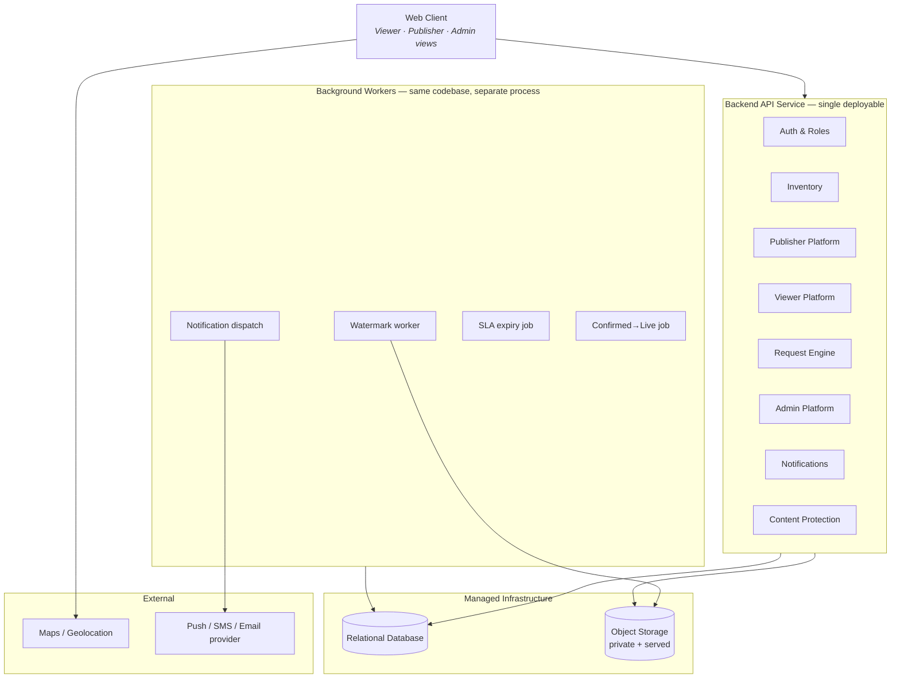

**What each of these actually is** — the brief correctly warns against assuming these are independently deployable services:

| Container | What it is | Deployment |
|---|---|---|
| Web Client | One client application with three role-scoped experiences | Static hosting |
| The eight modules | **Application modules inside one codebase** — namespaces/packages with enforced boundaries, not services | One deployable API |
| The four workers | **Background processes running the same codebase** against the same database | Separate process, same deploy artifact |
| Relational Database | Infrastructure service | Managed |
| Object Storage | Infrastructure service, two access tiers | Managed |
| Maps, Notification provider | **External services** | Third-party |

The client talks to the maps provider directly for tile rendering; it does not proxy tiles through the API. Geospatial *filtering* however happens server-side, against the database (§26), because filtered results must respect `INVENTORY-003` visibility rules that the client cannot be trusted to apply.

## 7. Architectural Style

**Recommendation: Modular Monolith + Background Workers + Managed Infrastructure.**

The case for it is not "monoliths are simpler." It is specific to this product's strongest requirement.

### Why not microservices

`REQUEST-004` (`request-engine.md` §24) requires that *at the moment a Publisher accepts a request*, the system re-validate that no conflicting Confirmed request exists — and `request-engine.md` §10 fixes the outcome as an invariant: "No two overlapping requests may both become Confirmed for the same hoarding."

In a single database, that is one transaction: read conflicting requests, check the hoarding's availability calendar, write the confirmation, commit (§28). In a microservice split where Request Engine and Inventory own separate databases, the same invariant becomes a **distributed transaction** — requiring either two-phase commit or a saga with compensating rollback, plus a reconciliation path for partial failure. That is a genuinely hard distributed-systems problem, and this product would be taking it on to serve **50–200 listings in one city**.

That is the whole argument. Not preference, not team size alone: the product's single most important correctness guarantee is cheap in one database and expensive in several, and there is no countervailing scale pressure.

### Why not serverless

Serverless functions would suit the four background jobs well. They suit the transactional core poorly: connection pooling against a relational database from ephemeral functions is a known operational tax, and cold-start latency works against `mvp-prd.md` §10's "search should feel responsive." A hybrid — serverless workers, long-running API — is defensible and is **not ruled out**; it is a deployment-shape choice (§34) rather than an architectural-style choice.

### Advantages

- **Development** — one repository, one test suite, one local environment; a change spanning Inventory and Request Engine is one pull request, not a coordinated multi-service release
- **Operational** — one deployment, one log stream, one database to back up; no service discovery, no inter-service auth, no distributed tracing requirement
- **Correctness** — transactional integrity is a database guarantee rather than an application-level protocol

### Limitations, stated honestly

- All modules scale together; a heavy watermarking load and a heavy search load cannot be scaled independently (mitigated by workers already being a separate process)
- Module boundaries are enforced by convention and review, not by the network — which is why §44's implementation rules matter more here than they would in a service architecture
- A single database is a single failure domain (§38 #1)

### Future extraction strategy

The module seams in §8 are drawn so that extraction is possible later without a redesign. The natural extraction order, if volume ever justifies it (§37): **Content Protection first** (already async, already isolated by `mvp-prd.md` §10, no transactional coupling), then **Notifications** (fire-and-forget, no read dependency), then **Search** as a read replica or index. **Request Engine and Inventory should be extracted last, and only together** — separating them is precisely what re-introduces the distributed-transaction problem this architecture exists to avoid.

## 8. Logical Module Architecture

Eight modules. Five have their own specifications; three (Auth & Roles, Notifications, Content Protection) are defined only inline in `mvp-prd.md` §7.1, §7.6, and §7.7 and have no module document — a documentation gap worth noting, since they are given real responsibilities below.

### Auth & Roles

- **Responsibility:** identity, credentials, sessions, role assignment.
- **Owns:** user accounts, credentials, sessions/tokens, role assignment, verification status *as an authentication fact*.
- **Reads:** nothing from other modules.
- **Writes:** user and session records.
- **Exposes:** authenticated identity + role to every other module; middleware that establishes "who is this actor."
- **Depends on:** nothing. It is the foundation layer.
- **Does not own:** authorization *policy* (what a role may do in a given module — that lives with the owning module, §18); Publisher verification *workflow* (Admin owns the queue and decision — `admin-platform.md` §8).

### Inventory

- **Responsibility:** the authoritative data model for hoardings.
- **Owns:** hoarding records, hoarding type and type-specific attributes, location, size, price, the Publisher-managed availability calendar, media references, Site Intelligence, approval/visibility state (`inventory.md` §6, §20).
- **Reads:** Publisher identity (ownership); media watermark status from Content Protection.
- **Writes:** hoarding records and their state flags.
- **Exposes:** hoarding read queries; the `INVENTORY-003` visibility predicate that Viewer search must apply.
- **Depends on:** Auth (ownership), Content Protection (media status).
- **Does not own:** request state; payment; campaign management; Request Engine's confirmed-date blocking (`inventory.md` §16).

### Publisher Platform

- **Responsibility:** the Publisher's workflow surface over Inventory and Request Engine.
- **Owns:** Publisher profile; listing management workflow; request-inbox presentation.
- **Reads:** own hoardings (Inventory); requests on own listings (Request Engine).
- **Writes:** Publisher profile; listing edits *through* Inventory; accept/reject actions *through* Request Engine.
- **Depends on:** Auth, Inventory, Request Engine.
- **Does not own:** the hoarding data model; request state transitions. It invokes both, it does not implement either.
- **Note:** `owner-platform.md` does not exist (§1). This module's boundary is inferred from `mvp-prd.md` §7.2 and should be reconciled if that document is ever written.

### Viewer Platform

- **Responsibility:** discovery and request-tracking surface.
- **Owns:** search/filter/map query composition; Viewer-facing status labels (`viewer-platform.md` §14).
- **Reads:** visible inventory (Inventory, filtered by `INVENTORY-003`); own requests (Request Engine).
- **Writes:** request creation *through* Request Engine.
- **Depends on:** Auth, Inventory, Request Engine.
- **Does not own:** request state, conflict logic, or inventory data — `viewer-platform.md` §27 states this explicitly: "The Viewer Platform surfaces this state; it does not independently define it."

### Request Engine

- **Responsibility:** the request lifecycle and date-conflict safety.
- **Owns:** request records, the state machine, conflict detection, expiry, confirmation, completion, request-state notification events, and the **composed availability query** (§16).
- **Reads:** hoarding availability calendar and approval state (Inventory).
- **Writes:** request records; emits notification events.
- **Depends on:** Auth, Inventory.
- **Does not own:** inventory master data; Publisher accounts; payment; notification delivery.

### Admin Platform

- **Responsibility:** trust and moderation.
- **Owns:** verification decisions, listing approval decisions, suspension and delisting actions, the counts dashboard.
- **Reads:** Publishers (Auth/Publisher), listings in every state (Inventory), aggregate request counts only (Request Engine).
- **Writes:** verification status, approval status + rejection reason, `paused`/`delisted` flags *through* Inventory; Mark Completed *through* Request Engine.
- **Depends on:** Auth, Inventory, Publisher, Request Engine.
- **Does not own:** individual request visibility or arbitrary request-state modification (`admin-platform.md` §12, `request-engine.md` §23) — **this is an architectural constraint, not just a product one.** The Admin module must not be given a general request-mutation capability, because there is no requirement authorizing one.

### Notifications

- **Responsibility:** delivering event notifications.
- **Owns:** notification records, delivery dispatch, provider integration, retry.
- **Reads:** events emitted by Request Engine and Admin/Inventory.
- **Writes:** notification records and delivery status.
- **Depends on:** an external provider; no read dependency on other modules' data.
- **Does not own:** which events exist — the emitting module defines those (`request-engine.md` §22).

### Content Protection

- **Responsibility:** media watermarking and access isolation.
- **Owns:** the watermark pipeline, private original storage, watermarked derivative production, watermark processing state.
- **Reads:** uploaded media.
- **Writes:** watermarked assets; watermark status back to the media reference.
- **Depends on:** object storage.
- **Does not own:** hoarding records (it writes only the media-status field Inventory reads).

## 9. Module Dependency Graph

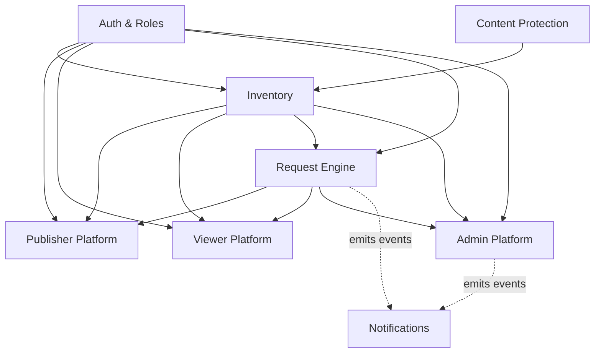

*(Arrows point from provider to consumer: `A --> B` means B depends on A.)*

Auth & Roles and Content Protection are leaves with no dependencies. Notifications is a pure sink. Every other arrow flows in one direction, and there are no cycles — **but only because of a deliberate resolution described immediately below.**

### Circular dependency identified — Inventory ↔ Request Engine

Read naively, the module documents produce a cycle:

- `inventory.md` §13 makes the availability calendar Inventory-owned data.
- `inventory.md` §16 and `REQUEST-001` make Confirmed requests — Request Engine data — also determine whether a date is available.
- So answering *"is hoarding X available on date D?"* appears to require Inventory to consult Request Engine, while Request Engine already consults Inventory to validate a request. That is a genuine cycle, and if implemented literally it would produce mutually-recursive module calls.

**Recommended resolution:** define availability as a **read model owned by the Request Engine**, not a field or method owned by Inventory.

Concretely: Inventory owns and exposes the raw calendar (Publisher-blocked dates) and the visibility flags. The Request Engine owns the composed query — *available = approved and not paused and not delisted (`INVENTORY-003`) and not Publisher-blocked and not covered by a Confirmed request* — reading both tables in one query, in one database. Inventory never reads request state. The arrow stays `Inventory → Request Engine`, one direction, and the cycle disappears.

Viewer search consumes that same composed query rather than re-implementing the predicate, which also satisfies §10's rule against two modules implementing one business rule.

**Alternative considered and rejected:** an availability service owned by Inventory that calls into Request Engine. Rejected because it inverts the ownership both `inventory.md` §16 and `request-engine.md` §6 state explicitly — `request-engine.md` §6 defines AVAILABLE as "a calendar condition, not a Request status," but the Confirmed-request half of that condition is unambiguously Request Engine data. Making Inventory the composer would require Inventory to know about request state, which is exactly what `inventory.md` §1 says it must not own.

## 10. Responsibility Boundaries

| Capability | Owning Module |
|---|---|
| Authentication, sessions, role assignment | Auth & Roles |
| Authorization policy per capability | The module owning that capability (§18) |
| Inventory master data (type, location, size, price, media refs, Site Intelligence) | Inventory |
| Type-specific field completeness validation (`INVENTORY-001`) | Inventory |
| Viewer-visibility eligibility (`INVENTORY-003`) | Inventory (predicate) — applied via the availability read model |
| Publisher-managed availability calendar | Inventory |
| Publisher listing management workflow | Publisher Platform |
| Viewer discovery, filters, map query composition | Viewer Platform |
| **Composed availability query** | **Request Engine** (§9) |
| Request lifecycle, conflict detection, expiry, completion | Request Engine |
| Confirmed-date blocking (`REQUEST-001`, `REQUEST-004`) | Request Engine |
| Publisher verification decision | Admin Platform |
| Listing approval / rejection + reason (`ADMIN-001`, `ADMIN-003`) | Admin Platform |
| Publisher suspension; hoarding delisting (`ADMIN-002`, `ADMIN-004`) | Admin Platform |
| Platform counts dashboard | Admin Platform |
| Notification delivery | Notifications |
| Notification event definition | The emitting module (Request Engine, Admin) |
| Media watermarking + original isolation (`CONTENT-001`) | Content Protection |

**The rule this table exists to enforce:** exactly one module implements each business rule. Two failure modes are worth naming because the documents make them easy to fall into:

1. **Duplicated conflict logic.** `viewer-platform.md` §13 describes what a Viewer sees when dates conflict, and `mvp-prd.md` §7.2 gives the Publisher `OWNER-001` ("cannot accept two overlapping requests"). Neither is a licence to implement conflict detection in the Viewer or Publisher module. `OWNER-001` is the Publisher-facing *mirror* of `REQUEST-001` — same rule, one implementation, in the Request Engine.
2. **Duplicated visibility filtering.** `ADMIN-001` (approval), the paused flag, and `ADMIN-004` (delisting) each independently affect whether a Viewer sees a listing. `INVENTORY-003` exists precisely so that this is **one predicate in one place**, not three checks scattered across search, map, and detail endpoints — a listing that slipped through one of three checks would be a direct `ADMIN-001` violation.

## 11. Data Architecture

Logical entities and their owning modules. This is not a schema — `docs/05-technical/database-design.md` (`README.md` Tier 1 item #5) owns tables, keys, indexes, and constraints.

```text
User  ······································  Auth & Roles
 ├── Viewer Profile  ·······················  Auth / Viewer
 └── Publisher Profile  ···················  Auth / Publisher
      │  (verification_status, suspension state — decision owned by Admin)
      │
      └── Hoarding  ························  Inventory
           ├── Type + type-specific attributes (JSON)  ····  Inventory
           ├── Location (address + coordinates)  ·········  Inventory
           ├── Price (flat)  ·······················  Inventory
           ├── Media Asset[]  ······················  Inventory (ref) / Content Protection (bytes + status)
           ├── Site Intelligence  ··················  Inventory
           ├── Availability Calendar  ··············  Inventory
           ├── Approval / visibility flags  ········  Inventory (data) / Admin (decision)
           └── Request[]  ·························  Request Engine
                └── Viewer  ·····················  Auth

Notification  ······························  Notifications
```

**Ownership distinctions that matter architecturally:**

- **A Publisher's verification status is Auth-adjacent data whose *decision* belongs to Admin.** The field lives with the user record; only the Admin module may write it (`admin-platform.md` §8).
- **A hoarding's approval flags are Inventory data whose *decision* belongs to Admin.** Same pattern: Inventory owns the shape, Admin owns the transition. This is why §44's rule 7 (cross-module writes go through the owning module's boundary) matters — Admin must not `UPDATE hoardings` directly.
- **A Media Asset is split deliberately.** Inventory holds the reference and the watermark status it must check before allowing submission (`CONTENT-001`); Content Protection holds the bytes and owns the status transitions. Neither owns both halves.
- **A Request references a Hoarding but is not part of it.** `inventory.md` §1 draws this line: a Request is "a date-specific demand interaction against that inventory," not inventory itself.

## 12. Database Strategy

**Recommendation — Pending Confirmation: a single relational database for all transactional data.**

Reasons, in order of weight:

1. **Transactional consistency across Inventory and Requests is a hard requirement**, not a convenience (`REQUEST-004`, §28, ADR-006). A relational database with real transactions provides it directly.
2. **The data is relational.** Publisher → Hoarding → Request is a clean hierarchy with foreign keys, and the queries the product needs are joins and range filters.
3. **Date-range overlap queries are a first-class relational operation.** The overlap predicate `start_A ≤ end_B AND start_B ≤ end_A` (`request-engine.md` §10) is a plain indexed query. Some relational engines additionally offer range types and exclusion constraints that can enforce non-overlap *at the database level* — which would make the `REQUEST-001` invariant structurally impossible to violate rather than merely checked in application code. That is worth evaluating during database design; it is the single highest-value database feature for this product.
4. **Geospatial filtering is available without extra infrastructure** (§26).

**Transactional vs. object data — a firm split.** The database stores hoarding metadata and media *references*. It never stores media bytes. Object storage holds the bytes (§20). Conflating these is a common early mistake that makes backups enormous and serving slow.

**Indexing needs** (direction only; specifics belong in the database design document):

- `hoardings`: the `INVENTORY-003` visibility predicate is on nearly every Viewer read path — index accordingly; plus type, price, and coordinates for filtering
- `requests`: `(hoarding_id, status, start_date, end_date)` is the conflict-detection access path and is the most performance-and-correctness-critical index in the system
- `requests`: `(viewer_id, hoarding_id, status)` for the `VIEWER-002` duplicate check
- `requests`: `status` + `created_at` for the SLA expiry sweep

No detailed SQL and no migration scripts here — those belong in `docs/05-technical/database-design.md`.

## 13. Inventory Data Flow

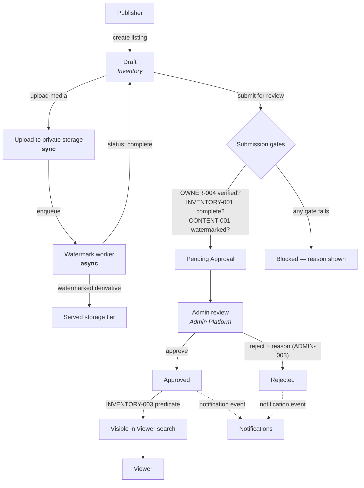

**Synchronous:** listing creation and edits, field validation, the media upload itself, the submission-gate check, the Admin approve/reject decision, and the resulting visibility change. All are database writes the acting user waits on.

**Asynchronous:** watermarking only. This is what produces the "processing media" state `mvp-prd.md` §12 explicitly requires — *"the listing cannot be submitted for Admin review, and the Publisher sees a 'processing media' status, not an error."* An architecture that watermarked synchronously would either block the upload response for the pipeline's duration or fail it, and neither matches that acceptance criterion.

**Approval transition → Viewer visibility is immediate and requires no reindexing step**, because visibility is a predicate evaluated at query time (`INVENTORY-003`), not a separate search index that must be kept in sync. At 50–200 listings this is both simpler and more correct — there is no window in which an unapproved listing is visible because an index lagged, which would be an `ADMIN-001` violation.

## 14. Viewer Discovery Data Flow

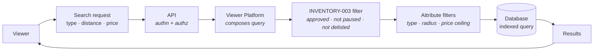

- **Approved listings are selected** by the `INVENTORY-003` predicate — approved **and** not paused **and** not delisted. All three conditions, one place (§10).
- **Availability evaluation:** date-range availability is *not* part of general search. `mvp-prd.md` §7.3's three filters are type, distance, and budget — there is no date filter in MVP scope. Availability is evaluated when the Viewer selects dates on the detail page, via the composed availability query (§16). `viewer-platform.md` §11 does show an availability indicator on result cards; that is a listing-level indicator (is this listing live and requestable at all), not a date-range availability computation per result.
- **Type filter:** equality/set match on the hoarding `type` column. Whether multi-select is supported is an unresolved product question (`viewer-platform.md` §28) — the architecture supports either.
- **Distance filter:** bounding-box prefilter on latitude/longitude, then precise distance (§26).
- **Price ceiling:** a `price <= ceiling` range predicate on an indexed column.
- **Map markers** are generated from the same filtered result set — `viewer-platform.md` §10 requires that "map and Search Results reflect the same underlying filtered result set." Architecturally this means **one query serving both views**, not a separate map endpoint with its own filtering logic, which would risk the two views diverging.

**Blocking dependency, flagged:** all distance filtering and all map markers require latitude/longitude on every hoarding. `inventory.md` §8 flags the presence of a geo-coordinate field as an **Assumption**, not a stated requirement — no source document confirms coordinates are captured. If they are not, two named `mvp-prd.md` §7.3 requirements have no data to operate on. See §26, §39, and §46.

## 15. Request Lifecycle Architecture

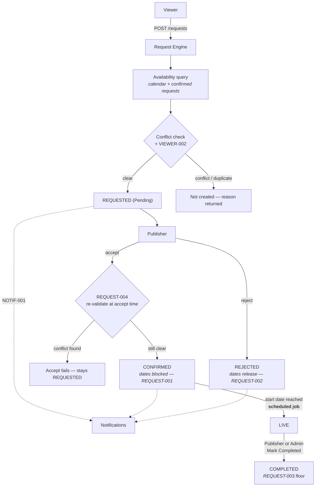

Expiry path:

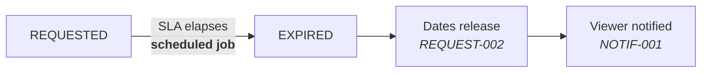

**Which component owns which operation** — this is the section where boundary discipline matters most:

| Operation | Owning component |
|---|---|
| Request creation + creation-time validation | Request Engine |
| Availability computation | Request Engine (composed query, §9) |
| Raw calendar + visibility flags | Inventory |
| Conflict detection at creation and at acceptance | Request Engine |
| Accept / reject action surface | Publisher Platform → **invokes** Request Engine |
| State transition itself | Request Engine, always |
| SLA expiry | Request Engine logic, triggered by a scheduled worker |
| Confirmed → Live transition | Request Engine logic, triggered by a scheduled worker |
| Mark Completed | Request Engine, invoked by Publisher **or** Admin |
| Notification delivery | Notifications, on events emitted by Request Engine |

**The Request Engine owns the request state machine, exclusively.** Inventory must not implement a second one — `inventory.md` §16 and §1 both say so, and §44 rule 3 restates it as a binding implementation rule. Concretely this means Inventory has no `request_status` column, no confirmed-dates cache, and no code path that transitions a request.

**A Pending request blocks nothing.** `request-engine.md` §9 and §11 are explicit: dates are blocked only on Confirmation. Two overlapping Pending requests are a valid, expected state (`mvp-prd.md` §12's own acceptance criterion). The architecture must not "helpfully" reserve dates at request time — that would contradict an approved rule.

## 16. Request Concurrency & Consistency

**The architectural requirement, stated once and plainly:**

> **Inventory availability and Request confirmation must remain transactionally consistent. No two overlapping requests may both reach Confirmed on the same hoarding.**

Everything below serves that sentence.

| Hazard | Architectural handling |
|---|---|
| Two Viewers request the same dates | **Both succeed as Pending.** This is correct behavior, not a race to prevent (`mvp-prd.md` §12, `request-engine.md` §25 #1–#2). No locking needed on the create path beyond the `VIEWER-002` duplicate check. |
| Two overlapping requests confirmed simultaneously | **The critical race.** Exactly one must win. Handled by performing the `REQUEST-004` re-validation and the confirmation write inside a single transaction, with the conflicting-request read taken under a lock or an equivalent guarantee (see below). |
| Stale availability | Structurally addressed by `REQUEST-004`: acceptance never trusts the availability captured at submission time. The re-read happens at accept time, inside the confirming transaction. |
| Duplicate requests from one Viewer | `VIEWER-002`. Best enforced by a **database constraint** — a partial unique index on `(viewer_id, hoarding_id)` restricted to Pending status — so a concurrent double-submit cannot slip past an application-level check. |
| Retries / double-submit from the client | Requires an idempotency mechanism on request creation. `request-engine.md` §25 #12 flags the exact retry semantics as an **Open Question**; the architecture requires *some* mechanism (idempotency key or the `VIEWER-002` constraint above absorbing the duplicate) without prescribing which. |
| Network failure mid-confirmation | The transaction either commits fully or not at all; there is no partial state. The client may not learn the outcome, so the accept endpoint must be safe to retry — re-running it either finds the request already Confirmed (no-op success) or fails re-validation cleanly. |
| SLA expiry racing a Publisher response | Both paths are state transitions on the same row; whichever commits first wins and the second must fail its precondition check rather than overwrite. `request-engine.md` §25 #5 flags **which** should win as an Open Question — the architecture guarantees only that exactly one does, deterministically. |
| Two Admins acting on one queue item | Same pattern: a state transition guarded by its current-state precondition. Flagged as an Open Question in `admin-platform.md` §22 #8; architecturally it needs no special mechanism beyond the precondition check. |

**Mechanism recommendations, deliberately not prescribed as decisions:**

- **Pessimistic row locking** on the hoarding (or on its conflicting requests) during confirmation is the most straightforward fit: confirmations are rare, contention is low, and correctness is easy to reason about.
- **Optimistic concurrency** (version column, retry on conflict) is a reasonable alternative and avoids lock-holding.
- **A database exclusion constraint** on the date range for Confirmed requests would enforce non-overlap structurally — the strongest option, and the one worth evaluating first during database design (§12).
- **Unique constraints** for `VIEWER-002` as described above.

Which of these is chosen belongs in `docs/05-technical/database-design.md`, once the database is chosen. What this document fixes is the property, not the technique.

## 17. Authentication Architecture

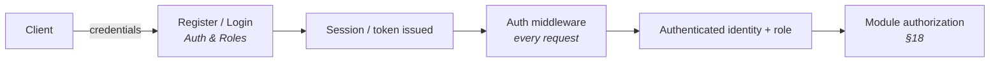

**Registration:** role is selected at signup and is permanent for the account (`AUTH-001` — one account, one role, no dual-role accounts at MVP). Architecturally this means role is a property of the user record established at creation, not a mutable assignment or a many-to-many relationship. A dual-role model would be a Phase 2 change.

**Sessions:** `mvp-prd.md` §7.1 requires "session persistence with standard secure token handling." The specific mechanism (opaque server-side sessions vs. signed tokens) is not specified anywhere and is left open (§46).

**Admin accounts** are provisioned internally rather than through public registration — an **Assumption** carried from `admin-platform.md` §21, since `mvp-prd.md` describes Admin only as an "internal" role with no registration flow. The architecture should therefore not expose an Admin signup path.

### The AUTH-002 three-way distinction

This must not be blurred, and `viewer-platform.md` §13's Demo Scope Note is explicit that it is a variance rather than a redefinition:

| | Mechanism | Status |
|---|---|---|
| **Approved product requirement** | OTP verification before a Publisher submits a listing or a Viewer sends a request (`AUTH-002`, `BR-AUTH-002`) | Approved, and remains the target |
| **Current demo build** | Email/mobile + password for the **Viewer** side; no OTP, no ownership verification, no pre-request gate (`viewer-platform.md` Demo Scope Note, v1.1) | Deliberate, explicit, documented variance — demo/validation only |
| **Production requirement** | OTP restored before any build handling real inventory or real user data | Required before real onboarding |

**Architectural consequence:** the Auth module needs a credential strategy that accommodates both without a rewrite — OTP is a verification step layered onto identity, not a different identity model. And because the demo build stores passwords, **password hashing is a requirement now**, not later (`viewer-platform.md` §24 already states this: hashing, not plaintext).

**Unresolved asymmetry, flagged not resolved:** the demo variance was written for the Viewer side only. `viewer-platform.md` §13 notes the same variance "would need to be applied symmetrically on the Publisher side," and `admin-platform.md`'s Consistency Note carries this forward as an Open Question. Whether Publisher login in the current build runs with or without OTP is **not documented anywhere**, which means the architecture cannot state what actually gates Publisher listing submission today. Carried to §46. This document does not silently change `AUTH-002` in either direction.

## 18. Authorization Architecture

```text
Viewer
 ├── Read inventory where INVENTORY-003 holds
 ├── Create own requests
 └── Read own requests

Publisher
 ├── Manage own inventory  (own listings only)
 ├── Read requests on own listings
 ├── Accept / reject requests on own listings
 └── Mark Completed on own listings' requests

Admin
 ├── Read listings in every state
 ├── Approve / reject listings
 ├── Verify / suspend Publishers
 ├── Delist hoardings
 ├── Mark Completed
 └── Read aggregate counts  (NOT individual requests)
```

**Two properties the architecture must guarantee:**

1. **Authorization is enforced server-side, in the module that owns the capability.** Client-side route protection is a user-experience affordance and nothing more. `viewer-platform.md` §6 notes a Viewer "cannot reach any Publisher or Admin surface" — that must be true of the API, not merely of the navigation.

2. **Ownership checks are not the same as role checks.** A Publisher having the Publisher role is necessary but not sufficient: `request-engine.md` §28 requires that "a Publisher cannot act on another Publisher's listing." Every Publisher-scoped operation needs a row-level ownership check, not just a role assertion. This is the single most likely authorization bug in a marketplace and deserves explicit test coverage.

**Admin's boundary is a real constraint, not an oversight.** `request-engine.md` §23's permissions matrix ends with "Modify state arbitrarily: No / No / **No**" — including Admin. `admin-platform.md` §12 restricts Admin to Mark Completed plus aggregate counts, with no individual-request browsing. The architecture must not implement a general Admin request-management capability, however natural it may feel to add. If operational need emerges, it should come through the Support/Dispute Runbook (`README.md` Tier 1 item #13) as a product decision, not appear as an undocumented Admin endpoint.

## 19. API Architecture

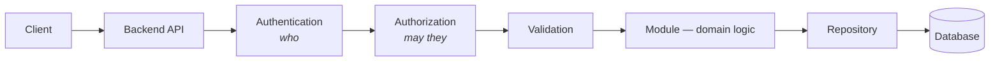

**Style — Recommendation:** REST over HTTP/JSON. `mvp-prd.md` §9's existing endpoint list is already REST-shaped and already versioned (`/api/v1/...`), which is the closest thing to a prior architectural decision this project has. Adopting it preserves that.

**Cross-cutting concerns, in order:** authentication middleware → authorization (in-module, §18) → input validation → domain logic → persistence. Plus: consistent error structure (§29), a request ID on every request for log correlation (§33), pagination on list endpoints (`viewer-platform.md` §11 flags the mechanism as undecided), filtering via query parameters as `mvp-prd.md` §9 already shows, and idempotency where §16 requires it.

**Known API-surface gaps** — carried from three module documents, not re-derived here, and all belonging to `docs/05-technical/api-specification.md` (`README.md` Tier 1 item #6):

- No endpoints exist for **Publisher verification, Publisher suspension, or hoarding delisting**, despite all three being explicit `mvp-prd.md` §7.5 functional requirements (`admin-platform.md` §19)
- No endpoints exist for **pause, delete, or delist** as distinct inventory actions (`inventory.md` §21)
- No single-request detail endpoint (`GET /api/v1/requests/{id}`) distinct from the list endpoints (`request-engine.md` §27, `viewer-platform.md` §23)
- No notification-retrieval endpoint, despite Notifications being an in-scope module (`viewer-platform.md` §23)
- Whether Admin's Mark Completed uses the shared `PATCH /api/v1/requests/{id}` with elevated authorization or a separate `/admin/` route is undefined (`request-engine.md` §27)

**This is a substantial gap:** the documented API surface covers roughly half the documented Admin functional requirements. It does not block architecture, but it blocks implementation.

## 20. Media Architecture

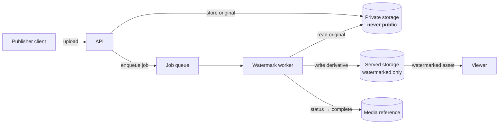

**The rule the whole pipeline exists to enforce:** *unwatermarked originals must never be publicly exposed* (`mvp-prd.md` §7.7).

| Concern | Handling |
|---|---|
| Original asset | Private storage tier, no public URL, reachable only by the API and the watermark worker |
| Processed asset | Served tier, containing watermarked derivatives only |
| Media metadata | Database reference: storage key, watermark status, association to hoarding |
| Processing state | `pending` → `complete` \| `failed`; drives the "processing media" UI state (`mvp-prd.md` §12) and gates submission (`CONTENT-001`) |
| Failure handling | `mvp-prd.md` §11 names watermark failure as an edge case; retry/escalation behavior is **undefined** in every source document (`inventory.md` §27) — the architecture requires a `failed` state and an operator-visible signal (§33), but cannot specify the recovery policy |
| Public access strategy | Either a public served tier containing only watermarked assets, or signed time-limited URLs — see §21 |

**Storage layout is an implementation detail, not product behavior.** Bucket names, key structures, and CDN configuration must never leak into API responses or UI copy as though they were product concepts.

## 21. Content Protection Architecture

`CONTENT-001` is enforced architecturally at two distinct points, and both are necessary:

```text
Original media
      ↓
Private storage  ──────────  no public route exists, at all
      ↓
Watermark processing
      ↓
Watermarked output
      ↓
Served tier  ───────────────  the only tier a Viewer URL can resolve to
```

**Gate 1 — submission.** A listing cannot enter Pending Approval while any media asset's watermark status is not `complete` (`CONTENT-001`). This is a precondition check in Inventory, reading a status Content Protection owns (§11).

**Gate 2 — serving.** A Viewer request can only ever resolve to the served tier. Not "should not" — *cannot*: the private tier must have no public route, so that a bug in URL construction produces a broken link rather than a leaked original.

**Security requirement vs. implementation choice — kept separate, as the brief requires:**

| Security requirement (fixed) | Implementation choice (open) |
|---|---|
| Unwatermarked originals are never publicly retrievable | Private bucket with no public access policy, vs. a separate storage account, vs. signed-URL-only access |
| Only watermarked media reaches a Viewer | Public served bucket, vs. CDN origin, vs. signed URLs with expiry |
| The watermark pipeline is isolated from public asset serving (`mvp-prd.md` §10) | Separate worker process, vs. an isolated service |

Signed URLs are worth considering for the served tier even though the content is already watermarked — they make hotlinking harder and give a revocation path if a listing is later delisted. That is a **Recommendation**, not a requirement; `mvp-prd.md` says nothing about it. Note also that screenshot/DRM deterrents are explicitly **out of MVP scope** (`mvp-prd.md` §3.2) — watermarking is the entire content-protection strategy at this phase.

## 22. Notification Architecture


**Events, per `mvp-prd.md` §7.6 and `request-engine.md` §22:** request created (to Publisher and Viewer), request accepted, request rejected, request expiring soon, request expired, listing approved, listing rejected.

**Synchronous vs. asynchronous — a deliberate split:**

- **Synchronous:** writing the notification record, inside the same transaction as the state change that caused it. This means a Confirmed request can never exist without its corresponding notification having been *recorded*.
- **Asynchronous:** actually delivering it. `NOTIF-001` allows a defined delay ("e.g., under 5 minutes"), so delivery does not belong on the request path, and a provider outage must not fail a Publisher's accept action.

**No event bus.** A database-backed job queue is sufficient for seven event types at this volume. Kafka or an equivalent would be infrastructure with no requirement behind it (§4).

**Scope gap noted, not resolved.** `NOTIF-001`'s text covers only "state change in the Request Engine," yet `mvp-prd.md` §7.6's own functional requirement also lists "listing approved/rejected" — which are Admin actions on inventory, not Request Engine transitions (`admin-platform.md` §17). **Architecturally this is handled by making the notification dispatcher accept events from any emitting module**, so the system satisfies the §7.6 functional requirement regardless of which rule ID formally covers it. That is an architecture accommodating a documentation gap, not a resolution of it — the gap stays open (§46).

Two further undefined cases, carried from `admin-platform.md` §17: whether Publisher verification outcomes and suspension/delisting decisions should notify the Publisher (not listed in §7.6 at all), and whether Live/Completed transitions notify anyone (`request-engine.md` §33).

## 23. Background Jobs

| Job | Trigger | Async? | Failure handling |
|---|---|---|---|
| **Media watermarking** | Media upload completes | Yes — required by `mvp-prd.md` §12's "processing media" state | Retry with backoff; terminal failure sets status `failed`, blocking submission per `CONTENT-001`; recovery policy undefined (§20, §46) |
| **Notification dispatch** | Notification record written | Yes — `NOTIF-001` permits a defined delay | Retry with backoff; provider outage must never fail the originating business action; persistent failure surfaces in metrics (§33) |
| **Request SLA expiry** | Scheduled sweep of Pending requests past the SLA | Yes — no actor triggers it | Must be idempotent; must fail its precondition cleanly if the Publisher responded first (§16). **Failure mode is silent and serious:** if this job stops, requests never expire and dates stay held — see §38 #10 and §39 |
| **Confirmed → Live** | Scheduled; Confirmed request reaches its start date | Yes | Idempotent; a missed run self-corrects on the next sweep. **Conditional on an Assumption:** `request-engine.md` §18 assumes this transition is system-triggered because no manual "Mark Live" action exists in `mvp-prd.md`. If that assumption is wrong, this job should not exist |

**Deliberately *not* background jobs**, because turning every operation async is its own failure mode: request creation, conflict detection, confirmation, listing approval, and search. All of these are synchronous — the acting user needs the outcome immediately, and in the confirmation case correctness *requires* it to be transactional (§28).

**Both scheduled jobs must be idempotent and safe to run concurrently with user actions**, since each competes with a human actor for the same row (§16).

## 24. External Service Architecture

| Service | Purpose | Failure impact | Fallback | MVP required? |
|---|---|---|---|---|
| **Maps / geolocation** | Map tile rendering, radius visualization (`viewer-platform.md` §10) | Map view unusable | **List-based search continues to work** — `viewer-platform.md` §21 requires that "map failure should not block discovery entirely" | Yes |
| **Object storage** | Media originals + watermarked derivatives | Uploads fail; existing listing images fail to load | Viewer sees a media-unavailable state, not a broken layout (`viewer-platform.md` §21); text listing data still renders | Yes |
| **Push notifications** | Request/listing event delivery | Notifications delayed | Queue retains and retries; in-app status remains authoritative | Yes |
| **SMS or email** | The second channel alongside push | Same | Same | Yes — **but which one is undecided** (`mvp-prd.md` §14) |
| **Watermarking service** | Media processing, *if* not built in-house | Listings cannot be submitted (`CONTENT-001`) | None — this is a hard gate; `mvp-prd.md` §13 already names the watermarking pipeline as a dependency that "blocks listing approval if down" | Yes, in some form |
| **Geocoding** | Deriving coordinates from addresses, *if* Publishers enter addresses rather than pinning a location | Distance filter and map markers have no data | None | **Undetermined** — depends on the unresolved coordinate question (§26) |

**No vendor is named anywhere in this document**, because no source document names one and no implementation exists to reveal one. Every provider choice is a §43 recommendation.

**Dependency-direction note:** the maps provider is a *client-side* dependency for rendering and a possible *server-side* dependency for geocoding. These are separable — the architecture should not assume one vendor serves both roles.

## 25. Search Architecture

**Recommendation: database queries. No search engine.**

The MVP target is 50–200 approved listings (`mvp-prd.md` §3.3, §10) in one city. At that volume:

- Filtering by type, price ceiling, and bounding box is an indexed relational query returning in single-digit milliseconds
- The entire visible result set fits comfortably in memory
- There is no full-text relevance requirement anywhere in `mvp-prd.md` §7.3 — the filters are exact-match and range predicates, not fuzzy scoring
- `viewer-platform.md` §8 explicitly defers ranking, autocomplete, and typo-tolerance as undefined and non-MVP

**Introducing Elasticsearch or OpenSearch here would add** a second datastore, an index-synchronization pipeline, a new failure mode (stale index showing an unapproved listing — an `ADMIN-001` violation), and meaningful operational cost — **to search two hundred rows.** That is the clearest example in this architecture of infrastructure without a requirement.

**Migration path, if the product outgrows this:** the trigger is not listing count alone but a *capability* requirement — full-text relevance ranking, faceted counts, or fuzzy matching. As a rough volume signal, database-side filtering remains comfortable into the low tens of thousands of listings with appropriate indexes. When a real trigger arrives, the extraction is clean because search already goes through one query surface (§14): introduce a read-optimized index alongside the database, keep the `INVENTORY-003` predicate authoritative at write time, and accept eventual consistency only for ranking, never for visibility.

## 26. Geospatial Architecture

Requirements: city filtering, distance filtering from a chosen point, map markers, radius visualization (`mvp-prd.md` §7.3, `viewer-platform.md` §9–§10).

**Recommendation — Pending Confirmation:** plain latitude/longitude columns, a bounding-box prefilter, then a precise distance calculation on the (small) remaining set. At 50–200 rows this needs **no geospatial extension at all**. A spatial extension such as PostGIS is the natural upgrade if inventory grows or if the product later needs polygon/catchment queries — it is not required now.

**City filtering** is a plain attribute filter, not a geospatial one — MVP is single-city (`mvp-prd.md` §3.3), so `city` is effectively a constant with a column reserved for expansion.

**Radius visualization** is a client-side rendering concern; the server returns the filtered set, the client draws the circle.

**How coordinates are obtained — the open dependency, separated as the brief requires:**

| Layer | Status |
|---|---|
| **Product requirement** | Distance filtering and map markers are explicitly required (`mvp-prd.md` §7.3) — **Approved** |
| **Implementation assumption** | That each hoarding carries usable coordinates. `inventory.md` §8 flags this as an **Assumption**, not a stated field requirement — no source document confirms coordinates are captured |
| **External dependency** | If Publishers enter a text address rather than pinning a map location, a **geocoding service is required** — a dependency no source document mentions anywhere |

This is the most consequential undocumented dependency in the architecture: **two named product requirements have no confirmed data source.** The fix is small (add a coordinate field and a map-pin step to the listing form) but it belongs to the Publisher module and the Inventory data model, not to this document. Flagged in §39 and §46.

## 27. Availability Architecture

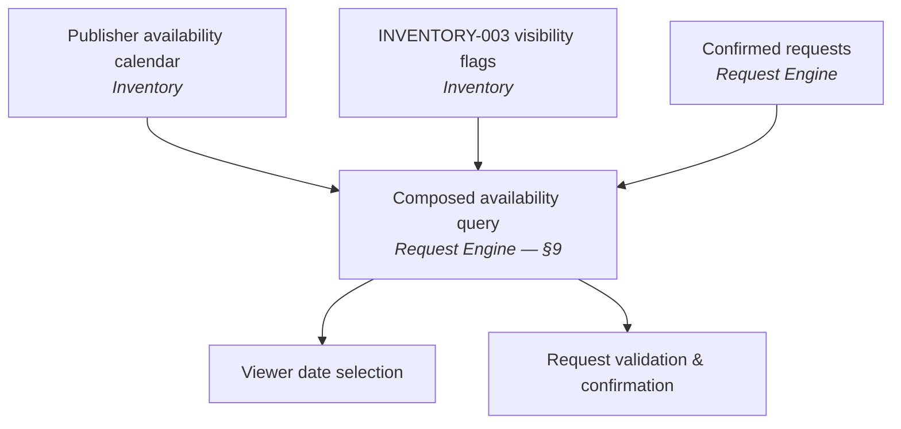

A date range on a hoarding is **available** when all of the following hold:

1. The listing satisfies `INVENTORY-003` — approved, not paused, not delisted
2. No Publisher-blocked date in the range (`mvp-prd.md` §7.2 availability calendar)
3. No Confirmed request covering any part of the range (`REQUEST-001`)

**Ownership, restated because it is the crux of §9's cycle resolution:** availability *inputs* 1 and 2 are Inventory data; input 3 is Request Engine data; the *composition* is owned by the Request Engine. Inventory never reads request state.

**Consistency with the three approved request rules:**

- **`REQUEST-001`** — Confirmation blocks the dates. Implemented as input 3 above: a Confirmed request makes its range unavailable to every other request on that hoarding.
- **`REQUEST-002`** — Rejection and expiry release dates *immediately*. This is structurally free in this design: because availability is *computed* from current Confirmed requests rather than stored as a mutated calendar, a request leaving Confirmed status releases its dates the instant its status changes. There is no release step to forget, and no possibility of a stale block persisting after a rejection — a meaningful correctness advantage of computing availability over caching it.
- **`REQUEST-003`** — Completion cannot precede the request's own start date. A precondition on the Completed transition, unrelated to availability.

**No payment state exists** in this model, or anywhere else in the architecture (`mvp-prd.md` §3.2).

**Note on Completed requests:** `request-engine.md` §6 observes that nothing in `mvp-prd.md` says a Completed request's dates return to Available. Under the computed model above, that behavior depends on whether the availability query treats Completed as still-blocking. This document does not decide it — it is an existing Open Question, surfaced here because the computed-availability design makes the choice explicit rather than incidental.

## 28. Transaction Boundaries

Three operations require a transaction. Everything else can be a plain write.

### Request creation

```text
BEGIN
  Validate listing visible (INVENTORY-003)
  Check VIEWER-002 duplicate            ← unique constraint preferred (§16)
  Check conflicts against Confirmed requests
  Create request (REQUESTED)
  Write notification record
COMMIT
```

### Request confirmation — the critical one

```text
BEGIN
  Read request, assert status = REQUESTED
  Re-validate conflicts against Confirmed requests   ← REQUEST-004, under lock
  Set status = CONFIRMED
  Write notification record
COMMIT
```

Dates become blocked as a *consequence* of the status change (§27), not as a separate write — which removes any possibility of a request being Confirmed without its dates being blocked.

### Listing approval

```text
BEGIN
  Assert status = Pending Approval
  Set status = Approved  (or Rejected + reason — ADMIN-003)
  Write notification record
COMMIT
```

Viewer visibility follows automatically from `INVENTORY-003` (§13) — no separate visibility write, no index update, no window of inconsistency.

**The property all three share:** no partially completed state transition is observable. A request is Pending or Confirmed, never "confirmed but dates not blocked." A listing is Pending or Approved, never "approved but invisible." Notification records commit with the state change that caused them, so a state change can never exist without its notification having been recorded (delivery is separate and async — §22).

**Deliberately outside transactions:** media watermarking, notification *delivery*, and search. None affects an invariant.

## 29. Error Handling Architecture

A consistent, structured error model across every endpoint: a stable machine-readable code, a human-readable message safe to display, optional field-level detail for validation failures, and the request ID for log correlation (§33).

| Category | Semantics | Notable requirement |
|---|---|---|
| Validation | Malformed or incomplete input | `INVENTORY-001` failures must identify *which* field is missing (`inventory.md` §24) |
| Authentication | Not authenticated | — |
| Authorization | Authenticated but not permitted | Must not leak whether the resource exists (a Publisher probing another Publisher's listing IDs) |
| Not found | Resource absent | `viewer-platform.md` §21: a removed listing must not resolve to a broken reference |
| **Conflict** | State precondition failed | **The most important category in this system.** A failed `REQUEST-004` re-validation must return a *specific* reason — "dates no longer available" — not a generic error (`request-engine.md` §10, §25 #4). A Publisher whose accept fails needs to know why |
| Unavailable inventory | Listing paused/delisted, or dates taken | Distinct from a generic conflict; drives the Unavailable UI state (`viewer-platform.md` §20) |
| External service failure | Provider unreachable | Must degrade per §24, not fail the whole page |
| Media processing failure | Watermarking failed | Surfaces as `failed` status, blocking submission (`CONTENT-001`) |
| Database failure | Infrastructure | Generic message to the user; full detail to logs only |
| Rate limiting | Throttled | No rate-limit requirement exists in any source document — noted as absent, not invented |

**Two cross-cutting rules.** First, from `viewer-platform.md` §20 and §25: *"no partial or duplicate request is silently created"* — every failure must be unambiguous about whether the action took effect. Second, error messages shown to users are non-technical; stack traces, SQL, and internal identifiers go to logs (§31).

The full error-code catalogue belongs in `docs/05-technical/api-specification.md`.

## 30. Security Architecture

MVP-appropriate controls, derived from `mvp-prd.md` §10 and the module documents — not a scale-phase security program:

- **Password hashing** — required now, because the demo build stores passwords (`viewer-platform.md` §24). Modern adaptive hashing, never plaintext, never a bare fast hash.
- **Secure session/token handling** — `mvp-prd.md` §7.1's stated requirement.
- **Role-based authorization, enforced server-side** — §18, including row-level ownership checks.
- **Input validation** at the API boundary on every write path (§19).
- **Protected media storage** — private tier unreachable publicly (§21).
- **No unwatermarked originals served, ever** (`CONTENT-001`).
- **Secrets management** — configuration and credentials outside source control (§35).
- **HTTPS everywhere**, including the object-storage served tier.
- **Restricted database access** — reachable only from the API and workers, never from the public internet.
- **Audit logging for sensitive Admin actions** — see the important qualification in §32.

**Not claimed and not designed for:** any compliance certification. No source document states a regulatory requirement, and inventing one would misrepresent the product's obligations. `README.md` Tier 1 items #8 (Security & Data Privacy) and #9 (Terms of Service — flagged there as *"highest priority of this list"*) remain unwritten; both are prerequisites for real user onboarding and neither is superseded by this section.

**Deliberately not over-engineered:** no WAF, no secrets-rotation automation, no intrusion detection, no penetration-testing program at MVP. These are scale-phase concerns; adding them now would consume a small team's capacity without a corresponding risk to mitigate at 50–200 listings.

## 31. Data Protection

| Data | Sensitivity | Who may access |
|---|---|---|
| Viewer account (name, phone/email, city) | Personal | The Viewer; Admin only as far as a documented capability requires |
| Publisher account (name, phone, business name, verification status) | Personal + business | The Publisher; Admin (verification queue) |
| **Publisher contact details** | **Personal — visibility undecided** | See below |
| Hoarding data (location, size, price, specs) | Public once Approved | Everyone, subject to `INVENTORY-003` |
| Original media | **Private, always** | API and watermark worker only (§21) |
| Watermarked media | Public once the listing is Approved | Viewers |
| Request records | Private to their parties | The Viewer who created it; the Publisher who owns the listing; **not** Admin individually (§18) |

**Publisher contact visibility is a genuinely open product question with a privacy dimension.** `viewer-platform.md` §12 flags it: `mvp-brd.md` §12 names **disintermediation** as the single biggest structural risk of a payment-free MVP, and exposing Publisher contact details before a request exists plausibly increases it. Whether contact details appear pre-request, post-request, or only post-Confirmation is undefined. The architecture must therefore treat Publisher contact fields as **separately gated**, not as ordinary listing fields — so that whichever policy is chosen can be applied at one point rather than retrofitted across every response that includes a Publisher.

**Retention:** no retention policy exists in any source document. Not invented here; belongs in the Security & Data Privacy document (`README.md` Tier 1 item #8).

**Logging restriction:** personal data — phone numbers, email addresses, credentials, tokens — must never be written to application logs (§33). This is the most common accidental data-protection failure and the cheapest to prevent at the start.

## 32. Auditability

**Which operations warrant an audit record:** Admin approval/rejection (with reason), Publisher verification decisions, Publisher suspension, listing delisting and deletion, and request state transitions.

**Status — and this needs care, because two documents disagree in scope:**

- A **full audit-log system** is a full-scope BRD requirement (`BR-ADMIN-003`) and explicitly **not MVP scope** (`admin-platform.md` §20, §25).
- But the Request Engine already requires **per-request timestamps** (`created_at`, `responded_at`, `completed_at` — `request-engine.md` §26) as data necessary to *enforce* approved rules like SLA expiry and `REQUEST-003`. Those are approved, because they are load-bearing rather than archival.
- And `admin-platform.md` §18 notes that **no field records which Admin approved or rejected a listing** — anywhere.

**Architectural position:** the state-carrying timestamps in the Request and Hoarding entities are approved and required. A separate, structured, multi-row audit-log table is **not** an MVP requirement and is not designed here.

**Worth flagging to the business, not deciding here:** `mvp-brd.md` §17 names "no-recourse disputes" as a live risk whose stated mitigation is "strong Admin moderation now." Moderation decisions that record *what* changed but not *who* changed it or *when* are weak evidence in exactly the disputes that risk anticipates. Adding an actor ID and timestamp to the four Admin decision points is a very small increment — a handful of columns, no new subsystem — and materially cheaper now than reconstructing history later. That is a **Recommendation**; `admin-platform.md` §27 already carries it as an Open Question and it stays there.

## 33. Observability

MVP-appropriate, using whatever the chosen platform provides. No dedicated observability stack.

**Logs:** API errors with request ID; authentication failures; authorization failures (a spike here is the signature of the row-level-ownership bug §18 warns about); request state transitions; media processing failures; background job outcomes. **Never** personal data or credentials (§31).

**Metrics:** API latency and error rate; request creation and confirmation counts; **conflict-rejection rate** (a sudden change signals either a concurrency bug or unexpected demand patterns); media processing failure rate; notification delivery failure rate; **background job execution and lag**.

That last one deserves emphasis: the SLA expiry job failing is **silent from the user's perspective** — nothing errors, requests simply never expire and dates stay held indefinitely, quietly violating `OWNER-002`. A "last successful run" metric with an alert on staleness is the cheapest possible protection against the least visible failure in the system.

**Health checks:** application liveness, database connectivity, object storage reachability.

## 34. Deployment Architecture

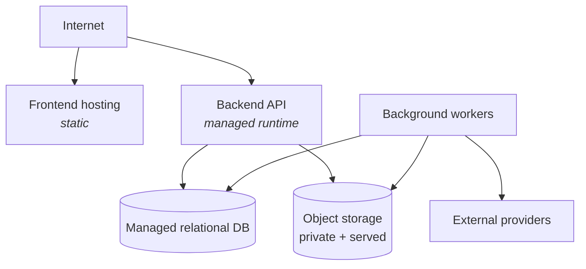

**Recommendation — Pending Confirmation:** managed platform services throughout — managed frontend hosting, a managed application runtime for the API and workers, a managed database, and managed object storage. **Rationale:** the team is small, the load is modest, and every self-hosted component is operational surface with no product benefit at this scale.

**Environments:** development (local, with the API, database, and object storage available locally or as cheap cloud instances), staging (production-shaped, for validating migrations and integrations against real external providers), production. Staging matters most for the two things hardest to test locally: database migrations against realistic data, and external provider integrations.

**Not introduced:** container orchestration, service mesh, multi-region, autoscaling groups, load-balancer tiers. None has a requirement behind it (§4).

## 35. Environment Configuration

Three categories, and the distinction is a security boundary, not a filing convention:

| Category | Examples | Handling |
|---|---|---|
| **Public configuration** | API base URL, map style, feature flags, environment name | May ship to the client; safe in source control |
| **Private configuration** | Log level, worker concurrency, SLA duration, pagination limits | Server-side only; values in source control acceptable, per-environment |
| **Secrets** | Database credentials, object storage keys, notification provider keys, map API keys with billing attached, session signing keys | **Never in source control.** Platform secret store, injected at runtime, rotatable |

**The SLA duration deserves specific mention.** `mvp-prd.md` §14 leaves the Publisher response SLA explicitly undecided, and `request-engine.md` §14 calls it "a configurable, open product value." It should therefore be **configuration, not a constant** — so the still-unmade product decision can be made, and later tuned, without a code change.

**Client-side exposure caution:** a map API key shipped to the browser is publicly visible by nature. It must be domain-restricted and usage-capped at the provider, since it cannot be kept secret.

## 36. CI/CD Architecture

```text
Git push
   ↓
Lint + type check
   ↓
Tests  ──  unit + the integration tests that matter most (below)
   ↓
Build
   ↓
Deploy staging
   ↓
Validation  ──  migrations applied, smoke tests
   ↓
Deploy production
```

No CI/CD vendor is assumed; any standard pipeline satisfies this shape.

**The tests that most deserve automation on every commit**, because they guard invariants rather than behavior:

1. **Concurrent confirmation of overlapping requests** — exactly one succeeds (§16). This is the system's defining correctness property and the one most likely to break silently under refactoring.
2. **Authorization boundaries** — a Viewer cannot act as a Publisher; a Publisher cannot act on another Publisher's listing (§18).
3. **`INVENTORY-003` visibility** — no unapproved, paused, or delisted listing appears in any Viewer-facing response.
4. **`CONTENT-001`** — no unwatermarked original is reachable through any public route.

**Database migrations** must be applied and validated in staging before production, and must be backward-compatible with the running application version if deploys are not atomic. `docs/07-quality/test-requirements.md` (`README.md` Tier 1 item #10) owns the full test strategy; these four are called out because they are architectural invariants, not feature tests.

## 37. Scalability Strategy

### Stage 1 — MVP (50–200 listings)

Modular monolith, one database, one object store, four workers. **This is the whole plan for the validated hypothesis.** No caching layer, no read replicas, no CDN, no search index — none has a requirement (§4).

### Stage 2 — growth (multi-city, thousands of listings)

Introduce, in response to measured pressure and in roughly this order:

- **CDN for media** — the highest-value, lowest-risk addition; media is the heaviest payload and is already immutable once watermarked
- **Database read replicas** for search-heavy read traffic
- **Caching** for hot read paths — with the caveat that `INVENTORY-003` visibility must never be served stale (an `ADMIN-001` violation)
- **Worker scaling** — trivially horizontal, since all four jobs are idempotent (§23)
- **A search index**, if and only if a capability trigger arrives (§25)

### Stage 3 — large-scale marketplace

Extraction becomes worth its cost. The boundaries drawn in §8 make these the natural candidates, in this order:

1. **Content Protection** — already async, already isolated, no transactional coupling
2. **Notifications** — fire-and-forget, no read dependency
3. **Search** — read-only, tolerant of eventual consistency for ranking (never for visibility)
4. **Analytics** — does not exist yet, but would be a clean greenfield boundary

**Request Engine and Inventory should be extracted last, and only together**, for the reason §7 gives: separating them re-creates the distributed-transaction problem that `REQUEST-004` makes expensive. If they must ever be split, the availability read model (§9) is the seam — and the exclusion-constraint approach from §12 would have to be replaced by an application-level consensus mechanism, which is a genuine step down in reliability.

**None of Stage 2 or 3 should exist now.** They are documented so the MVP's boundaries are drawn with them in mind, not as a roadmap to begin.

## 38. Failure Scenarios

| # | Failure | Impact | Recovery | Consistency requirement |
|---|---|---|---|---|
| 1 | Database unavailable | Total outage — every module depends on it | Managed failover; restore from backup | No partial writes; in-flight transactions roll back |
| 2 | Object storage unavailable | Uploads fail; listing images fail to load | Retry; degrade per §24 | Media reference and stored object must not diverge — write the reference only after the object persists |
| 3 | Media processing fails | Listing cannot be submitted (`CONTENT-001`) | Retry with backoff; terminal → `failed` status | Status must reflect reality; a `complete` status with no watermarked asset would breach `CONTENT-001` |
| 4 | Notification provider fails | Delivery delayed | Queue retains and retries | Business state already committed; the notification record exists (§22). **In-app status stays authoritative** |
| 5 | Map provider fails | Map view unusable | **List search continues** (`viewer-platform.md` §21) | None — read-only concern |
| 6 | Request submission times out | Viewer unsure whether it was created | Transaction committed or it did not; the accept/create path must be safe to re-check | `viewer-platform.md` §21: the Viewer must be told clearly, to prevent an unintended duplicate. Exact idempotency mechanism is an Open Question |
| 7 | Concurrent Publisher actions on one request | One succeeds, one fails a precondition | Failing action returns a specific reason (§29) | Exactly one state transition applies |
| 8 | Two Viewers request overlapping dates | **Both succeed as Pending — correct behavior** (`mvp-prd.md` §12) | None needed | Only Confirmation is exclusive, not requesting |
| 9 | Backend crashes mid-request-creation | Transaction rolls back; no request exists | Client retries | No orphaned request, no phantom date block |
| 10 | Worker crashes mid-watermarking | Job incomplete; media stays `pending` | Job retried on the next run | **Idempotency required** — a partially written derivative must never be treated as complete |
| 11 | Worker processes the same job twice | Duplicate work | Idempotent design absorbs it | Critical for the SLA expiry job: expiring an already-Confirmed request would violate `ADMIN-002`-adjacent expectations and destroy a valid booking. Every job must re-assert its precondition, not assume the state it saw when enqueued |
| 12 | External service responds slowly | Request latency rises; workers back up | Timeouts on every external call | **No external call inside a database transaction** — a slow provider must never hold a lock on the confirmation path |

That last point is worth stating as a rule rather than a mitigation: **external calls never occur inside transactions.** A notification provider timing out while holding a row lock on the confirmation path would convert a third-party latency spike into a marketplace-wide booking outage.

## 39. Architectural Risks

| Risk | Impact | Probability | Mitigation |
|---|---|---|---|
| **Availability race condition — two overlapping Confirmed requests** | Severe: the marketplace's core promise fails; two advertisers believe they hold the same hoarding, with no payment system to arbitrate | Medium without deliberate design; low with it | Single transaction (§28); database-level exclusion constraint if available (§12); automated concurrency test in CI (§36) |
| **Missing geo-coordinates block two named requirements** | High: distance filter and map markers cannot function; `mvp-prd.md` §7.3 requirements undeliverable | **High — currently unresolved** (`inventory.md` §8) | Confirm the coordinate field and its capture mechanism before Publisher-form implementation begins (§26) |
| **Row-level ownership check omitted** | Severe: one Publisher acts on another's listing or requests | Medium — the classic marketplace bug | Ownership checks in the owning module, not middleware (§18); explicit CI test (§36) |
| **Unwatermarked original exposed** | High: `CONTENT-001` breached; the MVP's stated IP-protection promise fails | Low with a private tier that has no public route | Architectural isolation (§21), not URL discipline; CI test |
| **`INVENTORY-003` applied inconsistently across endpoints** | High: an unapproved or delisted listing appears in search — a direct `ADMIN-001` violation | Medium — three separate conditions across several read paths | One predicate, one place (§10); computed at query time, never cached stale (§13) |
| **SLA expiry job fails silently** | Medium: requests never expire, dates stay held, `OWNER-002` quietly violated with no error anywhere | Medium — silent by nature | Job-lag metric with staleness alert (§33) |
| **Premature microservices** | High: distributed transactions for a 200-listing marketplace; small team consumed by infrastructure | Low if this document is followed | ADR-001; §44 rule 10 |
| **Notification provider dependency** | Medium: users miss time-sensitive request events; Publisher SLA pressure without notice | Medium | Async with retry; in-app status authoritative (§22) |
| **Vendor lock-in via managed services** | Low-medium: migration cost later | Medium | Keep provider-specific code behind narrow interfaces; the database is the component worth keeping most portable |
| **Background job duplicate execution** | Medium: double notifications, or a valid Confirmed request wrongly expired | Medium | Idempotency plus precondition re-assertion in every job (§23, §38 #11) |
| **Documentation drift — three README-✅ docs absent** | Medium: engineering builds against assumptions no document actually states, especially Publisher-side | **Confirmed, present today** (§1) | Correct `README.md`'s status column; write `owner-platform.md` before Publisher implementation |
| **Search scalability** | Low at MVP scale | Low | Deliberately deferred with a defined trigger (§25) |

## 40. Architecture Decision Records

All six are **Proposed**. None can honestly be marked Accepted: no architecture has previously been agreed by this project, no code embodies a decision, and this document is the first architecture artifact. They become Accepted when the product owner and engineering lead confirm them.

### ADR-001 — Modular Monolith over Microservices

- **Context:** seven-to-eight product modules, 50–200 listings, single city, small team, one hard cross-module transactional invariant (`REQUEST-004`).
- **Decision:** one deployable API containing bounded modules, plus background workers.
- **Alternatives:** microservices per module; serverless-first.
- **Reason:** the confirmation invariant is a single transaction in one database and a distributed transaction across services — a large correctness cost with no offsetting scale requirement. Module count is not a service requirement.
- **Consequences:** modules scale together; boundaries rest on convention and review (§44); extraction remains available later (§37).
- **Status:** **Proposed.**

### ADR-002 — Relational Database for Transactional Data

- **Context:** hierarchical, relational data; date-range overlap queries; a hard consistency requirement.
- **Decision:** one relational database for all transactional data; object storage for media bytes.
- **Alternatives:** document store; separate databases per module.
- **Reason:** transactions, foreign keys, indexed range queries, and possibly database-enforced non-overlap (§12). Document stores would push the `REQUEST-001` invariant into application code.
- **Consequences:** schema migrations become a deployment concern; the database is a single failure domain (§38 #1).
- **Status:** **Proposed.**

### ADR-003 — Private Object Storage for Originals

- **Context:** `CONTENT-001` and `mvp-prd.md` §7.7 require that unwatermarked originals are never publicly exposed.
- **Decision:** two tiers — a private tier with no public route for originals, and a served tier for watermarked derivatives only.
- **Alternatives:** one bucket with path-based access rules; database blob storage.
- **Reason:** isolation should be structural, not a matter of correct URL construction. A bug should produce a broken link, not a leak.
- **Consequences:** two storage locations to manage; the worker needs read access to the private tier.
- **Status:** **Proposed.**

### ADR-004 — Asynchronous Media Watermarking

- **Context:** `mvp-prd.md` §12 requires a "processing media" status rather than a blocking failure; watermarking is slow relative to a request.
- **Decision:** watermark in a background worker; gate submission on `complete` status.
- **Alternatives:** synchronous watermarking on upload.
- **Reason:** synchronous processing cannot produce the required "processing" state — it would either block the response or fail it.
- **Consequences:** requires a processing state, a failure state, and an undefined recovery policy (§20, §46).
- **Status:** **Proposed.**

### ADR-005 — Background Jobs for Notifications and Expiry

- **Context:** `NOTIF-001` permits a defined delay; SLA expiry has no actor to trigger it.
- **Decision:** a database-backed job queue plus scheduled sweeps; notification records written transactionally, delivered asynchronously.
- **Alternatives:** synchronous delivery; a dedicated message broker.
- **Reason:** provider outages must not fail business actions; a broker would be infrastructure without a requirement at seven event types.
- **Consequences:** jobs must be idempotent (§38 #11); job lag becomes a monitored signal (§33).
- **Status:** **Proposed.**

### ADR-006 — Database-Backed Availability and Request Consistency

- **Context:** `REQUEST-004` requires accept-time re-validation; `request-engine.md` §10 fixes the invariant that two overlapping requests never both reach Confirmed.
- **Decision:** compute availability from Inventory's calendar plus Request Engine's Confirmed requests, in one query, in one database; perform re-validation and confirmation in one transaction.
- **Alternatives:** a cached/materialized availability calendar mutated on each confirmation; a separate availability service.
- **Reason:** computing rather than caching makes `REQUEST-002`'s immediate date release structurally automatic (§27) — there is no release step to forget and no stale block to leak. A separate service would re-create the distributed-transaction problem and invert the ownership `inventory.md` §16 states.
- **Consequences:** availability is a query, not a stored field, so the conflict-detection index is performance-critical (§12); the availability read model becomes the Request Engine's responsibility (§9).
- **Status:** **Proposed.**

## 41. Traceability Matrix

Every ID below exists in the source documents; none is invented. IDs marked *(new)* were formalized in the module documents indicated and are flagged there as formalizations of existing prose, not new product decisions.

| Requirement | Architectural component |
|---|---|
| `AUTH-001` — one account, one role | Auth & Roles — role fixed on the user record (§17) |
| `AUTH-002` — OTP verification gate | Auth & Roles — **varied for the demo build** (§17); Publisher-side status undocumented (§46) |
| `OWNER-001` — no overlapping accepts | Request Engine + transaction layer (§16, §28) — the Publisher-facing mirror of `REQUEST-001`, one implementation |
| `OWNER-002` — unanswered requests expire | Request Engine + SLA expiry worker (§23) |
| `OWNER-003` — no core edits while a request is Pending | Publisher Platform + Inventory — precondition on the edit path |
| `OWNER-004` — unverified Publishers cannot submit | Inventory submission gate, reading Auth/Admin verification status (§13) |
| `VIEWER-001` — multiple simultaneous Pending requests | Request Engine — no cross-listing constraint |
| `VIEWER-002` — no duplicate Pending request per listing | Request Engine + **database unique constraint** (§16) |
| `REQUEST-001` — confirmation blocks dates | Request Engine + availability read model (§27) |
| `REQUEST-002` — rejection/expiry releases dates | Request Engine — structurally automatic under computed availability (§27) |
| `REQUEST-003` — no completion before start date | Request Engine — precondition on the Completed transition |
| `REQUEST-004` *(new — `request-engine.md` §24)* — accept-time re-validation | Request Engine + transactional confirmation (§16, §28) — **the architecture's defining constraint** |
| `ADMIN-001` — no unapproved listing in search | Admin Platform (decision) + `INVENTORY-003` predicate (enforcement) (§10) |
| `ADMIN-002` — suspension does not cancel Confirmed requests | Admin Platform — suspension writes Publisher state only; no cascade into request state |
| `ADMIN-003` *(new — `admin-platform.md` §16)* — rejection requires a reason | Admin Platform + a non-null `rejection_reason` on the Rejected transition (§28) |
| `ADMIN-004` *(new — `admin-platform.md` §16)* — delisting independent of suspension | Inventory `delisted` flag, written by Admin, independent of Publisher state (§11) |
| `INVENTORY-001` — type-specific fields complete before submission | Inventory submission gate (§13) |
| `INVENTORY-002` — Site Intelligence optional, flagged incomplete | Inventory — derived completeness flag surfaced in the Admin queue |
| `INVENTORY-003` *(new — `inventory.md` §18)* — Viewer-visibility eligibility | Inventory predicate, applied via the availability read model (§10, §14) |
| `CONTENT-001` — no submission with unwatermarked media | Content Protection + Inventory submission gate + private storage tier (§20, §21) |
| `NOTIF-001` — state changes trigger notifications | Notifications + notification records written in-transaction (§22) — **note the documented scope gap re: listing events** (§22, §46) |

`BR-*` business-rule IDs in `mvp-brd.md` §7 map one-to-one onto the PRD IDs above and are not restated. The full-scope BRD's `BR-ADMIN-001/002/003` are **not** MVP requirements — see the ID-collision analysis in `admin-platform.md`'s header note.

## 42. Architecture Diagrams

Thirteen Mermaid diagrams are included — the nine the brief requires, plus four supporting flows:

| # | Diagram | Section | Required by brief |
|---|---|---|---|
| 1 | System Context | §5 | Yes |
| 2 | Container Architecture | §6 | Yes |
| 3 | Module Dependency Graph | §9 | Yes |
| 4 | Inventory Lifecycle | §13 | Yes |
| 5 | Viewer Discovery Flow | §14 | Yes |
| 6 | Request Lifecycle | §15 | Yes |
| 7 | Request Expiry Path | §15 | Supporting |
| 8 | Authentication Flow | §17 | Supporting |
| 9 | API Request Pipeline | §19 | Supporting |
| 10 | Media / Watermarking Flow | §20 | Yes |
| 11 | Notification Flow | §22 | Yes |
| 12 | Availability Composition | §27 | Supporting |
| 13 | Deployment Architecture | §34 | Yes |

All thirteen have been validated as parsing and rendering correctly. All are kept deliberately small, because a diagram that must be zoomed to read has stopped being a communication tool.

## 43. Technology Stack

**No stack is specified anywhere in this project** (§1). Everything in this section is therefore a recommendation.

## Recommended MVP Stack

**Every item below: Recommendation — Pending Confirmation.**

| Layer | Recommendation | Reasoning |
|---|---|---|
| **Frontend** | A single mainstream component-based web framework, serving all three role views | One codebase, three role-scoped experiences; mobile-responsive matters because discovery is map- and location-centric (`viewer-platform.md` §24) |
| **Backend** | A mainstream server framework in a language the team knows, with strong relational-database and transaction support | The transaction requirements in §28 are the binding constraint; team familiarity outweighs any framework's marginal advantages |
| **Database** | A mature relational database with strong transaction isolation, range-query support, and ideally range/exclusion-constraint capability | §12, ADR-002 — the exclusion-constraint capability is the single highest-value differentiator for this product |
| **Object storage** | Managed object storage with per-tier access policies | §21, ADR-003 — private/served separation must be enforceable at the storage layer |
| **Background jobs** | A database-backed job queue in the same codebase | §23, ADR-005 — no broker needed at four job types |
| **Authentication** | Framework-native session/token handling plus modern adaptive password hashing | §17, §30 — must accommodate both the demo password flow and OTP restoration |
| **Maps** | A mainstream maps provider offering markers, radius drawing, and (if needed) geocoding | §26 — **note the unresolved coordinate dependency** |
| **Notifications** | One push provider plus one of SMS/email | `mvp-prd.md` §14 leaves the second channel undecided — this is a product decision, not a technical one |
| **Hosting** | A managed application platform with managed database and object storage | §34 — minimize operational surface |
| **Monitoring** | Whatever the hosting platform provides, plus the specific metrics in §33 | No dedicated observability stack at MVP |

**Explicitly not recommended at MVP:** search engines, message brokers, caching layers, container orchestration, CDN (a Stage 2 addition, §37), API gateway infrastructure beyond what the hosting platform provides.

**The most important selection criterion is not on this table:** whichever stack is chosen, the team must be able to reason confidently about its transaction semantics. That is where this system's correctness lives.

## 44. Implementation Rules

Ten rules developers should be able to cite in code review:

1. **Business rules live in the owning module** (§10). If two modules implement one rule, one of them is wrong.
2. **The frontend is never the source of authorization** (§18). Client-side route guards are UX; the API decides.
3. **Request state is owned by the Request Engine** (§15). No other module transitions a request or stores its status.
4. **Inventory is the source of truth for inventory data** (§8). No module caches a hoarding's price, availability, or approval state in its own tables.
5. **Originals remain private** (§21). No public route to the private storage tier — ever, for any reason, including debugging.
6. **Public media is watermarked media** (`CONTENT-001`). No exceptions for previews, thumbnails, or Admin views.
7. **Cross-module writes go through the owning module's boundary** (§11). Admin approving a listing calls Inventory; it does not `UPDATE hoardings` directly.
8. **No circular module dependencies** (§9). If a new one appears, resolve it by moving the composition, as availability was resolved — do not add a back-reference.
9. **Critical state transitions are transactional** (§28). Request creation, confirmation, and listing approval each commit fully or not at all.
10. **No new infrastructure without a demonstrated requirement** (§4). "It's standard practice" is not a requirement; a product need or a measured problem is.

Two more, earned from the failure analysis:

11. **No external call inside a database transaction** (§38 #12).
12. **Every background job re-asserts its preconditions** rather than trusting the state it saw when enqueued (§23, §38 #11).

## 45. MVP vs Future Architecture

| Architecture capability | MVP | Future |
|---|---|---|
| Modular backend | Yes | Selective service extraction (§37) |
| Relational database | Yes | Read replicas, partitioning |
| Object storage | Yes | CDN |
| Background workers | Yes | Independent worker scaling |
| Database-backed search | Yes | Search index, on a capability trigger (§25) |
| Basic geospatial (bounding box + distance) | Yes | Spatial extension; polygon/catchment queries |
| Notifications (push + one channel) | Yes | Multi-channel platform, preferences, templating |
| Watermarking | Yes | Advanced media pipeline; DRM (`mvp-prd.md` §3.2) |
| Single Admin role | Yes | Granular RBAC (full-scope `BR-ADMIN-002`) |
| State-carrying timestamps | Yes | Full audit log (full-scope `BR-ADMIN-003`, §32) |
| Microservices | No | Possible, in the §37 order |
| Event-driven architecture | Limited — four jobs | Possible |
| Payment infrastructure | **No** | Phase 2 (`mvp-prd.md` §15) |
| AI infrastructure | **No** | Consumes Site Intelligence already captured |
| Analytics platform | **No** | Future; Tracking Plan first (`README.md` #11) |

## 46. Open Questions

Genuinely unresolved architectural decisions. Product-level open questions already carried by the module documents are not duplicated here except where they *block* an architectural choice.

**Blocking — these prevent implementation from starting cleanly:**

- **Are geo-coordinates captured on a hoarding, and how?** Distance filtering and map markers (`mvp-prd.md` §7.3) have no confirmed data source; `inventory.md` §8 flags the field as an Assumption. Also determines whether a geocoding dependency exists (§26, §39).
- **Does the demo build's OTP deferral apply to Publishers as well as Viewers?** Undocumented (§17). Until answered, the architecture cannot state what gates Publisher listing submission today.
- **The API surface covers roughly half the Admin functional requirements** — no endpoints for Publisher verification, suspension, delisting, pause, or delete (§19).

**Technology selections — all open, all §43 recommendations:**

- Frontend framework; backend framework/language; database engine; hosting provider; object storage provider; job queue technology; map provider; push and SMS/email providers; session/token mechanism (opaque sessions vs. signed tokens).

**Architectural mechanism choices, deferred to database design:**

- Concurrency mechanism for confirmation — pessimistic lock, optimistic version, or a database exclusion constraint (§16). The exclusion constraint is worth evaluating first.
- Idempotency mechanism for request creation retries (§16; `request-engine.md` §25 #12).
- Pagination mechanism for search results (§19; `viewer-platform.md` §11).

**Operational and policy questions with no source document:**

- Backup frequency and retention; disaster-recovery expectations (RPO/RTO); data-retention policy (§31) — all belong to `README.md` Tier 1 item #8, unwritten.
- Recovery policy for terminal watermarking failure (§20).
- Whether a lightweight Admin action trail (actor + timestamp on the four moderation decision points) should be added ahead of the full audit log (§32).
- Rate limiting — no requirement exists anywhere; noted as absent rather than invented (§29).

**Documentation questions this document surfaced:**

- Whether this document belongs at `docs/04-architecture/` or `docs/05-technical/` — and updating whichever reference is left dangling (§1).
- Correcting `README.md`'s Tier 1 status column for the three ✅ documents that do not exist (§1).
- Whether `seeable-discovery-map.html` exists anywhere — if so, §26 and §43 must be revised against it, since a running implementation outranks a recommendation.

## 47. Architecture Validation Checklist

### Product

- [x] Viewer discovery works — search, three filters, map, detail (§14) — **conditional on the coordinate question (§46)**
- [x] Publisher inventory management works — create, edit, pause, delete, calendar, request inbox (§8, §13)
- [x] Admin approval works — verification queue, approval queue, suspension, delisting, dashboard (§8, §13)
- [x] Request flow works end to end, including expiry (§15)
- [x] Notifications work, for both Request Engine and Admin-originated events (§22)
- [x] Offline commercial settlement remains outside the platform — **no payment component exists anywhere in this architecture** (§4)

### Inventory

- [x] All six static MVP hoarding types representable; both digital types representable in the data model without being live (§8, `inventory.md` §7)
- [x] Type-specific attributes supported extensibly — structured JSON per `mvp-prd.md` §10 (§8)
- [x] Flat pricing supported; no dynamic-pricing machinery introduced (§11)
- [x] Availability supported and correctly composed (§27)
- [x] Site Intelligence supported as optional, informational data (§11)
- [x] Inventory approval supported, with visibility following automatically (§13)

### Request Engine

- [x] Pending, Confirmed, Rejected, Expired, Live, Completed all represented (§15)
- [x] Conflict handling is transactionally safe (§16, §28)
- [x] `REQUEST-004` accept-time re-validation is architecturally enforced, not advisory (§28)
- [x] `REQUEST-002` immediate date release is structural rather than a step that can be missed (§27)
- [x] Two overlapping Pending requests remain a valid state (§15) — the architecture does not "helpfully" prevent it

### Security

- [x] Viewer cannot reach Publisher or Admin capabilities (§18)
- [x] Publisher cannot act on another Publisher's inventory or requests — row-level ownership, not role alone (§18)
- [x] Admin permissions are bounded to what the documents grant; no general request mutation (§18)
- [x] Original media is structurally unreachable publicly (§21)
- [x] Passwords hashed; personal data excluded from logs (§30, §31)

### Architecture

- [x] No unnecessary microservices — ADR-001, with a requirement-based rationale
- [x] No circular module dependencies — one was identified and resolved (§9)
- [x] Critical operations are transactional (§28)
- [x] Async processing used only where a requirement demands it (§23)
- [x] Every external dependency has a defined failure behavior (§24, §38)
- [x] Future scale accommodated by boundary placement, not by present complexity (§37)
- [x] No infrastructure introduced without a requirement — no search engine, no broker, no cache, no orchestration (§4, §25)

**One checklist item cannot be marked complete:** Viewer distance filtering and map markers depend on hoarding coordinates whose existence no source document confirms (§26, §46). Every other product capability in this checklist is supported by the architecture as designed.

---

*End of SEEABLE Hoardings — System Architecture.*
